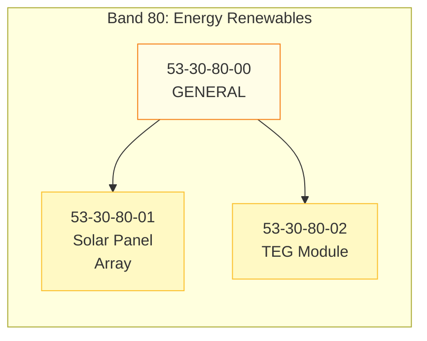
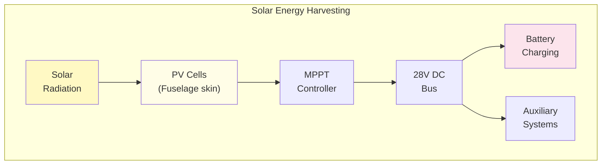
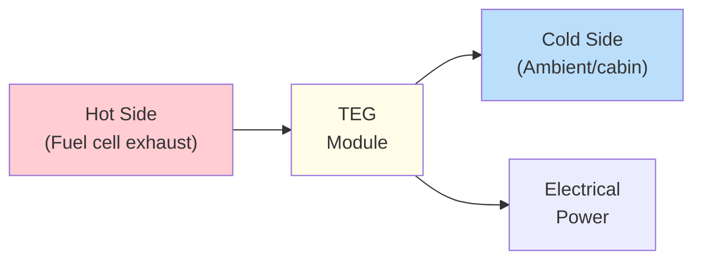
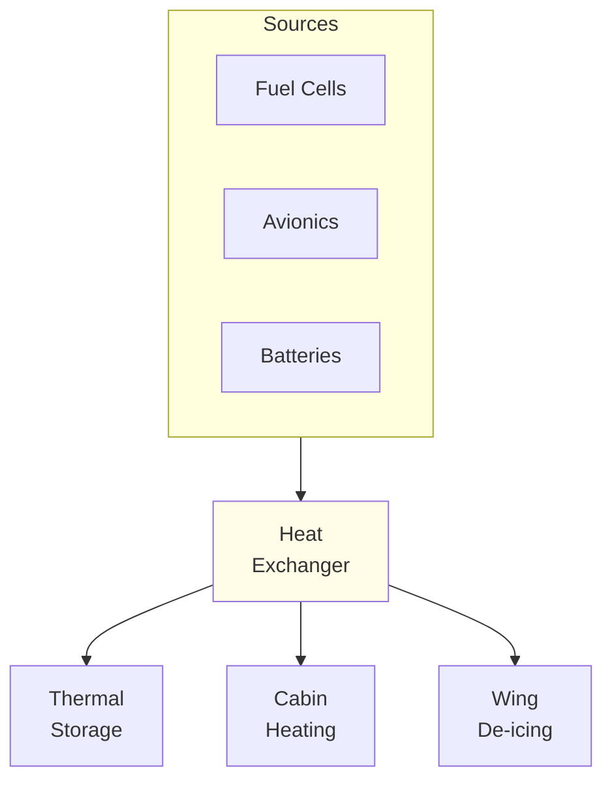
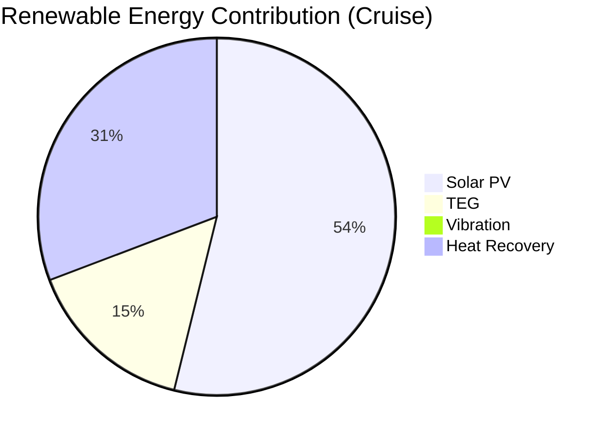

# 53-30-80 — Energy Renewables

| Field | Value |
|-------|-------|
| **Document ID** | ATA53-30-80-00-OVR-001 |
| **Version** | 1.0 |
| **Date** | 2025-11-26 |
| **Status** | DRAFT |
| **Classification** | TECHNICAL |

---

## Overview

**Band 80 — Energy Renewables** encompasses all renewable energy harvesting systems within ANCHORS. These systems capture ambient energy from solar radiation, mechanical vibration, thermal gradients, and waste heat to supplement the aircraft's primary power systems and reduce overall energy consumption.

---

## Scope



### Components

| ID | Component | Description |
|----|-----------|-------------|
| **53-30-80-00** | General | Subsystem-level overview, requirements, interfaces |
| **53-30-80-01** | Solar Panel Array | Integrated photovoltaic panels on fuselage surfaces |
| **53-30-80-02** | TEG Module | Thermoelectric generator modules for thermal gradient harvesting |

---

## Energy Harvesting Technologies

### 1. Solar Photovoltaics

Flexible, lightweight solar cells integrated into aircraft skin:



| Parameter | Specification |
|-----------|---------------|
| Cell technology | Flexible III-V multi-junction |
| Efficiency | 28% (STC) |
| Total area | 15 m² (upper fuselage) |
| Peak output | 3.5 kW |
| Weight penalty | 2.5 kg/m² |

### 2. Thermoelectric Generation (TEG)

Solid-state power generation from thermal gradients:



| Parameter | Specification |
|-----------|---------------|
| Module type | Bismuth telluride (Bi₂Te₃) |
| Hot side temp | 250°C max |
| Cold side temp | 20-40°C |
| ΔT operating | 180-230°C |
| Power output | 50 W per module |
| Total modules | 20 |
| Total output | 1 kW |

### 3. Vibration Energy Harvesting

Piezoelectric and electromagnetic harvesting from structural vibration:

| Location | Technology | Output |
|----------|------------|--------|
| Engine mounts | Electromagnetic | 20 W |
| Landing gear bays | Piezoelectric | 5 W |
| Cabin floor | Piezoelectric | 10 W |

### 4. Heat Recovery Exchangers

Integration with thermal management for energy recovery:



---

## Energy Budget Contribution



| Source | Peak Power | Cruise Average | Annual kWh |
|--------|------------|----------------|------------|
| Solar PV | 3.5 kW | 1.8 kW | 3,000 |
| TEG | 1.0 kW | 0.8 kW | 1,400 |
| Vibration | 35 W | 25 W | 40 |
| Heat Recovery | — | 2.0 kW (thermal) | — |

---

## Interfaces

### Internal ANCHORS Interfaces

| Interface | Description | Reference |
|-----------|-------------|-----------|
| 53-30-40 | Battery Loops — Charging integration | [ICD 53-30-80 ↔ 40](../53-30-00_GENERAL/53-30-00-05_Interfaces/) |
| 53-30-50 | Circular Structures — Panel mounting | [ICD 53-30-80 ↔ 50](../53-30-00_GENERAL/53-30-00-05_Interfaces/) |
| 53-30-95 | ANCHORS Networks — ResourceBus | [ICD 53-30-80 ↔ 95](../53-30-00_GENERAL/53-30-00-05_Interfaces/) |

### External ATA Interfaces

| ATA | System | Interface Type |
|-----|--------|----------------|
| 24-00 | Electrical Power | 28V DC bus integration |
| 21-00 | ECS | Heat recovery interface |
| 53-00 | Fuselage | Panel structural integration |

---

## Directory Structure

```
53-30-80_Energy_Renewables/
├── README.md
├── 53-30-80-00_GENERAL/
│   ├── 53-30-80-00_Overview.md
│   ├── 53-30-80-00_Requirements.md
│   └── 53-30-80-00_Interfaces.md
├── 53-30-80-01_Solar_Panel_Array/
│   ├── 53-30-80-01_System_Description.md
│   ├── 53-30-80-01_Requirements.md
│   └── 53-30-80-01_Design.md
└── 53-30-80-02_TEG_Module/
    ├── 53-30-80-02_System_Description.md
    ├── 53-30-80-02_Requirements.md
    └── 53-30-80-02_Design.md
```

---

## Document Control

- **Generated with assistance of:** AI (GitHub Copilot)
- **Prompted by:** Amedeo Pelliccia
- **Status:** DRAFT — Subject to human review and approval
- **Repository:** `AMPEL360-BWB-H2-Hy-E`
- **Last AI update:** 2025-11-26
