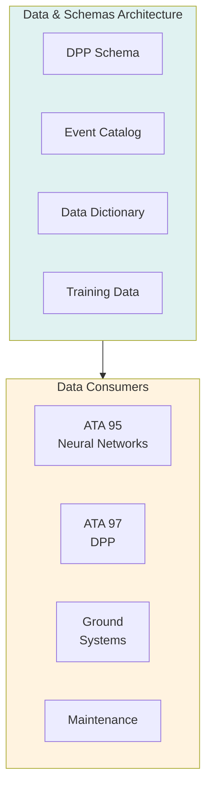
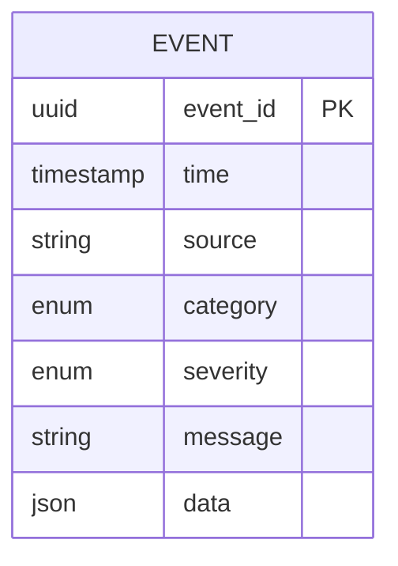

# 53-30-90-00 — Data & Schemas Overview

| Field | Value |
|-------|-------|
| **Document ID** | ATA53-30-90-00-OVR-002 |
| **Version** | 1.0 |
| **Date** | 2025-11-26 |
| **Status** | DRAFT |

---

## Purpose

This document provides an overview of the Data & Schemas subsystem (Band 90) within ANCHORS, defining the data architecture, governance, and integration standards.

---

## Subsystem Description

The Data & Schemas subsystem provides:

1. **DPP Integration** — Digital Product Passport data structures
2. **Event Logging** — Standardized event catalogs
3. **Data Dictionary** — Canonical definitions
4. **Training Datasets** — AI/ML model support

---

## Data Categories

### Digital Product Passport

| Category | Update | Retention |
|----------|--------|-----------|
| Identity | Static | Lifetime |
| Materials | Static | Lifetime |
| Manufacturing | Static | Lifetime |
| Operational | Per flight | 10 years |
| Maintenance | Per event | 10 years |
| End-of-Life | At disposal | 5 years |

### Event Schema

---

## Key Components

### 53-30-90-01: DPP Schema

Standardized data structures for component lifecycle tracking.

### 53-30-90-02: Event Catalog

| Category | Example Events |
|----------|----------------|
| Operational | Mode change, resource transfer |
| Maintenance | Inspection, replacement |
| Fault | Sensor failure, limit exceeded |
| Performance | Efficiency metric, degradation |

---

## Document Control

- **Generated with assistance of:** AI (GitHub Copilot)
- **Prompted by:** Amedeo Pelliccia
- **Status:** DRAFT
- **Last AI update:** 2025-11-26
