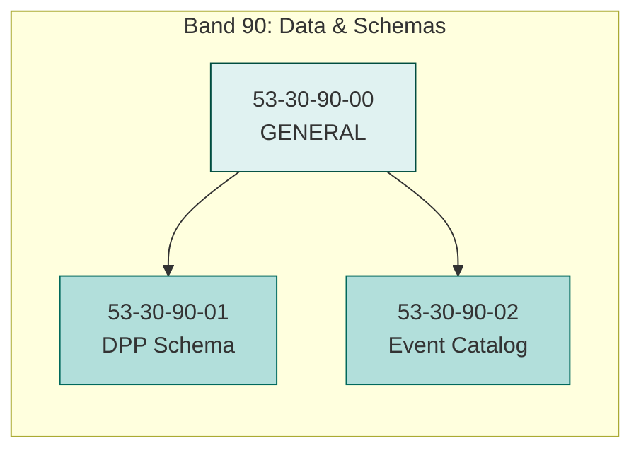
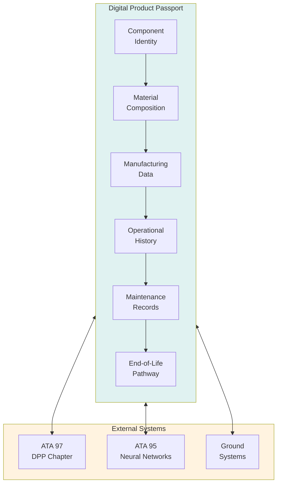
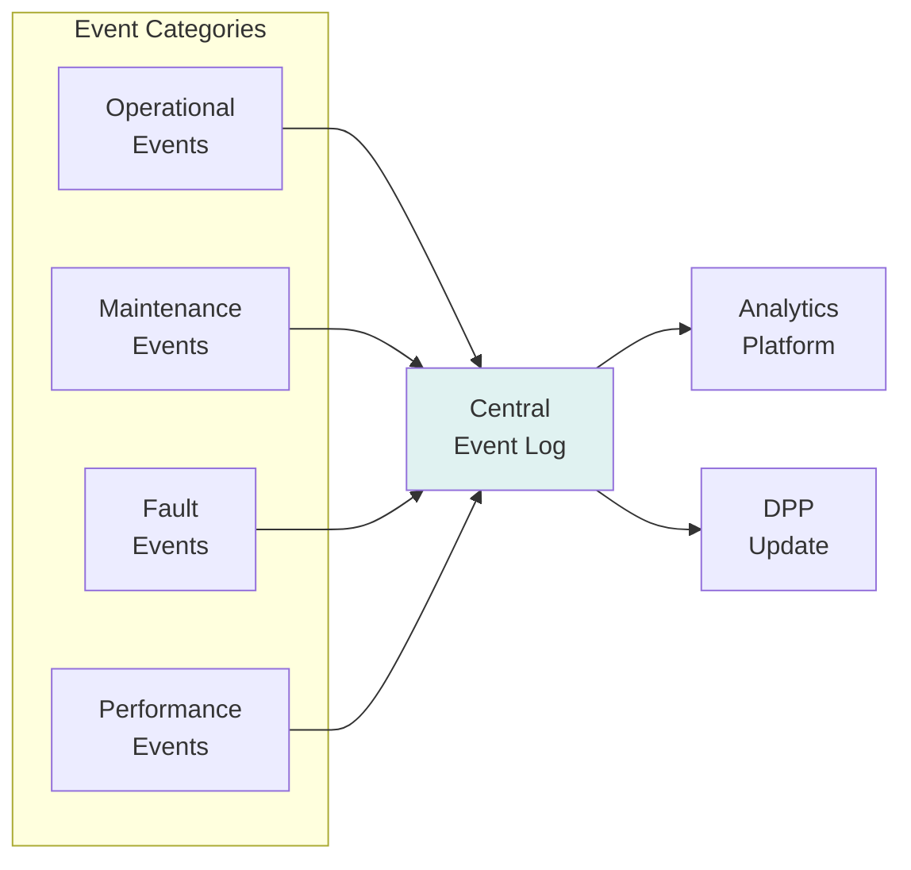
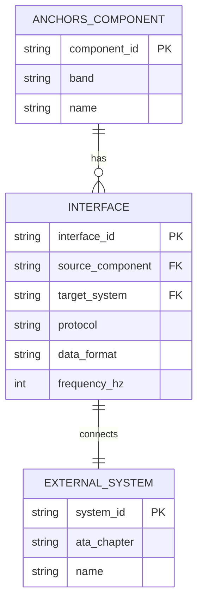

# 53-30-90 — Data & Schemas

| Field | Value |
|-------|-------|
| **Document ID** | ATA53-30-90-00-OVR-001 |
| **Version** | 1.0 |
| **Date** | 2025-11-26 |
| **Status** | DRAFT |
| **Classification** | TECHNICAL |

---

## Overview

**Band 90 — Data & Schemas** encompasses all data structures, schemas, catalogs, and digital integration systems for ANCHORS. This band provides the information architecture that enables Digital Product Passport (DPP) integration, event logging, interface definitions, and training datasets for AI/ML systems.

---

## Scope



### Components

| ID | Component | Description |
|----|-----------|-------------|
| **53-30-90-00** | General | Subsystem-level overview, data governance, standards |
| **53-30-90-01** | DPP Schema | Digital Product Passport data structures and interfaces |
| **53-30-90-02** | Event Catalog | Standardized event definitions and logging schemas |

---

## Data Architecture

### 1. Digital Product Passport (DPP) Integration

The DPP schema enables full lifecycle traceability for all ANCHORS components:



#### DPP Data Categories

| Category | Data Elements | Update Frequency |
|----------|---------------|------------------|
| Identity | Part number, serial, manufacturer | Static |
| Materials | Composition, source, certifications | Static |
| Manufacturing | Date, location, process, energy | Static |
| Operational | Hours, cycles, loads, environment | Per flight |
| Maintenance | Inspections, repairs, replacements | Per event |
| End-of-Life | Recycling pathway, recovery rate | At disposal |

### 2. Event Catalog

Standardized event definitions for ANCHORS operations:



#### Event Schema Structure

| Field | Type | Description |
|-------|------|-------------|
| `event_id` | UUID | Unique event identifier |
| `timestamp` | ISO-8601 | Event occurrence time (UTC) |
| `source` | String | Source system/component |
| `category` | Enum | OPERATIONAL, MAINTENANCE, FAULT, PERFORMANCE |
| `severity` | Enum | INFO, WARNING, CAUTION, CRITICAL |
| `message` | String | Human-readable description |
| `data` | JSON | Event-specific payload |
| `correlation_id` | UUID | Related events linkage |

### 3. Data Dictionary

Canonical definitions for all ANCHORS data elements:

| Domain | Elements | Schema Location |
|--------|----------|-----------------|
| Battery | SoC, SoH, temperature, cycles | `53-30-90-01_DPP_Schema/battery.yaml` |
| CO₂ Capture | Rate, purity, cartridge fill | `53-30-90-01_DPP_Schema/co2.yaml` |
| Water | Quality, volume, temperature | `53-30-90-01_DPP_Schema/water.yaml` |
| Energy | Generation, consumption, efficiency | `53-30-90-01_DPP_Schema/energy.yaml` |

### 4. Interface Tables

Standardized interface definitions for cross-system communication:



---

## Training Datasets

Band 90 maintains curated datasets for AI/ML model training:

| Dataset | Purpose | Size | Format |
|---------|---------|------|--------|
| Battery degradation | SoH prediction | 500 GB | Parquet |
| CO₂ capture efficiency | Process optimization | 50 GB | CSV |
| Thermal performance | Heat recovery modeling | 100 GB | HDF5 |
| Fault patterns | Anomaly detection | 200 GB | JSON |

---

## Interfaces

### Internal ANCHORS Interfaces

| Interface | Description | Reference |
|-----------|-------------|-----------|
| 53-30-40 | Battery Loops — SoH data integration | [ICD 53-30-90 ↔ 40](../53-30-00_GENERAL/53-30-00-05_Interfaces/) |
| 53-30-95 | ANCHORS Networks — Data bus | [ICD 53-30-90 ↔ 95](../53-30-00_GENERAL/53-30-00-05_Interfaces/) |

### External ATA Interfaces

| ATA | System | Interface Type |
|-----|--------|----------------|
| 95-00 | Neural Networks | AI/ML data exchange |
| 97-00 | DPP | Digital passport integration |
| 46-00 | Information Systems | Data recording |

---

## Directory Structure

```
53-30-90_Data_Schemas/
├── README.md
├── 53-30-90-00_GENERAL/
│   ├── 53-30-90-00_Overview.md
│   ├── 53-30-90-00_Data_Governance.md
│   └── 53-30-90-00_Standards.md
├── 53-30-90-01_DPP_Schema/
│   ├── 53-30-90-01_Schema_Overview.md
│   ├── battery.yaml
│   ├── co2.yaml
│   ├── water.yaml
│   └── energy.yaml
└── 53-30-90-02_Event_Catalog/
    ├── 53-30-90-02_Catalog_Overview.md
    ├── operational_events.yaml
    ├── maintenance_events.yaml
    └── fault_events.yaml
```

---

## Document Control

- **Generated with assistance of:** AI (GitHub Copilot)
- **Prompted by:** Amedeo Pelliccia
- **Status:** DRAFT — Subject to human review and approval
- **Repository:** `AMPEL360-BWB-H2-Hy-E`
- **Last AI update:** 2025-11-26
