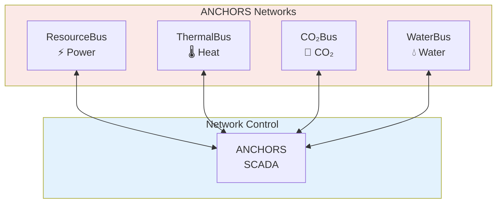
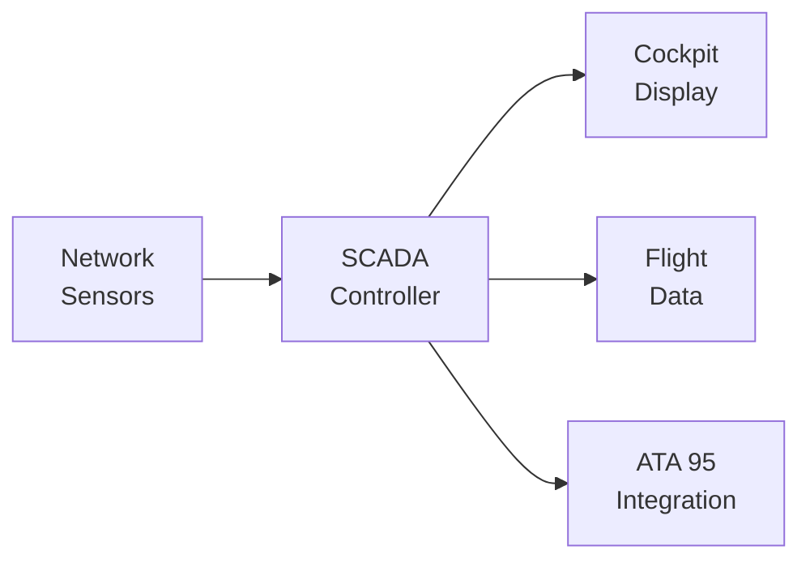

# 53-30-95-00 — ANCHORS Networks Overview

| Field | Value |
|-------|-------|
| **Document ID** | ATA53-30-95-00-OVR-002 |
| **Version** | 1.0 |
| **Date** | 2025-11-26 |
| **Status** | DRAFT |

---

## Purpose

This document provides an overview of the ANCHORS Networks subsystem (Band 95), defining the internal routing, distribution, and monitoring architecture.

> ⚠️ **Note:** Band 95 (`53-30-95-xx`) is for ANCHORS-internal networks. This is distinct from **ATA 95 (Neural Networks)**.

---

## Subsystem Description

ANCHORS Networks provides four core buses:

1. **ResourceBus** — Electrical power routing
2. **ThermalBus** — Heat distribution
3. **CO₂Bus** — CO₂ flow management
4. **WaterBus** — Water distribution

---

## Network Specifications

| Network | Medium | Capacity | Redundancy |
|---------|--------|----------|------------|
| ResourceBus | 28V DC | 6 kW | Dual |
| ThermalBus | Glycol/water | 50 kW | Dual pump |
| CO₂Bus | Gas/solid | 2 kg/hr | Single |
| WaterBus | Water | 5 L/min | Single |

---

## Key Components

### 53-30-95-01: ResourceBus

- MPPT solar integration
- Battery charging management
- Load balancing

### 53-30-95-02: ThermalBus

- Heat source collection
- Thermal storage integration
- Heat sink distribution

### 53-30-95-03: CO₂Bus

- DAC outlet routing
- Mineralization feed
- Cartridge bay interface

### 53-30-95-04: WaterBus

- Multi-grade distribution
- Quality monitoring
- Source blending

---

## Monitoring Architecture

---

## Document Control

- **Generated with assistance of:** AI (GitHub Copilot)
- **Prompted by:** Amedeo Pelliccia
- **Status:** DRAFT
- **Last AI update:** 2025-11-26
