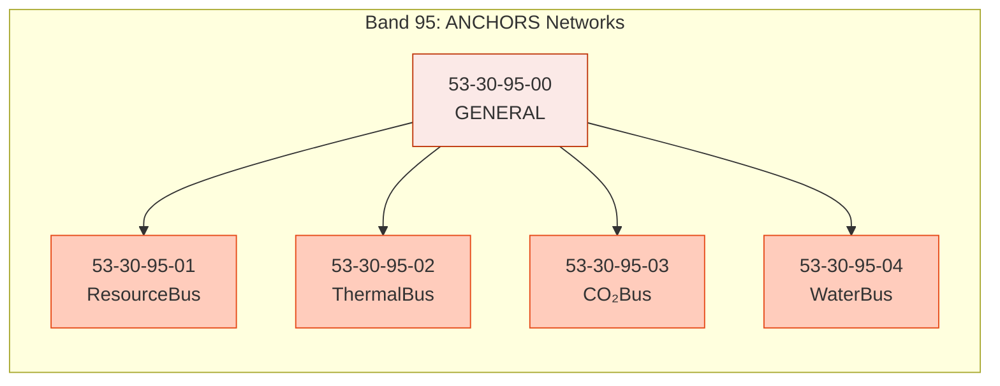
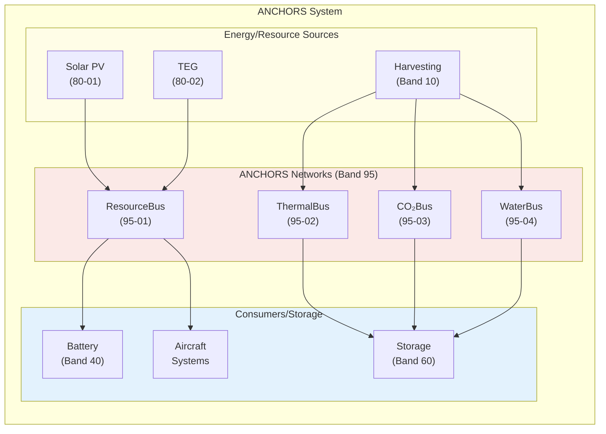
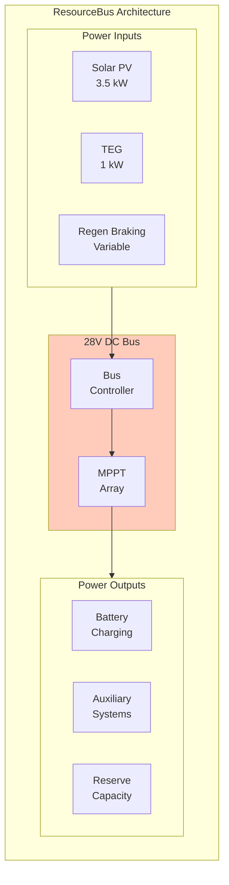
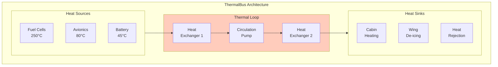
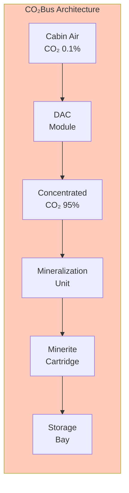
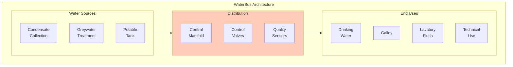
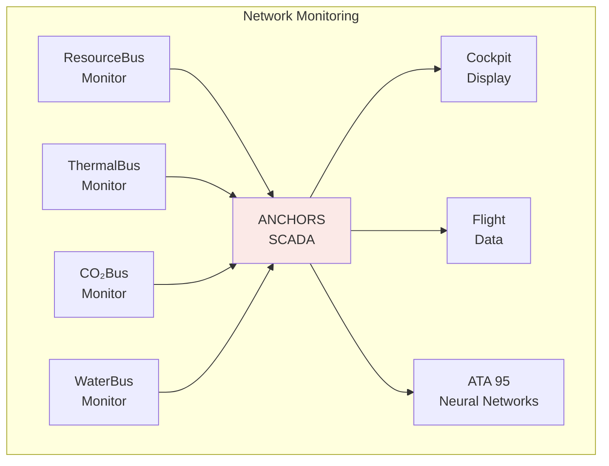

# 53-30-95 — ANCHORS Networks

| Field | Value |
|-------|-------|
| **Document ID** | ATA53-30-95-00-OVR-001 |
| **Version** | 1.0 |
| **Date** | 2025-11-26 |
| **Status** | DRAFT |
| **Classification** | TECHNICAL |

---

## Overview

**Band 95 — ANCHORS Networks** encompasses all internal routing, distribution, and bus systems that interconnect ANCHORS subsystems. These networks enable resource sharing, thermal balancing, and coordinated operation across the circular systems.

> ⚠️ **Important:** Band 95 (`53-30-95-xx`) denotes **ANCHORS-internal networks** and must not be confused with **ATA 95 (Neural Networks)**, which is a separate chapter referenced via ICDs.

---

## Scope



### Components

| ID | Component | Description |
|----|-----------|-------------|
| **53-30-95-00** | General | Network architecture, protocols, monitoring |
| **53-30-95-01** | ResourceBus | Electrical power routing and load balancing |
| **53-30-95-02** | ThermalBus | Heat distribution and thermal management |
| **53-30-95-03** | CO₂Bus | CO₂ flow routing from capture to storage |
| **53-30-95-04** | WaterBus | Water distribution across grades and uses |

---

## Network Architecture

### Overall Network Topology



---

## Network Specifications

### 1. ResourceBus (53-30-95-01)

Electrical power routing and load management:



| Parameter | Specification |
|-----------|---------------|
| Bus voltage | 28V DC nominal (24-32V range) |
| Maximum current | 200A continuous |
| Peak capacity | 6 kW |
| Efficiency | >95% |
| Redundancy | Dual-redundant bus controller |

### 2. ThermalBus (53-30-95-02)

Heat distribution and thermal balancing:



| Parameter | Specification |
|-----------|---------------|
| Working fluid | Propylene glycol / water (50/50) |
| Flow rate | 5 L/min per circuit |
| Temperature range | -40°C to +120°C |
| Heat capacity | 50 kW peak |
| Pump redundancy | Dual pumps per loop |

### 3. CO₂Bus (53-30-95-03)

CO₂ flow routing from capture to storage:



| Parameter | Specification |
|-----------|---------------|
| Inlet concentration | 400-2000 ppm |
| Capture rate | 2 kg/hr (cruise) |
| Outlet purity | >95% CO₂ |
| Cartridge capacity | 5 kg CO₂-equivalent |
| Total capacity | 100 kg/flight |

### 4. WaterBus (53-30-95-04)

Water distribution and quality management:



| Parameter | Specification |
|-----------|---------------|
| Flow rate | 0.5-5 L/min per outlet |
| Pressure | 2-4 bar |
| Temperature | 5-60°C controllable |
| Quality grades | Potable, Technical, Raw |
| Monitoring | pH, TDS, turbidity, chlorine |

---

## Network Monitoring

All ANCHORS networks are monitored via centralized SCADA:



---

## Interfaces

### Internal ANCHORS Interfaces

| Interface | Description | Reference |
|-----------|-------------|-----------|
| 53-30-10 | Harvesting — Energy/resource inputs | [ICD 53-30-95 ↔ 10](../53-30-00_GENERAL/53-30-00-05_Interfaces/) |
| 53-30-40 | Battery Loops — Power routing | [ICD 53-30-95 ↔ 40](../53-30-00_GENERAL/53-30-00-05_Interfaces/) |
| 53-30-60 | Storages — Distribution endpoints | [ICD 53-30-95 ↔ 60](../53-30-00_GENERAL/53-30-00-05_Interfaces/) |
| 53-30-80 | Energy Renewables — Power inputs | [ICD 53-30-95 ↔ 80](../53-30-00_GENERAL/53-30-00-05_Interfaces/) |
| 53-30-90 | Data & Schemas — Monitoring data | [ICD 53-30-95 ↔ 90](../53-30-00_GENERAL/53-30-00-05_Interfaces/) |

### External ATA Interfaces

| ATA | System | Interface Type |
|-----|--------|----------------|
| 21-00 | ECS | Thermal integration |
| 24-00 | Electrical Power | Bus tie interface |
| 38-00 | Water/Waste | Water system integration |
| 95-00 | Neural Networks | AI monitoring interface |

---

## Directory Structure

```
53-30-95_ANCHORS_Networks/
├── README.md
├── 53-30-95-00_GENERAL/
│   ├── 53-30-95-00_Overview.md
│   ├── 53-30-95-00_Architecture.md
│   └── 53-30-95-00_Protocols.md
├── 53-30-95-01_ResourceBus/
│   ├── 53-30-95-01_System_Description.md
│   ├── 53-30-95-01_Requirements.md
│   └── 53-30-95-01_Design.md
├── 53-30-95-02_ThermalBus/
│   ├── 53-30-95-02_System_Description.md
│   ├── 53-30-95-02_Requirements.md
│   └── 53-30-95-02_Design.md
├── 53-30-95-03_CO2Bus/
│   ├── 53-30-95-03_System_Description.md
│   ├── 53-30-95-03_Requirements.md
│   └── 53-30-95-03_Design.md
└── 53-30-95-04_WaterBus/
    ├── 53-30-95-04_System_Description.md
    ├── 53-30-95-04_Requirements.md
    └── 53-30-95-04_Design.md
```

---

## Document Control

- **Generated with assistance of:** AI (GitHub Copilot)
- **Prompted by:** Amedeo Pelliccia
- **Status:** DRAFT — Subject to human review and approval
- **Repository:** `AMPEL360-BWB-H2-Hy-E`
- **Last AI update:** 2025-11-26
