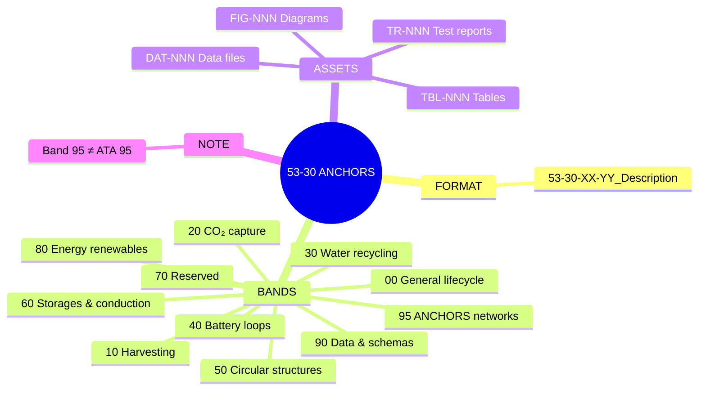

# 53-30 — ANCHORS Naming Convention & Directory Structure

| Field | Value |
|-------|-------|
| **Document ID** | ATA53-30-00-01-ADM-001 |
| **Version** | 2.1 |
| **Date** | 2025-11-26 |
| **Status** | APPROVED |
| **Classification** | ADMINISTRATIVE |

---

## Navigation

### Breadcrumb
`AMPEL360-BWB-H2-Hy-E` / `OPT-IN_FRAMEWORK` / `T-TECHNOLOGY` / `A-AIRFRAME` / `ATA_53-FUSELAGE` / `53-30_ANCHORS`

### Parent Documents
| Document | Path | Relationship |
|----------|------|--------------|
| OPT-IN Framework Standard | [`/OPT-IN_FRAMEWORK/OPT-IN_Standard_v1.1.md`](../../../../OPT-IN_Standard_v1.1.md) | Program standard |
| ATA 53 Structure | [`/ATA_53-FUSELAGE/53-00_GENERAL/`](../53-00_GENERAL/) | Chapter context |

---

## 1. Purpose

This document defines the mandatory naming convention and directory structure for all ANCHORS (ATA 53-30) documentation. Compliance ensures:

- Certification-grade traceability
- Consistent navigation across all subsystems
- CI/CD validation compatibility
- Alignment with OPT-IN Framework Standard v1.1

---

## 2. Naming Convention

### 2.1 Primary Format

```
53-30-XX-YY_DESCRIPTION
```

Where:

| Element | Description | Example |
|---------|-------------|---------|
| `53` | ATA chapter (**Fuselage**) | Fixed |
| `30` | Bucket number (**ANCHORS**) | Fixed |
| `XX` | Subsystem band (see §2.2) | `00`, `40`, `95` |
| `YY` | Component/sub-subsystem number | `01`, `02`, `10` |
| `DESCRIPTION` | Short descriptive name, `_` separator | `QuickSwap_Battery_Unit` |

### 2.2 Subsystem Band Allocation

| Band | Name | Scope | Examples |
|------|------|-------|----------|
| **00** | **General** | Lifecycle skeleton: Overview, Safety, Requirements, Design, Interfaces, Engineering, V&V, Prototyping, Production, Certification, EIS, Services, Subsystems, Operations | `53-30-00-01_Overview`, `53-30-00-02_Safety` |
| **10** | **Harvesting** | Airflow harvesting, condensate collection, waste-heat capture, RAM air recovery | `53-30-10-01_Airflow_Harvester`, `53-30-10-02_Condensate_Collector` |
| **20** | **CO₂ Capture** | CO₂ extraction, conversion, solidification (Minerite), exhaust processing | `53-30-20-01_DAC_Module`, `53-30-20-02_Mineralization_Unit` |
| **30** | **Water Recycling** | Greywater treatment, condensate processing, potable water integration | `53-30-30-01_Greywater_Treatment`, `53-30-30-02_UV_Disinfection` |
| **40** | **Battery Loops** | QuickSwap units, MicroCycle packs, thermal regeneration, SoH monitoring, BMS | `53-30-40-01_QuickSwap_Unit`, `53-30-40-02_BMS_Controller` |
| **50** | **Circular Structures** | Circular structural elements: reusable mounts, recyclable brackets, modular interfaces, DfD (Design for Disassembly) components, material passport integration | `53-30-50-01_QuickSwap_Bay_Structure`, `53-30-50-02_Modular_Rack_System` |
| **60** | **Storages & Conduction** | Tanks, cartridges, reservoirs, manifolds, long-duration thermal loops, cryogenic interfaces | `53-30-60-01_CO2_Cartridge_Bay`, `53-30-60-02_Water_Reservoir` |
| **70** | *(Reserved)* | Future expansion | — |
| **80** | **Energy Renewables** | Solar panels, vibration harvesters, thermoelectric generators, heat recovery exchangers | `53-30-80-01_Solar_Panel_Array`, `53-30-80-02_TEG_Module` |
| **90** | **Data & Schemas** | DPP integration, event catalogs, interface tables, data dictionaries, training datasets | `53-30-90-01_DPP_Schema`, `53-30-90-02_Event_Catalog` |
| **95** | **ANCHORS Networks** | ResourceBus, ThermalBus, CO₂Bus, WaterBus — intra-ANCHORS routing and distribution | `53-30-95-01_ResourceBus`, `53-30-95-02_ThermalBus` |

> **Note:** `XX = 95` denotes ANCHORS-internal networks and must not be confused with **ATA 95 (Neural Networks)**, which remains a separate chapter referenced via ICDs.

### 2.3 Band Allocation Diagram

```mermaid
flowchart TB
    subgraph ANCHORS["53-30 ANCHORS SUBSYSTEM BANDS"]
        direction LR
        
        subgraph Row1["Primary Bands"]
            B00["**00 GENERAL**<br/>Overview<br/>Safety<br/>Requirements<br/>Design"]
            B10["**10 HARVESTING**<br/>Airflow<br/>Condensate<br/>Waste Heat"]
            B20["**20 CO₂ CAPTURE**<br/>DAC<br/>Mineralization<br/>Solidification"]
            B30["**30 WATER**<br/>Greywater<br/>UV Disinfection<br/>Potable"]
            B40["**40 BATTERY**<br/>QuickSwap<br/>BMS<br/>Thermal Regen"]
            B50["**50 CIRCULAR**<br/>Reusable Mounts<br/>Modular<br/>DfD"]
        end
        
        subgraph Row2["Secondary Bands"]
            B60["**60 STORAGE**<br/>Tanks<br/>Cartridges<br/>Manifolds<br/>Cryogenic"]
            B70["**70 RESERVED**<br/>—<br/>Future Use"]
            B80["**80 ENERGY**<br/>Solar<br/>Vibration<br/>TEG<br/>Heat Recovery"]
            B90["**90 DATA**<br/>DPP Schema<br/>Event Catalog<br/>Data Dictionary"]
            B95["**95 NETWORKS**<br/>ResourceBus<br/>ThermalBus<br/>CO₂Bus<br/>WaterBus"]
        end
    end
    
    B00 --> B10 --> B20 --> B30 --> B40 --> B50
    B60 --> B70 --> B80 --> B90 --> B95
    
    style B00 fill:#e1f5fe,stroke:#01579b
    style B10 fill:#e8f5e9,stroke:#1b5e20
    style B20 fill:#fff3e0,stroke:#e65100
    style B30 fill:#e3f2fd,stroke:#0d47a1
    style B40 fill:#fce4ec,stroke:#880e4f
    style B50 fill:#f3e5f5,stroke:#4a148c
    style B60 fill:#efebe9,stroke:#3e2723
    style B70 fill:#f5f5f5,stroke:#616161
    style B80 fill:#fffde7,stroke:#f57f17
    style B90 fill:#e0f2f1,stroke:#004d40
    style B95 fill:#fbe9e7,stroke:#bf360c
```



### 2.4 Reserved Bands

| Band | Status | Potential Future Use |
|------|--------|---------------------|
| **70** | Reserved | Propulsion interfaces, APU integration |

---

## 3. Directory Structure

### 3.1 Top-Level Structure

```
53-30_ANCHORS/
├── 53-30-00_GENERAL/                    # Band 00 - Lifecycle skeleton
│   ├── 53-30-00-01_Overview/
│   ├── 53-30-00-02_Safety/
│   ├── 53-30-00-03_Requirements/
│   ├── 53-30-00-04_Design/
│   ├── 53-30-00-05_Interfaces/
│   ├── 53-30-00-06_Engineering/
│   ├── 53-30-00-07_V_and_V/
│   ├── 53-30-00-08_Prototyping/
│   ├── 53-30-00-09_Production_Planning/
│   ├── 53-30-00-10_Certification/
│   ├── 53-30-00-11_EIS_Versions_Tags/
│   ├── 53-30-00-12_Services/
│   ├── 53-30-00-13_Subsystems_Components/
│   └── 53-30-00-14_Ops_Std_Sustain/
├── 53-30-10_HARVESTING/                 # Band 10
├── 53-30-20_CO2_CAPTURE/                # Band 20
├── 53-30-30_WATER_RECYCLING/            # Band 30
├── 53-30-40_BATTERY_LOOPS/              # Band 40
├── 53-30-50_CIRCULAR_STRUCTURES/        # Band 50
├── 53-30-60_STORAGES_CONDUCTION/        # Band 60
├── 53-30-80_ENERGY_RENEWABLES/          # Band 80
├── 53-30-90_DATA_SCHEMAS/               # Band 90
└── 53-30-95_ANCHORS_NETWORKS/           # Band 95
```

### 3.2 Subsystem Directory Template

Each subsystem band (10, 20, 30, 40, 50, 60, 80, 95) follows this internal structure:

```
53-30-XX_SUBSYSTEM_NAME/
├── 53-30-XX-00_General/                 # Subsystem-level general info
│   ├── 53-30-XX-00_Overview.md
│   ├── 53-30-XX-00_Requirements.md
│   └── 53-30-XX-00_Interfaces.md
├── 53-30-XX-01_Component_A/             # First component
│   ├── 53-30-XX-01_System_Description.md
│   ├── 53-30-XX-01_Requirements.md
│   ├── 53-30-XX-01_Design.md
│   └── ASSETS/
│       ├── DIAGRAMS/
│       └── DATA/
├── 53-30-XX-02_Component_B/             # Second component
└── ...
```

### 3.3 General Layer (Band 00) Detail

```
53-30-00_GENERAL/
├── 53-30-00-01_Overview/
│   ├── 53-30-00-01_Overview.md                    # System overview
│   ├── 53-30-00-01_System_Architecture.md         # Architecture description
│   ├── 53-30-00-01_Scope_Boundaries.md            # Scope and interfaces
│   ├── 53-30-00-01_Acronym_Glossary.md            # Definitions
│   └── ASSETS/
│       └── DIAGRAMS/
│           ├── 53-30-00-01_FIG-001_*.mermaid
│           └── 53-30-00-01_FIG-001_*.svg
├── 53-30-00-02_Safety/
│   ├── 53-30-00-02_Safety_Assessment_Plan.md
│   ├── 53-30-00-02_FHA_ANCHORS.md
│   ├── 53-30-00-02_PSSA_ANCHORS.md
│   ├── 53-30-00-02_SSA_System_Safety_Assessment.md
│   ├── 53-30-00-02_FMEA_ANCHORS.md
│   ├── 53-30-00-02_FTA_ANCHORS.md
│   ├── 53-30-00-02_CCA_ANCHORS.md
│   ├── 53-30-00-02_H2_CO2_Safety_Provisions.md
│   ├── 53-30-00-02_Thermal_Runaway_Mitigation.md
│   ├── 53-30-00-02_Electrical_Hazard_Provisions.md
│   └── ASSETS/
│       └── DATA/
│           ├── 53-30-00-02_Hazard_Log.csv
│           └── 53-30-00-02_DSR_Register.csv
├── 53-30-00-03_Requirements/
├── 53-30-00-04_Design/
├── 53-30-00-05_Interfaces/
│   ├── 53-30-00-05_Interface_Matrix.md
│   ├── 53-30-00-05_ICD_21-00_ECS.md
│   ├── 53-30-00-05_ICD_24-00_Electrical.md
│   ├── 53-30-00-05_ICD_28-00_Fuel.md
│   ├── 53-30-00-05_ICD_38-00_Water.md
│   ├── 53-30-00-05_ICD_47-00_InertGas.md
│   ├── 53-30-00-05_ICD_53-00_Structures.md
│   ├── 53-30-00-05_ICD_85-00_Ground.md
│   ├── 53-30-00-05_ICD_95-00_Neural.md
│   └── 53-30-00-05_ICD_97-00_DPP.md
└── ... (06 through 14)
```

---

## 4. File Naming Rules

### 4.1 Document Files

| Pattern | Usage | Example |
|---------|-------|---------|
| `53-30-XX-YY_Name.md` | Primary document | `53-30-40-01_System_Description.md` |
| `53-30-XX-YY_Name_vN.M.md` | Versioned archive | `53-30-40-01_System_Description_v1.1.md` |
| `53-30-XX-YY_ICD_ZZ-00_Name.md` | Interface Control Document | `53-30-00-05_ICD_28-00_Fuel.md` |

### 4.2 Asset Files

| Type | Pattern | Example |
|------|---------|---------|
| **Diagrams (source)** | `53-30-XX-YY_FIG-NNN_Name.mermaid` | `53-30-00-01_FIG-001_System_Context.mermaid` |
| **Diagrams (export)** | `53-30-XX-YY_FIG-NNN_Name.svg` | `53-30-00-01_FIG-001_System_Context.svg` |
| **Data files** | `53-30-XX-YY_DAT-NNN_Name.csv` | `53-30-00-02_DAT-001_Hazard_Log.csv` |
| **Tables** | `53-30-XX-YY_TBL-NNN_Name.csv` | `53-30-90-01_TBL-001_Signal_Dictionary.csv` |
| **Test reports** | `53-30-XX-YY_TR-NNN_Name.md` | `53-30-40-01_TR-001_Propagation_Test.md` |

### 4.3 Prohibited Patterns

| Pattern | Reason | Alternative |
|---------|--------|-------------|
| Spaces in names | CI/CD incompatibility | Use `_` |
| Special characters (`&`, `#`, etc.) | Path issues | Spell out or omit |
| Binary files (`.xlsx`, `.vsdx`) | Version control | Use `.csv`, `.mermaid` |
| Deep nesting (>4 levels) | Navigation complexity | Flatten structure |

---

## 5. Cross-Reference Conventions

### 5.1 Internal References

Within ANCHORS documentation, use relative paths:

```markdown
See [System Architecture](../53-30-00-01_Overview/53-30-00-01_System_Architecture.md)
```

### 5.2 Cross-ATA References

For references to other ATA chapters, use explicit paths:

```markdown
See [ATA 28 Fuel System](/ATA_28-FUEL/28-00_GENERAL/28-00-01_Overview.md)
```

### 5.3 ICD References

Always reference ICDs by both parties:

```markdown
Interface defined in [ICD 53-30 ↔ 28](./53-30-00-05_ICD_28-00_Fuel.md)
```

---

## 6. Version Control

### 6.1 Document Versions

| Version Format | Meaning |
|----------------|---------|
| `0.x` | Draft, not reviewed |
| `1.0` | First release, reviewed |
| `1.x` | Minor updates, same baseline |
| `2.0` | Major revision, new baseline |

### 6.2 Document States

| State | Description |
|-------|-------------|
| **DRAFT** | Work in progress |
| **REVIEW** | Under review |
| **APPROVED** | Released for use |
| **SUPERSEDED** | Replaced by newer version |

---

## 7. Mapping: Previous → Current Convention

For documents created under earlier conventions:

| Previous Band | Previous Scope | Current Band | Current Scope |
|---------------|----------------|--------------|---------------|
| 50 | Energy renewables | **80** | Energy renewables |
| 70 | ANCHORS networks | **95** | ANCHORS networks |
| — | — | **60** | Storages & conduction (NEW) |
| — | — | **90** | Data & schemas (explicit) |

### 7.1 Document Migration

| Previous Path | Current Path | Action |
|---------------|--------------|--------|
| `53-30-50-xx_*` | `53-30-80-xx_*` | Renumber |
| `53-30-70-xx_*` | `53-30-95-xx_*` | Renumber |

---

## 8. CI/CD Validation

### 8.1 Automated Checks

The following are enforced by `/tools/ci/doc_meta_enforcer.py`:

| Check | Rule |
|-------|------|
| Naming | Matches `53-30-XX-YY_*.md` pattern |
| Band | XX in {00, 10, 20, 30, 40, 50, 60, 80, 90, 95} |
| No binaries | No `.xlsx`, `.vsdx`, `.docx` in repo |
| Header | Document ID, Version, Date, Status present |
| Links | All internal links resolve |

### 8.2 Pre-Commit Hooks

```bash
# Validate naming convention
./tools/ci/validate_naming.sh 53-30_ANCHORS/

# Check for binary files
./tools/ci/check_binaries.sh 53-30_ANCHORS/
```

---

## Document Control

| Field | Value |
|-------|-------|
| **Document ID** | ATA53-30-00-01-ADM-001 |
| **Version** | 2.1 |
| **Date** | 2025-11-26 |
| **Status** | APPROVED |
| **Author** | AMPEL360 Documentation WG |
| **Reviewer** | Amedeo Pelliccia |
| **Approver** | Amedeo Pelliccia |

### Revision History

| Rev | Date | Author | Description |
|-----|------|--------|-------------|
| 1.0 | 2025-11-25 | Documentation WG | Initial convention |
| 2.0 | 2025-11-26 | AI (Claude, Anthropic) | Updated band allocation: 50→80 (renewables), 70→95 (networks), added 60 (storages), 90 (data/schemas), reserved 50/70 |
| 2.1 | 2025-11-26 | AI (Claude, Anthropic) | Band 50 assigned to Circular Structures (reusable mounts, DfD, modular interfaces); only 70 remains reserved |

### AI Disclosure

- **Generated with assistance of:** AI (Claude, Anthropic)
- **Prompted by:** Amedeo Pelliccia
- **Status:** APPROVED
- **Repository:** `AMPEL360-BWB-H2-Hy-E`
- **Last AI update:** 2025-11-26

---

## Quick Reference Card



---

*END OF DOCUMENT*
