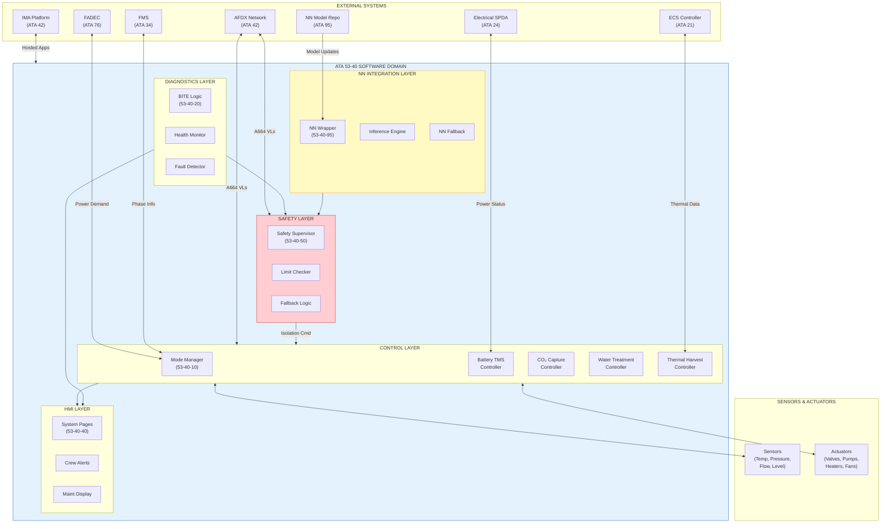
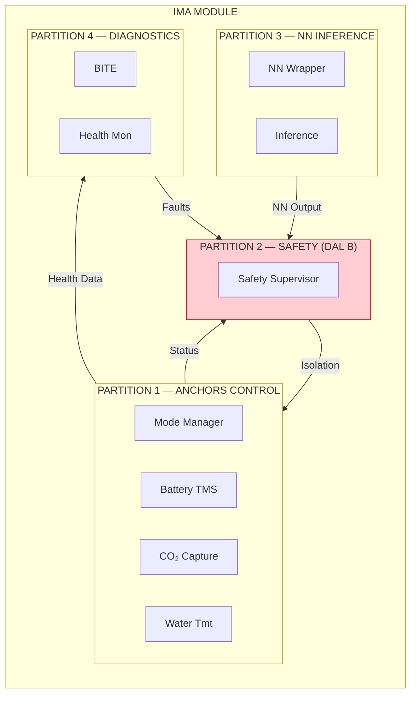
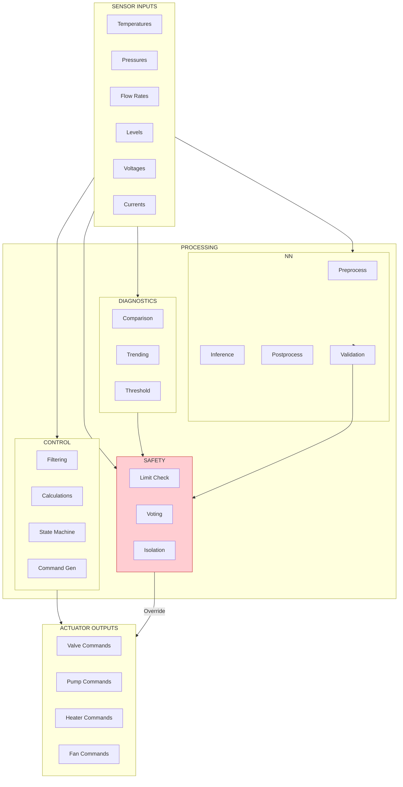
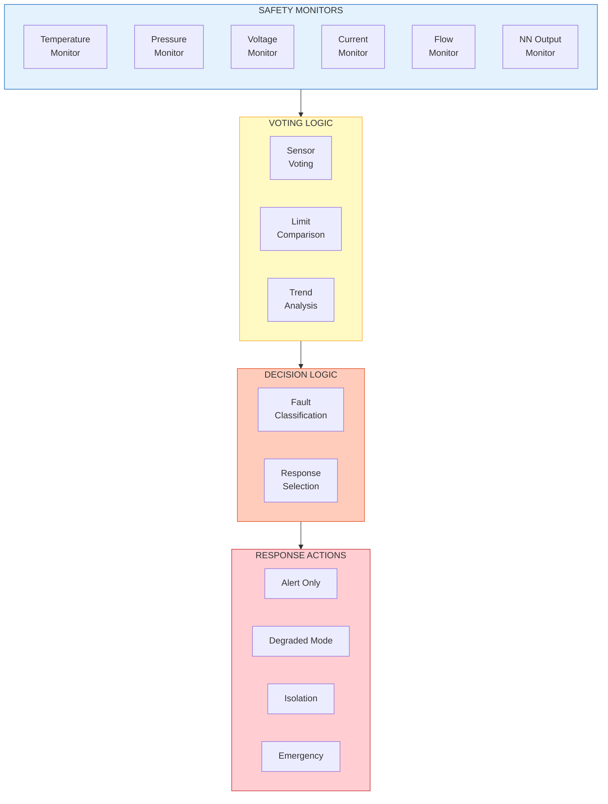

# ATA 53-40-00 Software General — Band 00 Complete Package

| Field | Value |
|-------|-------|
| **Document ID** | 53-40-00-00 |
| **Version** | 1.1 |
| **Date** | 2025-11-27 |
| **Status** | DRAFT |
| **Classification** | SOFTWARE / GENERAL |
| **ATA Chapter** | 53-40 |

---

<!--
MCP/Agent Header Prompt:
This document is the Band 00 spine for ATA 53-40 Software within the ANCHORS system.
Band 00 contains: Overview, Architecture, Design Rules, and Safety Classification.
All 53-40 software development SHALL comply with DO-178C and reference this Band 00 package.
The software controls ANCHORS subsystems: Battery TMS, CO₂ Capture, Water Treatment, and integrates ATA 95 Neural Networks.
Use this as the authoritative source for software governance, architecture patterns, and safety requirements.
-->

## Navigation

### Breadcrumb
`AMPEL360-BWB-H2-Hy-E` / `OPT-IN_FRAMEWORK` / `T-TECHNOLOGY` / `A-AIRFRAME` / `ATA_53-FUSELAGE` / `53-40_Software` / `53-40-00_GENERAL`

### Band 00 Document Index
| Document ID | Title | Section |
|-------------|-------|---------|
| 53-40-00-01 | SW Overview | [§1](#1-software-overview) |
| 53-40-00-02 | SW Architecture | [§2](#2-software-architecture) |
| 53-40-00-03 | SW Design Rules | [§3](#3-software-design-rules) |
| 53-40-00-04 | SW Safety Classification | [§4](#4-software-safety-classification) |

### Related Documents
| Document | Path | Relationship |
|----------|------|--------------|
| ANCHORS System Description | [`../53-30-00-00_ANCHORS_System_Description.md`](../53-30-00-00_ANCHORS_System_Description.md) | Parent system |
| Safety Assessment | [`../53-00-02_Safety/53-00-02-01_SSA.md`](../53-00-02_Safety/53-00-02-01_SSA.md) | Safety basis |
| Hazard Log | [`../53-00-02_Safety/53-00-02-02_Hazard_Log.md`](../53-00-02_Safety/53-00-02-02_Hazard_Log.md) | Hazard register |
| V&V Strategy | [`../53-00-07_V_AND_V/`](../53-00-07_V_AND_V/) | Verification |
| NN Integration | [`./53-40-95_NN_Integration/`](./53-40-95_NN_Integration/) | Neural networks |

---

# 1. Software Overview

## 1.1 Purpose

This section provides the top-level software overview for **ATA 53-40 — Fuselage Software**, encompassing embedded systems, control logic, diagnostics, and neural network integration within the AMPEL360 Q100 BWB-H2-Hy-E aircraft program.

## 1.2 Software Domain Scope

### 1.2.1 In Scope

| Domain | Description | Primary Functions |
|--------|-------------|-------------------|
| **ANCHORS Control** | Embedded controllers for circular systems | CO₂ capture, water recycling, battery TMS, energy harvesting |
| **Diagnostics & BITE** | Built-in test and health monitoring | Fault detection, degradation tracking, maintenance alerts |
| **Safety Supervision** | Real-time safety monitors | Limit checking, isolation commands, fallback activation |
| **NN Integration** | Neural network deployment | Inference wrappers, model loading, fallback logic |
| **HMI & Displays** | Crew interface software | System pages, alerts, ECAM integration |

### 1.2.2 Out of Scope

| Domain | Owner | Reference |
|--------|-------|-----------|
| NN model training & MLOps | ATA 95 | 95-40-00 |
| Physical system design | ATA 53-20/30 | 53-30-00 |
| Ground support equipment SW | ATA 85 | 85-40-00 |
| Avionics platform SW | ATA 42 | 42-40-00 |
| Propulsion control SW | ATA 76 | 76-40-00 |

## 1.3 Software Context Diagram



## 1.4 Software Band Structure

| Band | Name | Purpose | Key Artifacts |
|------|------|---------|---------------|
| **00** | General | Architecture, design rules, safety classification | This document |
| **10** | Control Logic | Deterministic control loops, state machines | Mode Manager, Controllers |
| **20** | Diagnostics & BITE | Fault detection, health monitoring | BITE specs, fault trees |
| **30** | Interfaces & Buses | Protocol stacks, ICD definitions | AFDX config, CAN defs |
| **40** | Applications & HMI | Cockpit displays, crew alerting | System pages, ECAM |
| **50** | Safety Supervision | Monitors, limit checking, fallback | Safety monitors, DAL-B |
| **60** | Tooling & Emulation | SIL/HIL frameworks | Test benches, emulators |
| **70** | Tests | Test strategy, vectors, coverage | Test plans, reports |
| **80** | Auto-Coding & Config | Parameter sets, generated code | Simulink configs |
| **90** | Data Models & Schemas | Signal dictionaries, log formats | ICD schemas, DPP links |
| **95** | NN Integration | NN wrappers, deployment configs | Model cards, inference |

## 1.5 Certification Basis

| Standard | Title | Application |
|----------|-------|-------------|
| **DO-178C** | Software Considerations in Airborne Systems | All airborne SW |
| **DO-331** | Model-Based Development Supplement | Auto-coded modules |
| **DO-330** | Software Tool Qualification | Dev tools |
| **DO-254** | Design Assurance for Airborne Electronic Hardware | HW/SW interfaces |
| **ARP4754A** | Development of Civil Aircraft and Systems | System integration |
| **ARP4761** | Safety Assessment Process | FHA, PSSA, SSA |
| **EASA AMC 20-115D** | Software Certification | EASA compliance |

---

# 2. Software Architecture

## 2.1 Architectural Principles

| Principle | Description | Rationale |
|-----------|-------------|-----------|
| **Layered Separation** | Control, Diagnostics, Safety, NN as distinct layers | Fault containment, testability |
| **Safety Independence** | Safety Supervisor independent of control functions | DAL-B integrity |
| **Deterministic Execution** | Fixed-period scheduling, WCET analysis | Real-time guarantees |
| **Graceful Degradation** | Defined fallback modes for all failures | Continued safe operation |
| **NN Containment** | NN outputs validated by deterministic logic | Regulatory acceptance |

## 2.2 Layered Architecture

```
┌─────────────────────────────────────────────────────────────────────────┐
│                          HMI LAYER (Band 40)                            │
│  ┌─────────────┐  ┌─────────────┐  ┌─────────────┐  ┌─────────────┐    │
│  │ System Page │  │ Alert Mgr   │  │ Maint Page  │  │ DPP Display │    │
│  └─────────────┘  └─────────────┘  └─────────────┘  └─────────────┘    │
├─────────────────────────────────────────────────────────────────────────┤
│                      SAFETY LAYER (Band 50) — DAL B                     │
│  ┌─────────────────────────────────────────────────────────────────┐   │
│  │                     SAFETY SUPERVISOR                           │   │
│  │  ┌──────────┐  ┌──────────┐  ┌──────────┐  ┌──────────────┐    │   │
│  │  │ Limit    │  │ Watchdog │  │ Fallback │  │ Isolation    │    │   │
│  │  │ Checker  │  │ Monitor  │  │ Selector │  │ Commander    │    │   │
│  │  └──────────┘  └──────────┘  └──────────┘  └──────────────┘    │   │
│  └─────────────────────────────────────────────────────────────────┘   │
├─────────────────────────────────────────────────────────────────────────┤
│                  NN INTEGRATION LAYER (Band 95) — DAL C                 │
│  ┌─────────────────────────────────────────────────────────────────┐   │
│  │                      NN WRAPPER                                 │   │
│  │  ┌──────────┐  ┌──────────┐  ┌──────────┐  ┌──────────────┐    │   │
│  │  │ Model    │  │ Inference│  │ Output   │  │ Fallback     │    │   │
│  │  │ Loader   │  │ Engine   │  │ Validator│  │ Activator    │    │   │
│  │  └──────────┘  └──────────┘  └──────────┘  └──────────────┘    │   │
│  └─────────────────────────────────────────────────────────────────┘   │
├─────────────────────────────────────────────────────────────────────────┤
│                 DIAGNOSTICS LAYER (Band 20) — DAL C/D                   │
│  ┌──────────────┐  ┌──────────────┐  ┌──────────────┐                  │
│  │ BITE Logic   │  │ Health       │  │ Fault        │                  │
│  │              │  │ Monitor      │  │ Detector     │                  │
│  └──────────────┘  └──────────────┘  └──────────────┘                  │
├─────────────────────────────────────────────────────────────────────────┤
│                   CONTROL LAYER (Band 10) — DAL B/C/D                   │
│  ┌──────────────┐  ┌──────────────┐  ┌──────────────┐  ┌────────────┐  │
│  │ Mode Manager │  │ Battery TMS  │  │ CO₂ Capture  │  │ Water Tmt  │  │
│  │ (DAL C)      │  │ (DAL B)      │  │ (DAL C)      │  │ (DAL D)    │  │
│  └──────────────┘  └──────────────┘  └──────────────┘  └────────────┘  │
├─────────────────────────────────────────────────────────────────────────┤
│                   INTERFACE LAYER (Band 30)                             │
│  ┌──────────────┐  ┌──────────────┐  ┌──────────────┐  ┌────────────┐  │
│  │ AFDX Driver  │  │ CAN Driver   │  │ Discrete I/O │  │ Analog I/O │  │
│  └──────────────┘  └──────────────┘  └──────────────┘  └────────────┘  │
├─────────────────────────────────────────────────────────────────────────┤
│                   PLATFORM LAYER (ATA 42)                               │
│  ┌─────────────────────────────────────────────────────────────────┐   │
│  │                    IMA / RTOS                                   │   │
│  └─────────────────────────────────────────────────────────────────┘   │
└─────────────────────────────────────────────────────────────────────────┘
```

## 2.3 Component Catalog

| Component ID | Name | Layer | DAL | SLOC (est.) | Scheduling |
|--------------|------|-------|-----|-------------|------------|
| SW-MM-001 | Mode Manager | Control | C | 2,500 | 20 Hz |
| SW-BTC-001 | Battery TMS Controller | Control | B | 4,000 | 50 Hz |
| SW-CO2-001 | CO₂ Capture Controller | Control | C | 3,000 | 10 Hz |
| SW-WTC-001 | Water Treatment Controller | Control | D | 1,500 | 5 Hz |
| SW-THC-001 | Thermal Harvest Controller | Control | C | 2,000 | 10 Hz |
| SW-BITE-001 | BITE Logic | Diagnostics | C | 3,500 | 1 Hz |
| SW-HM-001 | Health Monitor | Diagnostics | C | 2,000 | 1 Hz |
| SW-FD-001 | Fault Detector | Diagnostics | C | 2,500 | 10 Hz |
| SW-SS-001 | Safety Supervisor | Safety | B | 5,000 | 100 Hz |
| SW-NNW-001 | NN Wrapper | NN Integration | C | 3,000 | 10 Hz |
| SW-HMI-001 | System Pages | HMI | D | 4,000 | 5 Hz |
| **TOTAL** | — | — | — | **~33,000** | — |

## 2.4 Execution Architecture

### 2.4.1 Partition Allocation



### 2.4.2 Scheduling Parameters

| Partition | Period | WCET Budget | Priority | Memory |
|-----------|--------|-------------|----------|--------|
| ANCHORS Control | 20 ms | 12 ms | Medium | 16 MB |
| Safety (DAL B) | 10 ms | 5 ms | High | 8 MB |
| NN Inference | 100 ms | 80 ms | Low | 32 MB |
| Diagnostics | 100 ms | 50 ms | Low | 8 MB |

## 2.5 Data Flow Architecture



## 2.6 Interface Summary

| Interface | Protocol | Partner | Direction | Rate |
|-----------|----------|---------|-----------|------|
| IF-AFDX-01 | ARINC 664 | IMA Backbone | Bidirectional | 100 Mbps |
| IF-CAN-01 | CAN 2.0B | Sensor LRUs | Bidirectional | 500 kbps |
| IF-CAN-02 | CAN 2.0B | Actuator LRUs | Bidirectional | 500 kbps |
| IF-DIO-01 | Discrete | Safety relays | Output | N/A |
| IF-AIO-01 | Analog | Legacy sensors | Input | N/A |
| IF-AFDX-02 | ARINC 664 | FADEC | Bidirectional | 100 Mbps |
| IF-AFDX-03 | ARINC 664 | ECS | Bidirectional | 100 Mbps |

---

# 3. Software Design Rules

## 3.1 General Coding Standards

### 3.1.1 Language and Toolchain

| Aspect | Standard | Notes |
|--------|----------|-------|
| Language | C (ISO/IEC 9899:2011) | Safety-critical components |
| Language | C++ (ISO/IEC 14882:2017) | HMI, non-safety (restricted subset) |
| Coding Standard | MISRA C:2012 | Mandatory for DAL A/B/C |
| Static Analysis | Polyspace, LDRA | 100% compliance required |
| Compiler | GCC 11.x (qualified) | DO-330 TQL-1 |
| RTOS | VxWorks 653 / INTEGRITY | DO-178C certified |

### 3.1.2 MISRA C:2012 Deviations

| Rule | Deviation | Justification | Approval |
|------|-----------|---------------|----------|
| Rule 11.3 | Permitted for HW register access | Memory-mapped I/O | Chief SW Eng |
| Rule 21.6 | Permitted for debug builds only | printf diagnostics | Removed in release |

## 3.2 Naming Conventions

### 3.2.1 File Naming

```
<Module>_<Type>.<ext>

Examples:
  BatteryTMS_Ctrl.c       # Control logic
  BatteryTMS_Ctrl.h       # Header
  BatteryTMS_Cfg.c        # Configuration
  BatteryTMS_Test.c       # Unit tests
  SafetySupervisor_Mon.c  # Monitor function
```

### 3.2.2 Function Naming

```c
/* Pattern: <Module>_<Action><Object>[_<Qualifier>] */

/* Examples: */
BatteryTMS_CalculateSOC(void);
BatteryTMS_CheckThermalLimits(void);
SafetySupervisor_CommandIsolation(uint8_t channel);
CO2Capture_GetFlowRate_Filtered(void);
NNWrapper_RunInference(const float* input, float* output);
```

### 3.2.3 Variable Naming

| Scope | Prefix | Example |
|-------|--------|---------|
| Global | `g_` | `g_BatterySOC` |
| Static module | `m_` | `m_LastTemperature` |
| Parameter (config) | `p_` | `p_ThermalLimit_degC` |
| Pointer | `ptr_` | `ptr_SensorData` |
| Constant | `k_` | `k_MaxVoltage` |
| Boolean | `b_` | `b_IsOverTemp` |

### 3.2.4 Type Naming

```c
/* Enumerations: E_<Module>_<Name> */
typedef enum {
    E_MODE_OFF = 0,
    E_MODE_STANDBY,
    E_MODE_GROUND,
    E_MODE_FLIGHT,
    E_MODE_EMERGENCY
} E_AnchorsMode_t;

/* Structures: S_<Module>_<Name> */
typedef struct {
    float32_t temperature_degC;
    float32_t voltage_V;
    uint8_t   status;
} S_BatteryData_t;

/* Function pointers: FP_<Name> */
typedef void (*FP_FaultHandler_t)(uint16_t faultCode);
```

## 3.3 Architectural Design Rules

### 3.3.1 Mandatory Rules

| Rule ID | Rule | Rationale |
|---------|------|-----------|
| DR-001 | No dynamic memory allocation in DAL A/B code | Determinism, memory safety |
| DR-002 | No recursion in DAL A/B/C code | Stack overflow prevention |
| DR-003 | All loops SHALL have bounded iteration | WCET analysis |
| DR-004 | Safety functions SHALL NOT call non-safety functions | DAL integrity |
| DR-005 | All inter-partition communication via defined APIs | Partition isolation |
| DR-006 | NN outputs SHALL be validated by deterministic logic | NN containment |
| DR-007 | All fault conditions SHALL have defined responses | Graceful degradation |
| DR-008 | All parameters SHALL have range checking | Input validation |
| DR-009 | Watchdog refresh SHALL be conditional on health | Fault detection |
| DR-010 | All state machines SHALL have timeout transitions | Deadlock prevention |

### 3.3.2 Recommended Rules

| Rule ID | Rule | Rationale |
|---------|------|-----------|
| DR-101 | Prefer composition over inheritance | Testability |
| DR-102 | Maximum function length: 100 LOC | Maintainability |
| DR-103 | Maximum cyclomatic complexity: 15 | Testability |
| DR-104 | Maximum nesting depth: 4 | Readability |
| DR-105 | Use const wherever possible | Safety, optimization |

## 3.4 Safety-Specific Design Rules

### 3.4.1 DAL B Requirements

| Rule ID | Rule | Verification |
|---------|------|--------------|
| DS-001 | Dual-channel sensing for critical parameters | Design review |
| DS-002 | Voting logic for critical decisions | Code review, test |
| DS-003 | Independent watchdog monitoring | HIL test |
| DS-004 | Fail-safe default states defined | FMEA review |
| DS-005 | N-version diversity for critical algorithms | Design review |

### 3.4.2 NN Integration Rules

| Rule ID | Rule | Verification |
|---------|------|--------------|
| DN-001 | NN outputs bounded to physical limits | Unit test |
| DN-002 | Rate-of-change limiting on NN outputs | Unit test |
| DN-003 | Deterministic fallback for NN timeout | Integration test |
| DN-004 | NN confidence threshold enforced | Unit test |
| DN-005 | NN model versioning and integrity check | Boot test |

## 3.5 Documentation Rules

| Artifact | Template | Tool | Required For |
|----------|----------|------|--------------|
| SRS (Software Requirements) | DO-178C Table A-3 | DOORS | All DAL |
| SDD (Software Design) | DO-178C Table A-4 | DOORS + UML | All DAL |
| Source Code | In-code Doxygen | Doxygen | All DAL |
| Test Cases | DO-178C Table A-6 | VectorCAST | All DAL |
| Test Procedures | DO-178C Table A-7 | VectorCAST | All DAL |
| Test Results | DO-178C Table A-7 | VectorCAST | All DAL |

---

# 4. Software Safety Classification

## 4.1 Failure Condition Classification

Per ARP4761 and CS 25.1309:

| Classification | Definition | Probability | SW DAL |
|----------------|------------|-------------|--------|
| **Catastrophic** | Prevents safe flight/landing | < 10⁻⁹ | A |
| **Hazardous** | Large reduction in safety margins | < 10⁻⁷ | B |
| **Major** | Significant reduction in safety margins | < 10⁻⁵ | C |
| **Minor** | Slight reduction in safety margins | < 10⁻³ | D |
| **No Effect** | No impact on safety | — | E |

## 4.2 Functional Hazard Assessment (FHA) Summary

| Function | Failure Mode | Effect | Classification | SW DAL |
|----------|--------------|--------|----------------|--------|
| Battery thermal control | Loss of cooling | Thermal runaway | Hazardous | **B** |
| Battery thermal control | Erroneous high temp reading | Unnecessary shutdown | Major | **C** |
| Battery isolation | Failure to isolate | Fire propagation | Hazardous | **B** |
| CO₂ capture control | Loss of capture | CO₂ buildup (slow) | Major | **C** |
| CO₂ capture control | Valve stuck open | Pressure loss | Major | **C** |
| Water treatment | Complete loss | Comfort degradation | Minor | **D** |
| Safety supervisor | Loss of monitoring | Undetected faults | Hazardous | **B** |
| NN inference | Erroneous output | Suboptimal control | Major | **C** |
| NN inference | Loss of function | Fallback activation | Minor | **D** |
| HMI display | Loss of display | Crew workload increase | Minor | **D** |

## 4.3 Software DAL Allocation

### 4.3.1 Component DAL Matrix

| Component | Function | Failure Effect | DAL | Rationale |
|-----------|----------|----------------|-----|-----------|
| **Safety Supervisor** | Monitor, isolate | Loss = undetected hazards | **B** | Safety-critical monitoring |
| **Battery TMS Controller** | Thermal management | Loss = thermal runaway | **B** | Prevent battery fire |
| **Mode Manager** | System coordination | Loss = degraded ops | **C** | Fallback available |
| **CO₂ Capture Controller** | Capture control | Loss = CO₂ buildup | **C** | Slow effect, crew can respond |
| **Thermal Harvest Controller** | Energy recovery | Loss = efficiency loss | **C** | Non-safety function |
| **NN Wrapper** | Inference execution | Erroneous = suboptimal | **C** | Validated by Safety layer |
| **Water Treatment Controller** | Water recycling | Loss = comfort only | **D** | No safety impact |
| **BITE Logic** | Fault detection | Loss = maintenance | **C** | Affects dispatch, not safety |
| **Health Monitor** | Trending | Loss = degraded BITE | **D** | Supplement to BITE |
| **HMI / System Pages** | Display | Loss = workload | **D** | Backup indications exist |

### 4.3.2 DAL Independence Matrix

```
                    ┌─────────────────────────────────────────────┐
                    │           CALLS / USES                      │
                    │    DAL A   DAL B   DAL C   DAL D   DAL E    │
        ┌───────────┼─────────────────────────────────────────────┤
        │   DAL A   │     ✓       ✗       ✗       ✗       ✗      │
        │   DAL B   │     ✓       ✓       ✗       ✗       ✗      │
 FROM   │   DAL C   │     ✓       ✓       ✓       ✗       ✗      │
        │   DAL D   │     ✓       ✓       ✓       ✓       ✗      │
        │   DAL E   │     ✓       ✓       ✓       ✓       ✓      │
        └───────────┴─────────────────────────────────────────────┘
        
        ✓ = Permitted    ✗ = Not Permitted (requires isolation)
```

## 4.4 Safety Requirements Traceability

| Safety Req ID | Description | SW Component | DAL | Verification Method |
|---------------|-------------|--------------|-----|---------------------|
| SSR-001 | Detect battery over-temp within 100ms | Battery TMS | B | HIL test |
| SSR-002 | Isolate battery pack within 500ms of runaway | Safety Supervisor | B | HIL test |
| SSR-003 | Maintain cooling during single sensor failure | Battery TMS | B | Fault injection |
| SSR-004 | Detect CO₂ sensor failure within 1s | BITE | C | Unit test |
| SSR-005 | Activate NN fallback within 200ms of timeout | NN Wrapper | C | Integration test |
| SSR-006 | Prevent erroneous isolation commands | Safety Supervisor | B | Formal analysis |
| SSR-007 | Log all safety-relevant events | All DAL B | B | Review |
| SSR-008 | Maintain safe state on SW reset | All | B | Boot test |

## 4.5 Derived Safety Requirements

| DSR ID | Description | Source | SW Component | DAL |
|--------|-------------|--------|--------------|-----|
| DSR-SW-001 | Watchdog timeout < 100ms | SSR-001 | Safety Supervisor | B |
| DSR-SW-002 | Dual-channel temperature comparison | SSR-003 | Battery TMS | B |
| DSR-SW-003 | NN inference WCET < 80ms | SSR-005 | NN Wrapper | C |
| DSR-SW-004 | CRC check on NN model load | DN-005 | NN Wrapper | C |
| DSR-SW-005 | Parameter range check on all inputs | DS-008 | All Controllers | B/C |

## 4.6 Safety Monitor Architecture



---

# 5. Directory Structure

## 5.1 Band 00 Contents

```
53-40-00_GENERAL/
├── 53-40-00-00_SW_Band00_Complete.md      ← This document
├── 53-40-00-01_SW_Overview.md             # Standalone overview
├── 53-40-00-02_SW_Architecture.md         # Detailed architecture
├── 53-40-00-03_SW_Design_Rules.md         # Coding standards
├── 53-40-00-04_SW_Safety_Classification.md # DAL allocation
├── 53-40-00-05_SW_Interfaces.md           # Interface summary
├── 53-40-00-06_SW_Configuration_Index.md  # SCI template
└── 53-40-00-09_SW_Glossary.md             # Terms and acronyms
```

## 5.2 Complete 53-40 Structure

```
53-40_Software/
├── 53-40-00_GENERAL/                      ← Band 00 (This)
├── 53-40-10_Control_Logic/
│   ├── 53-40-10-01_Mode_Manager.md
│   ├── 53-40-10-02_Battery_TMS_Controller.md
│   ├── 53-40-10-03_CO2_Capture_Controller.md
│   ├── 53-40-10-04_Water_Treatment_Controller.md
│   └── 53-40-10-05_Thermal_Harvest_Controller.md
├── 53-40-20_Diagnostics_BITE/
│   ├── 53-40-20-01_BITE_Architecture.md
│   ├── 53-40-20-02_Health_Monitor.md
│   └── 53-40-20-03_Fault_Detector.md
├── 53-40-30_Interfaces_Buses/
│   ├── 53-40-30-01_AFDX_Configuration.md
│   ├── 53-40-30-02_CAN_Definitions.md
│   └── 53-40-30-03_Discrete_IO_Map.md
├── 53-40-40_Applications_HMI/
│   ├── 53-40-40-01_System_Pages.md
│   ├── 53-40-40-02_Crew_Alerts.md
│   └── 53-40-40-03_Maintenance_Display.md
├── 53-40-50_Safety_Supervision/
│   ├── 53-40-50-01_Safety_Supervisor_Design.md
│   ├── 53-40-50-02_Limit_Checker.md
│   ├── 53-40-50-03_Fallback_Logic.md
│   └── 53-40-50-04_Isolation_Commander.md
├── 53-40-60_Tooling_Emulation/
│   ├── 53-40-60-01_SIL_Framework.md
│   └── 53-40-60-02_HIL_Framework.md
├── 53-40-70_Tests/
│   ├── 53-40-70-01_Test_Strategy.md
│   ├── 53-40-70-02_Unit_Test_Plan.md
│   ├── 53-40-70-03_Integration_Test_Plan.md
│   └── 53-40-70-04_Coverage_Analysis.md
├── 53-40-80_AutoCoding_Config/
│   ├── 53-40-80-01_Simulink_Guidelines.md
│   ├── 53-40-80-02_Code_Generation_Config.md
│   └── 53-40-80-03_Parameter_Database.md
├── 53-40-90_Data_Schemas/
│   ├── 53-40-90-01_SCI_Template.md
│   ├── 53-40-90-02_Signal_Dictionary.csv
│   ├── 53-40-90-03_Message_Catalog.json
│   └── 53-40-90-04_Log_Format.md
└── 53-40-95_NN_Integration/
    ├── 53-40-95-01_NN_Wrapper_Specification.md
    ├── 53-40-95-02_Inference_Engine.md
    ├── 53-40-95-03_Model_Loader.md
    ├── 53-40-95-04_Output_Validator.md
    └── 53-40-95-05_Fallback_Activator.md
```

---

# 6. Document Control

| Field | Value |
|-------|-------|
| **Document ID** | 53-40-00-00 |
| **Version** | 1.1 |
| **Date** | 2025-11-27 |
| **Status** | DRAFT |
| **Author** | AMPEL360 SW Team |
| **Reviewer** | [To be assigned] |
| **Approver** | [To be assigned] |

## 6.1 Revision History

| Rev | Date | Author | Description |
|-----|------|--------|-------------|
| 1.0 | 2025-11-27 | AI (GitHub Copilot) | Initial SW Overview |
| 1.1 | 2025-11-27 | AI (Claude, Anthropic) | Complete Band 00 package: Architecture, Design Rules, Safety Classification, Context Diagram |

## 6.2 AI Disclosure

- **Generated with assistance of:** AI (Claude, Anthropic), AI (GitHub Copilot)
- **Prompted by:** Amedeo Pelliccia
- **Status:** DRAFT — Subject to human review and approval
- **Human approver:** [To be completed]
- **Repository:** `AMPEL360-BWB-H2-Hy-E`
- **Last AI update:** 2025-11-27

---

# Quick Reference Card

```
╔════════════════════════════════════════════════════════════════════════╗
║                    53-40 SOFTWARE BAND 00 QUICK REFERENCE              ║
╠════════════════════════════════════════════════════════════════════════╣
║  CERTIFICATION BASIS:                                                  ║
║  DO-178C (Software) │ DO-331 (MBD) │ DO-330 (Tools) │ ARP4754A        ║
╠════════════════════════════════════════════════════════════════════════╣
║  DAL ALLOCATION:                                                       ║
║  ┌─────────────────────────┬─────┬──────────────────────────┐         ║
║  │ Component               │ DAL │ Rationale                │         ║
║  ├─────────────────────────┼─────┼──────────────────────────┤         ║
║  │ Safety Supervisor       │  B  │ Safety-critical monitor  │         ║
║  │ Battery TMS Controller  │  B  │ Thermal runaway prevent  │         ║
║  │ Mode Manager            │  C  │ Fallback available       │         ║
║  │ CO₂ Capture Controller  │  C  │ Slow effect, crew resp   │         ║
║  │ NN Wrapper              │  C  │ Validated by Safety      │         ║
║  │ Water Treatment         │  D  │ Comfort only             │         ║
║  │ HMI / Display           │  D  │ Backup available         │         ║
║  └─────────────────────────┴─────┴──────────────────────────┘         ║
╠════════════════════════════════════════════════════════════════════════╣
║  ARCHITECTURE LAYERS:                                                  ║
║  HMI (40) → Safety (50) → NN (95) → Diagnostics (20) → Control (10)   ║
║                  ↓                                                     ║
║           Interface (30) → Platform (ATA 42)                          ║
╠════════════════════════════════════════════════════════════════════════╣
║  KEY DESIGN RULES:                                                     ║
║  DR-001: No dynamic memory (DAL A/B)                                  ║
║  DR-004: Safety SHALL NOT call non-safety                             ║
║  DR-006: NN outputs validated by deterministic logic                  ║
╠════════════════════════════════════════════════════════════════════════╣
║  SCHEDULING:                                                           ║
║  Safety: 100 Hz │ Control: 20-50 Hz │ NN: 10 Hz │ Diag: 1 Hz          ║
╠════════════════════════════════════════════════════════════════════════╣
║  ESTIMATED SIZE: ~33,000 SLOC                                         ║
╚════════════════════════════════════════════════════════════════════════╝
```

---

*END OF DOCUMENT*
