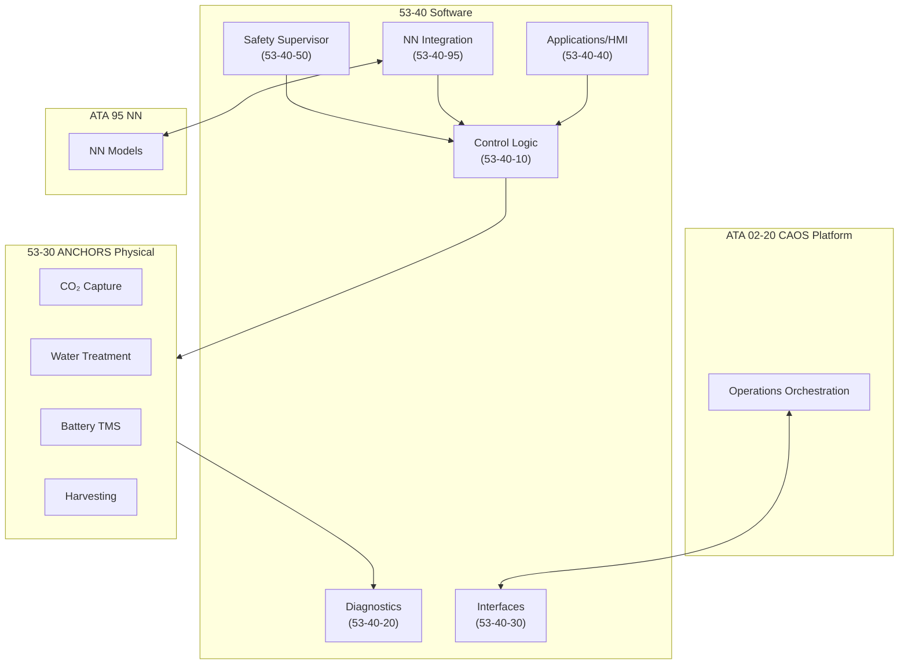

# 53-40-00-01 — Software Overview

| Field | Value |
|-------|-------|
| **Document ID** | 53-40-00-01 |
| **Version** | 1.0 |
| **Date** | 2025-11-27 |
| **Status** | DRAFT |
| **Classification** | SOFTWARE / GENERAL |

---

## 1. Purpose

This document provides the top-level software overview for ATA 53 — Fuselage embedded systems, control logic, diagnostics, and neural network integration within the AMPEL360 Q100 BWB-H2-Hy-E aircraft program.

## 2. Scope

### 2.1 Software Domain

The 53-40 Software bucket encompasses all software artifacts for fuselage-related systems, including:

- **ANCHORS Control Systems**: Software for CO₂ capture, water recycling, battery thermal management, and renewable energy harvesting
- **Diagnostics & BITE**: Built-in test equipment logic, health monitoring, and fault detection
- **Safety Supervision**: Real-time monitors, limit checking, and fallback logic
- **Neural Network Integration**: Wrappers and deployment configurations for ATA 95 NN models

### 2.2 Exclusions

- Core NN model training and MLOps (see [ATA 95](../../../../N-NEURAL_NETWORKS_USERS_TRACEABILITY/ATA_95-DIGITAL_PRODUCT_PASSPORT_NEURAL_NETWORKS/))
- Physical system design (see [53-30 ANCHORS](../../53-30_ANCHORS/))
- Ground support equipment software (see ATA 85-40)

## 3. Software Architecture Summary

## 4. Software Development Standards

### 4.1 Certification Basis

| Standard | Application |
|----------|-------------|
| [DO-178C](https://www.rtca.org/) | Software Considerations in Airborne Systems |
| [DO-254](https://www.rtca.org/) | Design Assurance for Airborne Electronic Hardware |
| [ARP4754A](https://www.sae.org/) | Development of Civil Aircraft and Systems |
| [ARP4761](https://www.sae.org/) | Safety Assessment Process |

### 4.2 Development Assurance Level (DAL) Allocation

| Function | DAL | Rationale |
|----------|-----|-----------|
| Safety Supervisor | B | Safety-critical isolation/shutdown |
| Battery TMS Controller | B | Thermal runaway prevention |
| CO₂ Capture Controller | C | Non-critical but performance-affecting |
| Water Treatment Controller | D | Non-safety, operational |
| HMI / System Page | D | Display only |
| NN Integration Wrapper | C | Fallback required |

## 5. Band Structure Overview

| Band | Name | Purpose |
|------|------|---------|
| 00 | General | Architecture, design rules, safety classification |
| 10 | Control Logic | Deterministic control loops, state machines |
| 20 | Diagnostics & BITE | Fault detection, health monitoring |
| 30 | Interfaces & Buses | Protocol stacks, ICD definitions |
| 40 | Applications & HMI | Cockpit displays, crew alerting |
| 50 | Safety Supervision | Monitors, limit checking, fallback |
| 60 | Tooling & Emulation | SIL/HIL frameworks |
| 70 | Tests | Test strategy, vectors, coverage |
| 80 | Auto-Coding & Config | Parameter sets, generated code |
| 90 | Data Models & Schemas | Signal dictionaries, log formats |
| 95 | NN Integration | NN wrappers, deployment configs |

## 6. Traceability

### 6.1 Related Requirements

- See [53-00-03 Requirements](../../53-00_GENERAL/53-00-03_Requirements/)
- See [53-30-00-03 ANCHORS Requirements](../../53-30_ANCHORS/53-30-00_GENERAL/53-30-00-03_Requirements/)

### 6.2 Verification & Validation

- See [53-00-07 V&V](../../53-00_GENERAL/53-00-07_V_AND_V/)
- See [53-40-70 Tests](../53-40-70_TESTS/)

---

## Document Control

| Field | Value |
|-------|-------|
| **Document ID** | 53-40-00-01 |
| **Version** | 1.0 |
| **Date** | 2025-11-27 |
| **Status** | DRAFT |
| **Author** | AMPEL360 SW Team |
| **Reviewer** | _[To be assigned]_ |
| **Approver** | _[To be assigned]_ |

### AI Disclosure

- **Generated with assistance of:** AI (GitHub Copilot), prompted by **Amedeo Pelliccia**
- **Status:** DRAFT — Subject to human review and approval
- **Repository:** `AMPEL360-BWB-H2-Hy-E`
- **Last AI update:** 2025-11-27

---

*END OF DOCUMENT*
