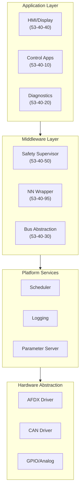
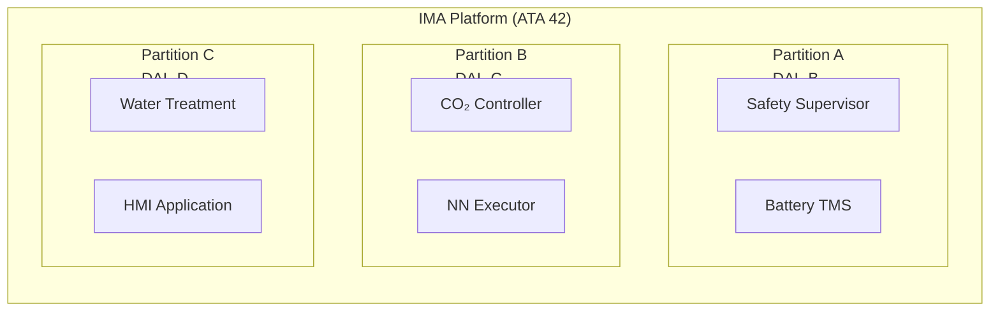
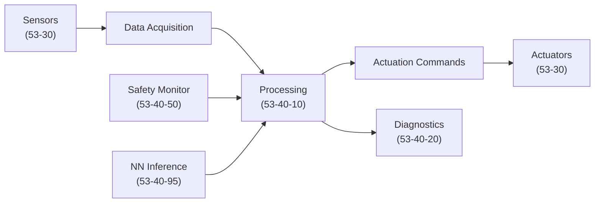

# 53-40-00-02 — Software Architecture

| Field | Value |
|-------|-------|
| **Document ID** | 53-40-00-02 |
| **Version** | 1.0 |
| **Date** | 2025-11-27 |
| **Status** | DRAFT |
| **Classification** | SOFTWARE / ARCHITECTURE |

---

## 1. Purpose

This document defines the software architecture for ATA 53 Fuselage embedded systems, establishing the structural organization, component interfaces, and design patterns used across all 53-40 software bands.

## 2. Architecture Overview

### 2.1 Layered Architecture



### 2.2 Component Architecture

| Component | Band | Responsibility | Interfaces |
|-----------|------|----------------|------------|
| ANCHORS Mode Manager | 10 | System mode control, transitions | AFDX, CAN |
| CO₂ Controller | 10 | CO₂ capture loop regulation | Sensors, Actuators |
| Battery TMS Controller | 10 | Thermal management control | Temperature sensors, Cooling |
| BITE Manager | 20 | Built-in test orchestration | All subsystems |
| Fault Handler | 20 | Fault detection and isolation | FDIR logic |
| Safety Supervisor | 50 | Real-time limit monitoring | All controllers |
| NN Inference Engine | 95 | Neural network execution | Control loops |

## 3. Software Partitioning

### 3.1 IMA Partition Model

The 53-40 software operates within the IMA (Integrated Modular Avionics) architecture defined by ATA 42:



### 3.2 Partition Allocation

| Partition | DAL | Time Budget | Memory Budget | Components |
|-----------|-----|-------------|---------------|------------|
| A | B | 20 ms | 64 MB | Safety Supervisor, Battery TMS |
| B | C | 50 ms | 128 MB | CO₂ Controller, NN Integration |
| C | D | 100 ms | 64 MB | Water Treatment, HMI |

## 4. Data Flow Architecture

### 4.1 Control Data Flow



### 4.2 Signal Categories

| Category | Rate | Priority | Latency |
|----------|------|----------|---------|
| Safety-Critical | 100 Hz | Highest | < 10 ms |
| Control | 50 Hz | High | < 20 ms |
| Monitoring | 10 Hz | Medium | < 100 ms |
| Display | 2 Hz | Low | < 500 ms |

## 5. Interface Standards

### 5.1 Internal Interfaces

| Interface | Type | Protocol | Reference |
|-----------|------|----------|-----------|
| Controller ↔ Supervisor | Message | APEX | ARINC 653 |
| Controller ↔ BITE | Function Call | Internal | 53-40-20 |
| Controller ↔ NN | RPC | gRPC | 53-40-95 |

### 5.2 External Interfaces

| Interface | Bus | Standard | Bandwidth |
|-----------|-----|----------|-----------|
| CAOS Link | AFDX | ARINC 664p7 | 100 Mbps |
| ANCHORS Bus | CAN-FD | ISO 11898-1 | 8 Mbps |
| Sensor Bus | ARINC 429 | ARINC 429 | 100 kbps |

## 6. Design Patterns

### 6.1 Control Loop Pattern

All control algorithms follow the standard control loop pattern:

```
┌─────────────────────────────────────────┐
│  Input → Filter → Controller → Limiter → Output
│                      ↑
│                   Feedback
└─────────────────────────────────────────┘
```

### 6.2 State Machine Pattern

Mode managers implement the hierarchical state machine pattern:

- **Top-level states**: OFF, INIT, READY, RUN, FAULT, MAINTENANCE
- **Sub-states**: Mode-specific operational states
- **Transitions**: Event-driven with guard conditions

### 6.3 Fault Tolerance Pattern

Safety-critical functions implement:

- **Triple Modular Redundancy (TMR)** for sensor inputs
- **Command/Monitor Architecture** for actuator outputs
- **Watchdog Supervision** for all active loops

## 7. Technology Stack

### 7.1 Languages and Tools

| Purpose | Technology | Justification |
|---------|------------|---------------|
| Safety-Critical | SPARK/Ada | Formal verification |
| Control Logic | C | Performance, determinism |
| Model-Based | Simulink | Auto-code generation |
| NN Runtime | ONNX Runtime | Portable inference |
| Configuration | YAML/JSON | Human-readable |

### 7.2 Development Environment

| Tool | Purpose | Version |
|------|---------|---------|
| SCADE | Model-based design | 2024.1 |
| VectorCAST | Unit testing | 2024 |
| LDRA | Static analysis | 10.x |
| Polyspace | Code verification | R2024a |

---

## Document Control

| Field | Value |
|-------|-------|
| **Document ID** | 53-40-00-02 |
| **Version** | 1.0 |
| **Date** | 2025-11-27 |
| **Status** | DRAFT |
| **Author** | AMPEL360 SW Architecture Team |
| **Reviewer** | _[To be assigned]_ |
| **Approver** | _[To be assigned]_ |

### AI Disclosure

- **Generated with assistance of:** AI (GitHub Copilot), prompted by **Amedeo Pelliccia**
- **Status:** DRAFT — Subject to human review and approval
- **Repository:** `AMPEL360-BWB-H2-Hy-E`
- **Last AI update:** 2025-11-27

---

*END OF DOCUMENT*
