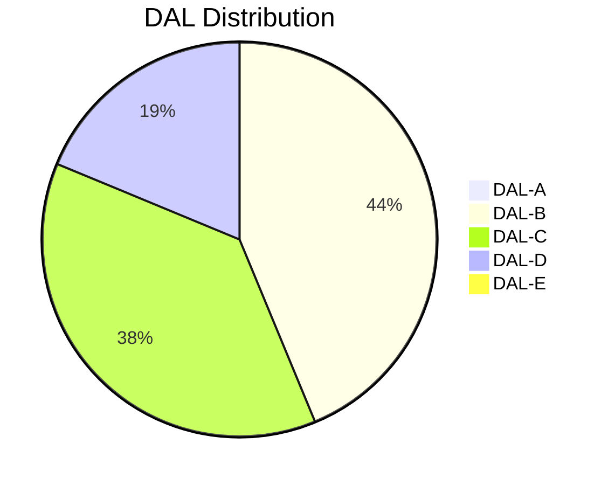
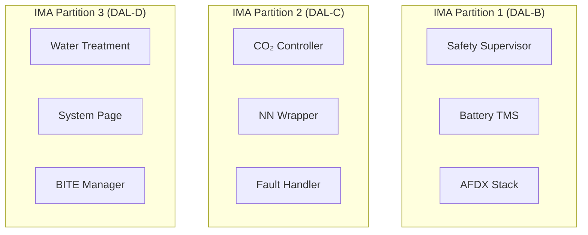

# 53-40-00-04 — Software Safety Classification

| Field | Value |
|-------|-------|
| **Document ID** | 53-40-00-04 |
| **Version** | 1.0 |
| **Date** | 2025-11-27 |
| **Status** | DRAFT |
| **Classification** | SOFTWARE / SAFETY |

---

## 1. Purpose

This document defines the software safety classification for all 53-40 Software components, establishing the Development Assurance Level (DAL) allocations based on [DO-178C](https://www.rtca.org/) and system-level hazard analysis per [ARP4761](https://www.sae.org/).

## 2. Scope

This classification covers:

- All software functions within 53-40 bands
- Interfaces to external systems (CAOS, IMA, ANCHORS)
- Neural network integration components
- Support and tooling software where applicable

## 3. Safety Assessment Framework

### 3.1 Failure Condition Categories

| Category | Definition | DAL |
|----------|------------|-----|
| **Catastrophic** | Failure conditions that would prevent continued safe flight and landing | A |
| **Hazardous** | Large reduction in safety margins or physical distress to crew/passengers | B |
| **Major** | Significant reduction in safety margins or functional capabilities | C |
| **Minor** | Slight reduction in safety margins | D |
| **No Effect** | No effect on safety | E |

### 3.2 Hazard Identification Summary

| Hazard ID | Hazard Description | Failure Condition | Category |
|-----------|-------------------|-------------------|----------|
| H-001 | Loss of battery thermal control | Battery thermal runaway | Hazardous |
| H-002 | Uncontrolled CO₂ capture | Cabin air quality degradation | Major |
| H-003 | Water system contamination | Health hazard to passengers | Major |
| H-004 | Loss of ANCHORS supervision | Multiple system degradation | Hazardous |
| H-005 | NN providing unsafe commands | Erratic system behavior | Major |

## 4. Software Classification

### 4.1 DAL Allocation Table

| Band | Component | Function | Hazard Ref | DAL |
|------|-----------|----------|------------|-----|
| **10** | Battery TMS Controller | Battery thermal regulation | H-001 | **B** |
| **10** | CO₂ Capture Controller | CO₂ capture loop control | H-002 | **C** |
| **10** | Water Treatment Controller | Water recycling control | H-003 | **D** |
| **10** | ANCHORS Mode Manager | System mode coordination | H-004 | **B** |
| **20** | BITE Manager | Built-in test orchestration | — | **D** |
| **20** | Fault Handler | Fault detection/isolation | H-004 | **C** |
| **20** | Health Monitor | Continuous health assessment | — | **C** |
| **30** | AFDX Stack | Avionics network interface | H-004 | **B** |
| **30** | CAN-FD Stack | ANCHORS network interface | H-004 | **C** |
| **40** | System Page | Crew display interface | — | **D** |
| **40** | Crew Alerting | Warning/caution logic | H-004 | **C** |
| **50** | Safety Supervisor | Real-time limit monitoring | H-001, H-004 | **B** |
| **50** | Limit Monitors | Parameter boundary checking | H-001, H-002 | **B** |
| **50** | Fallback Logic | Degraded mode operation | H-004, H-005 | **B** |
| **95** | NN Wrapper | Neural network execution | H-005 | **C** |
| **95** | Safety Envelope | NN output validation | H-005 | **B** |

### 4.2 Classification Diagram

## 5. Detailed Classification Rationale

### 5.1 DAL-B Components

#### 5.1.1 Battery TMS Controller

| Attribute | Value |
|-----------|-------|
| **Hazard** | H-001: Loss of battery thermal control |
| **Failure Effect** | Battery thermal runaway, potential fire |
| **Severity** | Hazardous |
| **Probability Target** | < 10⁻⁷ per flight hour |
| **Rationale** | Direct control of battery cooling; failure could lead to thermal event |

#### 5.1.2 Safety Supervisor

| Attribute | Value |
|-----------|-------|
| **Hazard** | H-001, H-004 |
| **Failure Effect** | Loss of safety oversight for ANCHORS systems |
| **Severity** | Hazardous |
| **Probability Target** | < 10⁻⁷ per flight hour |
| **Rationale** | Central safety monitoring function; failure cascades to multiple systems |

#### 5.1.3 AFDX Stack

| Attribute | Value |
|-----------|-------|
| **Hazard** | H-004 |
| **Failure Effect** | Loss of communication with CAOS and IMA |
| **Severity** | Hazardous |
| **Probability Target** | < 10⁻⁷ per flight hour |
| **Rationale** | Critical data path for system coordination |

### 5.2 DAL-C Components

#### 5.2.1 CO₂ Capture Controller

| Attribute | Value |
|-----------|-------|
| **Hazard** | H-002 |
| **Failure Effect** | Cabin CO₂ levels outside normal range |
| **Severity** | Major |
| **Probability Target** | < 10⁻⁵ per flight hour |
| **Rationale** | Cabin air quality impact; backup systems available |

#### 5.2.2 NN Wrapper

| Attribute | Value |
|-----------|-------|
| **Hazard** | H-005 |
| **Failure Effect** | NN provides suboptimal or incorrect commands |
| **Severity** | Major |
| **Probability Target** | < 10⁻⁵ per flight hour |
| **Rationale** | Fallback deterministic logic available |

## 6. Independence and Segregation

### 6.1 Independence Requirements

| DAL | Independence Requirement |
|-----|-------------------------|
| A | Complete functional and physical independence |
| B | Functional independence with partitioned resources |
| C | Logical separation within shared resources |
| D | No specific independence requirement |

### 6.2 Partition Allocation

## 7. Verification Requirements by DAL

| Activity | DAL-B | DAL-C | DAL-D |
|----------|-------|-------|-------|
| Requirements Coverage | ✓ | ✓ | ✓ |
| Code Coverage (Statement) | 100% | 100% | Objective |
| Code Coverage (Branch) | 100% | — | — |
| Code Coverage (MC/DC) | — | — | — |
| Structural Coverage | ✓ | ✓ | — |
| Independence of V&V | ✓ | — | — |

## 8. Traceability

### 8.1 Related Documents

| Document | Reference |
|----------|-----------|
| System FHA | [53-00-02 Safety](../../53-00_GENERAL/53-00-02_Safety/) |
| ANCHORS FMEA | [53-30-00-02 Safety](../../53-30_ANCHORS/53-30-00_GENERAL/53-30-00-02_Safety/) |
| SW Requirements | [53-40-00-03 Design Rules](./53-40-00-03_SW_Design_Rules.md) |

---

## Document Control

| Field | Value |
|-------|-------|
| **Document ID** | 53-40-00-04 |
| **Version** | 1.0 |
| **Date** | 2025-11-27 |
| **Status** | DRAFT |
| **Author** | AMPEL360 Safety Team |
| **Reviewer** | _[To be assigned]_ |
| **Approver** | _[To be assigned]_ |

### AI Disclosure

- **Generated with assistance of:** AI (GitHub Copilot), prompted by **Amedeo Pelliccia**
- **Status:** DRAFT — Subject to human review and approval
- **Repository:** `AMPEL360-BWB-H2-Hy-E`
- **Last AI update:** 2025-11-27

---

*END OF DOCUMENT*
