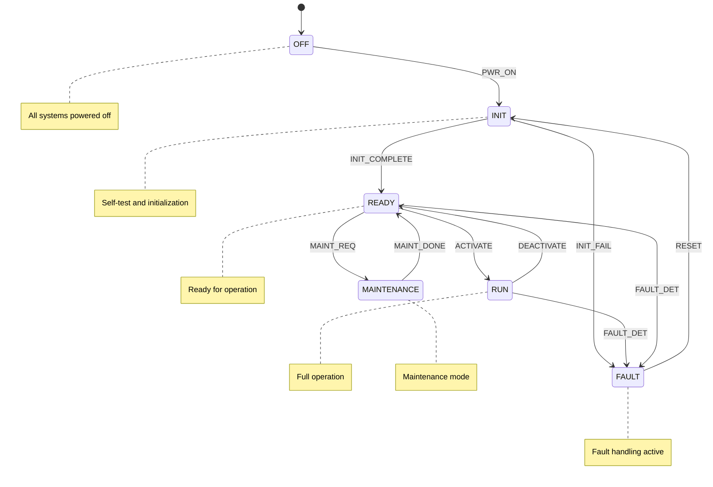

# 53-40-10-01 — ANCHORS Mode Manager

| Field | Value |
|-------|-------|
| **Document ID** | 53-40-10-01 |
| **Version** | 1.0 |
| **Date** | 2025-11-27 |
| **Status** | DRAFT |
| **Classification** | SOFTWARE / CONTROL LOGIC |
| **DAL** | B |

---

## 1. Purpose

The ANCHORS Mode Manager is the top-level coordinator for all ANCHORS (Advanced Networked Circular Hydrogen Operations & Regenerative Systems) subsystems within ATA 53 Fuselage. It orchestrates system modes, transitions, and inter-subsystem coordination.

## 2. Functional Description

### 2.1 Responsibilities

- Coordinate operational modes across all ANCHORS subsystems
- Manage mode transitions with proper sequencing
- Provide system-level status to CAOS (ATA 02-20)
- Interface with Safety Supervisor (53-40-50) for safety-critical transitions
- Handle degraded mode operations

### 2.2 Managed Subsystems

| Subsystem | Controller | Mode Dependency |
|-----------|------------|-----------------|
| CO₂ Capture | 53-40-10-02 | Requires READY state |
| Battery TMS | 53-40-10-03 | Always active in RUN |
| Water Treatment | 53-40-10-04 | Optional in RUN |
| Harvesting Systems | 53-30-10 | Mode-dependent activation |

## 3. State Machine Design

### 3.1 System States

### 3.2 State Descriptions

| State | Description | Subsystem Status |
|-------|-------------|------------------|
| OFF | Power off, no activity | All OFF |
| INIT | Power-on self-test, configuration load | Initializing |
| READY | Systems ready, awaiting activation | Standby |
| RUN | Full operational mode | Active |
| FAULT | Fault detected, safe state | Safe/Isolated |
| MAINTENANCE | Ground maintenance operations | Test mode |

### 3.3 Transition Guards

| Transition | Guard Condition |
|------------|-----------------|
| OFF → INIT | Power available |
| INIT → READY | All self-tests passed, config valid |
| INIT → FAULT | Any self-test failed |
| READY → RUN | Safety Supervisor approval, all controllers ready |
| RUN → READY | Orderly shutdown complete |
| RUN → FAULT | Critical fault detected |
| FAULT → INIT | Manual reset command, fault cleared |

## 4. Interfaces

### 4.1 Inputs

| Signal | Source | Type | Rate |
|--------|--------|------|------|
| Mode Command | CAOS | Discrete | Event |
| Controller Status | Subsystem Controllers | Status | 10 Hz |
| Safety Override | Safety Supervisor | Boolean | 100 Hz |
| Fault Indications | BITE | Discrete | Event |

### 4.2 Outputs

| Signal | Destination | Type | Rate |
|--------|-------------|------|------|
| System Mode | All Subsystems | Discrete | 10 Hz |
| System Status | CAOS | Status | 10 Hz |
| Mode Ready | Flight Deck | Boolean | 2 Hz |
| Fault Summary | BITE | Status | Event |

## 5. Requirements Traceability

| Requirement ID | Description | Verification |
|----------------|-------------|--------------|
| REQ-53-40-10-01-001 | Mode Manager shall coordinate all ANCHORS subsystems | Test |
| REQ-53-40-10-01-002 | Mode transitions shall be sequenced safely | Analysis + Test |
| REQ-53-40-10-01-003 | Fault detection shall trigger safe state within 100ms | Test |
| REQ-53-40-10-01-004 | Mode status shall be reported to CAOS at 10 Hz | Test |

---

## Document Control

| Field | Value |
|-------|-------|
| **Document ID** | 53-40-10-01 |
| **Version** | 1.0 |
| **Date** | 2025-11-27 |
| **Status** | DRAFT |
| **Author** | AMPEL360 Control SW Team |

### AI Disclosure

- **Generated with assistance of:** AI (GitHub Copilot), prompted by **Amedeo Pelliccia**
- **Status:** DRAFT — Subject to human review and approval
- **Repository:** `AMPEL360-BWB-H2-Hy-E`
- **Last AI update:** 2025-11-27

---

*END OF DOCUMENT*
