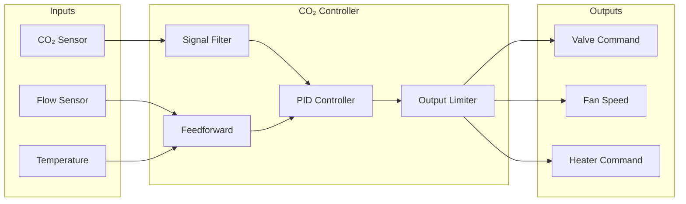

# 53-40-10-02 — CO₂ Capture Controller

| Field | Value |
|-------|-------|
| **Document ID** | 53-40-10-02 |
| **Version** | 1.0 |
| **Date** | 2025-11-27 |
| **Status** | DRAFT |
| **Classification** | SOFTWARE / CONTROL LOGIC |
| **DAL** | C |

---

## 1. Purpose

The CO₂ Capture Controller manages the onboard carbon capture system, regulating CO₂ absorption and storage to support the AMPEL360 Q100's carbon-neutral operations and cabin air quality management.

## 2. Functional Description

### 2.1 Control Objectives

- Maintain cabin CO₂ levels within acceptable limits (< 1500 ppm)
- Optimize CO₂ capture efficiency based on flight phase
- Manage sorbent regeneration cycles
- Coordinate with ECS (ATA 21) for air handling

### 2.2 Control Modes

| Mode | Description | Setpoint |
|------|-------------|----------|
| CRUISE | Normal cruise operation | 80% capture rate |
| ASCENT | Reduced load during climb | 50% capture rate |
| DESCENT | Preparation for landing | 60% capture rate |
| GROUND | Pre-conditioning | 100% capture rate |
| REGEN | Sorbent regeneration | N/A |

## 3. Control Architecture

### 3.1 Control Loop

### 3.2 Control Parameters

| Parameter | Value | Units | Description |
|-----------|-------|-------|-------------|
| Kp | 2.5 | — | Proportional gain |
| Ki | 0.1 | 1/s | Integral gain |
| Kd | 0.05 | s | Derivative gain |
| Output Rate Limit | 10 | %/s | Maximum change rate |
| Valve Min | 0 | % | Minimum valve position |
| Valve Max | 100 | % | Maximum valve position |

## 4. Interfaces

### 4.1 Sensor Inputs

| Signal | Range | Units | Rate | Source |
|--------|-------|-------|------|--------|
| Cabin CO₂ | 0-5000 | ppm | 10 Hz | CO₂ Sensor Array |
| Airflow Rate | 0-500 | kg/h | 10 Hz | Flow Meter |
| Sorbent Temp | -20 to 200 | °C | 10 Hz | RTD |
| Sorbent Saturation | 0-100 | % | 1 Hz | Saturation Sensor |

### 4.2 Actuator Outputs

| Signal | Range | Units | Rate | Destination |
|--------|-------|-------|------|-------------|
| Inlet Valve | 0-100 | % | 10 Hz | Valve Actuator |
| Fan Speed | 0-100 | % | 10 Hz | Fan VFD |
| Regeneration Heater | 0-100 | % | 1 Hz | Heater Controller |

## 5. Safety Considerations

### 5.1 Failure Modes

| Failure | Effect | Mitigation |
|---------|--------|------------|
| CO₂ sensor failure | Loss of feedback | Switch to ECS air quality backup |
| Valve stuck open | Overcooling | Rate limit + temperature monitoring |
| Valve stuck closed | No capture | Fault indication + manual override |

### 5.2 Safety Limits

| Parameter | Warning | Limit | Action |
|-----------|---------|-------|--------|
| Cabin CO₂ | 2000 ppm | 2500 ppm | Max capture mode |
| Sorbent Temp | 180°C | 200°C | Shutdown heater |
| Saturation | 90% | 95% | Force regeneration |

## 6. NN Integration

The CO₂ Controller integrates with the CO₂ Controller NN (53-40-95-01) for:

- Predictive capture rate optimization
- Regeneration cycle timing
- Energy efficiency optimization

See [53-40-95-01 CO₂ Controller NN](../../53-40-95_NN_INTEGRATION/53-40-95-01_CO2_Controller_NN/) for details.

---

## Document Control

| Field | Value |
|-------|-------|
| **Document ID** | 53-40-10-02 |
| **Version** | 1.0 |
| **Date** | 2025-11-27 |
| **Status** | DRAFT |
| **Author** | AMPEL360 Control SW Team |

### AI Disclosure

- **Generated with assistance of:** AI (GitHub Copilot), prompted by **Amedeo Pelliccia**
- **Status:** DRAFT — Subject to human review and approval
- **Repository:** `AMPEL360-BWB-H2-Hy-E`
- **Last AI update:** 2025-11-27

---

*END OF DOCUMENT*
