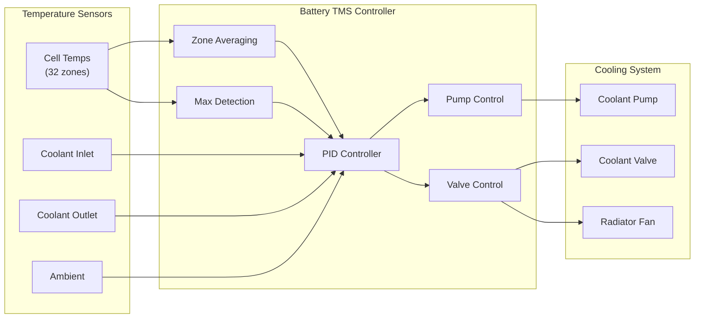

# 53-40-10-03 — Battery TMS Controller

| Field | Value |
|-------|-------|
| **Document ID** | 53-40-10-03 |
| **Version** | 1.0 |
| **Date** | 2025-11-27 |
| **Status** | DRAFT |
| **Classification** | SOFTWARE / CONTROL LOGIC |
| **DAL** | B |

---

## 1. Purpose

The Battery Thermal Management System (TMS) Controller regulates temperature for the AMPEL360 Q100's 5 MWh lithium-ion battery system, preventing thermal runaway and optimizing battery performance and longevity.

## 2. Functional Description

### 2.1 Control Objectives

- Maintain battery pack temperature within safe operating range (15-35°C)
- Prevent thermal runaway through proactive cooling
- Optimize battery performance during high-power operations
- Manage temperature during charging operations
- Coordinate with hydrogen fuel cell thermal systems

### 2.2 Control Modes

| Mode | Description | Target Temp |
|------|-------------|-------------|
| NORMAL | Standard operation | 25°C ± 5°C |
| HIGH_LOAD | High power discharge | 25°C ± 3°C |
| CHARGING | Ground charging | 20°C ± 3°C |
| PRECONDITIONING | Pre-flight warm-up | 25°C |
| EMERGENCY_COOL | Rapid cooling | Minimum achievable |

## 3. Control Architecture

### 3.1 Thermal Control Loop



### 3.2 Control Parameters

| Parameter | Value | Units | Description |
|-----------|-------|-------|-------------|
| Kp | 5.0 | — | Proportional gain |
| Ki | 0.2 | 1/s | Integral gain |
| Kd | 0.5 | s | Derivative gain |
| Max Temp Setpoint | 35 | °C | Maximum cell temperature |
| Warning Temp | 40 | °C | Warning threshold |
| Critical Temp | 50 | °C | Emergency shutdown |
| Pump Flow Range | 0-100 | L/min | Coolant flow rate |

## 4. Safety Features

### 4.1 Multi-Zone Monitoring

The controller monitors 32 temperature zones across the battery pack:

```
┌─────────────────────────────────────┐
│  Battery Pack Temperature Zones     │
├─────────────────────────────────────┤
│  Z01  Z02  Z03  Z04  Z05  Z06  Z07  Z08 │
│  Z09  Z10  Z11  Z12  Z13  Z14  Z15  Z16 │
│  Z17  Z18  Z19  Z20  Z21  Z22  Z23  Z24 │
│  Z25  Z26  Z27  Z28  Z29  Z30  Z31  Z32 │
└─────────────────────────────────────┘
```

### 4.2 Thermal Runaway Prevention

| Stage | Temperature | Action |
|-------|-------------|--------|
| Normal | < 35°C | Normal cooling |
| Elevated | 35-40°C | Increase cooling, reduce load |
| Warning | 40-45°C | Maximum cooling, alert crew |
| Critical | 45-50°C | Load shedding, emergency cool |
| Emergency | > 50°C | Isolation, shutdown, vent |

### 4.3 Redundancy

- Dual coolant pumps (primary/backup)
- Dual temperature sensor chains
- Independent thermal cutoff switches
- Passive thermal fuses

## 5. Interfaces

### 5.1 Inputs

| Signal | Range | Units | Rate | Source |
|--------|-------|-------|------|--------|
| Cell Temps (×32) | -40 to 100 | °C | 50 Hz | RTD Array |
| Coolant Flow | 0-150 | L/min | 10 Hz | Flow Sensor |
| Battery Current | -500 to 500 | A | 50 Hz | Current Sensor |
| Ambient Temp | -40 to 60 | °C | 1 Hz | External Sensor |

### 5.2 Outputs

| Signal | Range | Units | Rate | Destination |
|--------|-------|-------|------|-------------|
| Pump Speed | 0-100 | % | 50 Hz | Pump VFD |
| Cooling Valve | 0-100 | % | 10 Hz | Valve Actuator |
| Fan Speed | 0-100 | % | 10 Hz | Fan VFD |
| Isolation Cmd | Boolean | — | 50 Hz | Contactor |

## 6. Requirements Traceability

| Requirement ID | Description | Verification |
|----------------|-------------|--------------|
| REQ-53-40-10-03-001 | Battery temp shall be maintained 15-35°C | Test |
| REQ-53-40-10-03-002 | Thermal runaway detection < 100ms | Test |
| REQ-53-40-10-03-003 | Emergency isolation < 500ms | Test |
| REQ-53-40-10-03-004 | Dual-redundant sensor monitoring | Analysis |

---

## Document Control

| Field | Value |
|-------|-------|
| **Document ID** | 53-40-10-03 |
| **Version** | 1.0 |
| **Date** | 2025-11-27 |
| **Status** | DRAFT |
| **Author** | AMPEL360 Control SW Team |

### AI Disclosure

- **Generated with assistance of:** AI (GitHub Copilot), prompted by **Amedeo Pelliccia**
- **Status:** DRAFT — Subject to human review and approval
- **Repository:** `AMPEL360-BWB-H2-Hy-E`
- **Last AI update:** 2025-11-27

---

*END OF DOCUMENT*
