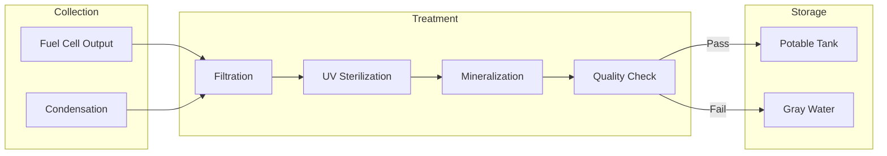

# 53-40-10-04 — Water Treatment Controller

| Field | Value |
|-------|-------|
| **Document ID** | 53-40-10-04 |
| **Version** | 1.0 |
| **Date** | 2025-11-27 |
| **Status** | DRAFT |
| **Classification** | SOFTWARE / CONTROL LOGIC |
| **DAL** | D |

---

## 1. Purpose

The Water Treatment Controller manages the AMPEL360 Q100's onboard water recycling system, treating fuel cell byproduct water for cabin use and supporting the aircraft's circular resource management philosophy.

## 2. Functional Description

### 2.1 Control Objectives

- Collect and treat water produced by hydrogen fuel cells
- Maintain potable water quality standards
- Manage water storage levels
- Coordinate with cabin water distribution system

### 2.2 Water Sources

| Source | Flow Rate | Quality |
|--------|-----------|---------|
| Fuel Cell Exhaust | 50-200 kg/h | High purity H₂O |
| Humidity Extraction | 5-20 kg/h | Variable |
| Atmospheric Condensation | 2-10 kg/h | Requires treatment |

## 3. Treatment Process

### 3.1 Treatment Stages



### 3.2 Control Modes

| Mode | Description | Processing Rate |
|------|-------------|-----------------|
| NORMAL | Standard operation | 100% capacity |
| LOW_DEMAND | Reduced processing | 50% capacity |
| HIGH_DEMAND | Maximum output | 100% + reserve |
| BYPASS | Direct routing (emergency) | N/A |
| MAINTENANCE | Cleaning/service mode | 0% |

## 4. Interfaces

### 4.1 Sensor Inputs

| Signal | Range | Units | Rate | Source |
|--------|-------|-------|------|--------|
| Inlet Flow | 0-300 | kg/h | 1 Hz | Flow Meter |
| Water Quality | 0-1000 | TDS | 0.1 Hz | TDS Sensor |
| pH Level | 4-10 | pH | 0.1 Hz | pH Sensor |
| Tank Level | 0-100 | % | 0.1 Hz | Level Sensor |
| UV Intensity | 0-100 | % | 1 Hz | UV Sensor |

### 4.2 Actuator Outputs

| Signal | Range | Units | Rate | Destination |
|--------|-------|-------|------|-------------|
| Inlet Valve | 0-100 | % | 1 Hz | Valve |
| Pump Speed | 0-100 | % | 1 Hz | Pump VFD |
| UV Lamp | ON/OFF | — | Event | UV System |
| Diverter | Route | — | Event | Diverter Valve |

## 5. Water Quality Standards

### 5.1 Potable Water Criteria

| Parameter | Min | Max | Units |
|-----------|-----|-----|-------|
| Total Dissolved Solids | 50 | 500 | ppm |
| pH | 6.5 | 8.5 | — |
| Turbidity | — | 1 | NTU |
| Free Chlorine | 0.2 | 2.0 | ppm |

### 5.2 Monitoring Schedule

| Test | Frequency | Response |
|------|-----------|----------|
| TDS | Continuous | Auto-adjust treatment |
| pH | Continuous | Adjust mineralization |
| Bacteriological | Daily | Alert if failed |
| Full Panel | Weekly | Ground service |

## 6. Storage Management

### 6.1 Tank Levels

| Tank | Capacity | Low Alarm | High Alarm |
|------|----------|-----------|------------|
| Potable | 500 L | 20% | 95% |
| Gray | 200 L | — | 90% |
| Collection | 100 L | — | 95% |

### 6.2 Level Control Logic

```
IF potable_tank < 20% THEN
    SET processing_mode = HIGH_DEMAND
    ALERT "Low potable water"
ELSE IF potable_tank > 95% THEN
    SET processing_mode = LOW_DEMAND
ELSE
    SET processing_mode = NORMAL
END IF
```

---

## Document Control

| Field | Value |
|-------|-------|
| **Document ID** | 53-40-10-04 |
| **Version** | 1.0 |
| **Date** | 2025-11-27 |
| **Status** | DRAFT |
| **Author** | AMPEL360 Control SW Team |

### AI Disclosure

- **Generated with assistance of:** AI (GitHub Copilot), prompted by **Amedeo Pelliccia**
- **Status:** DRAFT — Subject to human review and approval
- **Repository:** `AMPEL360-BWB-H2-Hy-E`
- **Last AI update:** 2025-11-27

---

*END OF DOCUMENT*
