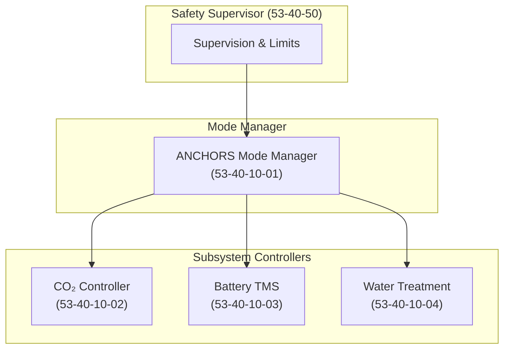
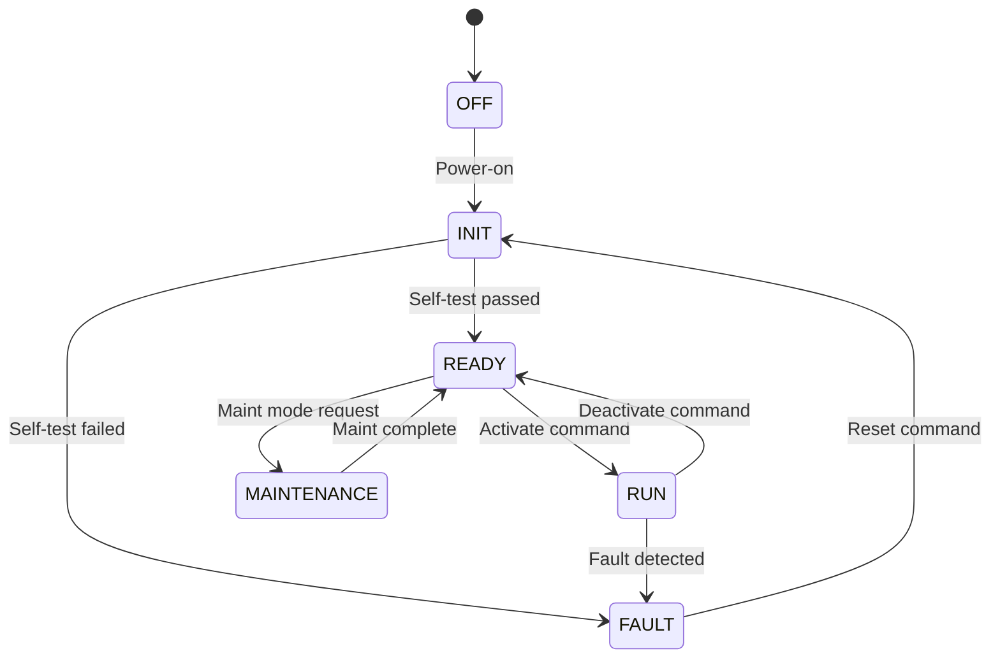

# 53-40-10 — Control Logic Band

| Field | Value |
|-------|-------|
| **Document ID** | 53-40-10-00 |
| **Version** | 1.0 |
| **Date** | 2025-11-27 |
| **Status** | DRAFT |
| **Classification** | SOFTWARE / CONTROL LOGIC |

---

## 1. Purpose

This document provides an overview of the Control Logic band (53-40-10) for ATA 53 Fuselage software. This band contains deterministic control loops, mode managers, and state machines that govern ANCHORS and fuselage subsystems.

## 2. Band Contents

| Module | Document ID | Purpose | DAL |
|--------|-------------|---------|-----|
| [ANCHORS Mode Manager](./53-40-10-01_Anchors_Mode_Manager/) | 53-40-10-01 | System mode coordination | B |
| [CO₂ Capture Controller](./53-40-10-02_CO2_Capture_Controller/) | 53-40-10-02 | CO₂ capture loop regulation | C |
| [Battery TMS Controller](./53-40-10-03_Battery_TMS_Controller/) | 53-40-10-03 | Thermal management control | B |
| [Water Treatment Controller](./53-40-10-04_Water_Treatment_Controller/) | 53-40-10-04 | Water recycling control | D |

## 3. Control Architecture

### 3.1 Controller Hierarchy

### 3.2 Execution Model

| Controller | Rate | Priority | Time Budget |
|------------|------|----------|-------------|
| Mode Manager | 10 Hz | Highest | 5 ms |
| Battery TMS | 50 Hz | High | 10 ms |
| CO₂ Controller | 10 Hz | Medium | 15 ms |
| Water Treatment | 1 Hz | Low | 50 ms |

## 4. Design Principles

### 4.1 State Machine Conventions

All mode managers and controllers follow standardized state machine conventions:

### 4.2 Control Loop Pattern

Standard control loop structure for all 53-40-10 controllers:

1. **Input Acquisition**: Read sensor data with validity check
2. **Filtering**: Apply appropriate signal conditioning
3. **Control Law**: Execute control algorithm
4. **Limiting**: Apply output limits and rate limits
5. **Safety Check**: Verify output within safety envelope
6. **Output**: Command actuators

## 5. Traceability

### 5.1 Requirements Reference

- [53-00-03 Requirements](../../53-00_GENERAL/53-00-03_Requirements/)
- [53-30-00-03 ANCHORS Requirements](../../53-30_ANCHORS/53-30-00_GENERAL/53-30-00-03_Requirements/)

### 5.2 Interface Reference

- [53-40-30 Interfaces](../53-40-30_INTERFACES_BUSES/)
- [53-40-90 Data Models](../53-40-90_DATA_MODELS_SCHEMAS/)

---

## Document Control

| Field | Value |
|-------|-------|
| **Document ID** | 53-40-10-00 |
| **Version** | 1.0 |
| **Date** | 2025-11-27 |
| **Status** | DRAFT |
| **Author** | AMPEL360 Control SW Team |

### AI Disclosure

- **Generated with assistance of:** AI (GitHub Copilot), prompted by **Amedeo Pelliccia**
- **Status:** DRAFT — Subject to human review and approval
- **Repository:** `AMPEL360-BWB-H2-Hy-E`
- **Last AI update:** 2025-11-27

---

*END OF DOCUMENT*
