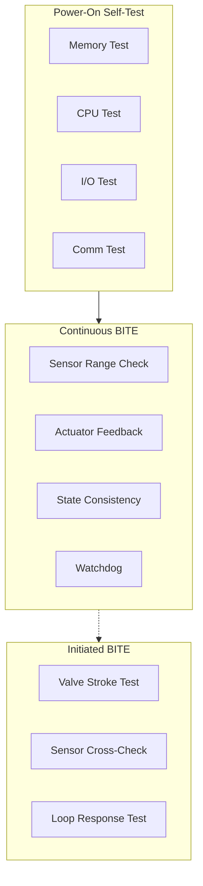

# 53-40-20-01 — ANCHORS BITE Design

| Field | Value |
|-------|-------|
| **Document ID** | 53-40-20-01 |
| **Version** | 1.0 |
| **Date** | 2025-11-27 |
| **Status** | DRAFT |
| **Classification** | SOFTWARE / DIAGNOSTICS |

---

## 1. Purpose

This document defines the Built-In Test Equipment (BITE) design for ANCHORS systems within ATA 53 Fuselage. BITE provides continuous monitoring, fault detection, and diagnostic capabilities.

## 2. BITE Architecture

### 2.1 Test Categories

| Category | Acronym | Trigger | Duration | Coverage |
|----------|---------|---------|----------|----------|
| Power-On Self-Test | POST | Power-up | < 30s | Full |
| Continuous BITE | CBIT | Always running | Continuous | Partial |
| Initiated BITE | IBIT | Crew/maintenance | Variable | Configurable |
| Maintenance BITE | MBIT | Ground only | Extended | Complete |

### 2.2 Test Hierarchy

## 3. Fault Detection

### 3.1 Detection Methods

| Method | Application | Response Time |
|--------|-------------|---------------|
| Range Check | All sensors | < 10 ms |
| Rate of Change | Critical sensors | < 20 ms |
| Reasonableness | Computed values | < 50 ms |
| Cross-Channel | Redundant sensors | < 100 ms |
| Model-Based | Complex systems | < 200 ms |

### 3.2 Fault Codes

See [53-40-20-02 Fault Catalog](../53-40-20-02_Fault_Catalog/) for complete fault code definitions.

## 4. BITE Interfaces

### 4.1 Data Collection

| Data Type | Source | Rate | Storage |
|-----------|--------|------|---------|
| Sensor Status | Controllers | 10 Hz | RAM + NVM |
| Fault Events | BITE Logic | Event | NVM |
| Health Scores | Health Monitor | 1 Hz | RAM |
| Test Results | POST/IBIT | Event | NVM |

### 4.2 External Interfaces

| Interface | Protocol | Purpose |
|-----------|----------|---------|
| CAOS | AFDX | Health reporting |
| CMC | ARINC 429 | Maintenance data |
| CFDS | AFDX | Fault forwarding |

---

## Document Control

| Field | Value |
|-------|-------|
| **Document ID** | 53-40-20-01 |
| **Version** | 1.0 |
| **Date** | 2025-11-27 |
| **Status** | DRAFT |
| **Author** | AMPEL360 Diagnostics Team |

### AI Disclosure

- **Generated with assistance of:** AI (GitHub Copilot), prompted by **Amedeo Pelliccia**
- **Status:** DRAFT — Subject to human review and approval
- **Repository:** `AMPEL360-BWB-H2-Hy-E`
- **Last AI update:** 2025-11-27

---

*END OF DOCUMENT*
