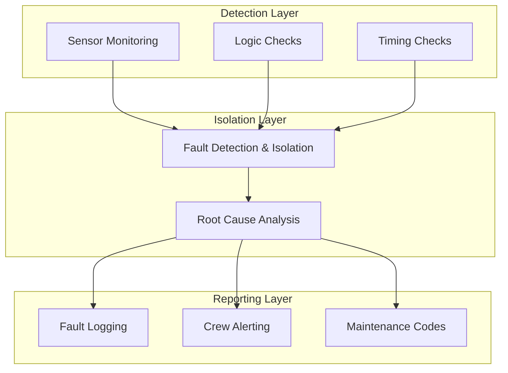

# 53-40-20 — Diagnostics & BITE Band

| Field | Value |
|-------|-------|
| **Document ID** | 53-40-20-00 |
| **Version** | 1.0 |
| **Date** | 2025-11-27 |
| **Status** | DRAFT |
| **Classification** | SOFTWARE / DIAGNOSTICS |

---

## 1. Purpose

This document provides an overview of the Diagnostics & BITE (Built-In Test Equipment) band (53-40-20) for ATA 53 Fuselage software. This band contains fault detection, health monitoring, and built-in test capabilities for ANCHORS systems.

## 2. Band Contents

| Module | Document ID | Purpose |
|--------|-------------|---------|
| [ANCHORS BITE Design](./53-40-20-01_Anchors_BITE_Design/) | 53-40-20-01 | Built-in test orchestration |
| [Fault Catalog](./53-40-20-02_Fault_Catalog/) | 53-40-20-02 | Fault definitions and codes |
| [Health Monitoring](./53-40-20-03_Health_Monitoring/) | 53-40-20-03 | Continuous health assessment |

## 3. BITE Architecture

### 3.1 Test Categories

| Category | Execution | Duration | Coverage |
|----------|-----------|----------|----------|
| Power-On Self-Test (POST) | At startup | < 30s | Full |
| Continuous BITE (CBIT) | In operation | Continuous | Partial |
| Initiated BITE (IBIT) | On demand | Variable | Configurable |
| Maintenance BITE (MBIT) | Ground only | Extended | Complete |

### 3.2 Fault Detection Flow



## 4. Fault Code Structure

### 4.1 Code Format

```
53-40-XX-YYY-Z
│  │  │  │   └── Severity (1-4)
│  │  │  └────── Fault sequence number
│  │  └───────── Subsystem band
│  └──────────── Software bucket
└─────────────── ATA chapter
```

### 4.2 Severity Levels

| Level | Name | Description | Crew Action |
|-------|------|-------------|-------------|
| 1 | WARNING | Advisory condition | Monitor |
| 2 | CAUTION | Abnormal condition | Near-term action |
| 3 | FAULT | Degraded operation | Immediate action |
| 4 | FAILURE | System inoperative | Emergency procedure |

## 5. Health Monitoring

### 5.1 Monitored Parameters

| System | Parameters | Rate | Threshold Type |
|--------|------------|------|----------------|
| CO₂ Capture | Efficiency, temps, flow | 10 Hz | Trend + absolute |
| Battery TMS | Cell temps, gradients | 50 Hz | Absolute + rate |
| Water Treatment | Quality, levels | 1 Hz | Absolute |
| Mode Manager | State consistency | 10 Hz | Logic |

### 5.2 Health Scoring

Health scores are computed on a 0-100 scale:

| Score | Status | Indicator |
|-------|--------|-----------|
| 90-100 | Healthy | Green |
| 70-89 | Degraded | Yellow |
| 50-69 | Impaired | Amber |
| 0-49 | Failed | Red |

---

## Document Control

| Field | Value |
|-------|-------|
| **Document ID** | 53-40-20-00 |
| **Version** | 1.0 |
| **Date** | 2025-11-27 |
| **Status** | DRAFT |
| **Author** | AMPEL360 Diagnostics Team |

### AI Disclosure

- **Generated with assistance of:** AI (GitHub Copilot), prompted by **Amedeo Pelliccia**
- **Status:** DRAFT — Subject to human review and approval
- **Repository:** `AMPEL360-BWB-H2-Hy-E`
- **Last AI update:** 2025-11-27

---

*END OF DOCUMENT*
