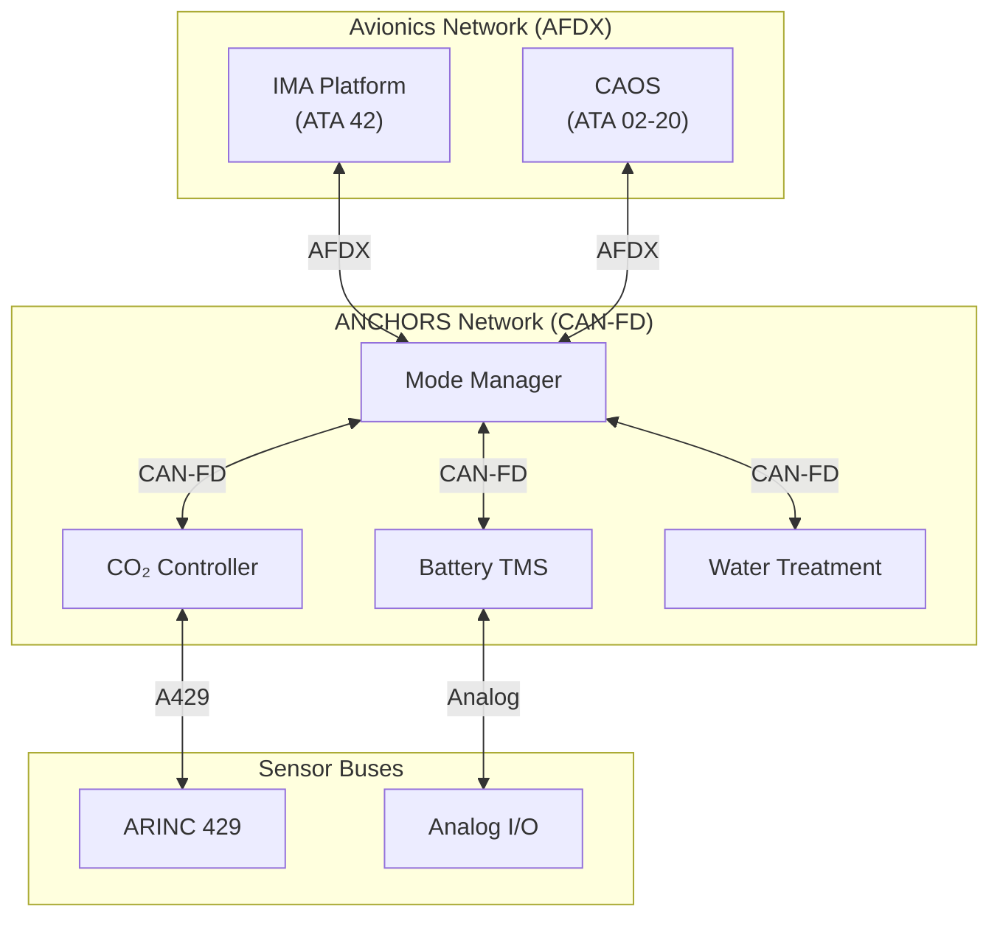

# 53-40-30 — Interfaces & Buses Band

| Field | Value |
|-------|-------|
| **Document ID** | 53-40-30-00 |
| **Version** | 1.0 |
| **Date** | 2025-11-27 |
| **Status** | DRAFT |
| **Classification** | SOFTWARE / INTERFACES |

---

## 1. Purpose

This document provides an overview of the Interfaces & Buses band (53-40-30) for ATA 53 Fuselage software. This band defines the communication protocols, bus interfaces, and network stacks used by ANCHORS systems.

## 2. Band Contents

| Module | Document ID | Purpose |
|--------|-------------|---------|
| [ANCHORS Network Stack](./53-40-30-01_Anchors_Network_Stack/) | 53-40-30-01 | ANCHORS internal network |
| [AFDX Bindings](./53-40-30-02_AFDX_Bindings/) | 53-40-30-02 | Avionics network interface |
| [CAN Bindings](./53-40-30-03_CAN_Bindings/) | 53-40-30-03 | Local bus interface |

## 3. Communication Architecture

### 3.1 Network Topology

### 3.2 Bus Specifications

| Bus | Standard | Bandwidth | Latency | Redundancy |
|-----|----------|-----------|---------|------------|
| AFDX | ARINC 664p7 | 100 Mbps | < 1 ms | Dual |
| CAN-FD | ISO 11898-1 | 8 Mbps | < 5 ms | Single |
| ARINC 429 | ARINC 429 | 100 kbps | < 10 ms | Dual |

## 4. Message Definitions

### 4.1 AFDX Virtual Links

| VL ID | Source | Destination | BAG (ms) | Max Frame |
|-------|--------|-------------|----------|-----------|
| VL001 | Mode Manager | IMA | 8 | 1518 |
| VL002 | IMA | Mode Manager | 8 | 1518 |
| VL003 | Mode Manager | CAOS | 16 | 1518 |
| VL004 | CAOS | Mode Manager | 16 | 1518 |

### 4.2 CAN-FD Messages

| CAN ID | Source | Content | Period |
|--------|--------|---------|--------|
| 0x100 | Mode Manager | System Mode | 100 ms |
| 0x110 | CO₂ Controller | Status | 100 ms |
| 0x120 | Battery TMS | Status | 20 ms |
| 0x130 | Water Treatment | Status | 1000 ms |
| 0x200 | Mode Manager | Commands | Event |

## 5. Protocol Stack

### 5.1 AFDX Stack Layers

| Layer | Function | Implementation |
|-------|----------|----------------|
| Application | Data encoding | Custom |
| Transport | End-to-end | UDP |
| Network | Routing | IP |
| Data Link | VL scheduling | AFDX |
| Physical | Ethernet | 100BASE-TX |

### 5.2 CAN-FD Stack Layers

| Layer | Function | Implementation |
|-------|----------|----------------|
| Application | Message handling | Custom |
| Transport | Segmentation | ISO-TP |
| Data Link | Arbitration | CAN-FD |
| Physical | Signaling | ISO 11898-2 |

---

## Document Control

| Field | Value |
|-------|-------|
| **Document ID** | 53-40-30-00 |
| **Version** | 1.0 |
| **Date** | 2025-11-27 |
| **Status** | DRAFT |
| **Author** | AMPEL360 Interface Team |

### AI Disclosure

- **Generated with assistance of:** AI (GitHub Copilot), prompted by **Amedeo Pelliccia**
- **Status:** DRAFT — Subject to human review and approval
- **Repository:** `AMPEL360-BWB-H2-Hy-E`
- **Last AI update:** 2025-11-27

---

*END OF DOCUMENT*
