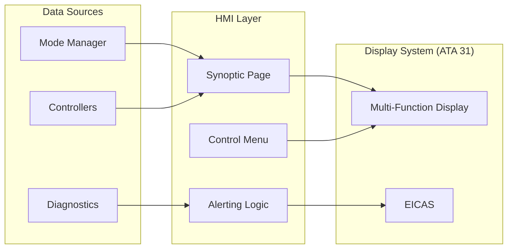

# 53-40-40 — Applications & HMI Band

| Field | Value |
|-------|-------|
| **Document ID** | 53-40-40-00 |
| **Version** | 1.0 |
| **Date** | 2025-11-27 |
| **Status** | DRAFT |
| **Classification** | SOFTWARE / APPLICATIONS |

---

## 1. Purpose

This document provides an overview of the Applications & HMI band (53-40-40) for ATA 53 Fuselage software. This band contains cockpit display applications and crew interface logic for ANCHORS systems.

## 2. Band Contents

| Module | Document ID | Purpose |
|--------|-------------|---------|
| [ANCHORS System Page](./53-40-40-01_Anchors_System_Page/) | 53-40-40-01 | Cockpit synoptic display |
| [Crew Alerting Logic](./53-40-40-02_Crew_Alerting_Logic/) | 53-40-40-02 | Warning and caution logic |

## 3. HMI Architecture

### 3.1 Display System Integration



### 3.2 Display Pages

| Page | Purpose | Update Rate |
|------|---------|-------------|
| ANCHORS Synoptic | System overview | 2 Hz |
| CO₂ Detail | CO₂ capture status | 2 Hz |
| Battery Detail | Battery TMS status | 5 Hz |
| Water Detail | Water system status | 1 Hz |
| Maintenance | Ground service | 1 Hz |

## 4. ANCHORS System Page

### 4.1 Page Layout

```
┌────────────────────────────────────────────────────────────┐
│                    ANCHORS SYSTEM                          │
├────────────────────────────────────────────────────────────┤
│  ┌─────────────┐  ┌─────────────┐  ┌─────────────┐        │
│  │  CO₂ CAPTURE│  │ BATTERY TMS │  │    WATER    │        │
│  │   [ACTIVE]  │  │   [ACTIVE]  │  │   [ACTIVE]  │        │
│  │             │  │             │  │             │        │
│  │  Rate: 80%  │  │ Temp: 25°C  │  │ Level: 75%  │        │
│  │  CO₂: 850ppm│  │ Cool: 60%   │  │ Quality: OK │        │
│  └─────────────┘  └─────────────┘  └─────────────┘        │
│                                                            │
│  System Mode: [RUN]     Health: [████████░░] 85%          │
│  Messages: None                                            │
└────────────────────────────────────────────────────────────┘
```

### 4.2 Color Coding

| Color | Meaning | Application |
|-------|---------|-------------|
| Green | Normal | Active, healthy |
| Cyan | Standby | Ready, inactive |
| Amber | Caution | Degraded, attention |
| Red | Warning/Fault | Failed, immediate action |
| White | Information | Labels, static text |

## 5. Crew Alerting

### 5.1 Alert Categories

| Category | Display | Aural | Priority |
|----------|---------|-------|----------|
| WARNING | Red box, master warn | Triple chime | Highest |
| CAUTION | Amber box, master caut | Single chime | High |
| ADVISORY | White/cyan text | None | Medium |
| STATUS | System page only | None | Low |

### 5.2 ANCHORS Alerts

| Alert ID | Text | Category | Condition |
|----------|------|----------|-----------|
| ANCH001 | BATT OVERHEAT | WARNING | Battery temp > 45°C |
| ANCH002 | CO2 SYS FAIL | CAUTION | CO₂ controller fault |
| ANCH003 | WATER LOW | ADVISORY | Potable water < 25% |
| ANCH004 | TMS DEGRADED | CAUTION | Single pump operation |

---

## Document Control

| Field | Value |
|-------|-------|
| **Document ID** | 53-40-40-00 |
| **Version** | 1.0 |
| **Date** | 2025-11-27 |
| **Status** | DRAFT |
| **Author** | AMPEL360 HMI Team |

### AI Disclosure

- **Generated with assistance of:** AI (GitHub Copilot), prompted by **Amedeo Pelliccia**
- **Status:** DRAFT — Subject to human review and approval
- **Repository:** `AMPEL360-BWB-H2-Hy-E`
- **Last AI update:** 2025-11-27

---

*END OF DOCUMENT*
