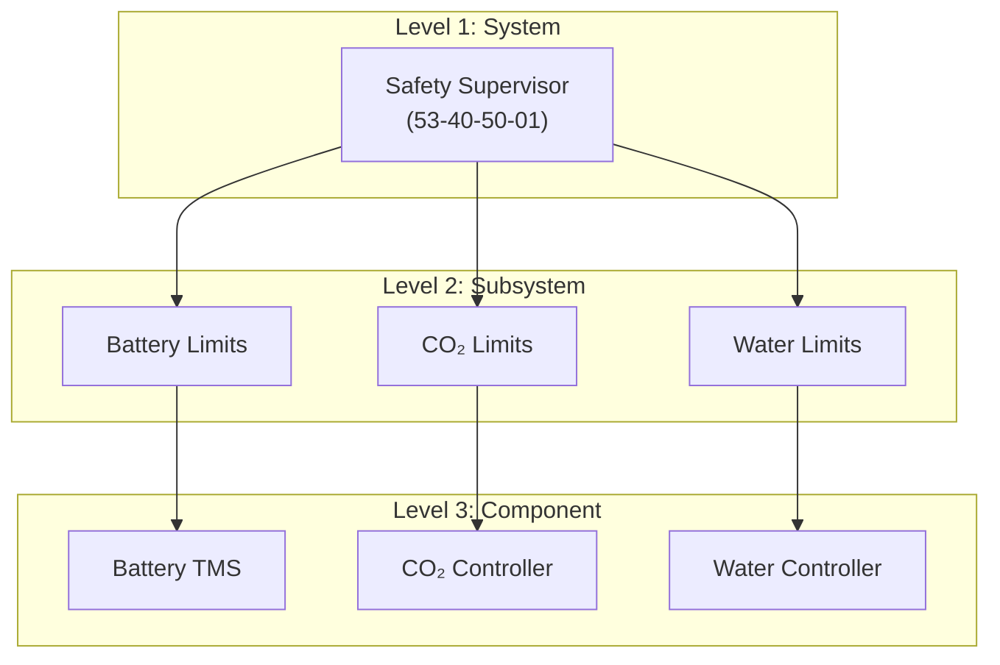
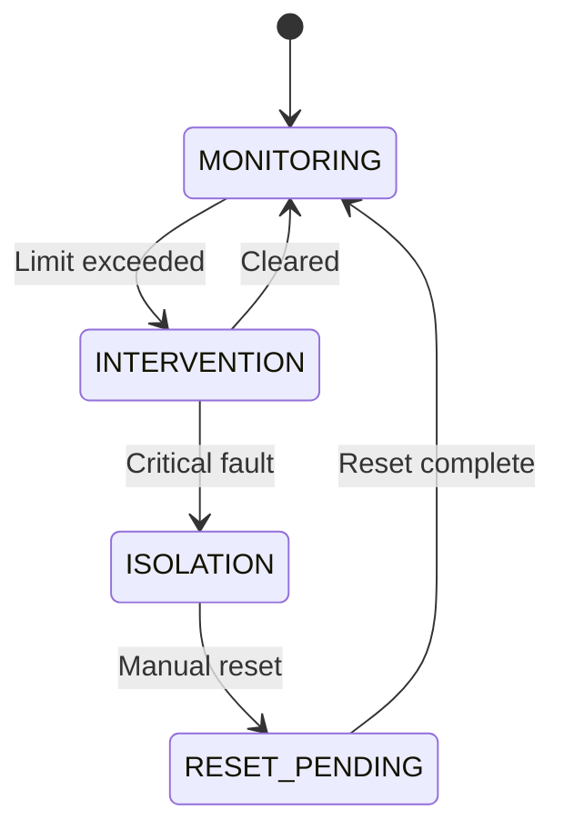
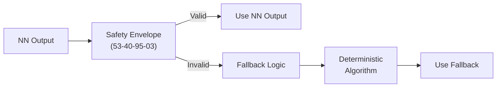

# 53-40-50 — Safety Supervision Band

| Field | Value |
|-------|-------|
| **Document ID** | 53-40-50-00 |
| **Version** | 1.0 |
| **Date** | 2025-11-27 |
| **Status** | DRAFT |
| **Classification** | SOFTWARE / SAFETY |

---

## 1. Purpose

This document provides an overview of the Safety Supervision band (53-40-50) for ATA 53 Fuselage software. This band contains safety-critical monitoring, limit checking, and fallback logic for ANCHORS systems.

## 2. Band Contents

| Module | Document ID | Purpose | DAL |
|--------|-------------|---------|-----|
| [Safety Supervisor](./53-40-50-01_Safety_Supervisor/) | 53-40-50-01 | Central safety monitoring | B |
| [Limit Monitors](./53-40-50-02_Limit_Monitors/) | 53-40-50-02 | Parameter boundary checking | B |
| [Fallback Logic](./53-40-50-03_Fallback_Logic/) | 53-40-50-03 | Degraded mode control | B |

## 3. Safety Architecture

### 3.1 Supervision Hierarchy

### 3.2 Safety Functions

| Function | DAL | Response Time | Description |
|----------|-----|---------------|-------------|
| Battery Isolation | B | < 100 ms | Emergency battery disconnect |
| Thermal Runaway Prevention | B | < 50 ms | Active cooling override |
| CO₂ System Shutdown | C | < 500 ms | Safe capture stop |
| NN Override | C | < 100 ms | Fallback to deterministic |

## 4. Safety Supervisor

### 4.1 Monitored Parameters

| Parameter | Source | Limit | Response |
|-----------|--------|-------|----------|
| Battery Max Temp | TMS | 50°C | Isolation |
| Battery Gradient | TMS | 5°C/s | Cooling boost |
| CO₂ Capture Rate | Controller | 0-100% | Limit output |
| System Mode | Mode Manager | Valid set | Force safe mode |

### 4.2 Safety States

## 5. Limit Monitors

### 5.1 Limit Types

| Type | Behavior | Example |
|------|----------|---------|
| Hard Limit | Immediate trip | Battery > 50°C |
| Soft Limit | Time-integrated | CO₂ > target for 60s |
| Rate Limit | Derivative-based | ΔT > 5°C/s |
| Voting Limit | Majority logic | 2-of-3 sensors |

### 5.2 Limit Configuration

| Parameter | Warning | Caution | Trip |
|-----------|---------|---------|------|
| Battery Temp | 35°C | 40°C | 50°C |
| Battery ΔT | 2°C/s | 3°C/s | 5°C/s |
| Cabin CO₂ | 1500 ppm | 2000 ppm | 2500 ppm |
| Water Quality | 300 TDS | 400 TDS | 500 TDS |

## 6. Fallback Logic

### 6.1 Fallback Modes

| Primary | Fallback | Trigger | Capability |
|---------|----------|---------|------------|
| NN Control | Deterministic | NN failure | 80% |
| Auto Mode | Manual | Controller fail | 70% |
| Full TMS | Reduced Cooling | Pump failure | 60% |
| Dual Sensor | Single Sensor | Sensor failure | 90% |

### 6.2 NN Fallback

When neural network outputs are unavailable or exceed safety envelope:

---

## Document Control

| Field | Value |
|-------|-------|
| **Document ID** | 53-40-50-00 |
| **Version** | 1.0 |
| **Date** | 2025-11-27 |
| **Status** | DRAFT |
| **Author** | AMPEL360 Safety SW Team |

### AI Disclosure

- **Generated with assistance of:** AI (GitHub Copilot), prompted by **Amedeo Pelliccia**
- **Status:** DRAFT — Subject to human review and approval
- **Repository:** `AMPEL360-BWB-H2-Hy-E`
- **Last AI update:** 2025-11-27

---

*END OF DOCUMENT*
