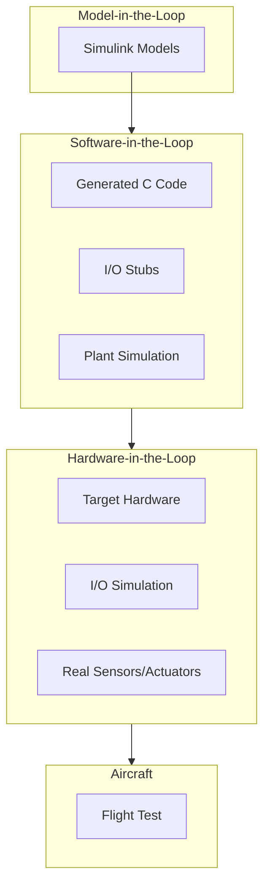

# 53-40-60 — Tooling & Emulation Band

| Field | Value |
|-------|-------|
| **Document ID** | 53-40-60-00 |
| **Version** | 1.0 |
| **Date** | 2025-11-27 |
| **Status** | DRAFT |
| **Classification** | SOFTWARE / TOOLING |

---

## 1. Purpose

This document provides an overview of the Tooling & Emulation band (53-40-60) for ATA 53 Fuselage software. This band contains Software-in-the-Loop (SIL) and Hardware-in-the-Loop (HIL) frameworks for ANCHORS system development and verification.

## 2. Band Contents

| Module | Document ID | Purpose |
|--------|-------------|---------|
| [SIL Framework](./53-40-60-01_SIL_Framework/) | 53-40-60-01 | Software-in-the-Loop testing |
| [HIL Framework](./53-40-60-02_HIL_Framework/) | 53-40-60-02 | Hardware-in-the-Loop testing |

## 3. Test Environment Architecture

### 3.1 SIL/HIL Hierarchy



### 3.2 Environment Comparison

| Aspect | SIL | HIL |
|--------|-----|-----|
| Code Execution | Host PC | Target CPU |
| I/O | Simulated | Physical interface |
| Plant | Mathematical model | Partial real hardware |
| Speed | Variable (1x-1000x) | Real-time |
| Coverage | High | Medium-high |

## 4. SIL Framework

### 4.1 Components

| Component | Purpose | Technology |
|-----------|---------|------------|
| Test Harness | Test execution | Python/pytest |
| Code Generator | Model to C | SCADE/Simulink |
| Plant Simulator | Physical simulation | Modelica/Simscape |
| Coverage Tool | Code coverage | LDRA/VectorCAST |

### 4.2 Test Categories

| Category | Purpose | Automation |
|----------|---------|------------|
| Unit Tests | Function verification | Full |
| Integration Tests | Interface verification | Full |
| Regression Tests | Change verification | Full |
| Scenario Tests | Use case verification | Partial |

## 5. HIL Framework

### 5.1 HIL Bench Configuration

```
┌─────────────────────────────────────────────────────────────┐
│                    HIL BENCH LAYOUT                          │
├─────────────────────────────────────────────────────────────┤
│  ┌─────────────┐  ┌─────────────┐  ┌─────────────┐         │
│  │   HOST PC   │  │  TARGET HW  │  │  I/O BOARDS │         │
│  │  (Control)  │  │   (IMA)     │  │             │         │
│  │             │  │             │  │  - AFDX     │         │
│  │  - Scripts  │  │  - 53-40    │  │  - CAN-FD   │         │
│  │  - Models   │  │    Code     │  │  - Analog   │         │
│  │  - Analysis │  │             │  │  - Discrete │         │
│  └─────────────┘  └─────────────┘  └─────────────┘         │
│         │                │                │                 │
│         └────────────────┼────────────────┘                 │
│                          │                                  │
│  ┌──────────────────────────────────────────────┐          │
│  │             PLANT SIMULATION                  │          │
│  │  - Battery thermal model                      │          │
│  │  - CO₂ capture dynamics                       │          │
│  │  - Water system hydraulics                    │          │
│  └──────────────────────────────────────────────┘          │
└─────────────────────────────────────────────────────────────┘
```

### 5.2 HIL Test Types

| Type | Purpose | Duration |
|------|---------|----------|
| Function Test | Feature verification | Minutes |
| Stress Test | Limit behavior | Hours |
| Endurance Test | Long-term stability | Days |
| Fault Injection | FDIR verification | Hours |

---

## Document Control

| Field | Value |
|-------|-------|
| **Document ID** | 53-40-60-00 |
| **Version** | 1.0 |
| **Date** | 2025-11-27 |
| **Status** | DRAFT |
| **Author** | AMPEL360 V&V Team |

### AI Disclosure

- **Generated with assistance of:** AI (GitHub Copilot), prompted by **Amedeo Pelliccia**
- **Status:** DRAFT — Subject to human review and approval
- **Repository:** `AMPEL360-BWB-H2-Hy-E`
- **Last AI update:** 2025-11-27

---

*END OF DOCUMENT*
