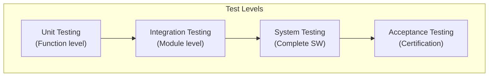

# 53-40-70 — Tests Band

| Field | Value |
|-------|-------|
| **Document ID** | 53-40-70-00 |
| **Version** | 1.0 |
| **Date** | 2025-11-27 |
| **Status** | DRAFT |
| **Classification** | SOFTWARE / TESTS |

---

## 1. Purpose

This document provides an overview of the Tests band (53-40-70) for ATA 53 Fuselage software. This band contains test strategy, test vectors, and coverage reports for ANCHORS software verification.

## 2. Band Contents

| Module | Document ID | Purpose |
|--------|-------------|---------|
| [Test Strategy](./53-40-70-01_Test_Strategy/) | 53-40-70-01 | Overall testing approach |
| [Test Vectors](./53-40-70-02_Test_Vectors/) | 53-40-70-02 | Test input/expected output |
| [Coverage Reports](./53-40-70-03_Coverage_Reports/) | 53-40-70-03 | Coverage analysis results |

## 3. Test Strategy

### 3.1 Test Levels



### 3.2 Test Matrix by DAL

| Test Type | DAL-B | DAL-C | DAL-D |
|-----------|-------|-------|-------|
| Requirements-Based | ✓ | ✓ | ✓ |
| Equivalence Classes | ✓ | ✓ | — |
| Boundary Value | ✓ | ✓ | — |
| Robustness | ✓ | — | — |
| Stress/Load | ✓ | ✓ | — |

## 4. Test Categories

### 4.1 Functional Tests

| Category | Description | Coverage Target |
|----------|-------------|-----------------|
| Normal Operation | Standard use cases | 100% requirements |
| Abnormal Operation | Off-nominal conditions | All failure modes |
| Boundary Conditions | Limit values | All limits |
| State Transitions | Mode changes | All transitions |

### 4.2 Non-Functional Tests

| Category | Description | Metric |
|----------|-------------|--------|
| Performance | Execution time | WCET < budget |
| Timing | Determinism | Jitter < spec |
| Resource | Memory/CPU | < allocation |
| Reliability | Long-duration | MTBF target |

## 5. Test Vector Format

### 5.1 Vector Structure

```json
{
  "test_id": "53-40-10-02-TV-001",
  "name": "CO2_Capture_Step_Response",
  "description": "Verify CO₂ controller step response",
  "preconditions": {
    "system_mode": "RUN",
    "initial_co2": 800
  },
  "inputs": [
    {"time": 0, "co2_setpoint": 800},
    {"time": 10, "co2_setpoint": 1000},
    {"time": 60, "co2_setpoint": 800}
  ],
  "expected_outputs": {
    "settling_time": "<15s",
    "overshoot": "<10%",
    "steady_state_error": "<2%"
  },
  "pass_criteria": "All outputs within tolerance"
}
```

### 5.2 Test Vector Categories

| Category | Count | Status |
|----------|-------|--------|
| Control Logic (10) | 150 | In progress |
| Diagnostics (20) | 80 | Planned |
| Interfaces (30) | 50 | Planned |
| Safety (50) | 200 | In progress |
| NN Integration (95) | 100 | Planned |

## 6. Coverage Requirements

### 6.1 Coverage Targets

| DAL | Statement | Branch | MC/DC |
|-----|-----------|--------|-------|
| B | 100% | 100% | — |
| C | 100% | — | — |
| D | Objective | — | — |

### 6.2 Coverage Report Format

| Module | Statement | Branch | Defects |
|--------|-----------|--------|---------|
| Mode Manager | 98% | 95% | 2 |
| CO₂ Controller | 96% | 92% | 1 |
| Battery TMS | 99% | 97% | 0 |
| Safety Supervisor | 100% | 100% | 0 |

---

## Document Control

| Field | Value |
|-------|-------|
| **Document ID** | 53-40-70-00 |
| **Version** | 1.0 |
| **Date** | 2025-11-27 |
| **Status** | DRAFT |
| **Author** | AMPEL360 V&V Team |

### AI Disclosure

- **Generated with assistance of:** AI (GitHub Copilot), prompted by **Amedeo Pelliccia**
- **Status:** DRAFT — Subject to human review and approval
- **Repository:** `AMPEL360-BWB-H2-Hy-E`
- **Last AI update:** 2025-11-27

---

*END OF DOCUMENT*
