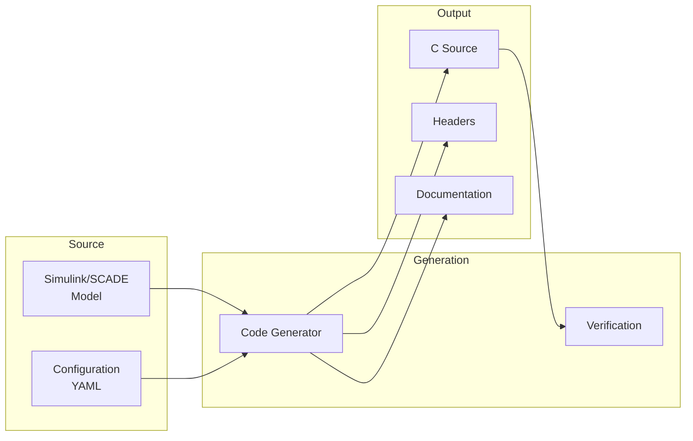

# 53-40-80 — Auto-Coding & Config Band

| Field | Value |
|-------|-------|
| **Document ID** | 53-40-80-00 |
| **Version** | 1.0 |
| **Date** | 2025-11-27 |
| **Status** | DRAFT |
| **Classification** | SOFTWARE / CONFIGURATION |

---

## 1. Purpose

This document provides an overview of the Auto-Coding & Configuration band (53-40-80) for ATA 53 Fuselage software. This band contains parameter sets, configuration packs, and auto-generated code artifacts.

## 2. Band Contents

| Module | Document ID | Purpose |
|--------|-------------|---------|
| [Parameter Sets](./53-40-80-01_Parameter_Sets/) | 53-40-80-01 | Tunable parameter definitions |
| [Config Packs](./53-40-80-02_Config_Packs/) | 53-40-80-02 | Configuration packages |

## 3. Parameter Management

### 3.1 Parameter Categories

| Category | Description | Update Frequency |
|----------|-------------|------------------|
| Constants | Fixed values | Never |
| Calibration | Tuned values | Maintenance |
| Configuration | System options | Ground load |
| Runtime | Dynamic adjustment | In-flight |

### 3.2 Parameter Structure

```yaml
parameter_set:
  id: "53-40-80-01-PS-001"
  name: "CO2_Controller_Gains"
  version: "1.0.0"
  target: "53-40-10-02"
  
  parameters:
    - name: "KP_CO2_CTRL"
      type: float32
      value: 2.5
      min: 0.1
      max: 10.0
      units: "-"
      description: "Proportional gain"
      
    - name: "KI_CO2_CTRL"
      type: float32
      value: 0.1
      min: 0.01
      max: 1.0
      units: "1/s"
      description: "Integral gain"
```

## 4. Configuration Packs

### 4.1 Pack Types

| Type | Content | Deployment |
|------|---------|------------|
| Development | Debug enabled, logging | Dev bench |
| Integration | Partial features | Integration bench |
| Qualification | Full features, test hooks | HIL bench |
| Production | Optimized, no debug | Aircraft |

### 4.2 Pack Structure

```
CONFIG_PACK/
├── manifest.yaml           # Pack metadata
├── parameters/
│   ├── control.yaml        # Control parameters
│   ├── limits.yaml         # Safety limits
│   └── interfaces.yaml     # Bus configuration
├── tables/
│   ├── lookup_tables.csv   # Interpolation data
│   └── calibration.csv     # Sensor calibration
└── checksums.txt           # Integrity verification
```

## 5. Auto-Generated Code

### 5.1 Code Generation Flow



### 5.2 Generated Artifacts

| Artifact | Format | Purpose |
|----------|--------|---------|
| Source Code | `.c` | Implementation |
| Headers | `.h` | Interfaces |
| Parameter Tables | `.c/.h` | Runtime data |
| Traceability | `.csv` | Req-to-code mapping |

## 6. Version Control

### 6.1 Versioning Scheme

```
MAJOR.MINOR.PATCH
  │     │     └── Bug fixes, calibration updates
  │     └──────── Feature additions, new parameters
  └────────────── Breaking changes, architecture updates
```

### 6.2 Compatibility Matrix

| SW Version | Param Set | Config Pack | Status |
|------------|-----------|-------------|--------|
| 1.0.x | 1.0.x | 1.0.x | Current |
| 1.1.x | 1.0.x, 1.1.x | 1.1.x | Planned |
| 2.0.x | 2.0.x | 2.0.x | Future |

---

## Document Control

| Field | Value |
|-------|-------|
| **Document ID** | 53-40-80-00 |
| **Version** | 1.0 |
| **Date** | 2025-11-27 |
| **Status** | DRAFT |
| **Author** | AMPEL360 Configuration Team |

### AI Disclosure

- **Generated with assistance of:** AI (GitHub Copilot), prompted by **Amedeo Pelliccia**
- **Status:** DRAFT — Subject to human review and approval
- **Repository:** `AMPEL360-BWB-H2-Hy-E`
- **Last AI update:** 2025-11-27

---

*END OF DOCUMENT*
