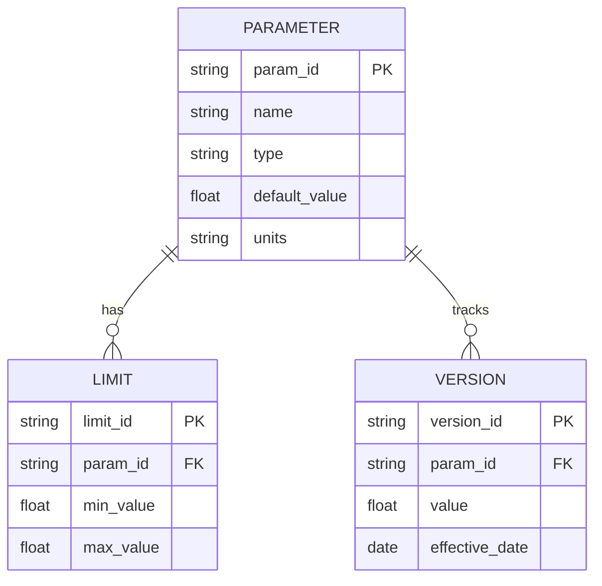

# 53-40-90 — Data Models & Schemas Band

| Field | Value |
|-------|-------|
| **Document ID** | 53-40-90-00 |
| **Version** | 1.0 |
| **Date** | 2025-11-27 |
| **Status** | DRAFT |
| **Classification** | SOFTWARE / DATA |

---

## 1. Purpose

This document provides an overview of the Data Models & Schemas band (53-40-90) for ATA 53 Fuselage software. This band contains signal dictionaries, log format schemas, and parameter databases for ANCHORS systems.

## 2. Band Contents

| Module | Document ID | Purpose |
|--------|-------------|---------|
| [Signal Dictionary](./53-40-90-01_Signal_Dictionary/) | 53-40-90-01 | Signal definitions |
| [Log Format Schema](./53-40-90-02_Log_Format_Schema/) | 53-40-90-02 | Data recording format |
| [Parameter Database](./53-40-90-03_Parameter_Database/) | 53-40-90-03 | Parameter registry |

## 3. Signal Dictionary

### 3.1 Signal Categories

| Category | Prefix | Example |
|----------|--------|---------|
| Sensor Input | SI_ | SI_BATT_TEMP_01 |
| Actuator Output | AO_ | AO_COOL_VALVE |
| Internal State | IS_ | IS_SYS_MODE |
| Computed Value | CV_ | CV_HEALTH_SCORE |
| Command | CM_ | CM_MODE_REQUEST |
| Status | ST_ | ST_CTRL_ACTIVE |

### 3.2 Signal Definition Format

```yaml
signal_dictionary:
  - signal_id: "SI_BATT_TEMP_01"
    name: "Battery Temperature Zone 1"
    type: float32
    units: "degC"
    range: [-40, 100]
    resolution: 0.1
    sample_rate: 50
    source: "RTD_ARRAY"
    consumers: ["53-40-10-03", "53-40-50-01"]
    validity:
      min: -40
      max: 100
      timeout: 100  # ms
```

### 3.3 Signal Count Summary

| System | Inputs | Outputs | States | Total |
|--------|--------|---------|--------|-------|
| Battery TMS | 48 | 12 | 20 | 80 |
| CO₂ Capture | 24 | 8 | 15 | 47 |
| Water Treatment | 16 | 6 | 10 | 32 |
| Mode Manager | 10 | 20 | 25 | 55 |
| Safety Supervisor | 50 | 10 | 30 | 90 |

## 4. Log Format Schema

### 4.1 Log Categories

| Category | Purpose | Rate | Retention |
|----------|---------|------|-----------|
| Flight | Certification data | 50 Hz | 25 hours |
| Maintenance | Service data | 1 Hz | 400 hours |
| Continuous | Health trending | 0.1 Hz | 1000 hours |
| Event | Fault records | Event | Permanent |

### 4.2 Log Record Format

```json
{
  "schema_version": "1.0",
  "record_type": "flight",
  "timestamp_utc": "2025-11-27T12:00:00.000Z",
  "flight_phase": "cruise",
  "data": {
    "battery": {
      "max_temp": 28.5,
      "avg_temp": 25.2,
      "cooling_pct": 45
    },
    "co2": {
      "cabin_ppm": 850,
      "capture_rate": 80,
      "sorbent_sat": 35
    },
    "water": {
      "potable_level": 75,
      "quality_tds": 150
    }
  },
  "status": {
    "mode": "RUN",
    "health": 92,
    "faults": []
  }
}
```

## 5. Parameter Database

### 5.1 Database Structure



### 5.2 Parameter Statistics

| Category | Count | Tunable | Safety |
|----------|-------|---------|--------|
| Control Gains | 45 | Yes | No |
| Safety Limits | 80 | Restricted | Yes |
| Calibration | 120 | Yes | No |
| Configuration | 60 | Ground only | Partial |

---

## Document Control

| Field | Value |
|-------|-------|
| **Document ID** | 53-40-90-00 |
| **Version** | 1.0 |
| **Date** | 2025-11-27 |
| **Status** | DRAFT |
| **Author** | AMPEL360 Data Team |

### AI Disclosure

- **Generated with assistance of:** AI (GitHub Copilot), prompted by **Amedeo Pelliccia**
- **Status:** DRAFT — Subject to human review and approval
- **Repository:** `AMPEL360-BWB-H2-Hy-E`
- **Last AI update:** 2025-11-27

---

*END OF DOCUMENT*
