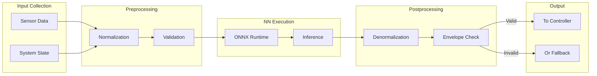

# 53-40-95-01 — CO₂ Controller NN Integration

| Field | Value |
|-------|-------|
| **Document ID** | 53-40-95-01 |
| **Version** | 1.0 |
| **Date** | 2025-11-27 |
| **Status** | DRAFT |
| **Classification** | SOFTWARE / NN INTEGRATION |
| **DAL** | C |

---

## 1. Purpose

This document defines the integration of the CO₂ Controller Neural Network into the 53-40 ANCHORS software. The NN provides optimized capture rate predictions to improve energy efficiency and system performance.

## 2. NN Model Reference

| Attribute | Value |
|-----------|-------|
| Model ID | 95-20-53-01 |
| Model Type | Feedforward MLP |
| Framework | ONNX |
| Version | 1.0.0 |
| Input Size | 8 |
| Output Size | 2 |
| Parameters | 2,450 |

## 3. Input/Output Specification

### 3.1 Inputs

| Index | Name | Units | Range | Description |
|-------|------|-------|-------|-------------|
| 0 | cabin_co2 | ppm | 400-5000 | Current cabin CO₂ level |
| 1 | co2_rate | ppm/min | -100 to 100 | CO₂ rate of change |
| 2 | cabin_temp | °C | 15-30 | Cabin temperature |
| 3 | altitude | ft | 0-45000 | Pressure altitude |
| 4 | pax_count | count | 0-100 | Passenger count |
| 5 | sorbent_sat | % | 0-100 | Sorbent saturation |
| 6 | avail_power | kW | 0-50 | Available power |
| 7 | flight_phase | enum | 0-5 | Current flight phase |

### 3.2 Outputs

| Index | Name | Units | Range | Description |
|-------|------|-------|-------|-------------|
| 0 | opt_capture_rate | % | 0-100 | Optimal capture rate |
| 1 | regen_recommend | bool | 0/1 | Regeneration recommendation |

## 4. Integration Design

### 4.1 Integration Flow



### 4.2 Timing Requirements

| Stage | Budget | Measured |
|-------|--------|----------|
| Input collection | 1 ms | 0.5 ms |
| Preprocessing | 1 ms | 0.3 ms |
| NN inference | 5 ms | 3.2 ms |
| Postprocessing | 1 ms | 0.4 ms |
| **Total** | **8 ms** | **4.4 ms** |

## 5. Safety Envelope

### 5.1 Output Constraints

| Constraint | Value | Action |
|------------|-------|--------|
| Min capture rate | 0% | Clamp |
| Max capture rate | 100% | Clamp |
| Rate of change | 10%/s | Rate limit |
| Min confidence | 0.85 | Use fallback |

### 5.2 Fallback Logic

When NN output is invalid:

```
IF confidence < 0.85 OR envelope_violation THEN
    USE deterministic_controller(cabin_co2, setpoint)
    LOG "NN fallback activated"
    INCREMENT fallback_counter
END IF
```

## 6. Verification

### 6.1 Test Coverage

| Test Type | Status | Coverage |
|-----------|--------|----------|
| Input validation | Complete | 100% |
| Output range | Complete | 100% |
| Timing | Complete | 100% |
| Fallback | Complete | 100% |
| Integration | In progress | 80% |

---

## Document Control

| Field | Value |
|-------|-------|
| **Document ID** | 53-40-95-01 |
| **Version** | 1.0 |
| **Date** | 2025-11-27 |
| **Status** | DRAFT |
| **Author** | AMPEL360 ML Integration Team |

### AI Disclosure

- **Generated with assistance of:** AI (GitHub Copilot), prompted by **Amedeo Pelliccia**
- **Status:** DRAFT — Subject to human review and approval
- **Repository:** `AMPEL360-BWB-H2-Hy-E`
- **Last AI update:** 2025-11-27

---

*END OF DOCUMENT*
