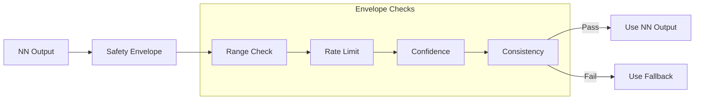

# 53-40-95-03 — Safety Envelope

| Field | Value |
|-------|-------|
| **Document ID** | 53-40-95-03 |
| **Version** | 1.0 |
| **Date** | 2025-11-27 |
| **Status** | DRAFT |
| **Classification** | SOFTWARE / NN INTEGRATION |
| **DAL** | B |

---

## 1. Purpose

This document defines the Safety Envelope for neural network outputs within the 53-40 ANCHORS software. The safety envelope ensures that all NN outputs are validated before use in control systems.

## 2. Safety Envelope Concept

### 2.1 Design Philosophy

The Safety Envelope acts as a "sandbox" for NN outputs:



### 2.2 Safety Criticality

| Component | DAL | Rationale |
|-----------|-----|-----------|
| Envelope Logic | B | Safety-critical gate |
| Fallback Trigger | B | Must always work |
| Logging | D | Non-critical |

## 3. Envelope Checks

### 3.1 Range Checks

| NN | Output | Min | Max | Unit |
|----|--------|-----|-----|------|
| CO₂ Controller | capture_rate | 0 | 100 | % |
| CO₂ Controller | regen_recommend | 0 | 1 | bool |
| Pred Maint | health_score | 0 | 100 | % |
| Pred Maint | rul_hours | 0 | 10000 | hr |

### 3.2 Rate Limits

| NN | Output | Rate Limit | Unit |
|----|--------|------------|------|
| CO₂ Controller | capture_rate | 10 | %/s |
| Pred Maint | health_score | 5 | %/min |

### 3.3 Confidence Thresholds

| NN | Min Confidence | Action Below |
|----|----------------|--------------|
| CO₂ Controller | 0.85 | Fallback |
| Pred Maint | 0.70 | Flag + use |

## 4. Implementation

### 4.1 Envelope Function

```c
typedef struct {
    float value;
    float confidence;
    float rate;
    uint32_t timestamp;
} NN_Output_t;

typedef enum {
    ENV_OK = 0,
    ENV_RANGE_VIOLATION,
    ENV_RATE_VIOLATION,
    ENV_CONFIDENCE_LOW,
    ENV_CONSISTENCY_FAIL
} EnvelopeResult_t;

EnvelopeResult_t SafetyEnvelope_Check(
    const NN_Output_t* output,
    const EnvelopeConfig_t* config,
    float* validated_output
);
```

### 4.2 Configuration Structure

```yaml
envelope_config:
  nn_id: "co2_controller"
  
  range:
    output_0:
      min: 0.0
      max: 100.0
    output_1:
      min: 0.0
      max: 1.0
      
  rate_limit:
    output_0: 10.0  # %/s
    
  confidence:
    minimum: 0.85
    action: "fallback"
    
  consistency:
    max_deviation: 20.0  # % from model prediction
    window: 10  # samples
```

## 5. Fallback Strategy

### 5.1 Fallback Triggers

| Trigger | Priority | Response |
|---------|----------|----------|
| Range violation | High | Clamp + fallback |
| Rate violation | Medium | Rate limit + log |
| Confidence low | Medium | Fallback |
| Consistency fail | High | Fallback + alert |

### 5.2 Fallback Controllers

| NN | Fallback Type | Source |
|----|---------------|--------|
| CO₂ Controller | PID | 53-40-10-02 |
| Pred Maint | Conservative estimate | 53-40-20-03 |

## 6. Monitoring and Logging

### 6.1 Logged Events

| Event | Log Level | Data |
|-------|-----------|------|
| Envelope pass | DEBUG | Output value |
| Range clamp | WARNING | Original, clamped |
| Rate limit | WARNING | Original, limited |
| Fallback | ALERT | Trigger reason |

### 6.2 Statistics

| Metric | Retention | Purpose |
|--------|-----------|---------|
| Pass rate | Flight | Performance |
| Violation count | 400 hr | Trend analysis |
| Fallback frequency | 400 hr | NN health |

---

## Document Control

| Field | Value |
|-------|-------|
| **Document ID** | 53-40-95-03 |
| **Version** | 1.0 |
| **Date** | 2025-11-27 |
| **Status** | DRAFT |
| **Author** | AMPEL360 Safety SW Team |

### AI Disclosure

- **Generated with assistance of:** AI (GitHub Copilot), prompted by **Amedeo Pelliccia**
- **Status:** DRAFT — Subject to human review and approval
- **Repository:** `AMPEL360-BWB-H2-Hy-E`
- **Last AI update:** 2025-11-27

---

*END OF DOCUMENT*
