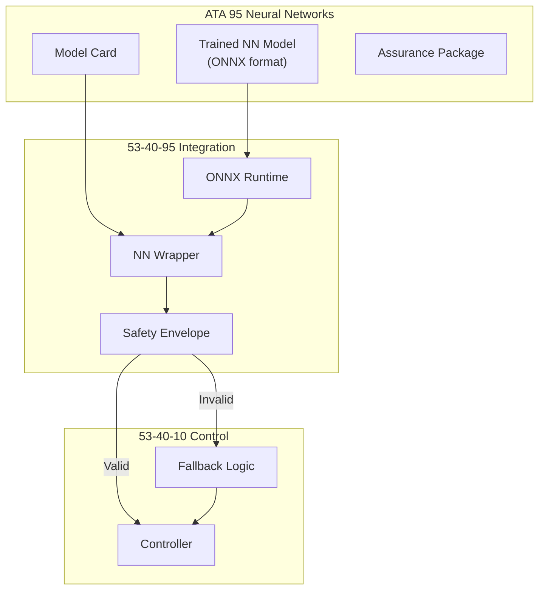
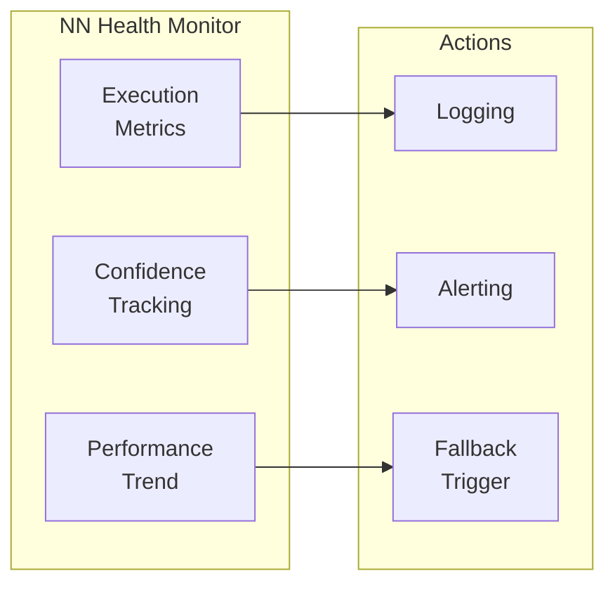

# 53-40-95 — NN Integration Band

| Field | Value |
|-------|-------|
| **Document ID** | 53-40-95-00 |
| **Version** | 1.0 |
| **Date** | 2025-11-27 |
| **Status** | DRAFT |
| **Classification** | SOFTWARE / NN INTEGRATION |

---

## 1. Purpose

This document provides an overview of the Neural Network Integration band (53-40-95) for ATA 53 Fuselage software. This band contains NN wrappers, deployment configurations, and safety envelope definitions for integrating ATA 95 neural networks into ANCHORS control systems.

## 2. Band Contents

| Module | Document ID | Purpose | DAL |
|--------|-------------|---------|-----|
| [CO₂ Controller NN](./53-40-95-01_CO2_Controller_NN/) | 53-40-95-01 | CO₂ optimization NN | C |
| [Predictive Maintenance NN](./53-40-95-02_Predictive_Maintenance_NN/) | 53-40-95-02 | Health prediction NN | D |
| [Safety Envelope](./53-40-95-03_Safety_Envelope/) | 53-40-95-03 | NN output validation | B |

## 3. NN Integration Architecture

### 3.1 Integration Pattern



### 3.2 Integration Responsibilities

| Layer | Responsibility | Owner |
|-------|---------------|-------|
| ATA 95 | Model training, validation, assurance | ML Team |
| 53-40-95 | Integration, deployment, runtime envelope | SW Team |
| 53-40-10 | Control logic, fallback, actuation | Control Team |
| 53-40-50 | Safety supervision, override | Safety Team |

## 4. NN Wrapper Design

### 4.1 Wrapper Interface

```c
typedef struct {
    float inputs[NN_INPUT_SIZE];
    float outputs[NN_OUTPUT_SIZE];
    float confidence;
    uint32_t status;
    uint32_t execution_time_us;
} NN_Context_t;

typedef enum {
    NN_STATUS_OK = 0,
    NN_STATUS_TIMEOUT,
    NN_STATUS_INVALID_INPUT,
    NN_STATUS_ENVELOPE_VIOLATION,
    NN_STATUS_MODEL_ERROR
} NN_Status_t;

NN_Status_t NN_Execute(NN_Context_t* ctx);
NN_Status_t NN_GetHealth(float* health_score);
```

### 4.2 Execution Constraints

| Parameter | Requirement | Verification |
|-----------|-------------|--------------|
| WCET | < 10 ms | Analysis + test |
| Memory | < 50 MB | Static analysis |
| CPU | < 20% | Runtime monitoring |
| Latency | < 20 ms end-to-end | Test |

## 5. Safety Envelope

### 5.1 Envelope Checks

| Check | Type | Action on Violation |
|-------|------|---------------------|
| Output Range | Absolute bounds | Clamp + log |
| Rate Limit | Derivative limit | Rate limit + log |
| Confidence | Threshold | Use fallback |
| Consistency | State comparison | Use fallback |

### 5.2 Envelope Definition

```yaml
safety_envelope:
  model: "co2_controller_nn"
  version: "1.0.0"
  
  output_limits:
    - name: "capture_rate_cmd"
      min: 0.0
      max: 100.0
      rate_limit: 10.0  # %/s
      
  confidence_threshold: 0.85
  
  fallback:
    trigger: "confidence < 0.85 OR output_violation"
    action: "use_deterministic_controller"
    log_level: "warning"
```

## 6. Deployment Configuration

### 6.1 Model Deployment

| Stage | Action | Verification |
|-------|--------|--------------|
| Import | Load ONNX model | Checksum verify |
| Validate | Run test vectors | Compare outputs |
| Configure | Set runtime params | Range check |
| Enable | Activate in controller | Monitor |

### 6.2 Runtime Monitoring



## 7. Traceability

### 7.1 Related ATA 95 Documents

| Document | Reference |
|----------|-----------|
| CO₂ NN Model Card | 95-20-53-01 |
| Predictive Maint NN | 95-20-53-02 |
| NN Assurance Framework | 95-00-07 |

### 7.2 Related 53-40 Documents

| Document | Reference |
|----------|-----------|
| CO₂ Controller | [53-40-10-02](../53-40-10_CONTROL_LOGIC/53-40-10-02_CO2_Capture_Controller/) |
| Safety Supervisor | [53-40-50-01](../53-40-50_SAFETY_SUPERVISION/) |
| Fallback Logic | [53-40-50-03](../53-40-50_SAFETY_SUPERVISION/) |

---

## Document Control

| Field | Value |
|-------|-------|
| **Document ID** | 53-40-95-00 |
| **Version** | 1.0 |
| **Date** | 2025-11-27 |
| **Status** | DRAFT |
| **Author** | AMPEL360 ML Integration Team |

### AI Disclosure

- **Generated with assistance of:** AI (GitHub Copilot), prompted by **Amedeo Pelliccia**
- **Status:** DRAFT — Subject to human review and approval
- **Repository:** `AMPEL360-BWB-H2-Hy-E`
- **Last AI update:** 2025-11-27

---

*END OF DOCUMENT*
