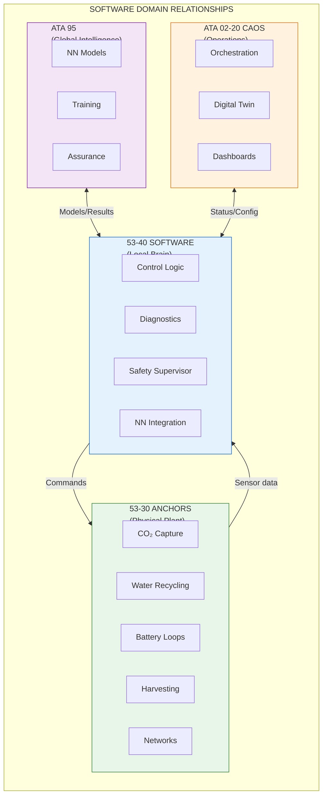
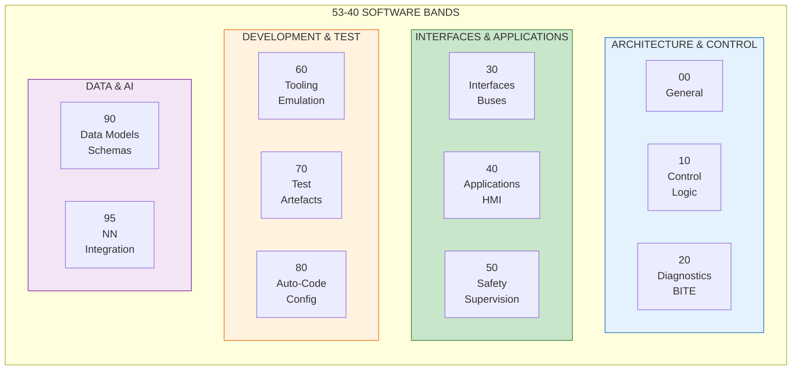
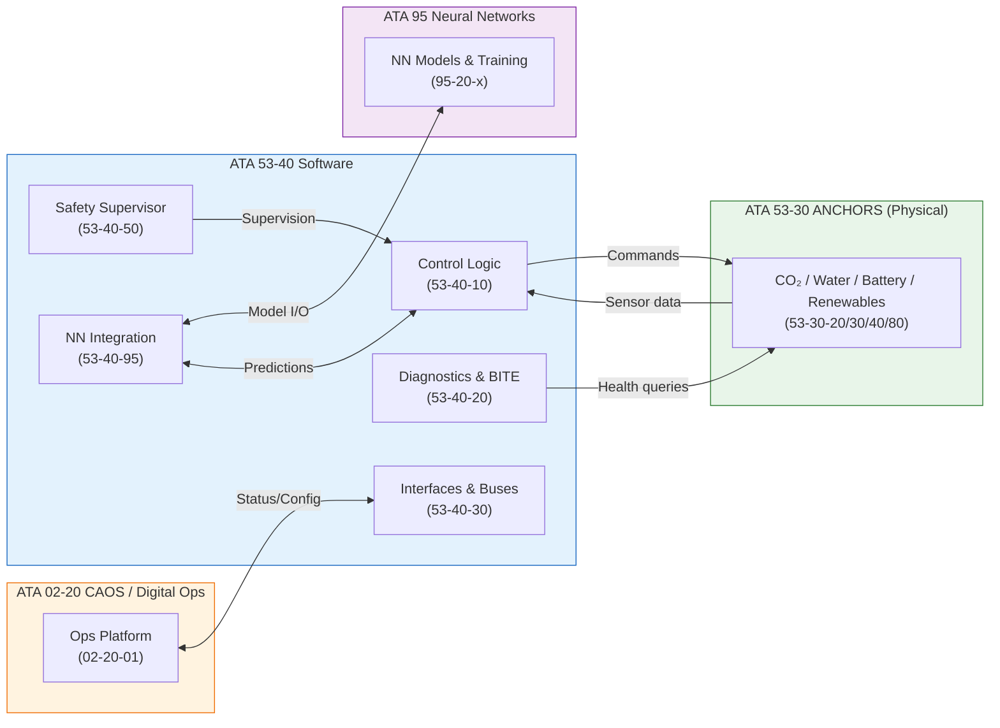

# ATA 53-40 — Fuselage Software, Control & Diagnostics

| Field | Value |
|-------|-------|
| **Document ID** | ATA53-40-00-SW-001 |
| **Version** | 1.0 |
| **Date** | 2025-11-27 |
| **Status** | DRAFT |
| **Classification** | SOFTWARE / CONTROL / DIAGNOSTICS |

---

<!--
MCP/Agent Header Prompt:
This document is the **software spine** for ATA 53 — Fuselage.
Use it as the canonical reference for:
- how ANCHORS (53-30) and fuselage-related systems are **controlled** (not designed or operated),
- how **control logic, diagnostics, FDIR, NN integration** are structured and numbered under 53-40, and
- which **software bands** (00-95) contain what type of content.
The design principle is: "53-30 owns the plant; 53-40 owns the local brain; 95 owns the global intelligence."
When creating software documents, keep IDs and filenames consistent with the patterns defined here.
-->

**Bucket definition:** 53-40 is the **Software** root bucket for ATA 53 — Fuselage; it hosts embedded software, control logic, diagnostics, FDIR, and ML/NN integration artifacts for fuselage and ANCHORS systems, without duplicating the 01–14 lifecycle skeleton.

---

## Navigation

### Breadcrumb

`AMPEL360-BWB-H2-Hy-E` / `OPT-IN_FRAMEWORK` / `T-TECHNOLOGY_AMEDEOPELLICCIA-ON_BOARD_SYSTEMS` / `A-AIRFRAME` / `ATA_53-FUSELAGE` / `53-40_SOFTWARE`

### ATA 53 Root Buckets

The following root buckets are mandatory for ATA 53; buckets marked "N/A" must still exist in the filesystem but may contain a short "not currently applicable" note. **Do not remove any bucket.**

| Bucket | Name | Path | Status |
|--------|------|------|--------|
| 53-00 | General | [`../53-00_GENERAL/`](../53-00_GENERAL/) | Active |
| 53-10 | Operations | [`../53-10_OPERATIONS/`](../53-10_OPERATIONS/) | Active |
| 53-20 | Subsystems | [`../53-20_SUBSYSTEMS/`](../53-20_SUBSYSTEMS/) | Active |
| 53-30 | ANCHORS (Circularity) | [`../53-30_ANCHORS/`](../53-30_ANCHORS/) | Active |
| **53-40** | **Software** | **This bucket** | **Active** |
| 53-50 | Structures | [`../53-50_STRUCTURES/`](../53-50_STRUCTURES/) | Active |
| 53-60 | Storages | [`../53-60_STORAGES/`](../53-60_STORAGES/) | N/A (for now) |
| 53-70 | Propulsion | [`../53-70_PROPULSION/`](../53-70_PROPULSION/) | N/A |
| 53-80 | Energy | [`../53-80_ENERGY/`](../53-80_ENERGY/) | Active |
| 53-90 | Tables/Schemas | [`../53-90_TABLES_SCHEMAS/`](../53-90_TABLES_SCHEMAS/) | Active |

### Cross-ATA Software References

| ATA | Software / Digital Bucket | Relationship |
|-----|---------------------------|--------------|
| 02 | 02-20 Digital Ops / CAOS | Central ops platform, orchestration |
| 21 | 21-40 Software | ECS control SW, environmental loops |
| 24 | 24-40 Software | Power management, HV/LV buses |
| 28 | 28-40 Software | H₂ / fuel-cell controllers, protections |
| 42 | 42-40 Software | IMA hosting, partition management |
| 47 | 47-40 Software | Inerting control logic |
| 85 | 85-40 Software | Ground / GSE SW, containers, CO₂ units |
| 90 | 53-90 Tables/Schemas | Parameter sets, signal/ICD tables |
| 95 | ATA 95 Neural Networks | NN models, training, assurance layer |

---

## 1. Purpose

### 1.1 Bucket Definition

53-40 is the **Software** root bucket for ATA 53 — Fuselage. It is the canonical home for:

- Embedded software and control logic specific to fuselage and ANCHORS systems
- Diagnostics and BITE (Built-In Test Equipment) logic
- FDIR (Fault Detection, Isolation & Recovery) strategies at fuselage/ANCHORS level
- ML/NN *integration* artifacts (bindings, IO contracts, deployment configs), while core NN systems remain in **ATA 95**
- Software architecture, interfaces, and test artefacts that are *local* to ATA 53

### 1.2 Scope

This is a **cross-ATA root bucket** instantiated here for ATA 53. It provides a consistent location for:

- SW architecture and design views related to fuselage systems
- Control algorithms for ANCHORS (53-30) and other fuselage subsystems
- Diagnostics, health monitoring, FDIR logic at ATA 53 scope
- ML/NN integration stubs, wrappers, and runtime configurations
- Software verification artefacts that complement 53-30-00-07_V_AND_V and ATA 95 assurance

The internal structure is **design-driven**, not a mandatory duplication of the 01–14 lifecycle skeleton.

---

## 2. Relationship to Other Domains

### 2.1 Relationship to 53-30 ANCHORS

- 53-30 defines the **physical and functional systems** (CO₂ capture, water recycling, battery loops, renewables, ANCHORS networks).
- 53-40 holds the **software that runs those systems** at ATA 53 level:
  - Control loops and supervisory logic (setpoints, modes, transitions)
  - Local diagnostics, FDIR, BITE, calibration tables
  - Software views of ANCHORS networks (ResourceBus, ThermalBus, CO₂Bus, WaterBus)

**Design principle:**

> "**53-30 owns the plant; 53-40 owns the local brain; 95 owns the global intelligence.**"

### 2.2 Relationship to ATA 95 (Neural Networks)

- **ATA 95**:
  - Model cards, training data, MLOps, safety/assurance frameworks
  - NN system-level architecture and cross-ATA traceability
- **53-40**:
  - Concrete integration of NN services into fuselage controllers
  - Wrappers, IO schemas, runtime configurations, and FDIR boundaries for NN usage
  - "Fallback" / deterministic backup logic when NN is unavailable or degraded

### 2.3 Relationship to CAOS / Digital Ops (ATA 02-20)

- CAOS / ATA 02-20 provides:
  - Centralized ops platform, dashboards, scheduling, digital twin integration
- 53-40 provides:
  - Fuselage/ANCHORS-resident SW pieces that **plug into** CAOS (topics, APIs, health reports)
  - Local logic that must work independently even if CAOS is degraded or unavailable

### 2.4 Domain Relationship Diagram



---

## 3. Naming Convention

### 3.1 Primary Format

To stay consistent with 53-30, the canonical pattern in this bucket is:

```
53-40-XX-YY_DESCRIPTION
```

Where:

| Element | Description | Example |
|---------|-------------|---------|
| `53` | ATA chapter (**Fuselage**) | Fixed |
| `40` | Bucket number (**Software**) | Fixed |
| `XX` | Software band (see §3.2) | `00`, `10`, `20`, etc. |
| `YY` | Component / module sequence within band | `01`, `02`, `10` |
| `DESCRIPTION` | Short descriptive name, `_` separator | `Anchors_Controller`, `FDIR_Strategy` |

Legacy pattern `53-40-XX_DESCRIPTION` is allowed for early documents; §7 provides mapping guidance if you want to renumber later.

### 3.2 Software Band Allocation

| Band | Name | Scope | Examples |
|------|------|-------|----------|
| **00** | **General** | Overview, SW architecture, design rules, coding standards, safety levels, toolchains | `53-40-00-01_SW_Architecture.md` |
| **10** | **Control Logic** | Deterministic control loops, mode management, state machines for fuselage/ANCHORS | `53-40-10-01_Anchors_Mode_Manager.md` |
| **20** | **Diagnostics & BITE** | Health monitoring, fault detection, built-in test, logging policies | `53-40-20-01_Anchors_BITE_Design.md` |
| **30** | **Interfaces & Buses** | Avionics buses, ANCHORS network bindings, protocol stacks, ICDs at software level | `53-40-30-01_Anchors_Network_Stack.md` |
| **40** | **Applications & HMI** | Cockpit/fuselage-related apps, system pages, crew interaction SW | `53-40-40-01_Anchors_System_Page_Logic.md` |
| **50** | **Safety Supervision** | Monitors, guards, limit-checking, fallback logic, safety kernels | `53-40-50-01_Anchors_Safety_Supervisor.md` |
| **60** | **Tooling & Emulation** | SIL/HIL bench apps, simulators, harnesses, code-generation helpers | `53-40-60-01_SIL_Bench_Framework.md` |
| **70** | **Test Artefacts** | Test procedures, test vectors, coverage reports, regression logic | `53-40-70-01_Anchors_SW_Test_Strategy.md` |
| **80** | **Auto-Coding & Config** | Auto-generated code, config packs, parameter sets | `53-40-80-01_Control_Parameter_Sets.md` |
| **90** | **Data Models & Schemas** | Software views of parameters, signals, logs, tables | `53-40-90-01_Log_Format_Schema.json` |
| **95** | **NN Integration** | Bindings to ATA 95 NNs, IO schemas, deployment configs, safety envelopes | `53-40-95-01_CO2_Controller_NN_Interface.md` |

> **Note:** `XX = 95` here refers to **NN integration from 53-40 perspective**, not the ATA 95 chapter itself.

### 3.3 Band Allocation Diagram



---

## 4. Directory Structure

### 4.1 Top-Level

```
53-40_SOFTWARE/
├── 53-40-00_GENERAL/               # Band 00 - General SW view for ATA 53
│   ├── 53-40-00-01_SW_Overview.md      ← This document
│   ├── 53-40-00-02_SW_Architecture.md
│   ├── 53-40-00-03_SW_Design_Rules.md
│   ├── 53-40-00-04_SW_Safety_Classification.md
│   └── ASSETS/
│       └── DIAGRAMS/
│           ├── 53-40-00-02_FIG-001_SW_Context.mermaid
│           └── 53-40-00-02_FIG-001_SW_Context.svg
│
├── 53-40-10_CONTROL_LOGIC/         # Band 10
│   ├── 53-40-10-00_General/
│   ├── 53-40-10-01_Anchors_Mode_Manager/
│   ├── 53-40-10-02_CO2_Capture_Controller/
│   ├── 53-40-10-03_Battery_TMS_Controller/
│   └── 53-40-10-04_Water_Treatment_Controller/
│
├── 53-40-20_DIAGNOSTICS_BITE/      # Band 20
│   ├── 53-40-20-01_Anchors_BITE_Design/
│   ├── 53-40-20-02_Fault_Catalog/
│   └── 53-40-20-03_Health_Monitoring/
│
├── 53-40-30_INTERFACES_BUSES/      # Band 30
│   ├── 53-40-30-01_Anchors_Network_Stack/
│   ├── 53-40-30-02_AFDX_Bindings/
│   └── 53-40-30-03_CAN_Bindings/
│
├── 53-40-40_APPLICATIONS_HMI/      # Band 40
│   ├── 53-40-40-01_Anchors_System_Page/
│   └── 53-40-40-02_Crew_Alerting_Logic/
│
├── 53-40-50_SAFETY_SUPERVISION/    # Band 50
│   ├── 53-40-50-01_Safety_Supervisor/
│   ├── 53-40-50-02_Limit_Monitors/
│   └── 53-40-50-03_Fallback_Logic/
│
├── 53-40-60_TOOLING_EMULATION/     # Band 60
│   ├── 53-40-60-01_SIL_Framework/
│   └── 53-40-60-02_HIL_Framework/
│
├── 53-40-70_TESTS/                 # Band 70
│   ├── 53-40-70-01_Test_Strategy/
│   ├── 53-40-70-02_Test_Vectors/
│   └── 53-40-70-03_Coverage_Reports/
│
├── 53-40-80_AUTOCODING_CONFIG/     # Band 80
│   ├── 53-40-80-01_Parameter_Sets/
│   └── 53-40-80-02_Config_Packs/
│
├── 53-40-90_DATA_MODELS_SCHEMAS/   # Band 90
│   ├── 53-40-90-01_Signal_Dictionary/
│   ├── 53-40-90-02_Log_Format_Schema/
│   └── 53-40-90-03_Parameter_Database/
│
└── 53-40-95_NN_INTEGRATION/        # Band 95
    ├── 53-40-95-01_CO2_Controller_NN/
    ├── 53-40-95-02_Predictive_Maintenance_NN/
    └── 53-40-95-03_Safety_Envelope/
```

### 4.2 Subsystem Directory Template (e.g., 53-40-10 Control Logic)

```
53-40-10_CONTROL_LOGIC/
├── 53-40-10-00_General/
│   ├── 53-40-10-00_Overview.md
│   ├── 53-40-10-00_Design_Principles.md
│   └── 53-40-10-00_State_Machine_Conventions.md
├── 53-40-10-01_Anchors_Mode_Manager/
│   ├── 53-40-10-01_Requirements.md
│   ├── 53-40-10-01_Design.md
│   ├── 53-40-10-01_State_Machine.mermaid
│   └── ASSETS/
│       └── DIAGRAMS/
│           └── 53-40-10-01_FIG-001_Mode_StateMachine.svg
├── 53-40-10-02_CO2_Capture_Controller/
└── ...
```

The same template applies to other bands, adapted to their content.

---

## 5. Software Context for ATA 53 / ANCHORS

### 5.1 High-Level SW Context



### 5.2 SW Safety and Assurance

- Safety-critical functions (e.g., ANCHORS safety supervisor, isolation commands, emergency shutdown) are categorized by **SW level** (aligned to DO-178C / program-specific criteria).
- NN-based functions SHALL have:
  - A defined **safety envelope** and fallback deterministic path (documented in 53-40-50 and 53-40-95).
  - Clear traceability back to ATA 95 assurance artefacts.
- Any logic issuing **actuation commands** to ANCHORS physical systems must have:
  - A supervising monitor in 53-40-50
  - Parameter limits defined and centrally registered in 53-90 / 53-40-90

### 5.3 SW Level Allocation (DO-178C)

| Function | SW Level | Rationale | Reference |
|----------|----------|-----------|-----------|
| Safety Supervisor | DAL-B | Safety-critical isolation/shutdown | H-005, H-014 |
| Battery TMS Controller | DAL-B | Thermal runaway prevention | H-005, H-006 |
| CO₂ Capture Controller | DAL-C | Non-critical but affects performance | H-003, H-004 |
| Water Treatment Controller | DAL-D | Non-safety, operational | H-007, H-008 |
| HMI / System Page | DAL-D | Display only | — |
| NN Integration Wrapper | DAL-C | Fallback required | ATA 95 |

---

## 6. File Naming Rules

### 6.1 Document Files

| Pattern | Usage | Example |
|---------|-------|---------|
| `53-40-XX-YY_Name.md` | Primary document | `53-40-10-01_Design.md` |
| `53-40-XX-YY_Name_vN.M.md` | Versioned static snapshot | `53-40-10-01_Design_v1.1.md` |
| `53-40-XX-YY_ICD_SW_ZZ-00_Name.md` | SW-level ICD | `53-40-30-01_ICD_SW_21-00_ECS_Bus.md` |

### 6.2 Asset Files

| Type | Pattern | Example |
|------|---------|---------|
| Diagrams (source) | `53-40-XX-YY_FIG-NNN_Name.mermaid` | `53-40-10-01_FIG-001_Mode_StateMachine.mermaid` |
| Diagrams (export) | `53-40-XX-YY_FIG-NNN_Name.svg` | `53-40-10-01_FIG-001_Mode_StateMachine.svg` |
| Data files | `53-40-XX-YY_DAT-NNN_Name.csv` | `53-40-20-01_DAT-001_Fault_Catalog.csv` |
| Tables | `53-40-XX-YY_TBL-NNN_Name.csv` | `53-40-90-01_TBL-001_Signal_Dictionary.csv` |
| Test vectors | `53-40-XX-YY_TV-NNN_Name.json` | `53-40-70-01_TV-001_CO2_Step_Response.json` |

> Binary formats (`.xlsx`, `.vsdx`, `.docx`) are discouraged; use `.csv`, `.md`, `.mermaid` to stay VCS-friendly.

---

## 7. Migration: Previous → Current Convention

If early documents were created with the simpler pattern `53-40-XX_Description.md`, they can either remain as-is or be migrated onto the `53-40-XX-YY_Description.md` pattern.

### 7.1 Mapping Table

| Previous ID | Previous Scope | Example | Recommended New ID |
|-------------|----------------|---------|--------------------|
| 53-40-00_* | General SW | `53-40-00_Software.md` | `53-40-00-01_SW_Overview.md` |
| 53-40-01_* | Control logic | `53-40-01_Anchors_Control.md` | `53-40-10-01_Anchors_Mode_Manager.md` |
| 53-40-02_* | Diagnostics | `53-40-02_Diagnostics.md` | `53-40-20-01_Anchors_BITE_Design.md` |

You can keep a short `MIGRATION.md` in this folder if you plan a bulk renumbering.

---

## 8. Cross-Reference Conventions

### 8.1 Internal 53-40 References

Use relative paths:

```markdown
See [SW Architecture](./53-40-00_GENERAL/53-40-00-02_SW_Architecture.md).
```

### 8.2 Cross-ATA References

For references into other ATA chapters:

```markdown
Control logic for ANCHORS physical systems is defined in
[53-30-20_CO2_CAPTURE](../53-30_ANCHORS/53-30-20_CO2_CAPTURE/)
and implemented in
[53-40-10_CONTROL_LOGIC](./53-40-10_CONTROL_LOGIC/).
```

NN-related references:

```markdown
NN specification, training data and model cards are defined in
[ATA 95 Neural Networks](../../../N-NEURAL_NETWORKS_USERS_TRACEABILITY/ATA_95_NEURAL_NETWORKS/),
with 53-40-95 documents defining the local integration, IO contracts and safety envelope.
```

---

## 9. CI/CD Considerations

If you enforce checks (e.g., via `tools/ci/doc_meta_enforcer.py`), recommended rules include:

| Check | Rule |
|-------|------|
| Naming | `53-40-XX-YY_*.md` or legacy `53-40-XX_*.md` |
| Bands | `XX` in {00,10,20,30,40,50,60,70,80,90,95} |
| Headers | All top-level docs must include: Document ID, Version, Date, Status |
| No binaries | Fail on `.docx`, `.xlsx`, `.vsdx` |
| Links | Warn or fail on broken internal links inside 53-40 bucket |

Example pre-commit call:

```bash
./tools/ci/validate_naming.sh ATA_53-FUSELAGE/53-40_SOFTWARE/
./tools/ci/check_binaries.sh ATA_53-FUSELAGE/53-40_SOFTWARE/
```

---

## 10. Bucket Status

- **Bucket**: `53-40_SOFTWARE`
- **Status (bucket):** Active
- **Status (documentation):** In progress (this document = initial overview)
- **Applicability:** Universal pattern for all ATA chapters; this instance is **specialized to ATA 53 Fuselage / ANCHORS**.
- **If judged "not applicable" at any point**: A short justification shall be documented in this file; the bucket SHALL NOT be removed from the filesystem.

---

## Document Control

| Field | Value |
|-------|-------|
| **Document ID** | ATA53-40-00-SW-001 |
| **Version** | 1.0 |
| **Date** | 2025-11-27 |
| **Status** | DRAFT |
| **Author** | AMPEL360 Documentation WG |
| **Reviewer** | [To be assigned] |
| **Approver** | [To be assigned] |
| **Next Review** | [To be scheduled] |

### Revision History

| Rev | Date | Author | Description |
|-----|------|--------|-------------|
| 1.0 | 2025-11-27 | AI (ChatGPT, OpenAI), AI (Claude, Anthropic) | Initial 53-40 overview, naming and structure definition for ATA 53 |

### AI Disclosure

- **Generated with assistance of:** AI (ChatGPT, OpenAI), AI (Claude, Anthropic)
- **Prompted by:** Amedeo Pelliccia
- **Status:** DRAFT — Subject to human review and approval
- **Human approver:** [To be completed]
- **Repository:** `AMPEL360-BWB-H2-Hy-E`
- **Last AI update:** 2025-11-27

---

## Quick Reference Card

```
┌─────────────────────────────────────────────────────────────┐
│              53-40 SOFTWARE QUICK REFERENCE                 │
└─────────────────────────────────────────────────────────────┘

FORMAT:  53-40-XX-YY_Description

BANDS:
  00 = General (architecture, rules)    60 = Tooling & emulation
  10 = Control logic                    70 = Test artefacts
  20 = Diagnostics & BITE               80 = Auto-coding & config
  30 = Interfaces & buses               90 = Data models & schemas
  40 = Applications & HMI               95 = NN integration
  50 = Safety supervision

DESIGN PRINCIPLE:
  "53-30 owns the plant; 53-40 owns the local brain; 95 owns the global intelligence."

SW LEVELS (DO-178C):
  DAL-B: Safety Supervisor, Battery TMS Controller
  DAL-C: CO₂ Controller, NN Integration Wrapper
  DAL-D: Water Controller, HMI

NOTE: Band 95 = NN integration from 53-40 perspective ≠ ATA 95 chapter
```

---

*END OF DOCUMENT*
