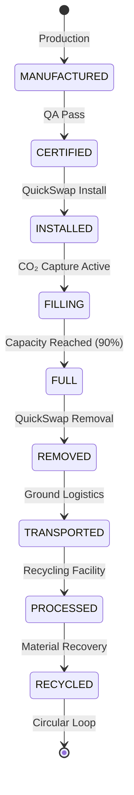

# 53-60-20-01 Minerite Cartridge Design

## Document Information

- **Document ID**: 53-60-20-01
- **Title**: Minerite Cartridge Design
- **Version**: 1.0
- **Date**: 2025-11-27
- **Status**: Draft
- **Category**: CO₂ Storage
- **ATA Chapter**: 53-60 - Fuselage Storages

## Purpose

This document defines the design specifications for the Minerite cartridge used to permanently sequester captured CO₂ through mineral carbonation.

## Scope

This specification covers:
- Cartridge structure
- Minerite core properties
- Valve and interface design
- Lifecycle management

## Cartridge Specifications

### Dimensions and Mass

| Parameter | Value | Unit | Reference |
|-----------|-------|------|-----------|
| Length | 600 | mm | DWG-53-60-20-001 |
| Diameter | 200 | mm | DWG-53-60-20-001 |
| Mass (empty) | 8 | kg | MASS-53-60-20 |
| Mass (full) | 70 | kg | MASS-53-60-20 |
| CO₂ capacity (equivalent) | 30 | kg | REQ-CO2-001 |

### Pressure and Temperature

| Parameter | Value | Unit | Reference |
|-----------|-------|------|-----------|
| Operating pressure | 0-2.0 | bar | REQ-CO2-010 |
| Design pressure | 4.0 | bar | REQ-CO2-010 |
| Burst pressure | ≥ 8.0 | bar | REQ-CO2-010 |
| Operating temperature | -20 to +80 | °C | REQ-CO2-011 |
| Relief pressure | 2.5 | bar | DSR-004 |

### Construction

| Component | Material | Specification |
|-----------|----------|---------------|
| Outer shell | Aluminum 6061-T6 | AMS 4027 |
| End caps | Aluminum 6061-T6 | AMS 4027 |
| Minerite core | Proprietary mineral | PS-53-60-20 |
| Valve body | Stainless 316L | AMS 5653 |
| Seals | PTFE | AMS 3651 |
| DPP tag mount | Stainless 316 | — |

### Minerite Core Properties

| Property | Value | Unit |
|----------|-------|------|
| Porosity | 60-70 | % |
| CO₂ binding capacity | 0.5 | kg CO₂/kg Minerite |
| Reaction temperature | 40-80 | °C |
| Carbonation rate | 0.5-1.0 | kg/hr |
| Service life | 500 | cycles |

## Cartridge Lifecycle

## References

### Internal Documents
- [53-60-20-02 Cartridge Bay Design](53-60-20-02_Cartridge_Bay.md)
- [53-60-20-06 Minerite Material Specification](53-60-20-06_Minerite_Material_Spec.md)

---

## Document Control

- Generated with the assistance of AI (GitHub Copilot), prompted by **Amedeo Pelliccia**.
- Status: **DRAFT** – Subject to human review and approval.
- Human approver: _[to be completed]_.
- Repository: `AMPEL360-BWB-H2-Hy-E`
- Last AI update: 2025-11-27

---
