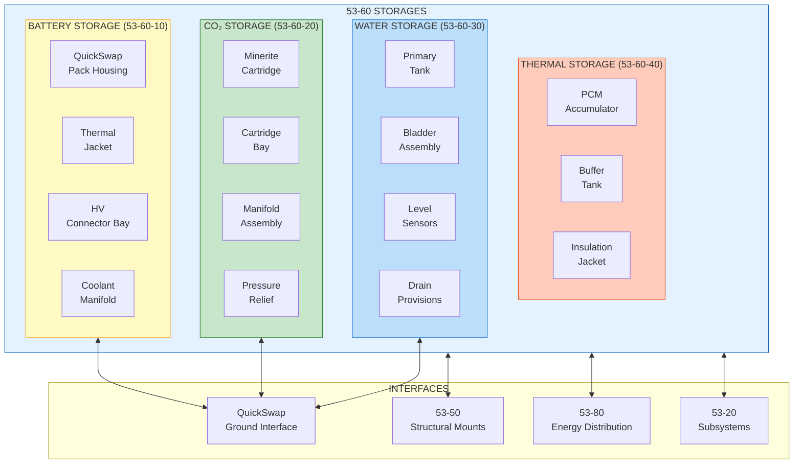
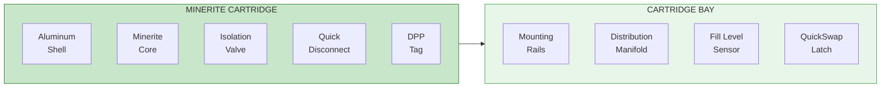
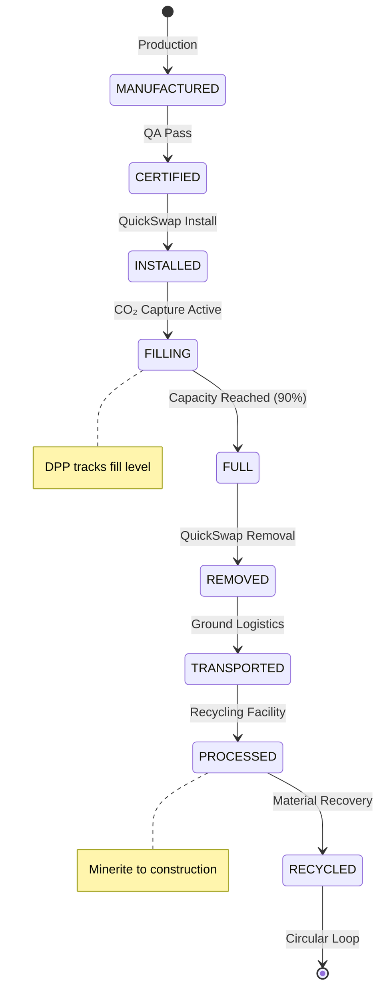
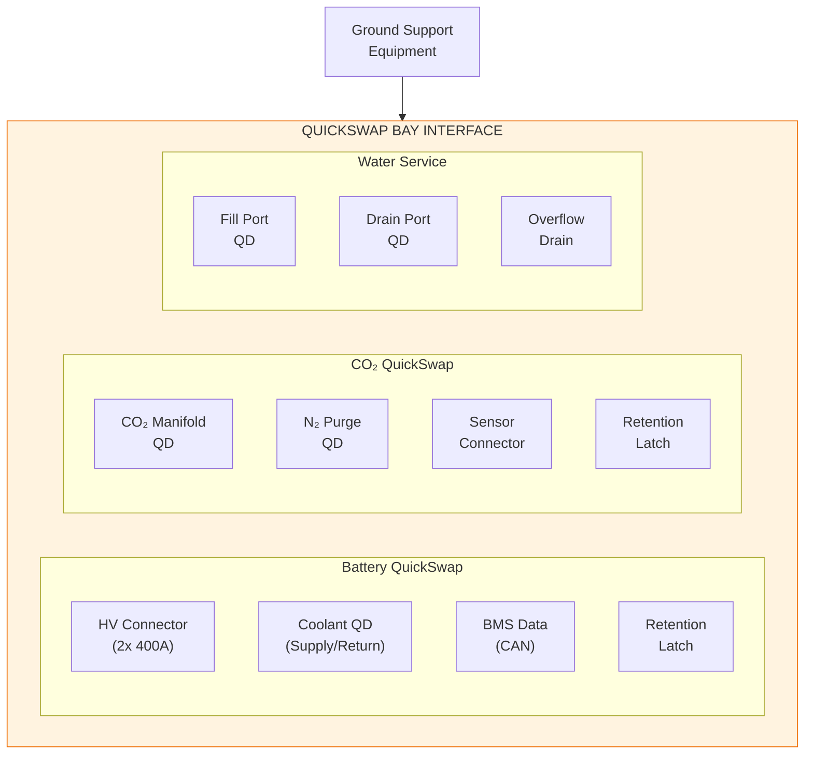

# ATA 53-60 Storages Overview

| Field | Value |
|-------|-------|
| **Document ID** | 53-60-00-01 |
| **Version** | 1.0 |
| **Date** | 2025-11-27 |
| **Status** | DRAFT |
| **Classification** | TECHNICAL |
| **ATA Chapter** | 53-60 |

---

<!--
MCP/Agent Header Prompt:
This document defines the 53-60 Storages bucket for ANCHORS (Aircraft Networks, Circular, Harvesting, Operating & Renewable Systems).
The Storages bucket covers all containment, reservoir, and accumulator systems within the ANCHORS circular economy architecture.
Key storage systems include: QuickSwap battery packs, CO₂ Minerite cartridges, water tanks, and thermal accumulators.
Use this as the spine document for all 53-60-XX child documents.
When generating storage-related content, reference the band allocation and design principles defined here.
-->

## Navigation

### Breadcrumb
`AMPEL360-BWB-H2-Hy-E` / `OPT-IN_FRAMEWORK` / `T-TECHNOLOGY` / `A-AIRFRAME` / `ATA_53-FUSELAGE` / `53-30_ANCHORS` / `53-60_Storages`

### Parent Document
| Document | Path |
|----------|------|
| ANCHORS System Description | [`../53-30-00-00_ANCHORS_System_Description.md`](../53-30-00-00_ANCHORS_System_Description.md) |

### Sibling Buckets
| Bucket | Path | Description |
|--------|------|-------------|
| 53-00 General | [`../53-00_GENERAL/`](../53-00_GENERAL/) | Governance, lifecycle, safety |
| 53-10 Operations | [`../53-10_Operations/`](../53-10_Operations/) | Flight/ground ops, procedures |
| 53-20 Subsystems | [`../53-20_Subsystems/`](../53-20_Subsystems/) | Functional subsystem design |
| 53-30 Circularity | [`../53-30_Circularity/`](../53-30_Circularity/) | LCA, DPP, sustainability |
| 53-40 Software | [`../53-40_Software/`](../53-40_Software/) | Control logic, diagnostics |
| 53-50 Structures | [`../53-50_Structures/`](../53-50_Structures/) | Frames, mounts, housings |
| **53-60 Storages** | **[`./`](.)** | **Tanks, reservoirs, cartridges** |
| 53-70 Propulsion | [`../53-70_Propulsion/`](../53-70_Propulsion/) | Propulsive interfaces |
| 53-80 Energy | [`../53-80_Energy/`](../53-80_Energy/) | Electrical/thermal distribution |
| 53-90 Schemas | [`../53-90_Tables_Schemas_Diagrams/`](../53-90_Tables_Schemas_Diagrams/) | Data schemas, catalogs |

### Related Documents
| Document | Path | Relationship |
|----------|------|--------------|
| QuickSwap Requirements | [`../53-30-00-02_Requirements.md`](../53-30-00-02_Requirements.md) | System requirements |
| Safety Provisions | [`../53-00-02_Safety/53-00-02-01_SSA.md`](../53-00-02_Safety/53-00-02-01_SSA.md) | Safety assessment |
| Hazard Log | [`../53-00-02_Safety/53-00-02-02_Hazard_Log.md`](../53-00-02_Safety/53-00-02-02_Hazard_Log.md) | Hazard register |
| ICD ATA 28 | [`../53-30-00-05_Interfaces/ICD-28-001_Fuel_H2_Interface.md`](../53-30-00-05_Interfaces/ICD-28-001_Fuel_H2_Interface.md) | H₂ system interface |
| ICD ATA 47 | [`../53-30-00-05_Interfaces/ICD-47-001_Inert_Gas_Interface.md`](../53-30-00-05_Interfaces/ICD-47-001_Inert_Gas_Interface.md) | Inerting interface |
| DPP Traceability | [`../53-30-00-03_DPP_Traceability_Requirements.md`](../53-30-00-03_DPP_Traceability_Requirements.md) | Digital passport |

---

## 1. Purpose and Scope

### 1.1 Bucket Definition

**The 53-60 Storages bucket owns all containment, reservoir, and accumulator systems within the ANCHORS architecture.** This includes design, integration, certification, and lifecycle management of storage vessels for batteries, captured CO₂ (Minerite), processed water, and thermal energy.

### 1.2 Design Principle

> **"53-20 owns the process; 53-60 owns the container; 53-50 owns the mount."**

The Storages bucket is responsible for:
- **Containment integrity** — structural and leak-tightness requirements
- **Thermal management** — insulation, heating, cooling provisions
- **QuickSwap interface** — mechanical, electrical, and fluid quick-disconnect design
- **Safety provisions** — pressure relief, venting, fire suppression interfaces
- **DPP integration** — storage unit identification and tracking

### 1.3 Scope Boundaries

| In Scope | Out of Scope |
|----------|--------------|
| Battery pack housings and thermal jackets | Battery cell chemistry (53-20) |
| CO₂ cartridge vessels and valves | CO₂ capture process (53-20) |
| Water tanks and bladders | Water treatment process (53-20) |
| Thermal accumulators | Thermal bus distribution (53-80) |
| QuickSwap bay structure | QuickSwap sequence control (53-40) |
| Storage unit DPP tags | DPP central repository (ATA 97) |
| Pressure relief systems | Fire suppression agents (ATA 26) |

---

## 2. Storages Architecture

### 2.1 Storage Systems Overview



### 2.2 Storage Band Allocation

| Band | Name | Contents |
|------|------|----------|
| **00** | General | Overview, design rules, material specs, safety |
| **10** | Battery Storage | QuickSwap pack housings, thermal jackets, HV bays |
| **20** | CO₂ Storage | Minerite cartridges, bays, manifolds |
| **30** | Water Storage | Tanks, bladders, sensors, drains |
| **40** | Thermal Storage | PCM accumulators, buffer tanks |
| **50** | Auxiliary Storage | Future expansion, consumables |
| **60** | Cryogenic Provisions | LH₂ interface provisions (if applicable) |
| **70** | Pressure Systems | Relief valves, burst discs, regulators |
| **80** | Insulation | Thermal barriers, MLI, aerogel |
| **90** | Data & Schemas | Storage parameters, DPP schemas |

---

## 3. Battery Storage (53-60-10)

### 3.1 QuickSwap Battery Pack Housing

The battery pack housing provides structural containment, thermal management, and electrical isolation for the QuickSwap battery modules.

```
┌─────────────────────────────────────────────────────────────────┐
│                    QUICKSWAP BATTERY PACK                       │
│  ┌───────────────────────────────────────────────────────────┐  │
│  │                   THERMAL JACKET                          │  │
│  │  ┌─────────────────────────────────────────────────────┐  │  │
│  │  │              BATTERY MODULES (4x)                   │  │  │
│  │  │  ┌─────────┐ ┌─────────┐ ┌─────────┐ ┌─────────┐   │  │  │
│  │  │  │ Module  │ │ Module  │ │ Module  │ │ Module  │   │  │  │
│  │  │  │   1     │ │   2     │ │   3     │ │   4     │   │  │  │
│  │  │  │ 400V    │ │ 400V    │ │ 400V    │ │ 400V    │   │  │  │
│  │  │  └────┬────┘ └────┬────┘ └────┬────┘ └────┬────┘   │  │  │
│  │  │       └──────┬────┴──────┬────┴──────┬────┘        │  │  │
│  │  │              │  BMS Bus  │           │             │  │  │
│  │  └──────────────┴───────────┴───────────┴─────────────┘  │  │
│  │  ┌─────────────────────────────────────────────────────┐  │  │
│  │  │              COOLANT CHANNELS                       │  │  │
│  │  └─────────────────────────────────────────────────────┘  │  │
│  └───────────────────────────────────────────────────────────┘  │
│  ┌──────────┐  ┌──────────┐  ┌──────────┐  ┌──────────────────┐ │
│  │ HV+ QD   │  │ HV- QD   │  │ Coolant  │  │ DPP Tag / BMS    │ │
│  │ Connector│  │ Connector│  │ QD Pair  │  │ Data Connector   │ │
│  └──────────┘  └──────────┘  └──────────┘  └──────────────────┘ │
└─────────────────────────────────────────────────────────────────┘
```

### 3.2 Battery Storage Specifications

| Parameter | Value | Unit | Reference |
|-----------|-------|------|-----------|
| Pack dimensions (L×W×H) | 800 × 500 × 300 | mm | DWG-53-60-10-001 |
| Pack mass (empty) | 15 | kg | MASS-53-60-10 |
| Pack mass (with cells) | 120 | kg | MASS-53-60-10 |
| Operating voltage | 650–850 | VDC | REQ-BAT-001 |
| Energy capacity | 50 | kWh | REQ-BAT-002 |
| Thermal jacket rating | -40 to +60 | °C | REQ-BAT-010 |
| Coolant flow rate | 10–20 | L/min | REQ-BAT-011 |
| Pressure rating (coolant) | 4.0 | bar | REQ-BAT-012 |
| IP rating | IP67 | — | REQ-BAT-020 |
| Fire containment time | ≥ 5 | min | DSR-005 |

### 3.3 Battery Storage Safety Features

| Feature | Function | Reference |
|---------|----------|-----------|
| Thermal runaway containment | Contain cell fire for ≥5 min | H-005, DSR-005 |
| Pressure relief valve | Vent gases at 2.0 bar differential | H-005, DSR-006 |
| HV interlock | Disconnect HV on lid removal | H-012, DSR-012 |
| Coolant leak detection | Detect and isolate coolant leak | H-006, DSR-007 |
| Ground fault detection | Monitor insulation resistance | H-013, DSR-013 |
| Thermal fuse | Disconnect at 150°C | H-005, DSR-008 |

### 3.4 Battery Storage Documents

| Document ID | Title | Status |
|-------------|-------|--------|
| 53-60-10-01 | Battery Pack Housing Design | PLANNED |
| 53-60-10-02 | Thermal Jacket Specification | PLANNED |
| 53-60-10-03 | HV Connector Bay Design | PLANNED |
| 53-60-10-04 | Coolant Manifold Design | PLANNED |
| 53-60-10-05 | QuickSwap Interface Spec | PLANNED |
| 53-60-10-06 | Battery Storage Safety Analysis | PLANNED |

---

## 4. CO₂ Storage (53-60-20)

### 4.1 Minerite Cartridge System

The CO₂ storage system uses swappable Minerite cartridges that permanently sequester captured CO₂ through mineral carbonation.



### 4.2 CO₂ Storage Specifications

| Parameter | Value | Unit | Reference |
|-----------|-------|------|-----------|
| Cartridge dimensions (L×D) | 600 × 200 | mm | DWG-53-60-20-001 |
| Cartridge mass (empty) | 8 | kg | MASS-53-60-20 |
| Cartridge mass (full) | 70 | kg | MASS-53-60-20 |
| CO₂ capacity (equivalent) | 30 | kg | REQ-CO2-001 |
| Operating pressure | 0–2.0 | bar | REQ-CO2-010 |
| Operating temperature | -20 to +80 | °C | REQ-CO2-011 |
| Number of cartridges | 4 | — | REQ-CO2-002 |
| Total CO₂ capacity | 120 | kg equiv | REQ-CO2-003 |
| Fill rate (max) | 10 | kg/hr | REQ-CO2-020 |
| Service life | 500 | cycles | REQ-CO2-030 |

### 4.3 Minerite Cartridge Lifecycle



### 4.4 CO₂ Storage Safety Features

| Feature | Function | Reference |
|---------|----------|-----------|
| Pressure relief | Vent at 2.5 bar | H-004, DSR-004 |
| Over-temperature protection | Thermal fuse at 120°C | H-003, DSR-003 |
| CO₂ leak detection | Cabin CO₂ monitoring | H-003, DSR-002 |
| Cartridge retention | Positive latch with indicator | H-011, DSR-011 |
| Material compatibility | Non-reactive with Minerite | REQ-CO2-040 |

### 4.5 CO₂ Storage Documents

| Document ID | Title | Status |
|-------------|-------|--------|
| 53-60-20-01 | Minerite Cartridge Design | PLANNED |
| 53-60-20-02 | Cartridge Bay Design | PLANNED |
| 53-60-20-03 | CO₂ Manifold Specification | PLANNED |
| 53-60-20-04 | Pressure Relief System | PLANNED |
| 53-60-20-05 | Cartridge DPP Integration | PLANNED |
| 53-60-20-06 | Minerite Material Specification | PLANNED |

---

## 5. Water Storage (53-60-30)

### 5.1 Water Tank System

The water storage system collects and stores water recovered from cabin humidity, fuel cell byproduct, and atmospheric condensation.

### 5.2 Water Storage Specifications

| Parameter | Value | Unit | Reference |
|-----------|-------|------|-----------|
| Tank capacity | 100 | L | REQ-H2O-001 |
| Tank dimensions (L×W×H) | 500 × 400 × 500 | mm | DWG-53-60-30-001 |
| Tank mass (empty) | 5 | kg | MASS-53-60-30 |
| Tank mass (full) | 105 | kg | MASS-53-60-30 |
| Operating pressure | 0–0.5 | bar | REQ-H2O-010 |
| Operating temperature | 5–50 | °C | REQ-H2O-011 |
| Material | Food-grade HDPE | — | REQ-H2O-020 |
| Anti-microbial treatment | Silver ion | — | REQ-H2O-021 |
| Level sensor accuracy | ±2 | % | REQ-H2O-030 |

### 5.3 Water Storage Configuration

```
┌─────────────────────────────────────────┐
│           WATER STORAGE TANK            │
│  ┌───────────────────────────────────┐  │
│  │         Vent / Overflow           │──┼── To drain mast
│  ├───────────────────────────────────┤  │
│  │                                   │  │
│  │      Flexible Bladder             │  │
│  │      (Potable Water)              │  │
│  │                                   │  │
│  │  ┌─────────┐                      │  │
│  │  │ Level   │ Capacitive sensor    │  │
│  │  │ Sensor  │                      │  │
│  │  └─────────┘                      │  │
│  │                                   │  │
│  ├───────────────────────────────────┤  │
│  │         Drain Sump                │──┼── To service panel
│  └───────────────────────────────────┘  │
│  ┌─────────┐  ┌─────────┐  ┌─────────┐  │
│  │ Fill    │  │ Supply  │  │ Temp    │  │
│  │ Port    │  │ Port    │  │ Sensor  │  │
│  └─────────┘  └─────────┘  └─────────┘  │
└─────────────────────────────────────────┘
```

### 5.4 Water Storage Documents

| Document ID | Title | Status |
|-------------|-------|--------|
| 53-60-30-01 | Water Tank Design | PLANNED |
| 53-60-30-02 | Bladder Assembly Specification | PLANNED |
| 53-60-30-03 | Level Sensing System | PLANNED |
| 53-60-30-04 | Drain and Overflow System | PLANNED |
| 53-60-30-05 | Water Quality Monitoring | PLANNED |

---

## 6. Thermal Storage (53-60-40)

### 6.1 Phase Change Material (PCM) Accumulator

The thermal storage system uses PCM accumulators to buffer thermal energy, enabling efficient heat recovery and load leveling.

### 6.2 Thermal Storage Specifications

| Parameter | Value | Unit | Reference |
|-----------|-------|------|-----------|
| PCM type | Paraffin-based | — | REQ-TH-001 |
| Melting point | 45 | °C | REQ-TH-002 |
| Latent heat capacity | 200 | kJ/kg | REQ-TH-003 |
| Accumulator mass | 20 | kg | MASS-53-60-40 |
| Thermal capacity | 4000 | kJ | REQ-TH-004 |
| Charge/discharge rate | 5–15 | kW | REQ-TH-010 |
| Operating temperature range | 30–60 | °C | REQ-TH-011 |
| Cycle life | 10,000 | cycles | REQ-TH-020 |

### 6.3 Thermal Storage Documents

| Document ID | Title | Status |
|-------------|-------|--------|
| 53-60-40-01 | PCM Accumulator Design | PLANNED |
| 53-60-40-02 | Buffer Tank Specification | PLANNED |
| 53-60-40-03 | Thermal Insulation Design | PLANNED |
| 53-60-40-04 | Heat Exchanger Integration | PLANNED |

---

## 7. Pressure Systems (53-60-70)

### 7.1 Pressure Relief Architecture

All pressurized storage systems include redundant pressure relief provisions per CS 25.1435.

### 7.2 Pressure Relief Specifications

| System | Relief Pressure | Burst Disc | Vent Routing |
|--------|-----------------|------------|--------------|
| Battery coolant | 4.5 bar | 6.0 bar | Overboard |
| CO₂ cartridge | 2.5 bar | 4.0 bar | Overboard |
| Water tank | 1.0 bar | N/A | Drain mast |
| Thermal accumulator | 3.0 bar | 5.0 bar | Overboard |

### 7.3 Pressure System Documents

| Document ID | Title | Status |
|-------------|-------|--------|
| 53-60-70-01 | Pressure Relief Valve Specification | PLANNED |
| 53-60-70-02 | Burst Disc Specification | PLANNED |
| 53-60-70-03 | Vent Line Routing | PLANNED |
| 53-60-70-04 | Pressure Test Procedures | PLANNED |

---

## 8. Insulation Systems (53-60-80)

### 8.1 Thermal Insulation Requirements

| Application | Insulation Type | Thickness | R-Value |
|-------------|-----------------|-----------|---------|
| Battery thermal jacket | Aerogel blanket | 10 mm | 0.5 m²K/W |
| CO₂ cartridge bay | Ceramic fiber | 15 mm | 0.3 m²K/W |
| Water tank | Closed-cell foam | 20 mm | 0.4 m²K/W |
| Thermal accumulator | MLI + aerogel | 25 mm | 0.8 m²K/W |
| Hot surfaces (>60°C) | Personnel protection | 5 mm min | Per CS 25.1359 |

### 8.2 Insulation Documents

| Document ID | Title | Status |
|-------------|-------|--------|
| 53-60-80-01 | Thermal Insulation Specification | PLANNED |
| 53-60-80-02 | Aerogel Application Guide | PLANNED |
| 53-60-80-03 | MLI Installation Procedures | PLANNED |

---

## 9. QuickSwap Integration

### 9.1 QuickSwap Interface Summary



### 9.2 QuickSwap Timing Targets

| Operation | Target Time | Max Time | Reference |
|-----------|-------------|----------|-----------|
| Battery pack removal | 3 min | 5 min | REQ-QS-001 |
| Battery pack installation | 4 min | 6 min | REQ-QS-002 |
| CO₂ cartridge removal | 1 min | 2 min | REQ-QS-003 |
| CO₂ cartridge installation | 2 min | 3 min | REQ-QS-004 |
| Water service (fill) | 5 min | 10 min | REQ-QS-005 |
| Full turnaround (all systems) | 15 min | 25 min | REQ-QS-010 |

---

## 10. Materials and Standards

### 10.1 Material Compatibility Matrix

| Material | Battery | CO₂ | Water | Thermal | Notes |
|----------|---------|-----|-------|---------|-------|
| Aluminum 6061-T6 | ✓ | ✓ | ✓ | ✓ | Primary structure |
| Stainless 316L | ✓ | ✓ | ✓ | ✓ | Wetted surfaces |
| HDPE | — | — | ✓ | — | Water bladder |
| PTFE | ✓ | ✓ | ✓ | ✓ | Seals |
| EPDM | ✓ | ✓ | ✓ | ✓ | Seals (non-HV) |
| Silicone | ✓ | — | ✓ | ✓ | Thermal interface |
| Aerogel | ✓ | ✓ | — | ✓ | Insulation |

### 10.2 Applicable Standards

| Standard | Title | Application |
|----------|-------|-------------|
| CS 25.1435 | Hydraulic Systems | Pressure relief |
| CS 25.1359 | Hot Surfaces | Personnel protection |
| CS 25.863 | Flammable Fluid Fire Protection | Battery coolant |
| SAE AS5780 | Aerospace Fluid Fittings | Quick-disconnects |
| SAE ARP4754A | Development Assurance | System development |
| ISO 16750 | Environmental Conditions | Testing requirements |

---

## 11. Directory Structure

### 11.1 53-60 Storage Bucket Contents

```
53-60_Storages/
├── 53-60-00_General/
│   ├── 53-60-00-01_STG_Overview.md          ← This document
│   ├── 53-60-00-02_Design_Rules.md
│   ├── 53-60-00-03_Material_Specifications.md
│   └── 53-60-00-04_Safety_Requirements.md
├── 53-60-10_Battery_Storage/
│   ├── 53-60-10-01_Pack_Housing_Design.md
│   ├── 53-60-10-02_Thermal_Jacket_Spec.md
│   ├── 53-60-10-03_HV_Connector_Bay.md
│   ├── 53-60-10-04_Coolant_Manifold.md
│   ├── 53-60-10-05_QuickSwap_Interface.md
│   └── 53-60-10-06_Safety_Analysis.md
├── 53-60-20_CO2_Storage/
│   ├── 53-60-20-01_Minerite_Cartridge.md
│   ├── 53-60-20-02_Cartridge_Bay.md
│   ├── 53-60-20-03_CO2_Manifold.md
│   ├── 53-60-20-04_Pressure_Relief.md
│   ├── 53-60-20-05_DPP_Integration.md
│   └── 53-60-20-06_Minerite_Material_Spec.md
├── 53-60-30_Water_Storage/
│   ├── 53-60-30-01_Tank_Design.md
│   ├── 53-60-30-02_Bladder_Assembly.md
│   ├── 53-60-30-03_Level_Sensing.md
│   ├── 53-60-30-04_Drain_Overflow.md
│   └── 53-60-30-05_Water_Quality.md
├── 53-60-40_Thermal_Storage/
│   ├── 53-60-40-01_PCM_Accumulator.md
│   ├── 53-60-40-02_Buffer_Tank.md
│   ├── 53-60-40-03_Thermal_Insulation.md
│   └── 53-60-40-04_Heat_Exchanger.md
├── 53-60-50_Auxiliary_Storage/
│   └── README.md                            # Reserved
├── 53-60-60_Cryogenic_Provisions/
│   └── README.md                            # Reserved for LH₂
├── 53-60-70_Pressure_Systems/
│   ├── 53-60-70-01_Relief_Valve_Spec.md
│   ├── 53-60-70-02_Burst_Disc_Spec.md
│   ├── 53-60-70-03_Vent_Routing.md
│   └── 53-60-70-04_Test_Procedures.md
├── 53-60-80_Insulation/
│   ├── 53-60-80-01_Thermal_Insulation.md
│   ├── 53-60-80-02_Aerogel_Guide.md
│   └── 53-60-80-03_MLI_Installation.md
└── 53-60-90_Data_Schemas/
    ├── 53-60-90-01_Storage_Parameters.csv
    ├── 53-60-90-02_DPP_Schema.json
    └── 53-60-90-03_Signal_Dictionary.csv
```

### 11.2 Document Status Summary

| Band | Documents Planned | Documents Created | Status |
|------|-------------------|-------------------|--------|
| 00 General | 4 | 1 | 25% |
| 10 Battery | 6 | 0 | 0% |
| 20 CO₂ | 6 | 0 | 0% |
| 30 Water | 5 | 0 | 0% |
| 40 Thermal | 4 | 0 | 0% |
| 50 Auxiliary | 1 | 0 | Reserved |
| 60 Cryogenic | 1 | 0 | Reserved |
| 70 Pressure | 4 | 0 | 0% |
| 80 Insulation | 3 | 0 | 0% |
| 90 Schemas | 3 | 0 | 0% |
| **Total** | **37** | **1** | **3%** |

---

## 12. Cross-ATA References

| ATA | System | Interface with 53-60 |
|-----|--------|---------------------|
| 21 | ECS | Water tank supply, thermal accumulator |
| 24 | Electrical | Battery storage HV connections |
| 26 | Fire Protection | Battery bay suppression interface |
| 28 | Fuel/H₂ | Cryogenic provisions (reserved) |
| 47 | Inert Gas | N₂ purge for CO₂ cartridges |
| 85 | Ground Support | QuickSwap GSE interface |
| 97 | DPP Repository | Storage unit tracking |

---

## Document Control

| Field | Value |
|-------|-------|
| **Document ID** | 53-60-00-01 |
| **Version** | 1.0 |
| **Date** | 2025-11-27 |
| **Status** | DRAFT |
| **Author** | AMPEL360 Documentation WG |
| **Reviewer** | [To be assigned] |
| **Approver** | [To be assigned] |

### Revision History

| Rev | Date | Author | Description |
|-----|------|--------|-------------|
| 1.0 | 2025-11-27 | AI (Claude, Anthropic) | Initial 53-60 Storages overview |

### AI Disclosure

- **Generated with assistance of:** AI (Claude, Anthropic)
- **Prompted by:** Amedeo Pelliccia
- **Status:** DRAFT — Subject to human review and approval
- **Human approver:** [To be completed]
- **Repository:** `AMPEL360-BWB-H2-Hy-E`
- **Last AI update:** 2025-11-27

---

## Quick Reference Card

```
╔════════════════════════════════════════════════════════════════════╗
║                    53-60 STORAGES QUICK REFERENCE                  ║
╠════════════════════════════════════════════════════════════════════╣
║  DESIGN PRINCIPLE:                                                 ║
║  "53-20 owns the process; 53-60 owns the container;               ║
║   53-50 owns the mount."                                          ║
╠════════════════════════════════════════════════════════════════════╣
║  STORAGE SYSTEMS:                                                  ║
║  ┌─────────────┬──────────┬───────────┬────────────┐              ║
║  │ System      │ Capacity │ Mass      │ QuickSwap  │              ║
║  ├─────────────┼──────────┼───────────┼────────────┤              ║
║  │ Battery     │ 50 kWh   │ 120 kg    │ Yes        │              ║
║  │ CO₂ Cart    │ 30 kg eq │ 70 kg     │ Yes        │              ║
║  │ Water       │ 100 L    │ 105 kg    │ Service    │              ║
║  │ Thermal     │ 4000 kJ  │ 20 kg     │ No         │              ║
║  └─────────────┴──────────┴───────────┴────────────┘              ║
╠════════════════════════════════════════════════════════════════════╣
║  BAND ALLOCATION:                                                  ║
║  00=General  10=Battery  20=CO₂  30=Water  40=Thermal             ║
║  50=Aux      60=Cryo     70=Pressure  80=Insulation  90=Data      ║
╠════════════════════════════════════════════════════════════════════╣
║  PRESSURE RELIEF:                                                  ║
║  Battery coolant: 4.5 bar  │  CO₂: 2.5 bar  │  Water: 1.0 bar    ║
╠════════════════════════════════════════════════════════════════════╣
║  QUICKSWAP TARGETS:                                                ║
║  Battery: <10 min  │  CO₂ Cartridge: <5 min  │  Full: <25 min    ║
╚════════════════════════════════════════════════════════════════════╝
```

---

*END OF DOCUMENT*
- **Status**: Active
- **Applicability**: Universal (all ATA chapters)
- **Last Updated**: 2025-11-13

## Document Control

- **Standard**: OPT-IN Framework v1.1
- **Owner**: AMPEL360 Documentation WG

---

**Note**: If this bucket is not applicable to ATA 53, document the reason here. Do not remove the bucket.
