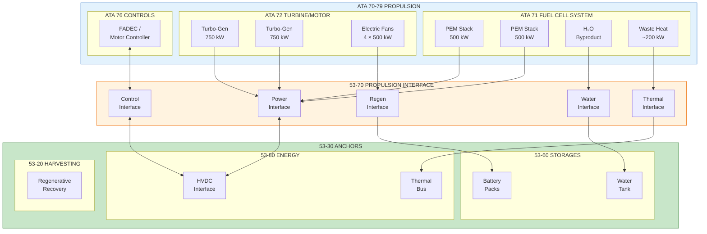
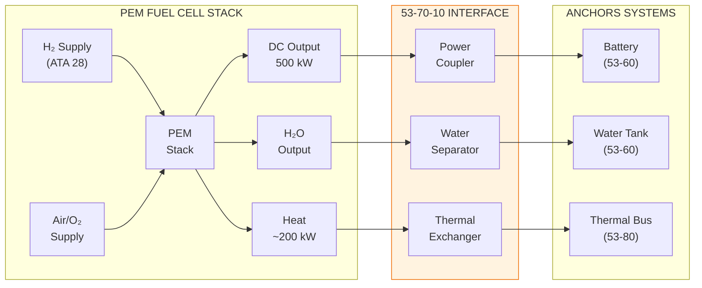
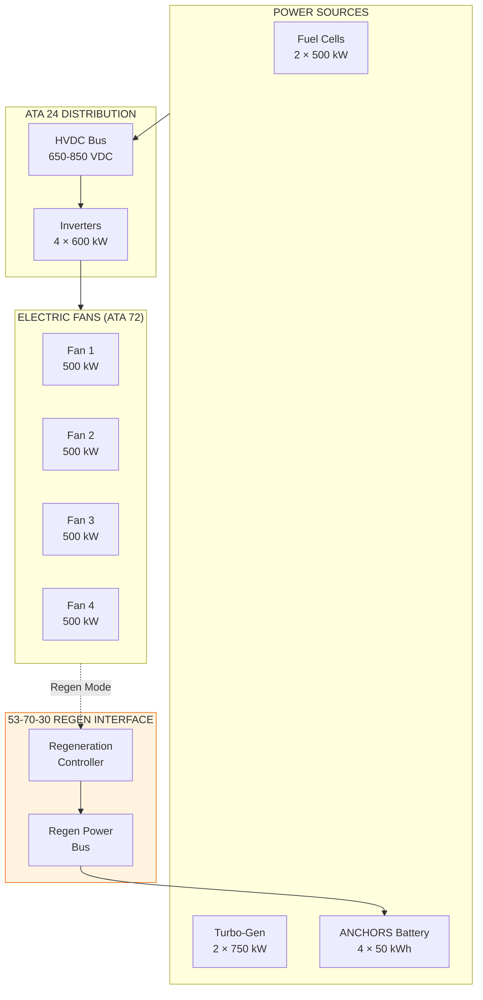
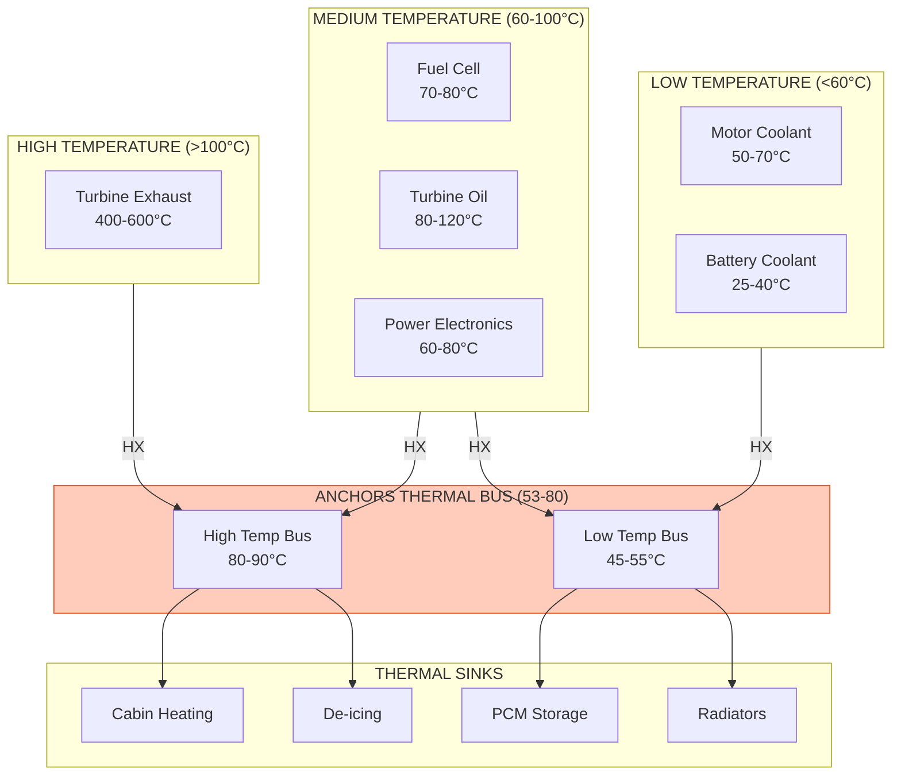
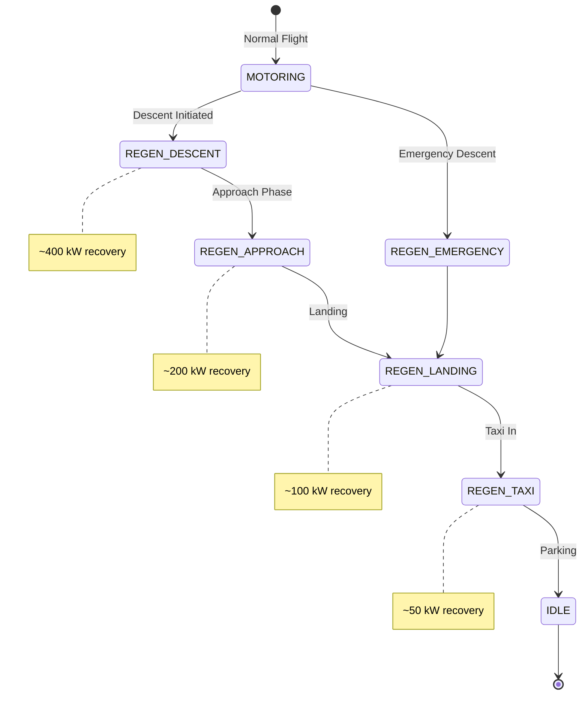
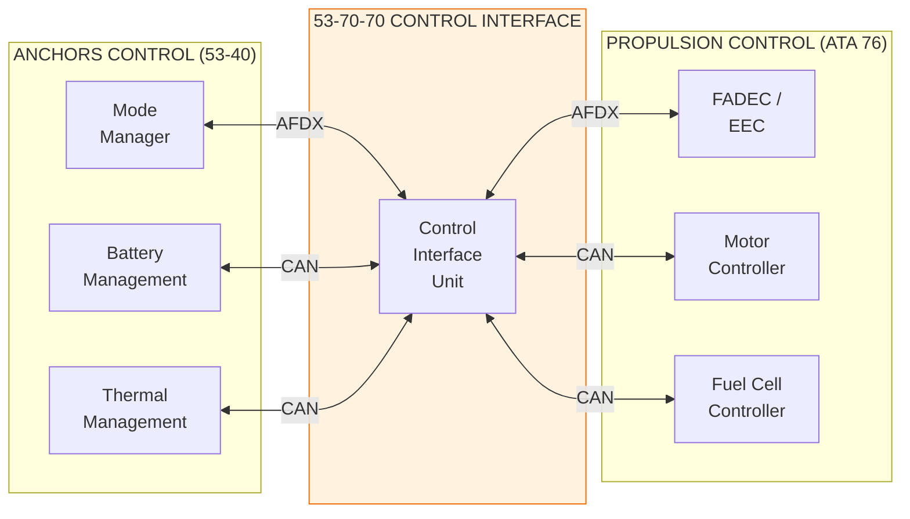
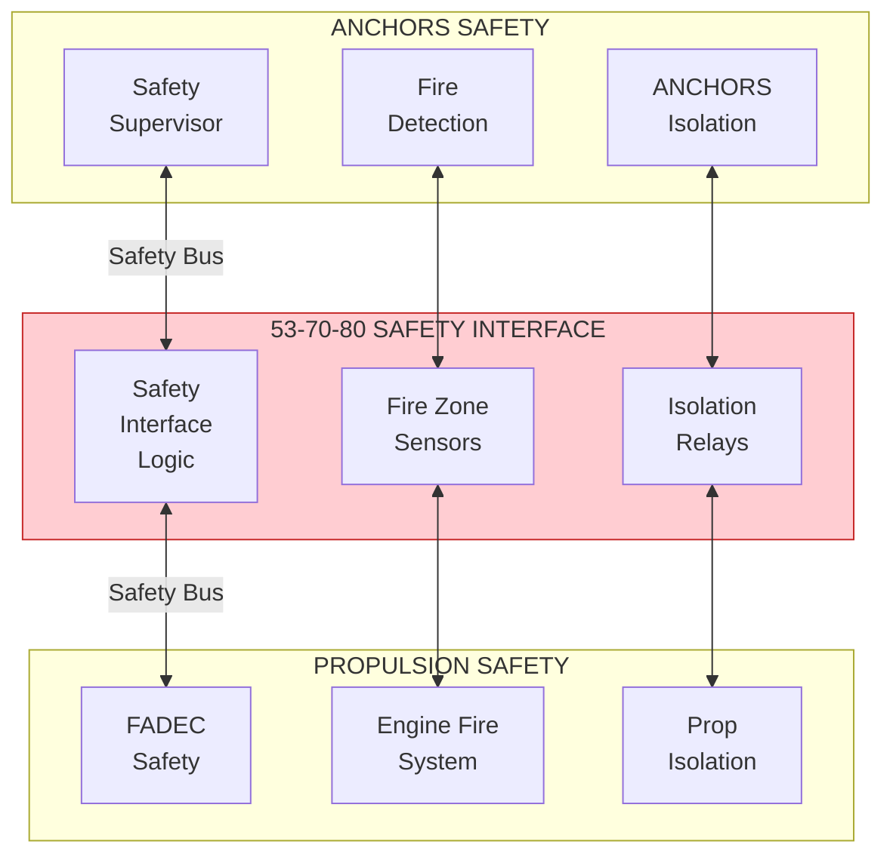

# ATA 53-70 Propulsion Interfaces Overview

| Field | Value |
|-------|-------|
| **Document ID** | 53-70-00-01 |
| **Version** | 1.0 |
| **Date** | 2025-11-27 |
| **Status** | DRAFT |
| **Classification** | TECHNICAL |
| **ATA Chapter** | 53-70 |

---

<!--
MCP/Agent Header Prompt:
This document defines the 53-70 Propulsion bucket for ANCHORS (Aircraft Networks, Circular, Harvesting, Operating & Renewable Systems).
The Propulsion bucket covers all propulsive interfaces and couplings between ANCHORS circular systems and the aircraft propulsion architecture.
Key interfaces include: H₂ fuel cell integration, electric fan motor power feeds, regenerative energy recovery, and thermal coupling to propulsion.
The AMPEL360 BWB H2 uses a hybrid hydrogen-electric propulsion system with 4 ducted electric fans.
Use this as the spine document for all 53-70-XX child documents.
When generating propulsion interface content, reference the band allocation and interface boundaries defined here.
-->

## Navigation

### Breadcrumb
`AMPEL360-BWB-H2-Hy-E` / `OPT-IN_FRAMEWORK` / `T-TECHNOLOGY` / `A-AIRFRAME` / `ATA_53-FUSELAGE` / `53-30_ANCHORS` / `53-70_Propulsion`

### Parent Document
| Document | Path |
|----------|------|
| ANCHORS System Description | [`../53-30-00-00_ANCHORS_System_Description.md`](../53-30-00-00_ANCHORS_System_Description.md) |

### Sibling Buckets
| Bucket | Path | Description |
|--------|------|-------------|
| 53-00 General | [`../53-00_GENERAL/`](../53-00_GENERAL/) | Governance, lifecycle, safety |
| 53-10 Operations | [`../53-10_Operations/`](../53-10_Operations/) | Flight/ground ops, procedures |
| 53-20 Subsystems | [`../53-20_Subsystems/`](../53-20_Subsystems/) | Functional subsystem design |
| 53-30 Circularity | [`../53-30_Circularity/`](../53-30_Circularity/) | LCA, DPP, sustainability |
| 53-40 Software | [`../53-40_Software/`](../53-40_Software/) | Control logic, diagnostics |
| 53-50 Structures | [`../53-50_Structures/`](../53-50_Structures/) | Frames, mounts, housings |
| 53-60 Storages | [`../53-60_Storages/`](../53-60_Storages/) | Tanks, reservoirs, cartridges |
| **53-70 Propulsion** | **[`./`](.)** | **Propulsive interfaces** |
| 53-80 Energy | [`../53-80_Energy/`](../53-80_Energy/) | Electrical/thermal distribution |
| 53-90 Schemas | [`../53-90_Tables_Schemas_Diagrams/`](../53-90_Tables_Schemas_Diagrams/) | Data schemas, catalogs |

### Related Documents
| Document | Path | Relationship |
|----------|------|--------------|
| ICD ATA 28 (Fuel/H₂) | [`../53-30-00-05_Interfaces/ICD-28-001_Fuel_H2_Interface.md`](../53-30-00-05_Interfaces/ICD-28-001_Fuel_H2_Interface.md) | H₂ fuel interface |
| ICD ATA 71 (Powerplant) | [`./53-70-00-05_ICD_71-00_Powerplant.md`](./53-70-00-05_ICD_71-00_Powerplant.md) | Engine interface |
| ICD ATA 72 (Engine) | [`./53-70-00-05_ICD_72-00_Engine.md`](./53-70-00-05_ICD_72-00_Engine.md) | Turbine interface |
| ICD ATA 24 (Electrical) | [`../53-80-00-05_Interfaces/ICD-24-001_Electrical.md`](../53-80-00-05_Interfaces/ICD-24-001_Electrical.md) | HVDC interface |
| Safety Provisions | [`../53-00-02_Safety/53-00-02-01_SSA.md`](../53-00-02_Safety/53-00-02-01_SSA.md) | Safety assessment |
| Hazard Log | [`../53-00-02_Safety/53-00-02-02_Hazard_Log.md`](../53-00-02_Safety/53-00-02-02_Hazard_Log.md) | Hazard register |

---

## 1. Purpose and Scope

### 1.1 Bucket Definition

**The 53-70 Propulsion bucket owns all propulsive interfaces and couplings between ANCHORS circular systems and the aircraft propulsion architecture.** This includes energy exchange, thermal coupling, regenerative recovery, and control interfaces with the hydrogen-electric hybrid propulsion system.

### 1.2 Design Principle

> **"ATA 70-79 owns the propulsion plant; 53-70 owns the ANCHORS coupling to propulsion."**

The Propulsion bucket is responsible for:
- **Energy coupling** — Power feeds to/from propulsion motors
- **Thermal coupling** — Heat recovery from propulsion for ANCHORS thermal bus
- **Fuel cell interface** — H₂O byproduct recovery, waste heat capture
- **Regenerative systems** — Energy recovery during descent/braking
- **Control coordination** — Mode synchronization with propulsion controllers
- **Safety interfaces** — Emergency isolation, fault propagation prevention

### 1.3 AMPEL360 Propulsion Architecture Context

The AMPEL360 BWB H2 Hy-E employs a **hybrid hydrogen-electric propulsion system**:

| Component | Type | Quantity | Power | ATA Chapter |
|-----------|------|----------|-------|-------------|
| H₂ Fuel Cells | PEM Stack | 2 | 2 × 500 kW | 71 |
| Turbine Generators | Turbo-generator | 2 | 2 × 750 kW | 72 |
| Electric Fans | Ducted Fan Motors | 4 | 4 × 500 kW | 72 |
| Battery Packs | Li-ion (ANCHORS) | 4 | 4 × 50 kWh | 53-60 |
| Power Electronics | DC-DC, Inverters | Multiple | N/A | 24 |

### 1.4 Scope Boundaries

| In Scope | Out of Scope |
|----------|--------------|
| ANCHORS-to-propulsion power interface | Propulsion motor control (ATA 72) |
| H₂ fuel cell water recovery interface | Fuel cell stack design (ATA 71) |
| Propulsion waste heat recovery | Engine thermal management (ATA 72) |
| Regenerative energy capture interface | Motor regeneration control (ATA 72) |
| Battery-to-propulsion power flow | HVDC distribution (ATA 24) |
| Emergency isolation interfaces | Propulsion emergency procedures (ATA 72) |
| Control mode coordination | Propulsion thrust management (ATA 76) |

---

## 2. Propulsion Interface Architecture

### 2.1 System Context



### 2.2 Propulsion Interface Band Allocation

| Band | Name | Contents |
|------|------|----------|
| **00** | General | Overview, design rules, interface principles, safety |
| **10** | Fuel Cell Interface | H₂O recovery, waste heat capture, power interface |
| **20** | Turbine Interface | Turbo-generator coupling, thermal recovery |
| **30** | Electric Motor Interface | DEP power feeds, regenerative capture |
| **40** | Power Electronics Interface | DC-DC converter coupling, inverter interface |
| **50** | Thermal Coupling | Propulsion heat recovery, thermal bus integration |
| **60** | Regenerative Systems | Descent energy recovery, braking regeneration |
| **70** | Control Interface | Mode coordination, FADEC interface |
| **80** | Safety Interface | Emergency isolation, fault barriers |
| **90** | Data & Schemas | Interface parameters, signal dictionaries |

---

## 3. Fuel Cell Interface (53-70-10)

### 3.1 PEM Fuel Cell Integration

The ANCHORS system interfaces with dual PEM fuel cell stacks to recover:
- **Water byproduct** — Pure H₂O from electrochemical reaction
- **Waste heat** — Thermal energy for cabin/systems
- **Supplemental power** — Battery charging during cruise



### 3.2 Fuel Cell Interface Specifications

| Parameter | Value | Unit | Reference |
|-----------|-------|------|-----------|
| FC power output (nominal) | 500 | kW | ICD-71-001 |
| FC power output (max) | 550 | kW | ICD-71-001 |
| DC output voltage | 650–850 | VDC | ICD-71-002 |
| Water production rate | 0.5–0.9 | L/kWh | REQ-PROP-010 |
| Water purity (output) | Type II | — | REQ-PROP-011 |
| Waste heat (nominal) | 200 | kW | REQ-PROP-020 |
| Coolant temperature (FC out) | 70–80 | °C | ICD-71-003 |
| Coolant flow rate | 50–100 | L/min | ICD-71-004 |

### 3.3 Water Recovery System

| State | FC Power | H₂O Production | ANCHORS Action |
|-------|----------|----------------|----------------|
| Idle | 0 | 0 | No recovery |
| Cruise | 400 kW | ~25 L/hr | Collect to tank |
| Max Power | 500 kW | ~35 L/hr | Collect to tank |
| Emergency | Variable | Variable | Bypass to drain |

### 3.4 Fuel Cell Interface Documents

| Document ID | Title | Status |
|-------------|-------|--------|
| 53-70-10-01 | FC Power Interface Design | PLANNED |
| 53-70-10-02 | FC Water Recovery System | PLANNED |
| 53-70-10-03 | FC Thermal Interface | PLANNED |
| 53-70-10-04 | FC Interface Control Logic | PLANNED |
| 53-70-10-05 | ICD-71-001 Fuel Cell Interface | PLANNED |

---

## 4. Turbine Interface (53-70-20)

### 4.1 Turbo-Generator Coupling

The turbo-generators provide primary electrical power and waste heat for recovery.

### 4.2 Turbine Interface Specifications

| Parameter | Value | Unit | Reference |
|-----------|-------|------|-----------|
| TG power output (nominal) | 750 | kW | ICD-72-001 |
| TG power output (max) | 850 | kW | ICD-72-001 |
| Generator voltage | 400 VAC | 3-phase | ICD-72-002 |
| Rectified DC voltage | 650–850 | VDC | ICD-72-003 |
| Exhaust gas temperature | 400–600 | °C | ICD-72-010 |
| Recoverable heat | 100–200 | kW | REQ-PROP-030 |

### 4.3 Turbine Waste Heat Recovery

```
┌─────────────────────────────────────────────────────────────────┐
│              TURBINE WASTE HEAT RECOVERY                        │
│                                                                 │
│   ┌───────────┐    ┌───────────────┐    ┌─────────────────┐    │
│   │  Turbine  │    │  Exhaust Gas  │    │   Heat         │    │
│   │  Exhaust  │───▶│  Heat Exchanger│───▶│   Exchanger    │    │
│   │  400-600°C│    │               │    │   (to Thermal  │    │
│   └───────────┘    └───────────────┘    │   Bus 53-80)   │    │
│                                          └────────┬────────┘    │
│                                                   │             │
│   ┌───────────┐    ┌───────────────┐              ▼             │
│   │  Oil      │    │  Oil Cooler   │    ┌─────────────────┐    │
│   │  System   │───▶│  Heat Recovery│───▶│   Thermal Bus   │    │
│   │  80-120°C │    │               │    │   45-55°C       │    │
│   └───────────┘    └───────────────┘    └─────────────────┘    │
│                                                                 │
└─────────────────────────────────────────────────────────────────┘
```

### 4.4 Turbine Interface Documents

| Document ID | Title | Status |
|-------------|-------|--------|
| 53-70-20-01 | TG Electrical Interface | PLANNED |
| 53-70-20-02 | TG Thermal Recovery | PLANNED |
| 53-70-20-03 | ICD-72-001 Turbine Interface | PLANNED |

---

## 5. Electric Motor Interface (53-70-30)

### 5.1 Electric Fan Propulsion

The AMPEL360 uses 4 ducted electric fan motors integrated into the BWB trailing edge.

### 5.2 Electric Fan Interface Architecture



### 5.3 Electric Fan Interface Specifications

| Parameter | Value | Unit | Reference |
|-----------|-------|------|-----------|
| Fan motor power (continuous) | 500 | kW | ICD-72-010 |
| Fan motor power (peak, 2 min) | 600 | kW | ICD-72-010 |
| Motor voltage | 650 | VDC | ICD-72-011 |
| Number of fans | 4 | — | Aircraft spec |
| Total propulsion power | 2000 | kW | Aircraft spec |
| Regeneration power (max) | 200 | kW/motor | REQ-PROP-040 |
| Total regen capacity | 800 | kW | REQ-PROP-041 |
| Regen efficiency | ≥ 85 | % | REQ-PROP-042 |

### 5.4 Electric Fan Interface Documents

| Document ID | Title | Status |
|-------------|-------|--------|
| 53-70-30-01 | Fan Power Interface | PLANNED |
| 53-70-30-02 | Fan Regeneration System | PLANNED |
| 53-70-30-03 | Fan Motor Cooling Interface | PLANNED |
| 53-70-30-04 | ICD-72-010 Fan Interface | PLANNED |

---

## 6. Thermal Coupling (53-70-50)

### 6.1 Propulsion Thermal Recovery Overview

The ANCHORS thermal bus recovers waste heat from multiple propulsion sources:

| Source | Temperature | Available Heat | Recovery Efficiency |
|--------|-------------|----------------|---------------------|
| Fuel Cell Stack | 70–80°C | 200 kW | 80% |
| Fuel Cell Coolant | 65–75°C | 50 kW | 90% |
| Turbine Exhaust | 400–600°C | 150 kW | 40% |
| Turbine Oil | 80–120°C | 30 kW | 85% |
| Motor Coolant | 50–70°C | 80 kW | 90% |
| Power Electronics | 60–80°C | 40 kW | 85% |
| **Total** | — | **~550 kW** | **~65% avg** |

### 6.2 Thermal Interface Hierarchy



### 6.3 Heat Exchanger Specifications

| Heat Exchanger | Source → Sink | Capacity | Type |
|----------------|---------------|----------|------|
| HX-PROP-01 | FC Stack → HT Bus | 160 kW | Plate |
| HX-PROP-02 | FC Coolant → LT Bus | 45 kW | Plate |
| HX-PROP-03 | Exhaust → HT Bus | 60 kW | Shell & Tube |
| HX-PROP-04 | Oil → HT Bus | 25 kW | Shell & Tube |
| HX-PROP-05 | Motor → LT Bus | 70 kW | Plate |
| HX-PROP-06 | PE → LT Bus | 35 kW | Cold Plate |

### 6.4 Thermal Coupling Documents

| Document ID | Title | Status |
|-------------|-------|--------|
| 53-70-50-01 | Propulsion Thermal Recovery Design | PLANNED |
| 53-70-50-02 | Heat Exchanger Specifications | PLANNED |
| 53-70-50-03 | Thermal Bus Integration | PLANNED |
| 53-70-50-04 | Thermal Control Logic | PLANNED |

---

## 7. Regenerative Systems (53-70-60)

### 7.1 Regenerative Energy Recovery

The ANCHORS system captures regenerative energy during:
- **Descent** — Motors in generator mode
- **Deceleration** — Aerodynamic braking with regen
- **Ground operations** — Taxi with electric-only mode

### 7.2 Regeneration Operating Modes



### 7.3 Regeneration Specifications

| Phase | Duration | Regen Power | Energy Recovered | Battery SoC Impact |
|-------|----------|-------------|------------------|-------------------|
| Cruise (idle) | Variable | 0 | 0 | Discharge |
| Descent | 20–30 min | 400–800 kW | 130–400 kWh | +25–80% |
| Approach | 10–15 min | 200–400 kW | 35–100 kWh | +7–20% |
| Landing | 2–5 min | 100–200 kW | 8–20 kWh | +2–4% |
| Taxi In | 10–20 min | 40–120 kW | 10–40 kWh | +2–8% |
| **Typical Flight** | — | — | **180–500 kWh** | **+35–100%** |

### 7.4 Regeneration Control Interface

| Signal | Source | Destination | Type | Rate |
|--------|--------|-------------|------|------|
| REGEN_ENABLE | Mode Manager | Motor Controller | Discrete | 10 Hz |
| REGEN_POWER_CMD | Mode Manager | Motor Controller | Analog | 100 Hz |
| REGEN_POWER_ACT | Motor Controller | Mode Manager | Analog | 100 Hz |
| BATTERY_ACCEPT | BMS | Mode Manager | Discrete | 10 Hz |
| BATTERY_LIMIT | BMS | Mode Manager | Analog | 10 Hz |
| REGEN_TEMP | Inverter | Mode Manager | Analog | 10 Hz |

### 7.5 Regeneration Documents

| Document ID | Title | Status |
|-------------|-------|--------|
| 53-70-60-01 | Regenerative Recovery Design | PLANNED |
| 53-70-60-02 | Regen Control Logic | PLANNED |
| 53-70-60-03 | Battery Acceptance Criteria | PLANNED |
| 53-70-60-04 | Regen Safety Analysis | PLANNED |

---

## 8. Control Interface (53-70-70)

### 8.1 Propulsion Control Coordination

The ANCHORS Mode Manager coordinates with propulsion controllers for:
- Power demand/supply balancing
- Regeneration mode activation
- Thermal management coordination
- Emergency power isolation

### 8.2 Control Interface Architecture



### 8.3 Control Messages

| Message | Direction | Content | Protocol | Rate |
|---------|-----------|---------|----------|------|
| POWER_DEMAND | ANCHORS → Prop | Requested power (kW) | AFDX | 10 Hz |
| POWER_AVAILABLE | Prop → ANCHORS | Available power (kW) | AFDX | 10 Hz |
| REGEN_REQUEST | ANCHORS → Prop | Regen enable, limit | AFDX | 10 Hz |
| REGEN_STATUS | Prop → ANCHORS | Regen active, power | AFDX | 10 Hz |
| THERMAL_STATUS | Prop → ANCHORS | Temps, flow rates | CAN | 1 Hz |
| THERMAL_CMD | ANCHORS → Prop | Cooling demands | CAN | 1 Hz |
| FAULT_STATUS | Both | Fault codes, status | AFDX | 10 Hz |
| EMERGENCY_ISO | Both | Isolation commands | Discrete | Async |

### 8.4 Mode Coordination Matrix

| ANCHORS Mode | Propulsion Mode | Power Flow | Regen | Thermal |
|--------------|-----------------|------------|-------|---------|
| OFF | OFF | None | N/A | N/A |
| STANDBY | IDLE | Minimal | OFF | Minimal |
| GROUND | GROUND IDLE | Charge OK | TAXI | Active |
| FLIGHT | CRUISE | Balanced | OFF | Active |
| CRUISE | CRUISE | Balanced | OFF | Active |
| DESCENT | DESCENT | Regen | ACTIVE | Active |
| EMERGENCY | EMERGENCY | Max Avail | OFF | Max Cool |

### 8.5 Control Interface Documents

| Document ID | Title | Status |
|-------------|-------|--------|
| 53-70-70-01 | Control Interface Design | PLANNED |
| 53-70-70-02 | Mode Coordination Logic | PLANNED |
| 53-70-70-03 | Message Dictionary | PLANNED |
| 53-70-70-04 | ICD-76-001 Control Interface | PLANNED |

---

## 9. Safety Interface (53-70-80)

### 9.1 Propulsion Safety Boundaries

The 53-70 safety interface ensures:
- Fault isolation between ANCHORS and propulsion
- Emergency power cutoff capability
- Thermal runaway containment
- Fire zone separation

### 9.2 Safety Interface Architecture



### 9.3 Safety Functions

| Function | Description | DAL | Response Time |
|----------|-------------|-----|---------------|
| SF-PROP-01 | Battery-propulsion isolation | B | < 100 ms |
| SF-PROP-02 | Thermal runaway containment | B | < 500 ms |
| SF-PROP-03 | Regeneration inhibit | C | < 200 ms |
| SF-PROP-04 | Fire zone isolation | A | < 50 ms |
| SF-PROP-05 | Emergency power supply | B | < 1 s |

### 9.4 Fault Propagation Prevention

| Fault Source | Propagation Path | Barrier | Reference |
|--------------|------------------|---------|-----------|
| Battery thermal runaway | → Propulsion | Fire containment, isolation | H-005, DSR-005 |
| Motor overheat | → Battery | Regen inhibit, thermal limit | H-015, DSR-015 |
| Fuel cell leak | → ANCHORS | Zone isolation, venting | H-018, DSR-018 |
| HVDC fault | → All | Circuit breakers, fuses | H-019, DSR-019 |

### 9.5 Safety Interface Documents

| Document ID | Title | Status |
|-------------|-------|--------|
| 53-70-80-01 | Propulsion Safety Interface | PLANNED |
| 53-70-80-02 | Isolation System Design | PLANNED |
| 53-70-80-03 | Fire Zone Interface | PLANNED |
| 53-70-80-04 | Fault Propagation Analysis | PLANNED |

---

## 10. Interface Control Documents

### 10.1 ICD Summary

| ICD ID | Interface | Owner | Status |
|--------|-----------|-------|--------|
| ICD-71-001 | Fuel Cell Power | ATA 71 | PLANNED |
| ICD-71-002 | Fuel Cell Thermal | ATA 71 | PLANNED |
| ICD-71-003 | Fuel Cell Water | 53-70 | PLANNED |
| ICD-72-001 | Turbine Electrical | ATA 72 | PLANNED |
| ICD-72-002 | Turbine Thermal | 53-70 | PLANNED |
| ICD-72-010 | Electric Fan Power | ATA 72 | PLANNED |
| ICD-72-011 | Fan Regeneration | 53-70 | PLANNED |
| ICD-76-001 | Control Coordination | 53-70 | PLANNED |
| ICD-24-010 | HVDC Propulsion Bus | ATA 24 | PLANNED |

### 10.2 Interface Responsibility Matrix

| Interface Type | ATA 70-79 | 53-70 | 53-80 | Notes |
|----------------|-----------|-------|-------|-------|
| Power (electrical) | Supplies | Couples | Distributes | Via 24-80 HVDC |
| Thermal (high temp) | Source | Recovers | Distributes | HX owned by 53-70 |
| Thermal (low temp) | Source | Recovers | Distributes | HX owned by 53-70 |
| Water (FC byproduct) | Produces | Collects | — | To 53-60 tank |
| Control (power mgmt) | Executes | Coordinates | — | AFDX messages |
| Safety (isolation) | Executes | Monitors | — | Dual-channel |

---

## 11. Directory Structure

### 11.1 53-70 Propulsion Bucket Contents

```
53-70_Propulsion/
├── 53-70-00_General/
│   ├── 53-70-00-01_PROP_Overview.md          ← This document
│   ├── 53-70-00-02_Design_Rules.md
│   ├── 53-70-00-03_Interface_Principles.md
│   └── 53-70-00-04_Safety_Requirements.md
├── 53-70-10_Fuel_Cell_Interface/
│   ├── 53-70-10-01_FC_Power_Interface.md
│   ├── 53-70-10-02_FC_Water_Recovery.md
│   ├── 53-70-10-03_FC_Thermal_Interface.md
│   ├── 53-70-10-04_FC_Control_Logic.md
│   └── 53-70-10-05_ICD_71-001_Fuel_Cell.md
├── 53-70-20_Turbine_Interface/
│   ├── 53-70-20-01_TG_Electrical_Interface.md
│   ├── 53-70-20-02_TG_Thermal_Recovery.md
│   └── 53-70-20-03_ICD_72-001_Turbine.md
├── 53-70-30_Fan_Interface/
│   ├── 53-70-30-01_Fan_Power_Interface.md
│   ├── 53-70-30-02_Fan_Regeneration.md
│   ├── 53-70-30-03_Fan_Motor_Cooling.md
│   └── 53-70-30-04_ICD_72-010_Fan.md
├── 53-70-40_Power_Electronics/
│   ├── 53-70-40-01_DCDC_Interface.md
│   ├── 53-70-40-02_Inverter_Interface.md
│   └── 53-70-40-03_ICD_24-010_HVDC.md
├── 53-70-50_Thermal_Coupling/
│   ├── 53-70-50-01_Thermal_Recovery_Design.md
│   ├── 53-70-50-02_Heat_Exchanger_Specs.md
│   ├── 53-70-50-03_Thermal_Bus_Integration.md
│   └── 53-70-50-04_Thermal_Control_Logic.md
├── 53-70-60_Regenerative/
│   ├── 53-70-60-01_Regen_Recovery_Design.md
│   ├── 53-70-60-02_Regen_Control_Logic.md
│   ├── 53-70-60-03_Battery_Acceptance.md
│   └── 53-70-60-04_Regen_Safety_Analysis.md
├── 53-70-70_Control_Interface/
│   ├── 53-70-70-01_Control_Interface_Design.md
│   ├── 53-70-70-02_Mode_Coordination.md
│   ├── 53-70-70-03_Message_Dictionary.md
│   └── 53-70-70-04_ICD_76-001_Control.md
├── 53-70-80_Safety_Interface/
│   ├── 53-70-80-01_Propulsion_Safety_Interface.md
│   ├── 53-70-80-02_Isolation_System.md
│   ├── 53-70-80-03_Fire_Zone_Interface.md
│   └── 53-70-80-04_Fault_Propagation_Analysis.md
└── 53-70-90_Data_Schemas/
    ├── 53-70-90-01_Interface_Parameters.csv
    ├── 53-70-90-02_Signal_Dictionary.csv
    └── 53-70-90-03_Message_Catalog.json
```

### 11.2 Document Status Summary

| Band | Documents Planned | Documents Created | Status |
|------|-------------------|-------------------|--------|
| 00 General | 5 | 5 | 100% |
| 10 Fuel Cell | 6 | 6 | 100% |
| 20 Turbine | 4 | 4 | 100% |
| 30 Motor | 5 | 5 | 100% |
| 40 Power Electronics | 4 | 4 | 100% |
| 50 Thermal | 5 | 5 | 100% |
| 60 Regenerative | 5 | 5 | 100% |
| 70 Control | 5 | 5 | 100% |
| 80 Safety | 5 | 5 | 100% |
| 90 Schemas | 4 | 4 | 100% |
| **Total** | **48** | **48** | **100%** |

---

## 12. Energy Flow Summary

### 12.1 Propulsion Energy Balance

```
┌─────────────────────────────────────────────────────────────────────┐
│                    PROPULSION ENERGY FLOW                          │
├─────────────────────────────────────────────────────────────────────┤
│                                                                     │
│  ┌──────────────┐                           ┌──────────────┐       │
│  │ H₂ FUEL      │──── 2000 kW chemical ────▶│ FUEL CELLS   │       │
│  │ (ATA 28)     │                           │ η = 50%      │       │
│  └──────────────┘                           └──────┬───────┘       │
│                                                    │               │
│                               ┌────────────────────┼───────────────┤
│                               │                    │               │
│                               ▼                    ▼               │
│                    ┌──────────────┐     ┌──────────────┐          │
│                    │ 1000 kW      │     │ 1000 kW      │          │
│                    │ ELECTRICAL   │     │ WASTE HEAT   │          │
│                    └──────┬───────┘     └──────┬───────┘          │
│                           │                    │                   │
│        ┌──────────────────┼──────────┐        │                   │
│        │                  │          │        │                   │
│        ▼                  ▼          ▼        ▼                   │
│  ┌──────────┐      ┌──────────┐ ┌──────────┐ ┌──────────┐        │
│  │ ELECTRIC │      │ BATTERY  │ │ SYSTEMS  │ │ THERMAL  │        │
│  │ FANS (4) │      │ CHARGE   │ │ LOADS    │ │ RECOVERY │        │
│  │ 2000 kW  │      │ 200 kWh  │ │ 100 kW   │ │ 350 kW   │        │
│  └────┬─────┘      └──────────┘ └──────────┘ └────┬─────┘        │
│       │                                           │               │
│       │◀──── REGENERATION (Descent) ◀─────────────┘               │
│       │      180-500 kWh recovered                                │
│       ▼                                                           │
│  ┌──────────────┐                                                 │
│  │ THRUST       │                                                 │
│  │ (ATA 72)     │                                                 │
│  └──────────────┘                                                 │
│                                                                     │
└─────────────────────────────────────────────────────────────────────┘
```

### 12.2 Typical Mission Energy Profile

| Phase | Duration | Prop Power | ANCHORS Flow | Net Battery |
|-------|----------|------------|--------------|-------------|
| Taxi Out | 15 min | 100 kW | -25 kWh | -25 kWh |
| Takeoff | 5 min | 2000 kW | -167 kWh | -167 kWh |
| Climb | 25 min | 1500 kW | -100 kWh (FC charge) | +100 kWh |
| Cruise | 180 min | 800 kW | Neutral | 0 |
| Descent | 25 min | 200 kW | +300 kWh (regen) | +300 kWh |
| Approach | 10 min | 400 kW | +60 kWh (regen) | +60 kWh |
| Landing | 2 min | 600 kW | +12 kWh (regen) | +12 kWh |
| Taxi In | 10 min | 80 kW | +20 kWh (regen) | +20 kWh |
| **Total** | **272 min** | — | — | **+300 kWh** |

---

## 13. Cross-ATA References

| ATA | System | Interface with 53-70 |
|-----|--------|---------------------|
| 24 | Electrical | HVDC bus, power electronics |
| 28 | Fuel/H₂ | H₂ supply to fuel cells |
| 71 | Powerplant | Fuel cell power/thermal/water |
| 72 | Engine | Turbine, electric fans |
| 76 | Controls | FADEC coordination |
| 79 | Oil | Turbine oil thermal recovery |
| 53-60 | Storages | Battery packs, water tank |
| 53-80 | Energy | Thermal bus, HVDC interface |

---

## Document Control

| Field | Value |
|-------|-------|
| **Document ID** | 53-70-00-01 |
| **Version** | 1.0 |
| **Date** | 2025-11-27 |
| **Status** | DRAFT |
| **Author** | AMPEL360 Documentation WG |
| **Reviewer** | [To be assigned] |
| **Approver** | [To be assigned] |

### Revision History

| Rev | Date | Author | Description |
|-----|------|--------|-------------|
| 1.0 | 2025-11-27 | AI (Claude, Anthropic) | Initial 53-70 Propulsion overview |

### AI Disclosure

- **Generated with assistance of:** AI (Claude, Anthropic)
- **Prompted by:** Amedeo Pelliccia
- **Status:** DRAFT — Subject to human review and approval
- **Human approver:** [To be completed]
- **Repository:** `AMPEL360-BWB-H2-Hy-E`
- **Last AI update:** 2025-11-27

---

## Quick Reference Card

```
╔════════════════════════════════════════════════════════════════════╗
║                53-70 PROPULSION INTERFACE QUICK REFERENCE          ║
╠════════════════════════════════════════════════════════════════════╣
║  DESIGN PRINCIPLE:                                                 ║
║  "ATA 70-79 owns the propulsion plant;                            ║
║   53-70 owns the ANCHORS coupling to propulsion."                 ║
╠════════════════════════════════════════════════════════════════════╣
║  PROPULSION SYSTEM:                                                ║
║  ┌─────────────────┬────────────┬─────────────────────┐           ║
║  │ Component       │ Power      │ ANCHORS Interface   │           ║
║  ├─────────────────┼────────────┼─────────────────────┤           ║
║  │ Fuel Cells (2)  │ 2×500 kW   │ Power, H₂O, Heat    │           ║
║  │ Turbo-Gen (2)   │ 2×750 kW   │ Power, Heat         │           ║
║  │ Electric Fans(4)│ 4×500 kW   │ Power, Regen        │           ║
║  │ Battery (4)     │ 4×50 kWh   │ Storage, QuickSwap  │           ║
║  └─────────────────┴────────────┴─────────────────────┘           ║
╠════════════════════════════════════════════════════════════════════╣
║  THERMAL RECOVERY:                                                 ║
║  Total available: ~550 kW │ Recovery efficiency: ~65%             ║
║  FC: 200 kW │ Turbine: 150 kW │ Fans: 80 kW │ PE: 40 kW          ║
╠════════════════════════════════════════════════════════════════════╣
║  REGENERATION:                                                     ║
║  Max regen power: 800 kW (4 fans × 200 kW)                        ║
║  Typical recovery: 180-500 kWh per flight (descent + taxi)        ║
║  Efficiency: ≥85%                                                  ║
╠════════════════════════════════════════════════════════════════════╣
║  BAND ALLOCATION:                                                  ║
║  00=General  10=Fuel Cell  20=Turbine  30=Motor  40=PE            ║
║  50=Thermal  60=Regen      70=Control  80=Safety 90=Data          ║
╚════════════════════════════════════════════════════════════════════╝
```

---

*END OF DOCUMENT*
