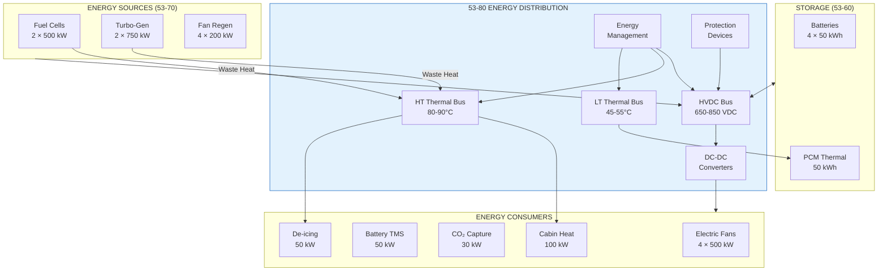

# 53-80-00-01 — Energy System Overview

| Field | Value |
|-------|-------|
| **Document ID** | 53-80-00-01 |
| **Version** | 1.0 |
| **Date** | 2025-11-27 |
| **Status** | DRAFT |
| **Classification** | ENERGY / OVERVIEW |

---

## 1. Purpose

This document provides a comprehensive overview of the 53-80 Energy bucket for ATA 53 Fuselage systems. It establishes the fundamental concepts, architecture, and design philosophy for electrical and thermal energy distribution, conversion, and management within the ANCHORS (Aircraft Networks, Circular, Harvesting, Operating & Renewable Systems) architecture.

## 2. Scope

### 2.1 What This Bucket Covers

The 53-80 Energy bucket owns:

| Domain | Systems | Responsibility |
|--------|---------|----------------|
| **Electrical Distribution** | HVDC bus interface, load routing, power management | Distribution from sources to ANCHORS loads |
| **Thermal Distribution** | Dual thermal bus, heat exchangers, coolant systems | Heat routing from sources to sinks |
| **Power Conversion** | DC-DC converters, bidirectional power flow | Voltage conversion and power regulation |
| **Energy Management** | EMS algorithms, load balancing, optimization | Real-time energy optimization |
| **Protection** | SSCBs, thermal limits, fault isolation | System protection and safety |
| **Monitoring** | Power quality, thermal sensors, efficiency | Performance monitoring and reporting |

### 2.2 Design Principle

> **"53-60 owns the storage; 53-70 owns the propulsion coupling; 53-80 owns the distribution and conversion."**

This separation ensures clear responsibility boundaries:
- **53-60 Storages**: Battery packs, PCM thermal storage, water tanks
- **53-70 Propulsion**: Fuel cells, turbo-generators, regeneration interfaces
- **53-80 Energy**: Power/thermal routing, conversion, optimization

## 3. System Architecture

### 3.1 Energy Flow Diagram

### 3.2 Energy Architecture Summary

| Parameter | Electrical | Thermal (HT) | Thermal (LT) |
|-----------|------------|--------------|--------------|
| Voltage/Temp | 650-850 VDC | 80-90°C | 45-55°C |
| Capacity | 2500 kW sources | 300 kW | 250 kW |
| ANCHORS Load | 150 kW max | 150 kW max | 150 kW max |
| Medium | Electrical | 50% PG/Water | 50% PG/Water |
| Flow Rate | N/A | 100 L/min | 150 L/min |

## 4. Band Allocation

The 53-80 Energy bucket is organized into 10 bands:

| Band | Name | Document Prefix | Contents |
|------|------|-----------------|----------|
| **00** | General | 53-80-00-XX | Overview, design rules, principles, safety |
| **10** | Electrical Distribution | 53-80-10-XX | HVDC bus, load routing, bus ties |
| **20** | Thermal Distribution | 53-80-20-XX | Dual thermal bus, coolant, heat exchangers |
| **30** | Power Conversion | 53-80-30-XX | DC-DC converters, bidirectional flow |
| **40** | Energy Management | 53-80-40-XX | EMS, load balancing, optimization |
| **50** | Interfaces | 53-80-50-XX | ATA 24, ATA 21, ATA 72 interfaces |
| **60** | Protection | 53-80-60-XX | SSCBs, thermal limits, fault isolation |
| **70** | Monitoring | 53-80-70-XX | Power quality, thermal monitoring |
| **80** | Efficiency | 53-80-80-XX | Efficiency optimization, loss analysis |
| **90** | Data & Schemas | 53-80-90-XX | Parameters, signal dictionaries |

## 5. Key Performance Requirements

### 5.1 Electrical Requirements

| Requirement ID | Parameter | Value | Rationale |
|----------------|-----------|-------|-----------|
| REQ-NRG-001 | HVDC bus voltage | 750 VDC ± 100 VDC | Aircraft standard |
| REQ-NRG-002 | Max ANCHORS load | 150 kW | System sizing |
| REQ-NRG-003 | Power quality ripple | < 2% | EMI compliance |
| REQ-NRG-004 | Transient response | < 50 ms | Load stability |
| REQ-NRG-005 | Ground fault detection | < 30 mA | Safety |

### 5.2 Thermal Requirements

| Requirement ID | Parameter | Value | Rationale |
|----------------|-----------|-------|-----------|
| REQ-NRG-010 | HT bus temperature | 85 ± 5°C | Heat source matching |
| REQ-NRG-011 | LT bus temperature | 50 ± 5°C | Battery/PE cooling |
| REQ-NRG-012 | Thermal recovery | ≥ 65% | Efficiency target |
| REQ-NRG-013 | Coolant flow HT | ≥ 80 L/min | Heat transfer |
| REQ-NRG-014 | Coolant flow LT | ≥ 120 L/min | Cooling capacity |

### 5.3 Efficiency Requirements

| Requirement ID | Parameter | Value | Rationale |
|----------------|-----------|-------|-----------|
| REQ-NRG-020 | DC-DC efficiency | ≥ 95% | Power conservation |
| REQ-NRG-021 | Regen capture | ≥ 85% | Energy recovery |
| REQ-NRG-022 | Overall system | ≥ 75% | Net benefit |

## 6. Interface Summary

### 6.1 External Interfaces

| ICD | Partner | Direction | Content |
|-----|---------|-----------|---------|
| ICD-24-001 | ATA 24 Electrical | Bidirectional | HVDC bus power |
| ICD-21-001 | ATA 21 ECS | Output | Cabin/de-ice heat |
| ICD-72-020 | ATA 72 Propulsion | Input | Waste heat |
| ICD-72-021 | ATA 72 Propulsion | Input | Regen power |

### 6.2 Internal Interfaces

| Interface | From | To | Data |
|-----------|------|-----|------|
| NRG-INT-01 | 53-80 | 53-60 | Battery charge/discharge |
| NRG-INT-02 | 53-80 | 53-60 | PCM charge/discharge |
| NRG-INT-03 | 53-70 | 53-80 | FC/TG power & heat |
| NRG-INT-04 | 53-80 | 53-40 | EMS commands |

## 7. Safety Classification

### 7.1 Failure Effects

| System | Failure Mode | Effect | Classification |
|--------|--------------|--------|----------------|
| HVDC bus | Loss of power | Loss of ANCHORS functions | Major |
| HT thermal bus | Overtemperature | Component damage | Hazardous |
| LT thermal bus | Loss of cooling | Battery thermal runaway | Hazardous |
| EMS | Incorrect optimization | Reduced efficiency | Minor |
| Protection | Failure to trip | Equipment damage | Major |

### 7.2 Design Assurance Level

| Function | DAL | Rationale |
|----------|-----|-----------|
| Electrical protection | B | Prevents hazardous conditions |
| Thermal protection | B | Battery safety |
| Power distribution | C | Mission critical |
| Energy optimization | D | Efficiency only |

## 8. Traceability

### 8.1 Parent Documents

- [53-80 Energy README](../README.md) — Bucket overview
- [53-00-03 Requirements](../../53-00_GENERAL/53-00-03_Requirements/) — System requirements

### 8.2 Child Documents

- [53-80-00-02 Design Rules](./53-80-00-02_Design_Rules.md)
- [53-80-00-03 Energy Principles](./53-80-00-03_Energy_Principles.md)
- [53-80-00-04 Safety Requirements](./53-80-00-04_Safety_Requirements.md)

---

## Document Control

| Field | Value |
|-------|-------|
| **Document ID** | 53-80-00-01 |
| **Version** | 1.0 |
| **Date** | 2025-11-27 |
| **Status** | DRAFT |
| **Author** | AMPEL360 Energy Systems Team |
| **Reviewer** | _[To be assigned]_ |
| **Approver** | _[To be assigned]_ |

### AI Disclosure

- **Generated with assistance of:** AI (GitHub Copilot), prompted by **Amedeo Pelliccia**
- **Status:** DRAFT — Subject to human review and approval
- **Repository:** `AMPEL360-BWB-H2-Hy-E`
- **Last AI update:** 2025-11-27

---

*END OF DOCUMENT*
