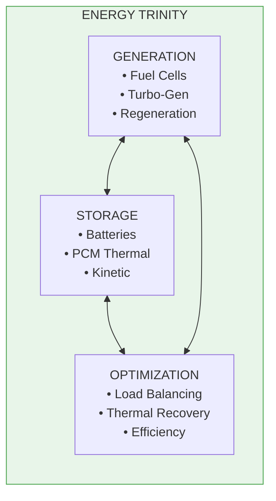
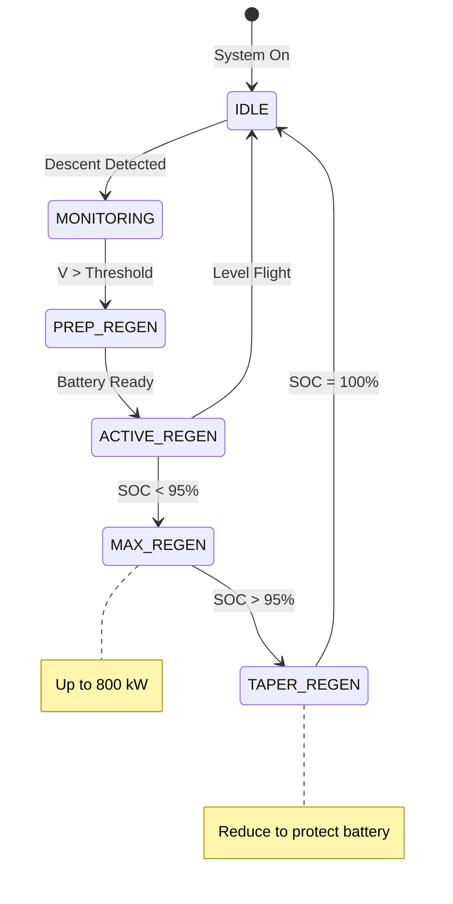
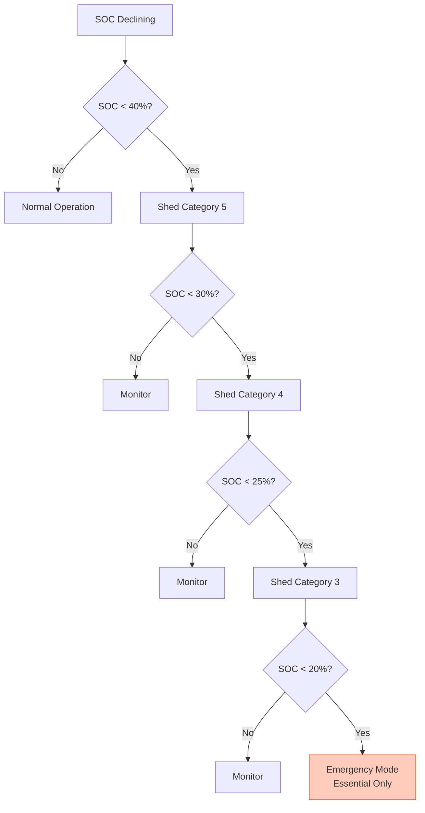

# 53-80-00-03 — Energy Management Principles

| Field | Value |
|-------|-------|
| **Document ID** | 53-80-00-03 |
| **Version** | 1.0 |
| **Date** | 2025-11-27 |
| **Status** | DRAFT |
| **Classification** | ENERGY / PRINCIPLES |

---

## 1. Purpose

This document defines the fundamental energy management principles that govern all 53-80 Energy systems. These principles ensure optimal energy utilization, recovery, and distribution throughout the AMPEL360 BWB H2 Hy-E aircraft mission profile.

## 2. Core Energy Philosophy

### 2.1 The Energy Trinity

The AMPEL360 energy architecture is built on three interdependent pillars:



### 2.2 Guiding Principles

| Principle | Statement | Implementation |
|-----------|-----------|----------------|
| **P1** | Energy shall never be wasted | All waste heat recovered where practical |
| **P2** | Storage is a buffer, not a sink | Batteries return to 100% SOC each flight |
| **P3** | Optimization is continuous | EMS adapts in real-time to conditions |
| **P4** | Regeneration is maximized | Descent energy captured to batteries |
| **P5** | Thermal and electrical are coupled | Waste heat serves cabin/de-ice needs |

## 3. Energy Balance Principles

### 3.1 Electrical Energy Balance

The fundamental electrical power balance equation:

```
P_generation = P_load + P_storage + P_losses

Where:
  P_generation = P_FC + P_TG + P_regen
  P_load = P_fans + P_ANCHORS + P_systems
  P_storage = P_battery_charge − P_battery_discharge
  P_losses = Σ(conversion losses) + Σ(distribution losses)
```

### 3.2 Mission Energy Profile

| Phase | Duration | Generation | Load | Battery | Net |
|-------|----------|------------|------|---------|-----|
| Taxi Out | 15 min | 0 kW | 100 kW | −25 kWh | −25 kWh |
| Takeoff | 5 min | 1000 kW | 2000 kW | −17 kWh | −17 kWh |
| Climb | 25 min | 1500 kW | 1260 kW | +100 kWh | +100 kWh |
| Cruise | 180 min | 1200 kW | 1200 kW | ±0 kWh | ±0 kWh |
| Descent | 25 min | 0 kW + 800 regen | 500 kW | +125 kWh | +125 kWh |
| Approach | 10 min | 800 kW | 900 kW | −17 kWh | −17 kWh |
| Landing | 2 min | 0 kW + 200 regen | 100 kW | +3 kWh | +3 kWh |
| Taxi In | 10 min | 0 kW + 80 regen | 60 kW | +3 kWh | +3 kWh |
| **Total** | **272 min** | — | — | **+172 kWh** | **Net Positive** |

### 3.3 Thermal Energy Balance

The fundamental thermal energy balance equation:

```
Q_sources = Q_sinks + Q_storage + Q_rejected

Where:
  Q_sources = Q_FC + Q_turbine + Q_motors + Q_PE + Q_batteries
  Q_sinks = Q_cabin + Q_deice + Q_precondition
  Q_storage = Q_PCM_charge − Q_PCM_discharge
  Q_rejected = Q_radiator (waste to ambient)
```

### 3.4 Thermal Recovery Priority

Heat recovery follows a priority cascade:

```
Priority 1: Cabin Heating (passenger comfort)
    ↓ Excess heat available
Priority 2: De-icing (wing/empennage protection)
    ↓ Excess heat available
Priority 3: Battery Preconditioning (cold weather)
    ↓ Excess heat available
Priority 4: PCM Storage (future use)
    ↓ Excess heat available
Priority 5: Radiator Rejection (waste heat)
```

## 4. Regeneration Principles

### 4.1 Regeneration Sources

| Source | Condition | Max Power | Capture Efficiency |
|--------|-----------|-----------|-------------------|
| Fan Motors | Descent, braking | 800 kW | 85% |
| Wheel Brakes | Landing, taxi | 200 kW | 50% |
| APU Windmill | Emergency | 50 kW | 70% |

### 4.2 Regeneration Strategy



### 4.3 Regeneration Rules

| Rule | Condition | Action |
|------|-----------|--------|
| R1 | Battery SOC < 95% | Accept max regen |
| R2 | Battery temp > 45°C | Reduce regen rate |
| R3 | Battery SOC ≥ 98% | Taper to C/10 |
| R4 | Battery SOC = 100% | Cease regen |
| R5 | Descent rate > 2000 fpm | Prioritize regen |

## 5. Thermal Integration Principles

### 5.1 Heat Cascade

The thermal system implements a temperature cascade:

```
┌─────────────────────────────────────────────────────────────────┐
│                    TEMPERATURE CASCADE                          │
├─────────────────────────────────────────────────────────────────┤
│                                                                 │
│  120°C ─────────┐                                               │
│                 │ Turbine Exhaust (limited use)                 │
│   90°C ─────────┼───────────────────────────────────────────    │
│                 │          HIGH TEMP BUS                        │
│   80°C ─────────┼───→ Cabin Heating (20°C delta)               │
│                 │ ───→ De-icing (ice melting)                   │
│   55°C ─────────┼───────────────────────────────────────────    │
│                 │          LOW TEMP BUS                         │
│   45°C ─────────┼───→ Battery Preconditioning                  │
│                 │ ───→ PCM Charging (phase change at 48°C)     │
│   25°C ─────────┼───→ Radiator Rejection                       │
│                 │                                               │
│   -40°C ────────┘ (cold day operations)                        │
│                                                                 │
└─────────────────────────────────────────────────────────────────┘
```

### 5.2 Cross-Bus Heat Transfer

| Condition | Direction | Purpose | Capacity |
|-----------|-----------|---------|----------|
| Excess HT capacity | HT → LT | Reduce LT load | 80 kW |
| HT demand, LT excess | LT → HT | Emergency heating | 40 kW |
| Balance | Coupled | Optimize both | Variable |

## 6. Load Prioritization Principles

### 6.1 Load Categories

| Category | Examples | Priority | Shed Policy |
|----------|----------|----------|-------------|
| Essential | Safety systems, BMS core | 1 | Never shed |
| Flight Critical | Battery TMS, minimal avionics | 2 | Only in emergency |
| Mission | CO₂ capture, water treatment | 3 | Shed at 40% SOC |
| Comfort | Cabin services, IFE | 4 | Shed at 30% SOC |
| Deferrable | Preconditioning, ground power | 5 | Shed at 25% SOC |

### 6.2 Load Shedding Sequence



## 7. Efficiency Optimization Principles

### 7.1 Efficiency Targets

| System | Target | Measurement Method |
|--------|--------|-------------------|
| DC-DC converters | ≥ 95% | Pin/Pout |
| Thermal recovery | ≥ 65% | Q_recovered/Q_available |
| Regeneration | ≥ 85% | E_captured/E_kinetic |
| Pump systems | ≥ 80% | Hydraulic power/electrical |
| Overall ANCHORS | ≥ 75% | Net energy benefit |

### 7.2 Optimization Strategies

| Strategy | Implementation | Benefit |
|----------|----------------|---------|
| Variable pump speed | Match flow to demand | 30% pump energy reduction |
| DC-DC load sharing | Operate converters at optimal point | 2-3% efficiency gain |
| Thermal storage | PCM for peak shaving | 20% radiator size reduction |
| Predictive regen | Anticipate descent | 5% more energy captured |
| Heat recovery priority | Cascade by temperature | 15% less rejection |

## 8. Failure Management Principles

### 8.1 Graceful Degradation

| Failure | Effect | Mitigation |
|---------|--------|------------|
| One DC-DC fails | Reduced capacity | Remaining units at 120% |
| HT pump fails | No cabin heat | Cross-connect from LT |
| LT pump fails | Reduced cooling | Reduce thermal loads |
| EMS fails | No optimization | Fixed mode operation |
| Sensors fail | Uncertain state | Conservative operation |

### 8.2 Fail-Safe States

| System | Fail-Safe State |
|--------|-----------------|
| HVDC bus | Disconnect ANCHORS, preserve aircraft |
| Thermal pumps | Backup pump on, max cooling |
| DC-DC converters | Trip if overvoltage/overcurrent |
| Valves | Spring-return to safe position |

---

## Document Control

| Field | Value |
|-------|-------|
| **Document ID** | 53-80-00-03 |
| **Version** | 1.0 |
| **Date** | 2025-11-27 |
| **Status** | DRAFT |
| **Author** | AMPEL360 Energy Systems Team |
| **Reviewer** | _[To be assigned]_ |
| **Approver** | _[To be assigned]_ |

### AI Disclosure

- **Generated with assistance of:** AI (GitHub Copilot), prompted by **Amedeo Pelliccia**
- **Status:** DRAFT — Subject to human review and approval
- **Repository:** `AMPEL360-BWB-H2-Hy-E`
- **Last AI update:** 2025-11-27

---

*END OF DOCUMENT*
