# 53-80-10-01 — HVDC Bus Design

| Field | Value |
|-------|-------|
| **Document ID** | 53-80-10-01 |
| **Version** | 1.0 |
| **Date** | 2025-11-27 |
| **Status** | DRAFT |
| **Classification** | ENERGY / ELECTRICAL |

---

## 1. Purpose

This document defines the High Voltage Direct Current (HVDC) bus architecture for the ANCHORS energy distribution system within ATA 53 Fuselage. The HVDC bus is the primary electrical backbone connecting energy sources to loads within the integrated energy management system.

## 2. HVDC Bus Architecture

### 2.1 System Overview

```mermaid
flowchart LR
    subgraph SOURCES["POWER SOURCES"]
        FC["Fuel Cells<br/>1000 kW"]
        TG["Turbo-Gen<br/>1500 kW"]
        BAT["Batteries<br/>200 kWh"]
        REGEN["Regen<br/>800 kW"]
    end
    
    subgraph BUS["ANCHORS HVDC BUS"]
        direction TB
        HVDC_P["HVDC+ Rail"]
        HVDC_N["HVDC− Rail"]
        GND["Ground Reference"]
        SPDA["ANCHORS SPDA"]
    end
    
    subgraph LOADS["ANCHORS LOADS"]
        L1["Battery TMS<br/>50 kW"]
        L2["CO₂ Capture<br/>30 kW"]
        L3["Water System<br/>10 kW"]
        L4["Thermal Pumps<br/>20 kW"]
        L5["Controls (28V)<br/>5 kW"]
    end
    
    SOURCES --> BUS
    BUS --> LOADS
    
    style BUS fill:#e3f2fd,stroke:#1565c0
```



### 2.2 Bus Specifications

| Parameter | Value | Unit | Tolerance | Reference |
|-----------|-------|------|-----------|-----------|
| Nominal voltage | 750 | VDC | ±5% | ICD-24-001 |
| Operating range | 650–850 | VDC | — | ICD-24-001 |
| Transient range | 600–900 | VDC | < 100 ms | ICD-24-001 |
| Maximum current | 2000 | A | — | ICD-24-002 |
| Ripple voltage | < 15 | Vpp | — | REQ-NRG-003 |
| Ripple percentage | < 2 | % | — | REQ-NRG-003 |
| Power quality | Class A | — | — | MIL-STD-704 |

### 2.3 Bus Configuration

The ANCHORS HVDC bus uses a **split-bus architecture** with bus tie capability:

```
┌─────────────────────────────────────────────────────────────────────┐
│                    ANCHORS HVDC BUS ARCHITECTURE                    │
├─────────────────────────────────────────────────────────────────────┤
│                                                                     │
│   HVDC BUS 1 (Left)                 HVDC BUS 2 (Right)             │
│   ══════════════════                ══════════════════              │
│        │                  BUS TIE                  │                │
│        │                 ═══╤═══                   │                │
│        │                    │                      │                │
│   ┌────┴────┐          ┌────┴────┐           ┌────┴────┐           │
│   │ Source  │          │ Bus Tie │           │ Source  │           │
│   │ Contctr │          │ Contctr │           │ Contctr │           │
│   │  (K1)   │          │  (KBT)  │           │  (K2)   │           │
│   └────┬────┘          └────┬────┘           └────┬────┘           │
│        │                    │                      │                │
│   FC + TG 1              Normal                FC + TG 2           │
│                         Closed                                      │
│                                                                     │
│   NORMAL: Bus tie closed, single bus operation                     │
│   FAULT:  Bus tie opens, isolated bus operation                    │
│                                                                     │
└─────────────────────────────────────────────────────────────────────┘
```

## 3. Power Distribution

### 3.1 ANCHORS Secondary Power Distribution Assembly (SPDA)

| Channel | Load | Voltage | Power | Protection | Priority |
|---------|------|---------|-------|------------|----------|
| CH-01 | Battery TMS | 750 VDC | 50 kW | 80A SSCB | 2 |
| CH-02 | CO₂ Capture | 750 VDC | 30 kW | 50A SSCB | 3 |
| CH-03 | Water System | 750 VDC | 10 kW | 20A SSCB | 3 |
| CH-04 | Thermal Pumps | 750 VDC | 20 kW | 35A SSCB | 2 |
| CH-05 | Controls | 28 VDC | 5 kW | 15A Fuse | 1 |
| CH-06 | Emergency | 750 VDC | 20 kW | 35A SSCB | 1 |

### 3.2 Power Budget

| Load Category | Nominal (kW) | Peak (kW) | Duty Cycle |
|---------------|--------------|-----------|------------|
| Battery TMS | 30 | 50 | 60% |
| CO₂ Capture | 20 | 30 | 80% |
| Water System | 5 | 10 | 30% |
| Thermal Pumps | 15 | 20 | 70% |
| Controls | 3 | 5 | 100% |
| Emergency Reserve | 0 | 20 | 0% |
| **Total ANCHORS** | **73** | **135** | — |

### 3.3 Load Profile

```mermaid
gantt
    title ANCHORS Load Profile by Flight Phase
    dateFormat X
    axisFormat %s

    section Battery TMS
    Taxi Out (30 kW)   :a1, 0, 15
    Takeoff (50 kW)    :a2, 15, 5
    Climb (40 kW)      :a3, 20, 25
    Cruise (30 kW)     :a4, 45, 180
    Descent (20 kW)    :a5, 225, 25
    Landing (30 kW)    :a6, 250, 12

    section CO₂ Capture
    Taxi Out (10 kW)   :b1, 0, 15
    Takeoff (5 kW)     :b2, 15, 5
    Climb (20 kW)      :b3, 20, 25
    Cruise (25 kW)     :b4, 45, 180
    Descent (20 kW)    :b5, 225, 25
    Landing (10 kW)    :b6, 250, 12

    section Thermal
    All Phases (15 kW) :c1, 0, 262
```



## 4. Grounding and Bonding

### 4.1 Grounding Scheme

The HVDC system uses a **TN-S grounding scheme**:

| Element | Connection | Purpose |
|---------|------------|---------|
| HVDC− rail | Grounded via resistor | Fault current limiting |
| Equipment chassis | Bonded to structure | Safety ground |
| Shield | 360° termination | EMI control |
| Ground reference | Single-point ground | Noise rejection |

### 4.2 Ground Fault Protection

```
┌─────────────────────────────────────────────────────────────────┐
│                 GROUND FAULT DETECTION SCHEME                   │
├─────────────────────────────────────────────────────────────────┤
│                                                                 │
│   HVDC+  ═══════════════════════════════════════════════════   │
│                                                                 │
│            ┌───────────┐                                        │
│            │   Load    │                                        │
│            │           │                                        │
│            └─────┬─────┘                                        │
│                  │                                               │
│   HVDC−  ═══════╪═══════════════════════════════════════════   │
│                  │                                               │
│               ┌──┴──┐                                           │
│               │ GFI │  Ground Fault Interrupter                 │
│               │ ≤30mA │  Threshold: 30 mA                        │
│               └──┬──┘  Trip time: < 50 ms                       │
│                  │                                               │
│   GND    ════════╧══════════════════════════════════════════   │
│                                                                 │
└─────────────────────────────────────────────────────────────────┘
```

### 4.3 Bonding Requirements

| Joint Type | Resistance | Verification |
|------------|------------|--------------|
| Structural bond | < 2.5 mΩ | Measurement |
| Equipment bond | < 10 mΩ | Measurement |
| Shield bond | < 5 mΩ | Measurement |

## 5. Conductor Specifications

### 5.1 HVDC Cables

| Parameter | Requirement | Standard |
|-----------|-------------|----------|
| Conductor | Copper, Class 5 | EN 60228 |
| Insulation | Cross-linked ETFE | AS22759 |
| Temperature rating | 200°C | — |
| Voltage rating | 1000 VDC | — |
| Flame resistance | VW-1 | UL 94 |
| Smoke density | ≤ 200 Ds(4) | FAR 25.853 |

### 5.2 Cable Sizing

| Channel | Current (A) | Size (AWG) | Voltage Drop | Length (m) |
|---------|-------------|------------|--------------|------------|
| CH-01 | 67 | 4 AWG | 1.8% | 15 |
| CH-02 | 40 | 6 AWG | 1.5% | 12 |
| CH-03 | 13 | 10 AWG | 1.2% | 10 |
| CH-04 | 27 | 8 AWG | 1.4% | 14 |
| CH-05 | 179 | 2/0 AWG | 2.5% | 8 |

### 5.3 EMI Shielding

| Requirement | Value |
|-------------|-------|
| Shield type | Braid + foil |
| Coverage | ≥ 90% |
| Transfer impedance | < 10 mΩ/m @ 1 MHz |
| Termination | 360° at both ends |

## 6. Power Quality

### 6.1 Steady-State Requirements

| Parameter | Limit | Verification |
|-----------|-------|--------------|
| Voltage regulation | ±5% | Measurement |
| Ripple (0-500 Hz) | < 1% | Measurement |
| Ripple (500 Hz-150 kHz) | < 2% | Measurement |
| Harmonic distortion | < 5% THD | Measurement |

### 6.2 Transient Requirements

| Event | Limit | Duration |
|-------|-------|----------|
| Load step (0-100%) | < 10% deviation | 50 ms recovery |
| Source switching | < 5% deviation | 10 ms recovery |
| Fault clearing | < 20% deviation | 100 ms recovery |

## 7. Interface Definition

### 7.1 ICD-24-001 (Aircraft HVDC Interface)

| Parameter | Specification |
|-----------|---------------|
| Voltage | 750 VDC nominal |
| Current | 200 A maximum (ANCHORS allocation) |
| Power quality | Per MIL-STD-704F |
| Connection | MIL-DTL-5015 connector |
| Signal interface | AFDX per ARINC 664p7 |

### 7.2 Connector Specifications

| Location | Connector Type | Rating | Mating Cycles |
|----------|---------------|--------|---------------|
| Source interface | MIL-DTL-38999 III | 200A | 500 |
| SPDA input | MIL-DTL-5015 | 200A | 500 |
| Load channels | MIL-DTL-38999 III | 100A | 250 |

---

## Document Control

| Field | Value |
|-------|-------|
| **Document ID** | 53-80-10-01 |
| **Version** | 1.0 |
| **Date** | 2025-11-27 |
| **Status** | DRAFT |
| **Author** | AMPEL360 Electrical Systems Team |
| **Reviewer** | _[To be assigned]_ |
| **Approver** | _[To be assigned]_ |

### AI Disclosure

- **Generated with assistance of:** AI (GitHub Copilot), prompted by **Amedeo Pelliccia**
- **Status:** DRAFT — Subject to human review and approval
- **Repository:** `AMPEL360-BWB-H2-Hy-E`
- **Last AI update:** 2025-11-27

---

*END OF DOCUMENT*
