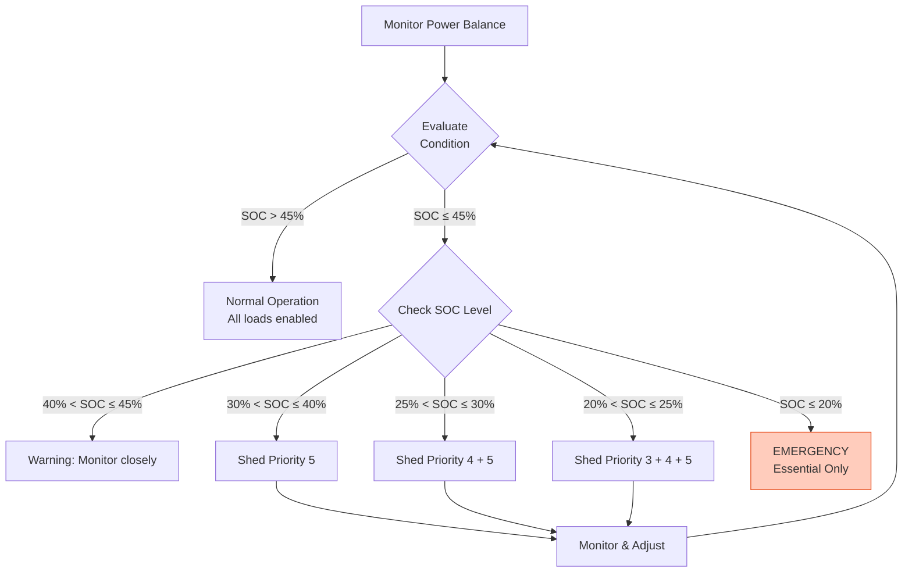
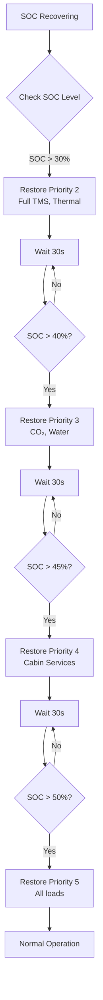

# 53-80-10-02 — Load Management Strategy

| Field | Value |
|-------|-------|
| **Document ID** | 53-80-10-02 |
| **Version** | 1.0 |
| **Date** | 2025-11-27 |
| **Status** | DRAFT |
| **Classification** | ENERGY / ELECTRICAL |

---

## 1. Purpose

This document defines the electrical load management strategy for the ANCHORS energy distribution system. It establishes load prioritization, shedding sequences, and restoration procedures to ensure safe and efficient power management across all operating conditions.

## 2. Load Classification

### 2.1 Priority Categories

| Priority | Category | Description | Shed Condition | Examples |
|----------|----------|-------------|----------------|----------|
| 1 | Essential | Required for flight safety | Never shed | Safety Supervisor, BMS core |
| 2 | Flight Critical | Required for normal operation | Emergency only | Battery TMS, thermal pumps |
| 3 | Mission | Required for mission completion | SOC < 40% | CO₂ capture, water treatment |
| 4 | Comfort | Passenger convenience | SOC < 30% | Cabin services |
| 5 | Deferrable | Can wait without impact | SOC < 25% | Preconditioning, ground ops |

### 2.2 ANCHORS Load Inventory

| Load | Priority | Normal (kW) | Peak (kW) | Shed Allowed | Restore Priority |
|------|----------|-------------|-----------|--------------|------------------|
| Safety Supervisor | 1 | 0.5 | 1 | No | N/A |
| BMS Core | 1 | 2 | 3 | No | N/A |
| Emergency Bus | 1 | 0 | 20 | No | N/A |
| Battery TMS Cooling | 2 | 30 | 50 | Emergency | 1st |
| Thermal Circulation | 2 | 15 | 20 | Emergency | 2nd |
| CO₂ Capture System | 3 | 20 | 30 | Yes | 3rd |
| Water Treatment | 3 | 5 | 10 | Yes | 4th |
| Cabin Preconditioning | 5 | 0 | 25 | Yes | Last |

## 3. Load Shedding Strategy

### 3.1 Shedding Decision Logic



### 3.2 Shedding Thresholds

| Threshold | SOC Level | Action | Response Time |
|-----------|-----------|--------|---------------|
| T1 | 45% | Enable monitoring | — |
| T2 | 40% | Shed Priority 5 | 1 s |
| T3 | 30% | Shed Priority 4 | 1 s |
| T4 | 25% | Shed Priority 3 | 500 ms |
| T5 | 20% | Emergency mode | 100 ms |

### 3.3 Hysteresis Settings

To prevent oscillation, restoration uses different thresholds:

| Priority | Shed Threshold | Restore Threshold | Hysteresis |
|----------|----------------|-------------------|------------|
| 5 | 40% SOC | 50% SOC | 10% |
| 4 | 30% SOC | 45% SOC | 15% |
| 3 | 25% SOC | 40% SOC | 15% |
| 2 | Emergency | 30% SOC | — |

## 4. Shedding Sequence

### 4.1 Priority 5 Shedding (SOC < 40%)

| Step | Load | Action | Power Saved |
|------|------|--------|-------------|
| 1 | Cabin Preconditioning | Off | 25 kW |
| 2 | Ground Equipment Interface | Off | 5 kW |
| | **Total** | | **30 kW** |

### 4.2 Priority 4 Shedding (SOC < 30%)

| Step | Load | Action | Power Saved |
|------|------|--------|-------------|
| 1 | Cabin Services (non-essential) | Off | 15 kW |
| 2 | IFE Power | Off | 10 kW |
| | **Total** | | **25 kW** |

### 4.3 Priority 3 Shedding (SOC < 25%)

| Step | Load | Action | Power Saved |
|------|------|--------|-------------|
| 1 | Water Treatment | Standby mode | 8 kW |
| 2 | CO₂ Capture | Reduced mode (50%) | 10 kW |
| | **Total** | | **18 kW** |

### 4.4 Emergency Shedding (SOC < 20%)

| Step | Load | Action | Power Saved |
|------|------|--------|-------------|
| 1 | All Priority 3, 4, 5 | Off | 73 kW |
| 2 | Battery TMS | Minimum cooling | 20 kW |
| | **Retained** | Essential only | ~5 kW |

## 5. Load Restoration

### 5.1 Restoration Sequence



### 5.2 Restoration Rules

| Rule | Description |
|------|-------------|
| R1 | Wait 30 seconds between restoration steps |
| R2 | Verify SOC trend is positive before restoring |
| R3 | Restore within priority in order of importance |
| R4 | Monitor power balance after each restoration |
| R5 | If SOC drops, pause restoration sequence |

## 6. Special Operating Modes

### 6.1 Takeoff/Landing Mode

During takeoff and landing, load management changes:

| Mode | Duration | Action |
|------|----------|--------|
| Takeoff | -2 to +2 min | Priority 5 shed, max power reserve |
| Landing | -5 to 0 min | Priority 4+5 shed, max regen capacity |
| Go-Around | As needed | All non-essential shed |

### 6.2 Ground Mode

| Condition | Strategy |
|-----------|----------|
| Ground Power Available | Maximize charging, preconditioning |
| Battery Only | Minimum loads, conservation |
| APU Only | Limited loads, prepare for flight |

### 6.3 Emergency Mode

| Trigger | Action |
|---------|--------|
| SOC < 20% | Essential loads only |
| HVDC fault | Isolate and reconfigure |
| Fire detection | Shed affected loads, isolate |
| Ditching | Preserve emergency systems |

## 7. Crew Interface

### 7.1 Load Management Display

```
┌─────────────────────────────────────────────────────────────────┐
│                    ANCHORS LOAD MANAGEMENT                      │
├─────────────────────────────────────────────────────────────────┤
│                                                                 │
│   SOC: ███████████████████░░░░░░  78%   TREND: ↑ +2.3%/min    │
│                                                                 │
│   LOAD STATUS:                                                  │
│   ┌──────────────────────────┬─────────┬─────────┬─────────┐   │
│   │ Load                     │ Status  │ Power   │ Shed    │   │
│   ├──────────────────────────┼─────────┼─────────┼─────────┤   │
│   │ Safety Supervisor        │ ● ON    │ 0.5 kW  │ NEVER   │   │
│   │ BMS Core                 │ ● ON    │ 2.0 kW  │ NEVER   │   │
│   │ Battery TMS              │ ● ON    │ 35.0 kW │ EMERG   │   │
│   │ Thermal Circulation      │ ● ON    │ 15.0 kW │ EMERG   │   │
│   │ CO₂ Capture              │ ● ON    │ 20.0 kW │ < 25%   │   │
│   │ Water Treatment          │ ● ON    │ 5.0 kW  │ < 25%   │   │
│   │ Preconditioning          │ ○ OFF   │ 0.0 kW  │ < 40%   │   │
│   └──────────────────────────┴─────────┴─────────┴─────────┘   │
│                                                                 │
│   TOTAL: 77.5 kW    AVAILABLE: 150 kW    MARGIN: 72.5 kW      │
│                                                                 │
│   MODE: AUTO          [MANUAL OVERRIDE]                        │
│                                                                 │
└─────────────────────────────────────────────────────────────────┘
```

### 7.2 Crew Actions

| Action | Method | Effect |
|--------|--------|--------|
| Manual shed | Select load + SHED button | Immediately shed selected load |
| Manual restore | Select load + RESTORE button | Restore if power available |
| Override auto | AUTO/MANUAL switch | Crew assumes control |
| Reset shed | RESET SHED button | Restore all if conditions permit |

## 8. Monitoring and Logging

### 8.1 Parameters Monitored

| Parameter | Rate | Log |
|-----------|------|-----|
| Bus voltage | 10 Hz | Yes |
| Channel current | 10 Hz | Yes |
| SOC | 1 Hz | Yes |
| Load status | On change | Yes |
| Shed events | On change | Yes |
| Crew actions | On change | Yes |

### 8.2 Event Logging

| Event | Data Captured |
|-------|---------------|
| Load shed | Time, load ID, SOC, trigger |
| Load restore | Time, load ID, SOC |
| Manual override | Time, crew action, load affected |
| Emergency mode | Time, trigger, loads shed |

---

## Document Control

| Field | Value |
|-------|-------|
| **Document ID** | 53-80-10-02 |
| **Version** | 1.0 |
| **Date** | 2025-11-27 |
| **Status** | DRAFT |
| **Author** | AMPEL360 Electrical Systems Team |
| **Reviewer** | _[To be assigned]_ |
| **Approver** | _[To be assigned]_ |

### AI Disclosure

- **Generated with assistance of:** AI (GitHub Copilot), prompted by **Amedeo Pelliccia**
- **Status:** DRAFT — Subject to human review and approval
- **Repository:** `AMPEL360-BWB-H2-Hy-E`
- **Last AI update:** 2025-11-27

---

*END OF DOCUMENT*
