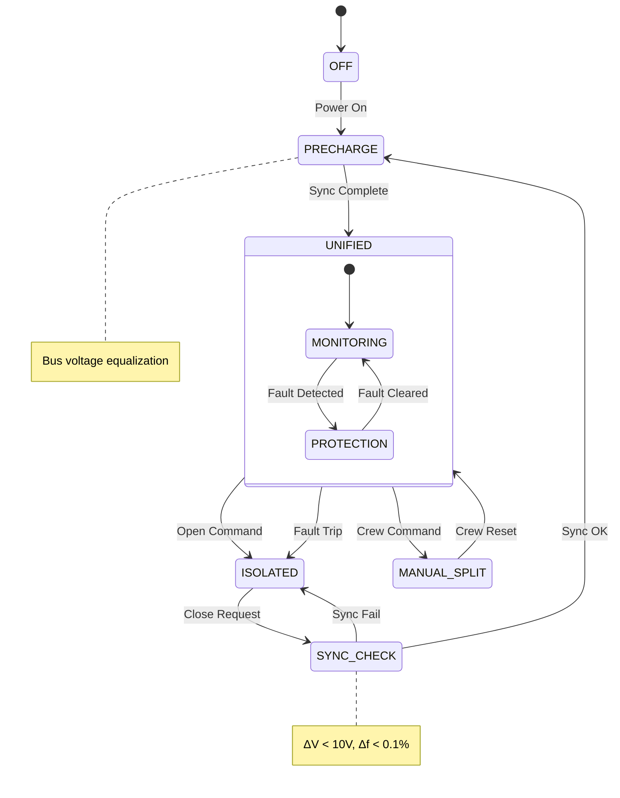

# 53-80-10-04 — Bus Tie Control

| Field | Value |
|-------|-------|
| **Document ID** | 53-80-10-04 |
| **Version** | 1.0 |
| **Date** | 2025-11-27 |
| **Status** | DRAFT |
| **Classification** | ENERGY / ELECTRICAL |

---

## 1. Purpose

This document defines the bus tie control system for the ANCHORS HVDC distribution network. The bus tie enables unified or isolated bus operation depending on operational requirements and fault conditions.

## 2. Bus Tie Architecture

### 2.1 Physical Configuration

```
┌─────────────────────────────────────────────────────────────────┐
│                     BUS TIE ASSEMBLY                            │
├─────────────────────────────────────────────────────────────────┤
│                                                                 │
│   BUS 1 (LEFT)                    BUS 2 (RIGHT)                │
│   ════════════                    ════════════                  │
│        │                               │                        │
│        │                               │                        │
│   ┌────┴────┐      ┌─────────┐    ┌────┴────┐                  │
│   │SSCB-BT1 │──────│ BUS TIE │────│SSCB-BT2 │                  │
│   │  200A   │      │CONTACTOR│    │  200A   │                  │
│   └─────────┘      │  KBT    │    └─────────┘                  │
│                    └────┬────┘                                  │
│                         │                                       │
│                    ┌────┴────┐                                  │
│                    │  COIL   │ ← Control signal                │
│                    │ DRIVER  │                                  │
│                    └─────────┘                                  │
│                                                                 │
│   PROTECTION: SSCB provides fast electronic protection          │
│   ISOLATION:  Contactor provides galvanic isolation            │
│                                                                 │
└─────────────────────────────────────────────────────────────────┘
```

### 2.2 Bus Tie Components

| Component | Function | Rating | Type |
|-----------|----------|--------|------|
| SSCB-BT1 | Electronic protection Bus 1 side | 200A, 850 VDC | Solid State |
| SSCB-BT2 | Electronic protection Bus 2 side | 200A, 850 VDC | Solid State |
| KBT | Galvanic isolation | 200A, 1000 VDC | Electromechanical |
| Coil Driver | Contactor control | 28 VDC | Electronic |
| Position Sensor | Contactor status | — | Magnetic |

### 2.3 Specifications

| Parameter | Value | Notes |
|-----------|-------|-------|
| Continuous current | 200 A | Both directions |
| Peak current (1 min) | 300 A | Overload |
| Interrupting capacity | 50 kA | With SSCBs |
| Operating voltage | 600-900 VDC | Full range |
| Open time (SSCB) | < 1 ms | Electronic |
| Open time (contactor) | < 20 ms | Electromechanical |
| Close time (contactor) | < 30 ms | Including precharge |

## 3. Operating Modes

### 3.1 Mode Definition

| Mode | Bus Tie Position | SSCBs | Application |
|------|------------------|-------|-------------|
| UNIFIED | Closed | Armed | Normal operation |
| ISOLATED | Open | Trip | Fault isolation |
| MANUAL_SPLIT | Open | Armed | Maintenance/test |
| PARALLEL_SYNC | Closed | Monitoring | Source paralleling |

### 3.2 Mode State Diagram



## 4. Control Logic

### 4.1 Close Sequence

```
Algorithm: Bus Tie Close

PRECONDITIONS:
  - No active faults on either bus
  - Both buses energized
  - Voltage difference < 10 VDC
  - Crew or auto command

SEQUENCE:
  1. Verify preconditions (50 ms)
  2. Enable precharge contactor (if equipped)
  3. Wait for voltage equalization (< 500 ms)
  4. Verify ΔV < 10 VDC
  5. Close main contactor KBT
  6. Verify closed position (20 ms)
  7. Arm SSCBs for protection
  8. Report UNIFIED status

FAILURE MODES:
  - Preconditions not met → Abort, report reason
  - Sync timeout → Abort, report "SYNC FAIL"
  - Position verify fail → Trip SSCBs, report "KBT FAIL"
```

### 4.2 Open Sequence

```
Algorithm: Bus Tie Open

INPUTS:
  - Fault detection signal (fast path)
  - Crew open command (normal path)
  - Automatic open trigger (logic path)

FAST PATH (Fault):
  1. Detect fault (comparator, < 100 μs)
  2. Trip SSCBs (< 1 ms)
  3. Open contactor KBT (< 20 ms)
  4. Report ISOLATED status
  5. Log fault data

NORMAL PATH (Command):
  1. Receive open command
  2. Reduce cross-bus power flow
  3. Open SSCBs
  4. Open contactor KBT
  5. Report ISOLATED status
```

### 4.3 Fault Detection

| Fault Type | Detection | Threshold | Action |
|------------|-----------|-----------|--------|
| Overcurrent | dI/dt sensor | > 10 kA/ms | Fast trip |
| Short circuit | Impedance | Z < 0.01Ω | Fast trip |
| Ground fault | GFI | > 30 mA | Trip affected bus |
| Overvoltage | Voltage monitor | > 900 VDC | Open and shed |
| Undervoltage | Voltage monitor | < 600 VDC | Isolate failed bus |
| Differential | Current comparison | > 10% | Trip and investigate |

## 5. Protection Coordination

### 5.1 Trip Coordination Table

| Fault Location | First Response | Backup | Isolation |
|----------------|----------------|--------|-----------|
| Bus 1 load | Load SSCB | Channel SSCB | Bus 1 only |
| Bus 2 load | Load SSCB | Channel SSCB | Bus 2 only |
| Bus tie zone | SSCB-BT1 & BT2 | KBT opens | Both buses |
| Bus 1 source | Source contactor | SSCB-BT | Bus 1 isolated |
| Bus 2 source | Source contactor | SSCB-BT | Bus 2 isolated |

### 5.2 Protection Timing

```
┌─────────────────────────────────────────────────────────────────┐
│                  PROTECTION TIMING DIAGRAM                      │
├─────────────────────────────────────────────────────────────────┤
│                                                                 │
│   Event         0      1ms    10ms   20ms   50ms   100ms       │
│   ─────────────────────────────────────────────────────────     │
│   Fault ───────┤                                                │
│                 │                                               │
│   SSCB-BT ─────┼──■    (Trip < 1 ms)                           │
│                 │                                               │
│   KBT open ────┼───────────────■    (Mechanical < 20 ms)       │
│                 │                                               │
│   Isolation ───┼───────────────────■    (Complete < 25 ms)     │
│                 │                                               │
│   Fault clear ─┼───────────────────────────■                   │
│                                                                 │
│   Legend: ■ = Action complete                                   │
│                                                                 │
└─────────────────────────────────────────────────────────────────┘
```

## 6. Crew Interface

### 6.1 Bus Tie Controls

| Control | Location | Function |
|---------|----------|----------|
| BUS TIE AUTO/MANUAL | Overhead Panel | Select control mode |
| BUS TIE OPEN pushbutton | Overhead Panel | Manual open command |
| BUS TIE CLOSE pushbutton | Overhead Panel | Manual close command |
| BUS TIE RESET | Overhead Panel | Reset after fault |

### 6.2 Indications

| Indication | Color | Meaning |
|------------|-------|---------|
| BUS TIE CLOSED | Green | Normal, unified operation |
| BUS TIE OPEN | Amber | Isolated operation |
| BUS TIE FAULT | Red | Trip due to fault |
| SYNC AVAIL | Blue | Sync conditions met |

### 6.3 Synoptic Display

```
┌─────────────────────────────────────────────────────────────────┐
│                   HVDC BUS SYNOPTIC                             │
├─────────────────────────────────────────────────────────────────┤
│                                                                 │
│   BUS 1                   BUS TIE                    BUS 2      │
│   ══════                  ═══════                    ══════     │
│                                                                 │
│   ┌─────────┐           ┌─────────┐            ┌─────────┐     │
│   │ 752 VDC │    SSCB   │  KBT    │    SSCB   │ 748 VDC │     │
│   │  ████   │◄───[●]────│ [CLOSED]│───[●]───►│  ████   │     │
│   │ 1200 A  │    ON     │   ▲     │    ON     │  800 A  │     │
│   └─────────┘           │   │     │           └─────────┘     │
│                         │ SYNC OK │                             │
│   Sources: FC1, TG1     │ ΔV=4 V  │     Sources: FC2, TG2      │
│   Loads: 150 kW         └─────────┘     Loads: 100 kW          │
│                                                                 │
│   [AUTO] ○ OPEN  ○ CLOSE  ○ RESET                              │
│                                                                 │
└─────────────────────────────────────────────────────────────────┘
```

## 7. Testing and Maintenance

### 7.1 Built-In Test (BIT)

| Test | Frequency | Duration | Method |
|------|-----------|----------|--------|
| SSCB trip test | Power-on | 100 ms | Signal injection |
| Contactor movement | Power-on | 500 ms | Mechanical exercise |
| Sync logic | Continuous | — | Voltage comparison |
| Position sensing | Continuous | — | Sensor monitoring |

### 7.2 Maintenance Requirements

| Action | Interval | Duration | Access |
|--------|----------|----------|--------|
| Visual inspection | 200 FH | 30 min | Panel access |
| Contactor exercise | 500 FH | 1 hr | De-energized |
| Full functional test | A-Check | 2 hr | Dedicated GSE |
| Contactor replacement | 10,000 cycles | 4 hr | LRU replacement |

---

## Document Control

| Field | Value |
|-------|-------|
| **Document ID** | 53-80-10-04 |
| **Version** | 1.0 |
| **Date** | 2025-11-27 |
| **Status** | DRAFT |
| **Author** | AMPEL360 Electrical Systems Team |
| **Reviewer** | _[To be assigned]_ |
| **Approver** | _[To be assigned]_ |

### AI Disclosure

- **Generated with assistance of:** AI (GitHub Copilot), prompted by **Amedeo Pelliccia**
- **Status:** DRAFT — Subject to human review and approval
- **Repository:** `AMPEL360-BWB-H2-Hy-E`
- **Last AI update:** 2025-11-27

---

*END OF DOCUMENT*
