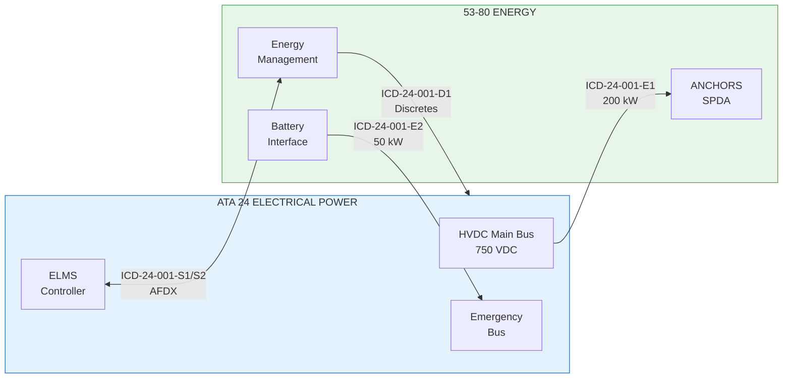
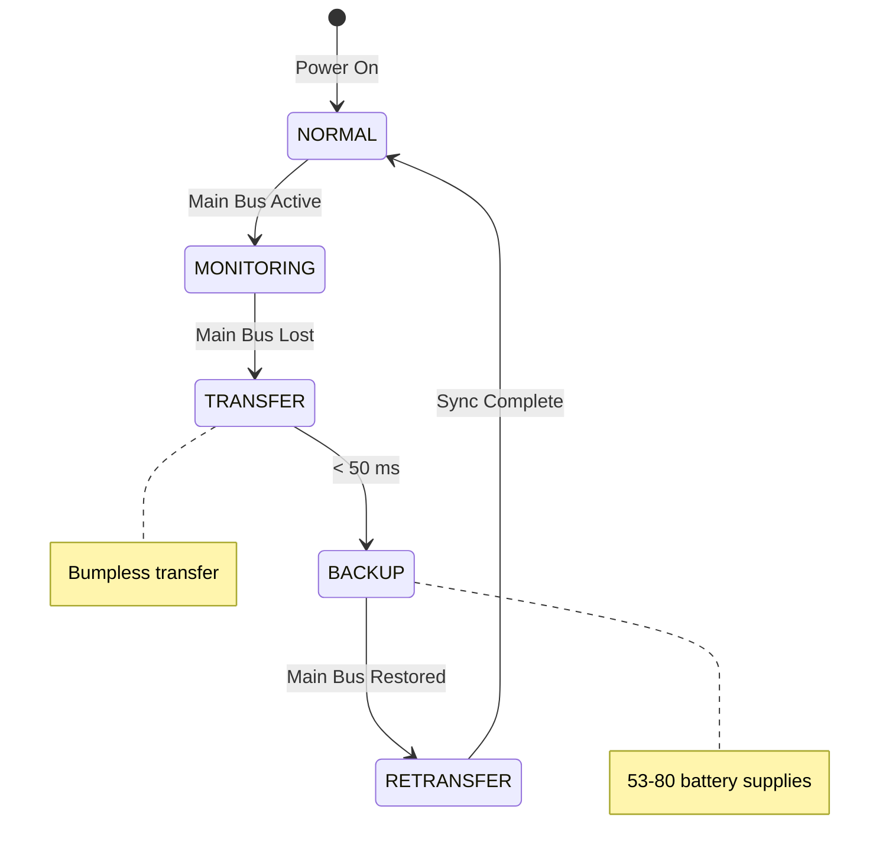

# 53-80-10-05 — ICD-24-001 HVDC Interface

| Field | Value |
|-------|-------|
| **Document ID** | 53-80-10-05 |
| **Version** | 1.0 |
| **Date** | 2025-11-27 |
| **Status** | DRAFT |
| **Classification** | ENERGY / INTERFACE |

---

## 1. Purpose

This Interface Control Document (ICD) defines the electrical interface between the ANCHORS Energy System (ATA 53-80) and the Aircraft Electrical Power System (ATA 24). It establishes the physical, electrical, and logical interfaces for HVDC power exchange.

## 2. Interface Overview

### 2.1 Interface Scope

| Interface | From | To | Type |
|-----------|------|-----|------|
| ICD-24-001-E1 | ATA 24 HVDC Bus | 53-80 SPDA Input | Power |
| ICD-24-001-E2 | 53-80 Battery | ATA 24 Emergency Bus | Power (backup) |
| ICD-24-001-S1 | ATA 24 ELMS | 53-80 EMS | AFDX signals |
| ICD-24-001-S2 | 53-80 EMS | ATA 24 ELMS | AFDX signals |
| ICD-24-001-D1 | 53-80 Status | ATA 24 ECAM | Discrete signals |

### 2.2 Interface Block Diagram

## 3. Electrical Interface (ICD-24-001-E1)

### 3.1 Power Interface Specifications

| Parameter | Value | Tolerance | Notes |
|-----------|-------|-----------|-------|
| Nominal voltage | 750 VDC | ±5% | Normal operation |
| Voltage range | 650-850 VDC | — | Full operating range |
| Transient voltage | 600-900 VDC | < 100 ms | During transients |
| Maximum current | 267 A | — | 200 kW at 750 VDC |
| Continuous power | 200 kW | — | ANCHORS allocation |
| Peak power (1 min) | 250 kW | — | Transient demand |
| Power quality | Class A | — | Per MIL-STD-704F |

### 3.2 Physical Interface

| Item | Specification |
|------|---------------|
| Connector type | MIL-DTL-38999 Series III |
| Connector size | Size 21 |
| Contact arrangement | 2 power + 4 signal |
| Power contacts | Size 4 (200A rated) |
| Signal contacts | Size 20 |
| Mating cycles | 500 minimum |
| Sealing | Environmental, IP67 |

### 3.3 Pin Assignment

| Pin | Function | Type | Rating |
|-----|----------|------|--------|
| A | HVDC+ | Power | 200A |
| B | HVDC− | Power | 200A |
| C | Shield/Ground | Signal | — |
| D | Contactor Enable | Discrete | 28V/5A |
| E | Contactor Status | Discrete | 28V/0.1A |
| F | Spare | — | — |

### 3.4 Grounding

| Requirement | Specification |
|-------------|---------------|
| Grounding scheme | TN-S |
| Ground bond resistance | < 2.5 mΩ |
| Shield termination | 360° backshell |
| EMI suppression | Ferrite clamp at interface |

## 4. Backup Power Interface (ICD-24-001-E2)

### 4.1 Emergency Bus Backup

| Parameter | Value | Notes |
|-----------|-------|-------|
| Nominal voltage | 750 VDC | Battery direct |
| Voltage range | 650-820 VDC | SOC dependent |
| Maximum current | 67 A | 50 kW at 750 VDC |
| Duration | 30 min | At 50 kW |
| Activation | Automatic | On main bus failure |

### 4.2 Transfer Logic

## 5. Signal Interface (ICD-24-001-S1/S2)

### 5.1 AFDX Interface

| Parameter | Value |
|-----------|-------|
| Standard | ARINC 664 Part 7 |
| Port type | End System |
| Virtual Links | 4 |
| Bandwidth allocation | 10 Mbps |
| BAG | 16 ms |
| Jitter | < 500 μs |

### 5.2 Signal List — ATA 24 to 53-80 (ICD-24-001-S1)

| Signal Name | VL | Parameter | Type | Units | Range | Rate |
|-------------|-----|-----------|------|-------|-------|------|
| HVDC_BUS_V | 1001 | Bus voltage | A664 | VDC | 0-1000 | 10 Hz |
| HVDC_BUS_I | 1001 | Bus current | A664 | A | 0-3000 | 10 Hz |
| HVDC_AVAIL | 1001 | Power available | A664 | kW | 0-500 | 1 Hz |
| PWR_CMD_ACK | 1002 | Power command ack | A664 | — | — | Event |
| ELMS_STATUS | 1003 | ELMS health | A664 | — | — | 1 Hz |
| LOAD_SHED_CMD | 1004 | Aircraft load shed | A664 | Level | 0-5 | Event |

### 5.3 Signal List — 53-80 to ATA 24 (ICD-24-001-S2)

| Signal Name | VL | Parameter | Type | Units | Range | Rate |
|-------------|-----|-----------|------|-------|-------|------|
| ANCHORS_PWR_REQ | 2001 | Power request | A664 | kW | 0-250 | 1 Hz |
| ANCHORS_SOC | 2001 | Battery SOC | A664 | % | 0-100 | 1 Hz |
| ANCHORS_STATUS | 2002 | System status | A664 | Bitmap | — | 1 Hz |
| EMERG_PWR_AVAIL | 2003 | Emergency backup | A664 | kW | 0-50 | 1 Hz |
| REGEN_POWER | 2004 | Regen available | A664 | kW | 0-800 | 10 Hz |
| FAULT_STATUS | 2005 | Fault indicator | A664 | Code | — | Event |

### 5.4 Status Word Definition

| Bit | Name | 0 = | 1 = |
|-----|------|-----|-----|
| 0 | SPDA_READY | Not ready | Ready |
| 1 | BAT_ONLINE | Offline | Online |
| 2 | REGEN_ACTIVE | Inactive | Active |
| 3 | LOAD_SHED | Normal | Shedding |
| 4 | FAULT | No fault | Fault present |
| 5 | EMERG_MODE | Normal | Emergency |
| 6-15 | Reserved | — | — |

## 6. Discrete Interface (ICD-24-001-D1)

### 6.1 Discrete Signals

| Signal | Direction | Type | Voltage | Function |
|--------|-----------|------|---------|----------|
| ANCHORS_ONLINE | 53-80 → 24 | Output | 28 VDC | System operational |
| ANCHORS_FAULT | 53-80 → 24 | Output | 28 VDC | Fault indication |
| EMERG_PWR_RDY | 53-80 → 24 | Output | 28 VDC | Emergency backup ready |
| GPU_DETECT | 24 → 53-80 | Input | 28 VDC | Ground power connected |
| SHED_L1_CMD | 24 → 53-80 | Input | 28 VDC | Level 1 load shed |
| SHED_L2_CMD | 24 → 53-80 | Input | 28 VDC | Level 2 load shed |

### 6.2 Discrete Logic

| Output State | Condition |
|--------------|-----------|
| ANCHORS_ONLINE = 1 | EMS healthy AND SPDA powered |
| ANCHORS_FAULT = 1 | Any fault active |
| EMERG_PWR_RDY = 1 | SOC > 30% AND BAT healthy |

## 7. Performance Requirements

### 7.1 Response Times

| Event | Requirement |
|-------|-------------|
| Power request to delivery | < 50 ms |
| Emergency transfer | < 50 ms |
| Load shed response | < 100 ms |
| Signal update latency | < 20 ms |

### 7.2 Availability

| Requirement | Value |
|-------------|-------|
| Power interface availability | 99.9% |
| Signal interface availability | 99.99% |
| MTBF (interface) | 50,000 FH |

## 8. Verification

### 8.1 Interface Verification Matrix

| Requirement | Test Method | Acceptance Criteria |
|-------------|-------------|---------------------|
| Voltage range | Measurement | 650-850 VDC |
| Current capacity | Load test | 267 A sustained |
| Transfer time | Timing test | < 50 ms |
| Signal integrity | Protocol analysis | Zero errors |
| EMI compliance | DO-160 test | Category M |

---

## Document Control

| Field | Value |
|-------|-------|
| **Document ID** | 53-80-10-05 |
| **Version** | 1.0 |
| **Date** | 2025-11-27 |
| **Status** | DRAFT |
| **Owner** | 53-80 Energy Systems |
| **Partner** | ATA 24 Electrical Systems |
| **Author** | AMPEL360 Interface Team |

### AI Disclosure

- **Generated with assistance of:** AI (GitHub Copilot), prompted by **Amedeo Pelliccia**
- **Status:** DRAFT — Subject to human review and approval
- **Repository:** `AMPEL360-BWB-H2-Hy-E`
- **Last AI update:** 2025-11-27

---

*END OF DOCUMENT*
