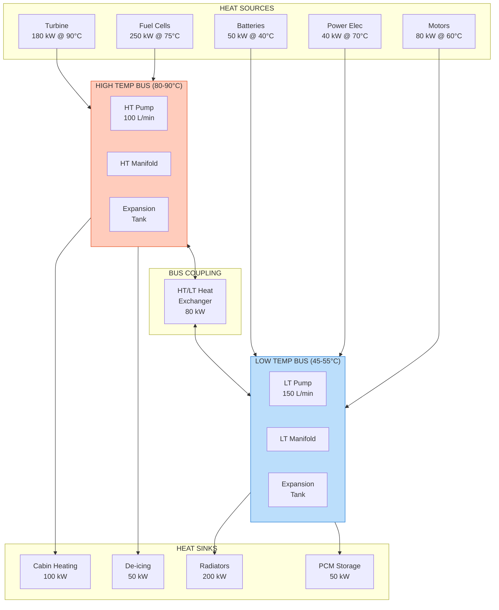
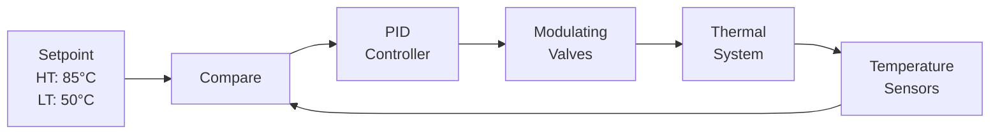

# 53-80-20-01 — Dual Thermal Bus Design

| Field | Value |
|-------|-------|
| **Document ID** | 53-80-20-01 |
| **Version** | 1.0 |
| **Date** | 2025-11-27 |
| **Status** | DRAFT |
| **Classification** | ENERGY / THERMAL |

---

## 1. Purpose

This document defines the dual thermal bus architecture for the ANCHORS energy system. The thermal distribution system manages waste heat from propulsion and energy conversion systems, enabling thermal recovery for cabin heating, de-icing, and energy storage.

## 2. System Architecture

### 2.1 Dual Bus Concept

The ANCHORS thermal system uses two independent thermal buses operating at different temperature levels:

| Bus | Temperature | Purpose | Heat Sources | Heat Sinks |
|-----|-------------|---------|--------------|------------|
| **High Temp (HT)** | 80-90°C | High-grade heat recovery | Fuel cells, turbine | Cabin, de-ice |
| **Low Temp (LT)** | 45-55°C | Component cooling | Motors, PE, batteries | Radiators, PCM |

### 2.2 System Schematic

## 3. High Temperature Bus

### 3.1 HT Bus Specifications

| Parameter | Value | Unit | Tolerance |
|-----------|-------|------|-----------|
| Operating temperature | 85 | °C | ±5°C |
| Design temperature (max) | 100 | °C | — |
| Design temperature (min) | -40 | °C | — |
| Coolant type | 50% PG/50% Water | — | — |
| System volume | 80 | L | — |
| Flow rate (nominal) | 100 | L/min | — |
| Flow rate (max) | 150 | L/min | — |
| System pressure (nominal) | 2.5 | bar | — |
| Pressure drop (total) | 150 | kPa | Max |
| Heat capacity | 300 | kW | — |

### 3.2 HT Bus Components

| Component | Quantity | Function | Rating |
|-----------|----------|----------|--------|
| HT Main Pump | 2 | Coolant circulation | 100 L/min, 300 kPa |
| HT Expansion Tank | 1 | Volume compensation | 15 L |
| HT 3-Way Valves | 4 | Flow distribution | 150 L/min |
| HT Temperature Sensors | 8 | Monitoring | ±0.5°C |
| HT Pressure Sensors | 4 | Monitoring | ±1% |
| HT Flow Sensors | 2 | Monitoring | ±2% |

### 3.3 HT Bus Connections

| Connection Point | Flow (L/min) | ΔT (°C) | Heat (kW) |
|------------------|--------------|---------|-----------|
| FC Inlet/Outlet | 60 | 15 | 200 |
| Turbine HX Inlet/Outlet | 40 | 15 | 150 |
| Cabin HX Inlet/Outlet | 30 | 20 | 100 |
| De-ice HX Inlet/Outlet | 15 | 20 | 50 |
| HT/LT Coupling HX | 25 | 15 | 80 |

## 4. Low Temperature Bus

### 4.1 LT Bus Specifications

| Parameter | Value | Unit | Tolerance |
|-----------|-------|------|-----------|
| Operating temperature | 50 | °C | ±5°C |
| Design temperature (max) | 70 | °C | — |
| Design temperature (min) | -40 | °C | — |
| Coolant type | 50% PG/50% Water | — | — |
| System volume | 100 | L | — |
| Flow rate (nominal) | 150 | L/min | — |
| Flow rate (max) | 220 | L/min | — |
| System pressure (nominal) | 2.0 | bar | — |
| Pressure drop (total) | 120 | kPa | Max |
| Heat capacity | 250 | kW | — |

### 4.2 LT Bus Components

| Component | Quantity | Function | Rating |
|-----------|----------|----------|--------|
| LT Main Pump | 2 | Coolant circulation | 150 L/min, 250 kPa |
| LT Expansion Tank | 1 | Volume compensation | 20 L |
| LT 3-Way Valves | 6 | Flow distribution | 200 L/min |
| LT Temperature Sensors | 10 | Monitoring | ±0.5°C |
| LT Pressure Sensors | 4 | Monitoring | ±1% |
| LT Flow Sensors | 2 | Monitoring | ±2% |

### 4.3 LT Bus Connections

| Connection Point | Flow (L/min) | ΔT (°C) | Heat (kW) |
|------------------|--------------|---------|-----------|
| Motor Cold Plate 1-4 | 80 | 10 | 80 |
| PE Cold Plate | 20 | 10 | 40 |
| Battery Pack 1-4 | 40 | 10 | 50 |
| Radiator 1-2 | 100 | 20 | 200 |
| PCM Storage | 20 | 15 | 50 |

## 5. Bus Coupling System

### 5.1 Coupling Heat Exchanger

The HT/LT coupling heat exchanger enables thermal energy transfer between buses:

| Parameter | Value | Unit |
|-----------|-------|------|
| Type | Plate heat exchanger | — |
| Capacity | 80 | kW |
| HT side flow | 25 | L/min |
| LT side flow | 40 | L/min |
| Approach temperature | 5 | °C |
| Pressure drop (each side) | 25 | kPa |

### 5.2 Coupling Operating Modes

| Mode | HT → LT | LT → HT | Application |
|------|---------|---------|-------------|
| Normal | 50 kW | — | Cruise, HT excess |
| Reverse | — | 20 kW | Cold start, HT demand |
| Bypass | — | — | Independent operation |
| Maximum | 80 kW | — | Peak HT shedding |

## 6. Coolant Specifications

### 6.1 Coolant Properties

| Property | Value | Unit | Condition |
|----------|-------|------|-----------|
| Composition | 50% PG / 50% Water | — | — |
| Freeze point | -35 | °C | — |
| Boiling point | 107 | °C | At 1 atm |
| Specific heat | 3.5 | kJ/kg·K | At 50°C |
| Density | 1045 | kg/m³ | At 50°C |
| Viscosity | 2.5 | mPa·s | At 50°C |
| Thermal conductivity | 0.42 | W/m·K | At 50°C |

### 6.2 Coolant Compatibility

| Material | Compatible | Notes |
|----------|------------|-------|
| Aluminum alloys | Yes | With inhibitors |
| Stainless steel | Yes | Preferred |
| EPDM rubber | Yes | Seals, hoses |
| Silicone rubber | Limited | Check specific grade |
| Copper | Yes | With inhibitors |
| Brass | Limited | Dezincification risk |

## 7. Thermal Control Strategy

### 7.1 Temperature Control

### 7.2 Control Parameters

| Loop | Kp | Ki | Kd | Output |
|------|-----|-----|-----|--------|
| HT Temperature | 5.0 | 0.2 | 1.0 | Radiator bypass |
| LT Temperature | 4.0 | 0.3 | 0.5 | Radiator bypass |
| HT Flow | 2.0 | 0.5 | 0.0 | Pump speed |
| LT Flow | 2.0 | 0.5 | 0.0 | Pump speed |

## 8. Safety Systems

### 8.1 Protection Devices

| Device | Function | Setpoint | Action |
|--------|----------|----------|--------|
| HT Over-temp | Protect components | 100°C | Alarm + reduce sources |
| LT Over-temp | Protect batteries | 65°C | Alarm + max cooling |
| HT Low flow | Detect pump fail | 50 L/min | Start backup pump |
| LT Low flow | Detect pump fail | 75 L/min | Start backup pump |
| Pressure relief | Prevent over-pressure | 4.0 bar | Vent to reservoir |
| Level sensor | Detect leak | 80% | Alarm + isolate |

---

## Document Control

| Field | Value |
|-------|-------|
| **Document ID** | 53-80-20-01 |
| **Version** | 1.0 |
| **Date** | 2025-11-27 |
| **Status** | DRAFT |
| **Author** | AMPEL360 Thermal Systems Team |

### AI Disclosure

- **Generated with assistance of:** AI (GitHub Copilot), prompted by **Amedeo Pelliccia**
- **Status:** DRAFT — Subject to human review and approval
- **Repository:** `AMPEL360-BWB-H2-Hy-E`
- **Last AI update:** 2025-11-27

---

*END OF DOCUMENT*
