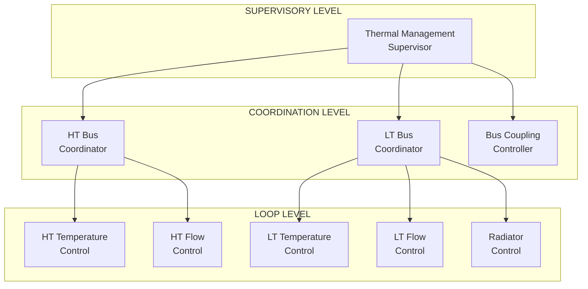
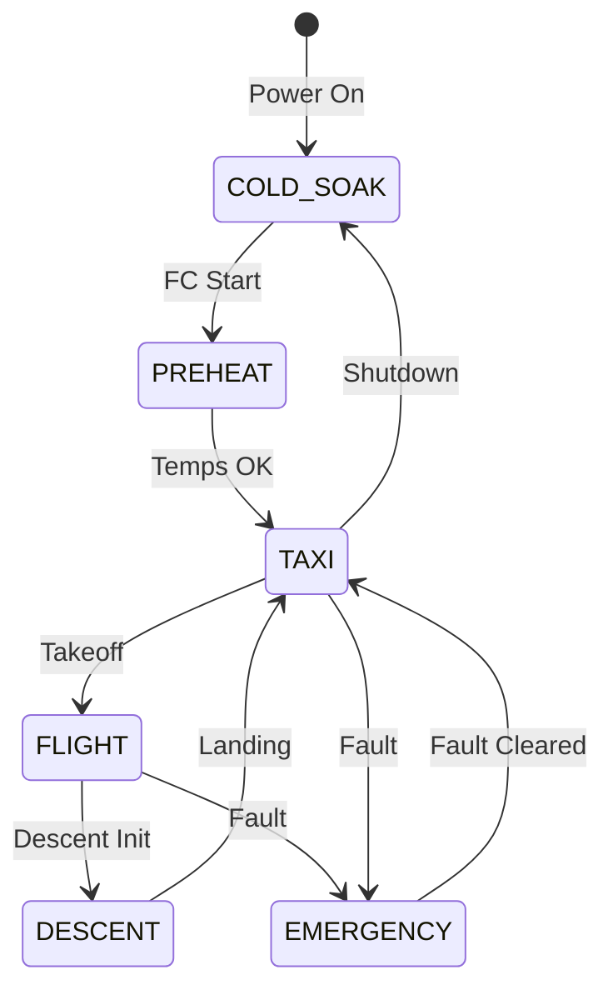

# 53-80-20-04 — Thermal Control Strategy

| Field | Value |
|-------|-------|
| **Document ID** | 53-80-20-04 |
| **Version** | 1.0 |
| **Date** | 2025-11-27 |
| **Status** | DRAFT |
| **Classification** | ENERGY / THERMAL |

---

## 1. Purpose

This document defines the thermal control strategy for the ANCHORS dual thermal bus system, including control algorithms, setpoints, and operating modes.

## 2. Control Architecture

### 2.1 Hierarchical Control Structure



### 2.2 Control Rates

| Level | Function | Rate | Priority |
|-------|----------|------|----------|
| Supervisory | Mode management | 1 Hz | High |
| Coordination | Setpoint optimization | 10 Hz | Medium |
| Loop | Temperature/flow | 50 Hz | Low |

## 3. Temperature Control

### 3.1 HT Bus Temperature Control

| Parameter | Value |
|-----------|-------|
| Setpoint | 85°C |
| Operating range | 80-90°C |
| Proportional gain | 5.0 |
| Integral gain | 0.2 |
| Derivative gain | 1.0 |
| Control output | Radiator bypass + coupling valve |

### 3.2 LT Bus Temperature Control

| Parameter | Value |
|-----------|-------|
| Setpoint | 50°C |
| Operating range | 45-55°C |
| Proportional gain | 4.0 |
| Integral gain | 0.3 |
| Derivative gain | 0.5 |
| Control output | Radiator speed + bypass |

### 3.3 Control Block Diagram

```
┌─────────────────────────────────────────────────────────────────┐
│              TEMPERATURE CONTROL LOOP                           │
├─────────────────────────────────────────────────────────────────┤
│                                                                 │
│   Setpoint ────┐                                                │
│                │   ┌──────┐   ┌──────┐   ┌──────┐              │
│                ├───│  Σ   │───│ PID  │───│ Limit │──── Output  │
│                │   └──────┘   └──────┘   └──────┘              │
│   Measured ────┘       │          │                            │
│        │               │          │                            │
│        │           Error      Control                          │
│        │                                                       │
│        └───────────────────────────────────────────────────    │
│                        Feedback                                │
│                                                                 │
└─────────────────────────────────────────────────────────────────┘
```

## 4. Flow Control

### 4.1 Pump Speed Control

| Mode | HT Pump Speed | LT Pump Speed | Condition |
|------|---------------|---------------|-----------|
| Minimum | 40% | 40% | Low load, ground |
| Normal | 70% | 70% | Cruise |
| High | 90% | 90% | High demand |
| Maximum | 100% | 100% | Emergency cooling |

### 4.2 Flow Demand Calculation

```
Q_demand = Q_source / (ρ × Cp × ΔT)

Where:
  Q_demand = Required flow rate (L/min)
  Q_source = Heat load (kW)
  ρ = Coolant density (kg/L)
  Cp = Specific heat (kJ/kg·K)
  ΔT = Temperature differential (°C)

Example (HT bus):
  Q_source = 200 kW
  ρ = 1.02 kg/L
  Cp = 3.5 kJ/kg·K
  ΔT = 10°C

  Q_demand = 200 / (1.02 × 3.5 × 10) = 56 L/min
```

## 5. Operating Modes

### 5.1 Mode Definitions

| Mode | HT Setpoint | LT Setpoint | Coupling | Radiator |
|------|-------------|-------------|----------|----------|
| COLD_SOAK | 85°C | 50°C | Max HT→LT | Off |
| PREHEAT | 85°C | 50°C | Max HT→LT | Off |
| TAXI | 85°C | 50°C | Moderate | Partial |
| FLIGHT | 85°C | 50°C | Balanced | Auto |
| DESCENT | 80°C | 48°C | Max LT→HT | Max |
| EMERGENCY | Variable | Variable | Open | Max |

### 5.2 Mode Transition



## 6. Heat Recovery Optimization

### 6.1 Recovery Priority

| Priority | Heat Sink | Condition | Capacity |
|----------|-----------|-----------|----------|
| 1 | Cabin heating | Cabin temp < setpoint | 100 kW |
| 2 | De-icing | Ice detected | 50 kW |
| 3 | Battery preconditioning | Bat temp < 15°C | 30 kW |
| 4 | PCM storage | PCM not charged | 50 kW |
| 5 | Radiator rejection | Excess heat | 200 kW |

### 6.2 Recovery Algorithm

```
Algorithm: Heat Recovery Optimization

INPUTS:
  Q_available = Total available waste heat
  T_cabin, T_cabin_set = Cabin temperatures
  Ice_detect = Ice detection flag
  T_bat = Battery temperature
  PCM_charged = PCM charge state

OUTPUTS:
  Q_cabin, Q_deice, Q_bat, Q_PCM, Q_rad = Heat distribution

LOGIC:
  Q_remaining = Q_available
  
  // Priority 1: Cabin
  IF T_cabin < T_cabin_set:
    Q_cabin = min(100 kW, Q_remaining)
    Q_remaining -= Q_cabin
  
  // Priority 2: De-icing
  IF Ice_detect AND Q_remaining > 0:
    Q_deice = min(50 kW, Q_remaining)
    Q_remaining -= Q_deice
  
  // Priority 3: Battery preconditioning
  IF T_bat < 15°C AND Q_remaining > 0:
    Q_bat = min(30 kW, Q_remaining)
    Q_remaining -= Q_bat
  
  // Priority 4: PCM charging
  IF NOT PCM_charged AND Q_remaining > 0:
    Q_PCM = min(50 kW, Q_remaining)
    Q_remaining -= Q_PCM
  
  // Priority 5: Radiator
  Q_rad = Q_remaining  // All excess to radiator
```

## 7. Fault Response

### 7.1 Fault Detection

| Fault | Detection | Threshold | Response |
|-------|-----------|-----------|----------|
| HT over-temp | T sensor | > 95°C | Increase radiator |
| LT over-temp | T sensor | > 60°C | Max radiator |
| Pump fail | Flow sensor | < 30% | Backup pump |
| Leak | Level sensor | < 85% | Isolate + alarm |
| Sensor fail | Range check | Out of range | Use backup |

### 7.2 Graceful Degradation

| Level | Condition | Action |
|-------|-----------|--------|
| Normal | All healthy | Full operation |
| Degraded | One pump failed | Backup pump, reduced flow |
| Limited | Radiator failed | Reduce heat sources |
| Emergency | Multiple failures | Essential cooling only |

---

## Document Control

| Field | Value |
|-------|-------|
| **Document ID** | 53-80-20-04 |
| **Version** | 1.0 |
| **Date** | 2025-11-27 |
| **Status** | DRAFT |
| **Author** | AMPEL360 Thermal Systems Team |

### AI Disclosure

- **Generated with assistance of:** AI (GitHub Copilot), prompted by **Amedeo Pelliccia**
- **Status:** DRAFT — Subject to human review and approval
- **Repository:** `AMPEL360-BWB-H2-Hy-E`
- **Last AI update:** 2025-11-27

---

*END OF DOCUMENT*
