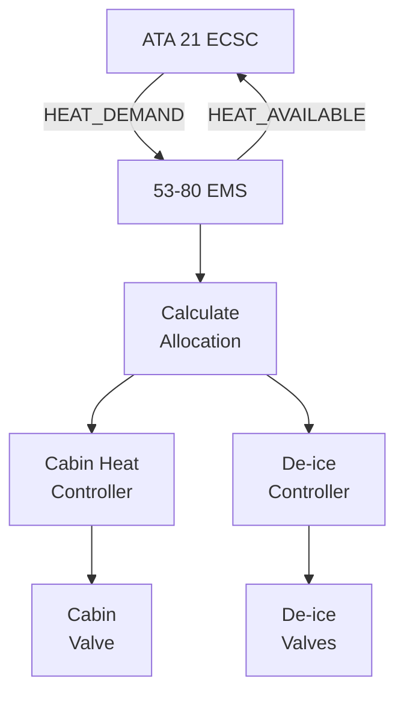

# 53-80-20-05 — ICD-21-001 ECS Thermal Interface

| Field | Value |
|-------|-------|
| **Document ID** | 53-80-20-05 |
| **Version** | 1.0 |
| **Date** | 2025-11-27 |
| **Status** | DRAFT |
| **Classification** | ENERGY / INTERFACE |

---

## 1. Purpose

This Interface Control Document defines the thermal interface between the ANCHORS Energy System (ATA 53-80) and the Environmental Control System (ATA 21) for cabin heating and thermal management.

## 2. Interface Overview

### 2.1 Interface Scope

| Interface | From | To | Type |
|-----------|------|-----|------|
| ICD-21-001-T1 | 53-80 HT Bus | ATA 21 Cabin Heater | Thermal (liquid) |
| ICD-21-001-T2 | 53-80 HT Bus | ATA 21 De-ice System | Thermal (liquid) |
| ICD-21-001-S1 | 53-80 EMS | ATA 21 ECSC | AFDX signals |
| ICD-21-001-S2 | ATA 21 ECSC | 53-80 EMS | AFDX signals |

## 3. Thermal Interface (ICD-21-001-T1)

### 3.1 Cabin Heating Interface

| Parameter | Value | Unit | Tolerance |
|-----------|-------|------|-----------|
| Coolant supply temperature | 85 | °C | ±5°C |
| Coolant return temperature | 65 | °C | Min |
| Flow rate (nominal) | 30 | L/min | — |
| Flow rate (max) | 45 | L/min | — |
| Heat transfer capacity | 100 | kW | — |
| Supply pressure | 2.5 | bar | ±0.5 bar |
| Pressure drop (ATA 21 side) | 50 | kPa | Max |

### 3.2 Physical Interface

| Item | Specification |
|------|---------------|
| Supply connection | DN25 Quick Disconnect |
| Return connection | DN25 Quick Disconnect |
| Connector type | MIL-DTL-27066 |
| Material | SS316L |
| Sealing | Double O-ring, EPDM |
| Location | Fwd pressure bulkhead |

### 3.3 Valve Specification

| Parameter | Value |
|-----------|-------|
| Type | Modulating ball valve |
| Size | DN25 |
| Cv | 25 |
| Actuator | Electric, 28 VDC |
| Control signal | 0-10 VDC analog |
| Stroke time | < 5 s |
| Fail position | Closed |

## 4. De-icing Interface (ICD-21-001-T2)

### 4.1 De-ice System Interface

| Parameter | Value | Unit |
|-----------|-------|------|
| Coolant supply temperature | 85 | °C |
| Coolant return temperature | 70 | °C |
| Flow rate (nominal) | 15 | L/min |
| Flow rate (max) | 25 | L/min |
| Heat transfer capacity | 50 | kW |
| Zones | 4 (wing LE × 2, HT × 2) |

### 4.2 Zone Distribution

| Zone | Location | Capacity | Control |
|------|----------|----------|---------|
| Zone 1 | LH Wing LE | 15 kW | On/Off |
| Zone 2 | RH Wing LE | 15 kW | On/Off |
| Zone 3 | LH HT LE | 10 kW | On/Off |
| Zone 4 | RH HT LE | 10 kW | On/Off |

## 5. Signal Interface

### 5.1 Signals to ATA 21 (ICD-21-001-S1)

| Signal | VL | Type | Range | Rate |
|--------|-----|------|-------|------|
| HT_SUPPLY_TEMP | 3001 | A664 | 0-120°C | 1 Hz |
| HT_SUPPLY_FLOW | 3001 | A664 | 0-100 L/min | 1 Hz |
| HEAT_AVAILABLE | 3002 | A664 | 0-150 kW | 1 Hz |
| VALVE_POSITION | 3002 | A664 | 0-100% | 1 Hz |
| THERMAL_STATUS | 3003 | A664 | Bitmap | 1 Hz |

### 5.2 Signals from ATA 21 (ICD-21-001-S2)

| Signal | VL | Type | Range | Rate |
|--------|-----|------|-------|------|
| HEAT_DEMAND | 4001 | A664 | 0-150 kW | 1 Hz |
| CABIN_TEMP | 4001 | A664 | -20 to 50°C | 1 Hz |
| DEICE_REQUEST | 4002 | A664 | Zone bitmap | Event |
| ECSC_STATUS | 4003 | A664 | Bitmap | 1 Hz |
| VALVE_CMD | 4004 | A664 | 0-100% | 10 Hz |

## 6. Operating Modes

### 6.1 Heat Provision Modes

| Mode | Heat Available | Priority | Condition |
|------|----------------|----------|-----------|
| NORMAL | 100% | Cabin first | Standard operation |
| REDUCED | 50% | De-ice first | High heat demand |
| MINIMUM | 20% | Essential only | Thermal fault |
| OFF | 0% | None | Isolation |

### 6.2 Coordination Logic

## 7. Performance Requirements

### 7.1 Response Times

| Event | Requirement |
|-------|-------------|
| Heat request to delivery | < 30 s |
| Valve response | < 5 s |
| Emergency shutoff | < 1 s |
| Signal update | < 100 ms |

### 7.2 Availability

| Requirement | Value |
|-------------|-------|
| Thermal interface availability | 99.5% |
| Signal interface availability | 99.9% |
| MTBF (thermal interface) | 25,000 FH |

---

## Document Control

| Field | Value |
|-------|-------|
| **Document ID** | 53-80-20-05 |
| **Version** | 1.0 |
| **Date** | 2025-11-27 |
| **Status** | DRAFT |
| **Owner** | 53-80 Energy Systems |
| **Partner** | ATA 21 ECS |

### AI Disclosure

- **Generated with assistance of:** AI (GitHub Copilot), prompted by **Amedeo Pelliccia**
- **Status:** DRAFT — Subject to human review and approval
- **Repository:** `AMPEL360-BWB-H2-Hy-E`
- **Last AI update:** 2025-11-27

---

*END OF DOCUMENT*
