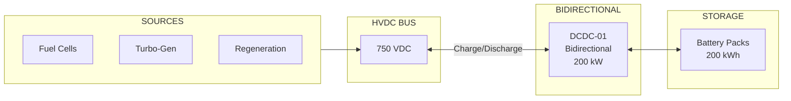
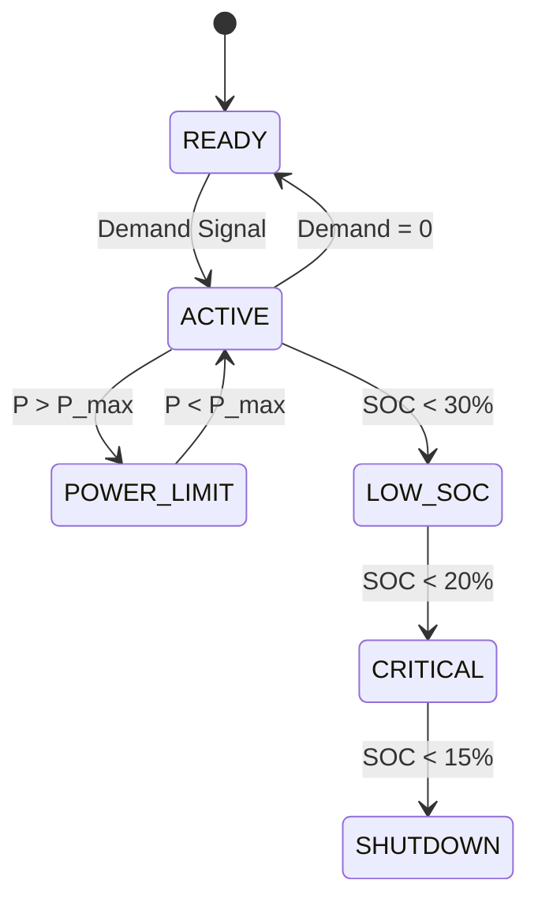

# 53-80-30-02 — Bidirectional Power Flow Design

| Field | Value |
|-------|-------|
| **Document ID** | 53-80-30-02 |
| **Version** | 1.0 |
| **Date** | 2025-11-27 |
| **Status** | DRAFT |
| **Classification** | ENERGY / CONVERSION |

---

## 1. Purpose

This document defines the bidirectional power flow architecture for the ANCHORS energy system, enabling energy storage during regeneration and power supplementation during peak demand.

## 2. Bidirectional System Overview

### 2.1 Power Flow Paths



### 2.2 Operating Modes

| Mode | Direction | Power | Trigger |
|------|-----------|-------|---------|
| CHARGE_NORMAL | Bus → Battery | 0-100 kW | Excess generation |
| CHARGE_REGEN | Regen → Battery | 0-200 kW | Descent phase |
| DISCHARGE | Battery → Bus | 0-200 kW | Demand > generation |
| FLOAT | Minimal | 0.5 kW | SOC = 100%, balanced |
| STANDBY | None | 0.2 kW | System idle |

## 3. Charging Operation

### 3.1 Charge Control

| SOC Range | Charge Mode | Max Current | Max Power |
|-----------|-------------|-------------|-----------|
| 0-20% | CC (1C) | 200 A | 150 kW |
| 20-80% | CC (0.8C) | 160 A | 120 kW |
| 80-95% | CV Transition | Variable | 80 kW |
| 95-100% | Float | 10 A | 8 kW |

### 3.2 Charge Profile

```
┌─────────────────────────────────────────────────────────────────┐
│                    CHARGE PROFILE                               │
├─────────────────────────────────────────────────────────────────┤
│                                                                 │
│   Current (A)                   Voltage (V)                     │
│   200│████████████              850│                  ████████  │
│      │            ████████         │              ████          │
│   150│                ████████  800│          ████              │
│      │                        █    │      ████                  │
│   100│                         █750│  ████                      │
│      │                          ██ │██                          │
│    50│                           █700│                          │
│      │                            █   │                         │
│     0├──────────────────────────────────────────────────        │
│        0%     20%    50%    80%   95%  100% SOC                │
│                                                                 │
│   Legend: ████ Current   ████ Voltage                          │
│                                                                 │
└─────────────────────────────────────────────────────────────────┘
```

## 4. Discharge Operation

### 4.1 Discharge Limits

| SOC Range | Max Discharge | Max Power |
|-----------|---------------|-----------|
| 100-80% | 1.5C | 200 kW |
| 80-50% | 1.2C | 160 kW |
| 50-30% | 1.0C | 130 kW |
| 30-20% | 0.5C | 65 kW |
| < 20% | Emergency only | 30 kW |

### 4.2 Discharge Control



## 5. Regeneration Capture

### 5.1 Regeneration Sources

| Source | Max Power | Duration | Capture Target |
|--------|-----------|----------|----------------|
| Fan motors | 800 kW | 25 min descent | 300 kWh |
| Wheel brakes | 200 kW | 30 s landing | 1.7 kWh |
| Total per flight | — | — | ~302 kWh |

### 5.2 Regen Acceptance Logic

```
Algorithm: Regen Acceptance

INPUTS:
  P_regen = Available regen power (kW)
  SOC = Battery state of charge (%)
  T_bat = Battery temperature (°C)
  I_max = Maximum charge current (A)

OUTPUTS:
  P_accept = Accepted regen power (kW)
  P_shed = Dissipated power (kW)

LOGIC:
  // Calculate battery acceptance
  IF SOC < 95%:
    P_bat_accept = I_max × V_bat × efficiency
  ELSE IF SOC < 98%:
    P_bat_accept = (100 - SOC) / 5 × P_bat_max
  ELSE:
    P_bat_accept = 0
  
  // Temperature derating
  IF T_bat > 40°C:
    P_bat_accept = P_bat_accept × (1 - (T_bat - 40) / 20)
  
  // Accept what battery can take
  P_accept = min(P_regen, P_bat_accept)
  P_shed = P_regen - P_accept
```

## 6. Power Balance Control

### 6.1 Balance Equation

```
P_bus = P_FC + P_TG + P_regen − P_load = P_battery + P_losses

Where:
  P_battery > 0 → Charging
  P_battery < 0 → Discharging
  P_battery ≈ 0 → Balanced
```

### 6.2 Control Strategy

| Condition | Action |
|-----------|--------|
| P_bus > +10 kW | Increase battery charge |
| P_bus < -10 kW | Increase battery discharge |
| -10 kW < P_bus < +10 kW | Maintain current state |
| P_bus > P_bat_max | Reduce FC/TG output |
| P_bus < -P_bat_max | Shed loads |

## 7. Transition Management

### 7.1 Mode Transitions

| From | To | Transition Time | Conditions |
|------|-----|-----------------|------------|
| CHARGE | DISCHARGE | < 10 ms | Demand reversal |
| DISCHARGE | CHARGE | < 10 ms | Generation excess |
| STANDBY | ACTIVE | < 50 ms | Precharge complete |
| ACTIVE | STANDBY | < 100 ms | Zero crossing |

### 7.2 Seamless Transfer

- Zero current crossing detection
- Soft switching during transition
- Current ramp rate limited to 1000 A/s
- Voltage maintained within ±2%

---

## Document Control

| Field | Value |
|-------|-------|
| **Document ID** | 53-80-30-02 |
| **Version** | 1.0 |
| **Date** | 2025-11-27 |
| **Status** | DRAFT |
| **Author** | AMPEL360 Power Electronics Team |

### AI Disclosure

- **Generated with assistance of:** AI (GitHub Copilot), prompted by **Amedeo Pelliccia**
- **Status:** DRAFT — Subject to human review and approval
- **Repository:** `AMPEL360-BWB-H2-Hy-E`
- **Last AI update:** 2025-11-27

---

*END OF DOCUMENT*
