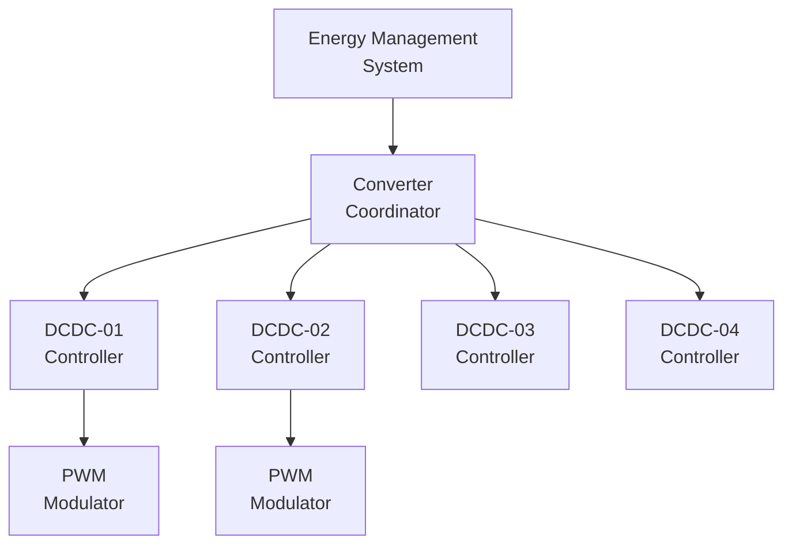
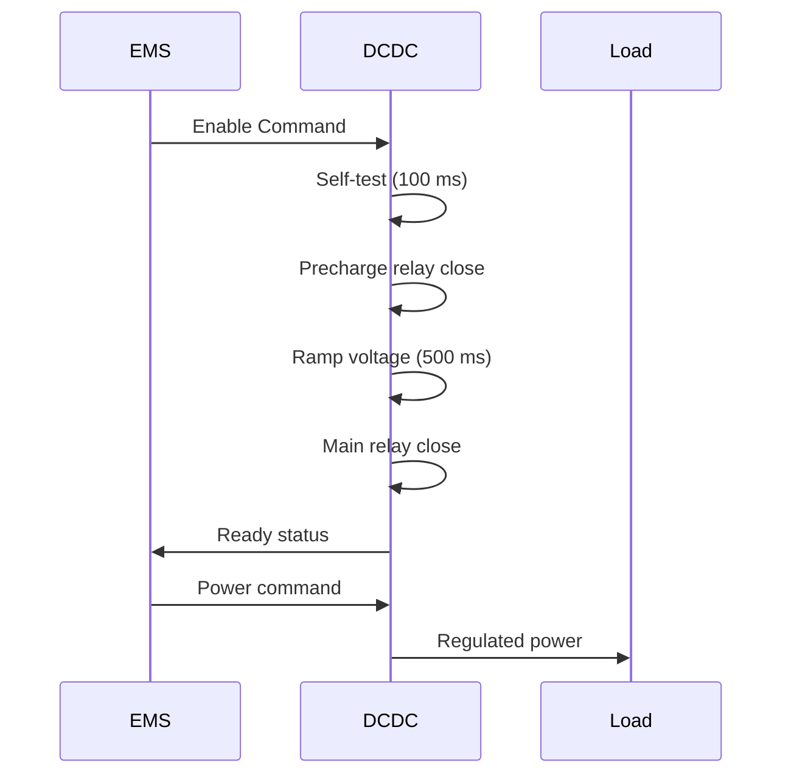

# 53-80-30-03 — Converter Control Strategy

| Field | Value |
|-------|-------|
| **Document ID** | 53-80-30-03 |
| **Version** | 1.0 |
| **Date** | 2025-11-27 |
| **Status** | DRAFT |
| **Classification** | ENERGY / CONVERSION |

---

## 1. Purpose

This document defines the control strategies for all DC-DC converters in the ANCHORS energy system, including regulation methods, protection schemes, and coordination algorithms.

## 2. Control Architecture

### 2.1 Hierarchical Control



### 2.2 Control Rates

| Level | Function | Rate | Latency |
|-------|----------|------|---------|
| EMS | Power commands | 10 Hz | 100 ms |
| Coordinator | Load sharing | 1 kHz | 1 ms |
| Controller | Voltage/current | 50 kHz | 20 μs |
| PWM | Switching | 100-150 kHz | — |

## 3. Voltage Regulation

### 3.1 Output Voltage Control

| Converter | Method | Setpoint | Droop |
|-----------|--------|----------|-------|
| DCDC-01 | Droop control | V_bus | 2% |
| DCDC-02 | Constant voltage | 28.0 VDC | 0% |
| DCDC-03 | Constant voltage | 270.0 VDC | 0% |
| DCDC-04 | Constant voltage | 48.0 VDC | 0% |

### 3.2 Control Loop

```
┌─────────────────────────────────────────────────────────────────┐
│                  VOLTAGE CONTROL LOOP                           │
├─────────────────────────────────────────────────────────────────┤
│                                                                 │
│   V_ref ──┬──►[Σ]──►[PI Controller]──►[Current Limiter]──►Output│
│           │    ▲                                                │
│           │    │                                                │
│   V_meas ─┴────┘                                                │
│                                                                 │
│   PI Controller: Kp = 0.1, Ki = 100                            │
│   Bandwidth: 1 kHz                                              │
│   Phase margin: > 45°                                           │
│                                                                 │
└─────────────────────────────────────────────────────────────────┘
```

## 4. Current Control

### 4.1 Current Limiting

| Converter | I_max | Method | Response |
|-----------|-------|--------|----------|
| DCDC-01 | 300 A | Cycle-by-cycle | < 10 μs |
| DCDC-02 | 400 A | Cycle-by-cycle | < 10 μs |
| DCDC-03 | 130 A | Cycle-by-cycle | < 10 μs |
| DCDC-04 | 600 A | Cycle-by-cycle | < 10 μs |

### 4.2 Current Sharing (Parallel Operation)

For DCDC-01 redundant configuration:
- Master-slave current sharing
- Droop-based load sharing
- Active current balancing to within ±5%

## 5. Soft Start / Precharge

### 5.1 Startup Sequence



### 5.2 Precharge Parameters

| Parameter | DCDC-01 | DCDC-02/03/04 |
|-----------|---------|---------------|
| Precharge resistor | 50 Ω | 100 Ω |
| Precharge current | 15 A | 8 A |
| Precharge time | 2 s | 1 s |
| Voltage threshold | 90% V_bus | 90% V_out |

## 6. Protection Logic

### 6.1 Fault Response

| Fault | Detection | Response | Recovery |
|-------|-----------|----------|----------|
| Input OV | > 900 VDC | Shutdown | Auto at < 880 VDC |
| Input UV | < 600 VDC | Shutdown | Auto at > 630 VDC |
| Output OV | > 105% setpoint | Fold-back | Auto |
| Output OC | > I_max | Current limit | Auto |
| Over-temp | > 85°C | Derating | Auto at < 75°C |
| Short circuit | di/dt | Shutdown | Manual reset |

### 6.2 Derating Curve

```
┌─────────────────────────────────────────────────────────────────┐
│                  THERMAL DERATING                               │
├─────────────────────────────────────────────────────────────────┤
│                                                                 │
│   Power (%)                                                     │
│   100│████████████████████████████                              │
│      │                            ████                          │
│    80│                                ████                      │
│      │                                    ████                  │
│    60│                                        ████              │
│      │                                            ████          │
│    40│                                                ████      │
│      │                                                    ████  │
│    20│                                                        ██│
│      │                                                          │
│     0├────┬────┬────┬────┬────┬────┬────┬────┬────┬────        │
│         50   55   60   65   70   75   80   85   90   95 T(°C)  │
│                                                                 │
└─────────────────────────────────────────────────────────────────┘
```

## 7. Coordination with EMS

### 7.1 Command Interface

| Command | Source | Content | Rate |
|---------|--------|---------|------|
| Power setpoint | EMS | 0-100% | 10 Hz |
| Mode command | EMS | Enum | Event |
| Enable/disable | EMS | Boolean | Event |
| Voltage trim | EMS | ±5% | 1 Hz |

### 7.2 Status Feedback

| Status | To | Content | Rate |
|--------|-----|---------|------|
| Output power | EMS | kW | 10 Hz |
| Efficiency | EMS | % | 1 Hz |
| Temperature | EMS | °C | 1 Hz |
| Fault status | EMS | Bitmap | Event |

---

## Document Control

| Field | Value |
|-------|-------|
| **Document ID** | 53-80-30-03 |
| **Version** | 1.0 |
| **Date** | 2025-11-27 |
| **Status** | DRAFT |
| **Author** | AMPEL360 Power Electronics Team |

### AI Disclosure

- **Generated with assistance of:** AI (GitHub Copilot), prompted by **Amedeo Pelliccia**
- **Status:** DRAFT — Subject to human review and approval
- **Repository:** `AMPEL360-BWB-H2-Hy-E`
- **Last AI update:** 2025-11-27

---

*END OF DOCUMENT*
