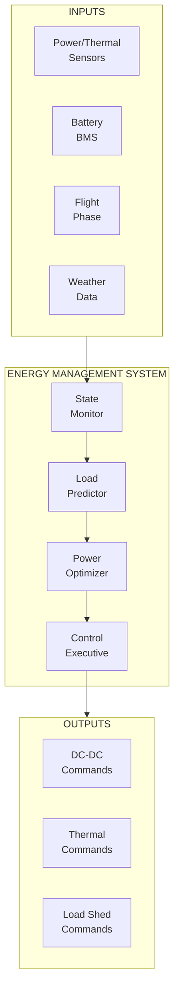

# 53-80-40-01 — EMS Architecture

| Field | Value |
|-------|-------|
| **Document ID** | 53-80-40-01 |
| **Version** | 1.0 |
| **Date** | 2025-11-27 |
| **Status** | DRAFT |
| **Classification** | ENERGY / MANAGEMENT |

---

## 1. Purpose

This document defines the Energy Management System (EMS) architecture for the ANCHORS integrated energy system, establishing the software structure, algorithms, and interfaces for optimal energy distribution.

## 2. EMS Architecture Overview



## 3. Functional Modules

### 3.1 State Monitor

| Function | Rate | Outputs |
|----------|------|---------|
| Power balance | 10 Hz | P_gen, P_load, P_storage |
| Thermal balance | 1 Hz | Q_source, Q_sink, T_bus |
| SOC estimation | 1 Hz | SOC, SOH, time to empty |
| Efficiency calculation | 0.1 Hz | η_system, losses |

### 3.2 Load Predictor

| Prediction | Horizon | Method | Accuracy |
|------------|---------|--------|----------|
| Electrical load | 30 min | Flight phase model | ±10% |
| Thermal load | 10 min | Weather + phase model | ±15% |
| Regeneration | 60 min | Trajectory analysis | ±20% |

### 3.3 Power Optimizer

| Optimization | Objective | Constraints |
|--------------|-----------|-------------|
| Source allocation | Minimize fuel | Power balance |
| Battery scheduling | Maximize SOC at landing | SOC limits |
| Thermal recovery | Maximize recovery | Temperature limits |

### 3.4 Control Executive

| Function | Rate | Latency |
|----------|------|---------|
| DC-DC commands | 10 Hz | < 50 ms |
| Thermal commands | 1 Hz | < 100 ms |
| Load shed execution | Event | < 100 ms |

## 4. Software Architecture

### 4.1 Partition Allocation

| Partition | DAL | Functions | Memory |
|-----------|-----|-----------|--------|
| A | C | Monitor, Control | 32 MB |
| B | D | Predictor, Optimizer | 64 MB |

### 4.2 Execution Timeline

```
│ 0ms        10ms       20ms       30ms       40ms       50ms      │
├───────────────────────────────────────────────────────────────────│
│ [Monitor]  [Monitor]  [Monitor]  [Monitor]  [Monitor]  [Monitor] │
│     [Control]   [Control]   [Control]   [Control]   [Control]    │
│         [Predict]                   [Predict]                    │
│                   [Optimize]                   [Optimize]        │
│                                                                  │
│ Frame period: 10 ms                                              │
│ Monitor + Control: every frame                                   │
│ Predict: every 2nd frame (50 ms)                                │
│ Optimize: every 5th frame (100 ms)                              │
```

## 5. Optimization Algorithms

### 5.1 Source Allocation

```
Minimize: J = Σ(fuel_rate × time)

Subject to:
  P_FC + P_TG + P_BAT = P_load
  P_FC ≤ P_FC_max
  P_TG ≤ P_TG_max
  SOC_min ≤ SOC ≤ SOC_max
  T_bat ≤ T_bat_max
```

### 5.2 Model Predictive Control

- Prediction horizon: 30 minutes
- Control horizon: 5 minutes
- Update rate: 1 Hz
- State variables: SOC, T_bus_HT, T_bus_LT
- Control variables: P_charge, Q_radiator, Q_recovery

## 6. Interfaces

### 6.1 Input Interfaces

| Interface | Protocol | Rate | Data |
|-----------|----------|------|------|
| Power sensors | AFDX | 10 Hz | V, I, P |
| Thermal sensors | AFDX | 1 Hz | T, flow |
| BMS | CAN-FD | 10 Hz | SOC, T, health |
| FMS | AFDX | 1 Hz | Phase, altitude, speed |

### 6.2 Output Interfaces

| Interface | Protocol | Rate | Data |
|-----------|----------|------|------|
| DC-DC converters | AFDX | 10 Hz | P_setpoint, mode |
| Thermal valves | CAN-FD | 1 Hz | Position command |
| Load contactors | Discrete | Event | On/off |
| EICAS | AFDX | 1 Hz | Status, alerts |

---

## Document Control

| Field | Value |
|-------|-------|
| **Document ID** | 53-80-40-01 |
| **Version** | 1.0 |
| **Date** | 2025-11-27 |
| **Status** | DRAFT |

### AI Disclosure

- **Generated with assistance of:** AI (GitHub Copilot), prompted by **Amedeo Pelliccia**
- **Status:** DRAFT — Subject to human review and approval
- **Repository:** `AMPEL360-BWB-H2-Hy-E`
- **Last AI update:** 2025-11-27

---

*END OF DOCUMENT*
