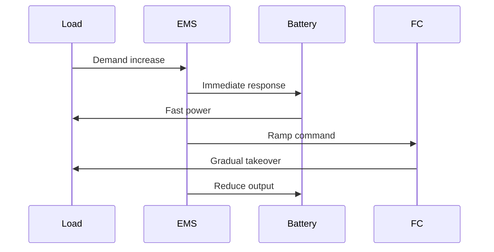

# 53-80-40-02 — Load Balancing Algorithm

| Field | Value |
|-------|-------|
| **Document ID** | 53-80-40-02 |
| **Version** | 1.0 |
| **Date** | 2025-11-27 |
| **Status** | DRAFT |
| **Classification** | ENERGY / MANAGEMENT |

---

## 1. Purpose

This document defines the load balancing algorithms used by the EMS to distribute power from multiple sources to loads while optimizing efficiency and maintaining system stability.

## 2. Load Balancing Concept

### 2.1 Power Balance Equation

```
P_generation = P_load + P_storage + P_losses

P_FC + P_TG + P_regen = P_fans + P_ANCHORS + P_systems + ΔP_battery + P_losses
```

### 2.2 Balance States

| State | Condition | Action |
|-------|-----------|--------|
| Surplus | P_gen > P_load | Charge battery |
| Deficit | P_gen < P_load | Discharge battery |
| Balanced | P_gen ≈ P_load | Float battery |

## 3. Source Allocation Algorithm

### 3.1 Priority-Based Allocation

```
Algorithm: Source Allocation

INPUTS:
  P_demand = Total power demand (kW)
  P_FC_avail = FC available power
  P_TG_avail = TG available power
  P_BAT_avail = Battery available power
  SOC = Battery state of charge

OUTPUTS:
  P_FC, P_TG, P_BAT = Source contributions

LOGIC:
  // Step 1: Use FC as base load
  P_FC = min(P_demand * 0.6, P_FC_avail)
  P_remaining = P_demand - P_FC
  
  // Step 2: Add TG for higher demand
  IF P_remaining > 0:
    P_TG = min(P_remaining, P_TG_avail)
    P_remaining = P_remaining - P_TG
  
  // Step 3: Battery fills gap
  IF P_remaining > 0:
    P_BAT = min(P_remaining, P_BAT_avail)
  
  // Step 4: Handle surplus
  IF P_FC + P_TG > P_demand AND SOC < 95%:
    P_BAT = -(P_FC + P_TG - P_demand)  // Negative = charging
```

### 3.2 Efficiency-Optimized Allocation

| FC Load | TG Load | Battery | Combined η |
|---------|---------|---------|------------|
| 50% | 0% | Supplement | 56% |
| 70% | 0% | Charge | 58% |
| 80% | 30% | Charge | 60% |
| 100% | 60% | Discharge | 58% |

## 4. Dynamic Rebalancing

### 4.1 Rebalance Triggers

| Trigger | Threshold | Response Time |
|---------|-----------|---------------|
| SOC deviation | ±5% from target | 10 s |
| Load step | > 20% change | 1 s |
| Source trip | Loss of source | 50 ms |
| Efficiency drop | > 5% below optimal | 30 s |

### 4.2 Rebalance Rate Limits

| Parameter | Limit | Rationale |
|-----------|-------|-----------|
| FC ramp | 100 kW/s | Fuel cell dynamics |
| TG ramp | 500 kW/s | Generator response |
| Battery ramp | 1000 kW/s | Fast response |
| Total system | 200 kW/s | Stability |

## 5. Load Sharing

### 5.1 Parallel Source Sharing

For redundant sources (e.g., dual FC, dual TG):

```
P_source_1 = P_total × (R_2 / (R_1 + R_2))
P_source_2 = P_total × (R_1 / (R_1 + R_2))

Where R = droop resistance (virtual)
```

### 5.2 Droop Control Settings

| Source | Droop | Effect |
|--------|-------|--------|
| FC #1 | 2% | 50% share at nominal |
| FC #2 | 2% | 50% share at nominal |
| TG #1 | 3% | 50% share at nominal |
| TG #2 | 3% | 50% share at nominal |

## 6. Transient Management

### 6.1 Load Step Response



### 6.2 Response Timing

| Event | Battery Response | FC/TG Takeover |
|-------|------------------|----------------|
| +50 kW step | 50 ms | 5 s |
| +100 kW step | 50 ms | 10 s |
| -100 kW step | Absorb in 100 ms | Ramp down 10 s |

---

## Document Control

| Field | Value |
|-------|-------|
| **Document ID** | 53-80-40-02 |
| **Version** | 1.0 |
| **Date** | 2025-11-27 |
| **Status** | DRAFT |

### AI Disclosure

- **Generated with assistance of:** AI (GitHub Copilot), prompted by **Amedeo Pelliccia**
- **Status:** DRAFT — Subject to human review and approval
- **Repository:** `AMPEL360-BWB-H2-Hy-E`
- **Last AI update:** 2025-11-27

---

*END OF DOCUMENT*
