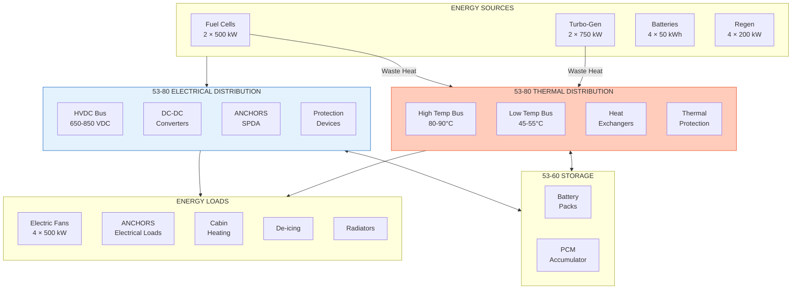
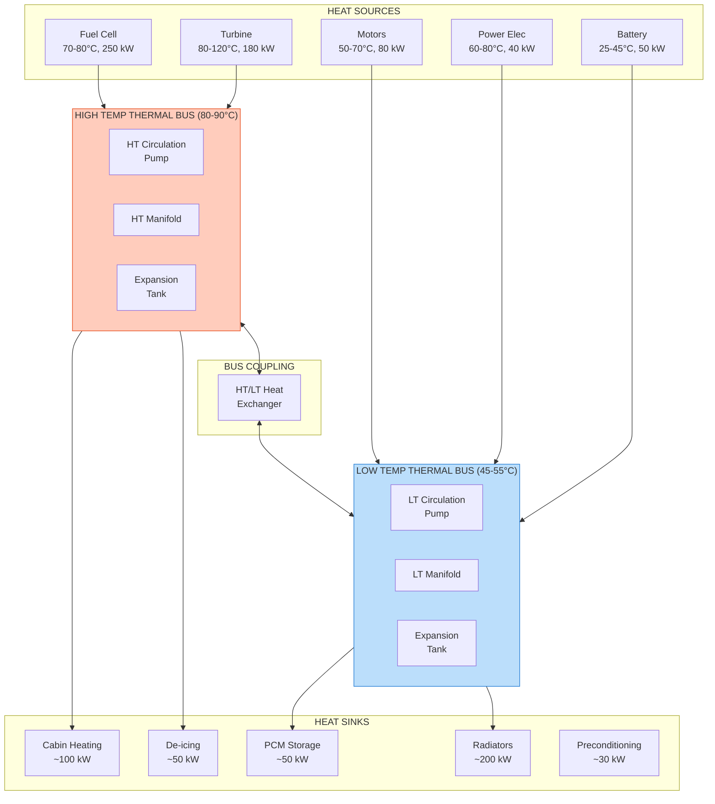
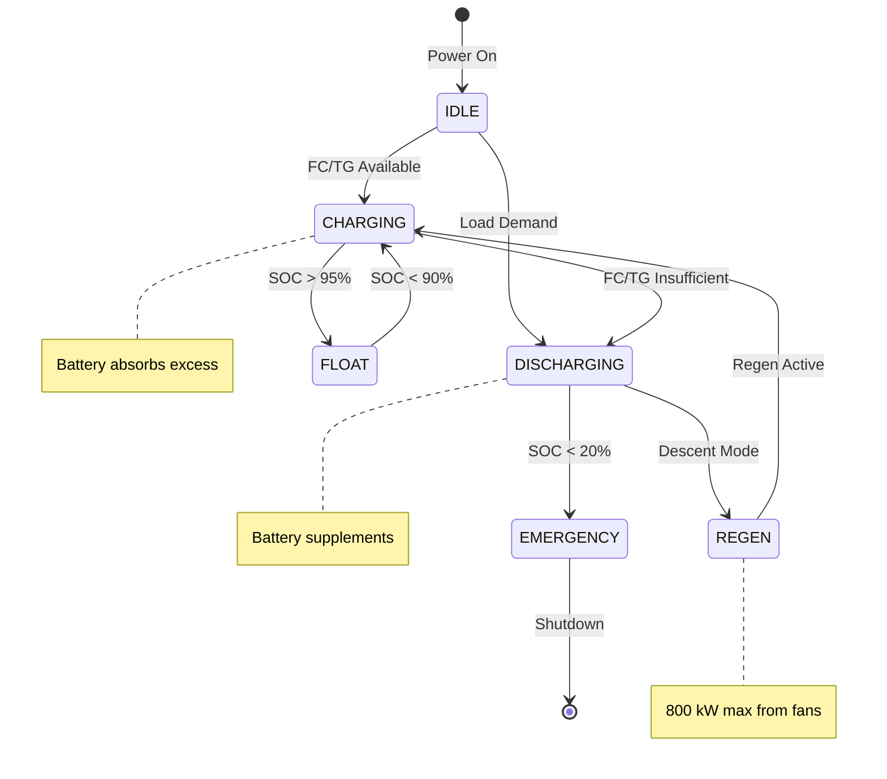
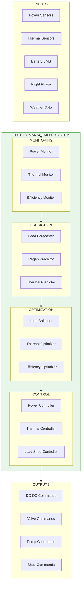

# ATA 53-80 Energy Overview

| Field | Value |
|-------|-------|
| **Document ID** | 53-80-00-01 |
| **Version** | 1.0 |
| **Date** | 2025-11-27 |
| **Status** | DRAFT |
| **Classification** | TECHNICAL |
| **ATA Chapter** | 53-80 |

---

<!--
MCP/Agent Header Prompt:
This document defines the 53-80 Energy bucket for ANCHORS (Aircraft Networks, Circular, Harvesting, Operating & Renewable Systems).
The Energy bucket covers all electrical and thermal energy distribution, conversion, and management within the ANCHORS architecture.
Key systems include: HVDC distribution, thermal bus, power conversion, energy management, and efficiency optimization.
The AMPEL360 BWB H2 uses a hybrid hydrogen-electric architecture with 4 electric fans, fuel cells, and battery QuickSwap.
Use this as the spine document for all 53-80-XX child documents.
When generating energy-related content, reference the band allocation and design principles defined here.
-->

## Navigation

### Breadcrumb
`AMPEL360-BWB-H2-Hy-E` / `OPT-IN_FRAMEWORK` / `T-TECHNOLOGY` / `A-AIRFRAME` / `ATA_53-FUSELAGE` / `53-30_ANCHORS` / `53-80_Energy`

### Parent Document
| Document | Path |
|----------|------|
| ANCHORS System Description | [`../53-30-00-00_ANCHORS_System_Description.md`](../53-30-00-00_ANCHORS_System_Description.md) |

### Sibling Buckets
| Bucket | Path | Description |
|--------|------|-------------|
| 53-00 General | [`../53-00_GENERAL/`](../53-00_GENERAL/) | Governance, lifecycle, safety |
| 53-10 Operations | [`../53-10_Operations/`](../53-10_Operations/) | Flight/ground ops, procedures |
| 53-20 Subsystems | [`../53-20_Subsystems/`](../53-20_Subsystems/) | Functional subsystem design |
| 53-30 Circularity | [`../53-30_Circularity/`](../53-30_Circularity/) | LCA, DPP, sustainability |
| 53-40 Software | [`../53-40_Software/`](../53-40_Software/) | Control logic, diagnostics |
| 53-50 Structures | [`../53-50_Structures/`](../53-50_Structures/) | Frames, mounts, housings |
| 53-60 Storages | [`../53-60_Storages/`](../53-60_Storages/) | Tanks, reservoirs, cartridges |
| 53-70 Propulsion | [`../53-70_Propulsion/`](../53-70_Propulsion/) | Propulsive interfaces |
| **53-80 Energy** | **[`./`](.)** | **Electrical/thermal distribution** |
| 53-90 Schemas | [`../53-90_Tables_Schemas_Diagrams/`](../53-90_Tables_Schemas_Diagrams/) | Data schemas, catalogs |

### Related Documents
| Document | Path | Relationship |
|----------|------|--------------|
| ICD ATA 24 (Electrical) | [`./53-80-00-05_ICD_24-00_Electrical.md`](./53-80-00-05_ICD_24-00_Electrical.md) | HVDC interface |
| ICD ATA 21 (ECS) | [`./53-80-00-05_ICD_21-00_ECS.md`](./53-80-00-05_ICD_21-00_ECS.md) | Thermal interface |
| Propulsion Interface | [`../53-70-00-01_PROP_Overview.md`](../53-70-00-01_PROP_Overview.md) | Energy from propulsion |
| Battery Storage | [`../53-60-10_Battery_Storage/`](../53-60-10_Battery_Storage/) | Electrical storage |
| Thermal Storage | [`../53-60-40_Thermal_Storage/`](../53-60-40_Thermal_Storage/) | Thermal storage |
| Safety Assessment | [`../53-00-02_Safety/53-00-02-01_SSA.md`](../53-00-02_Safety/53-00-02-01_SSA.md) | Safety basis |

---

## 1. Purpose and Scope

### 1.1 Bucket Definition

**The 53-80 Energy bucket owns all electrical and thermal energy distribution, conversion, and management within the ANCHORS architecture.** This includes power routing, thermal bus operation, energy balancing, and efficiency optimization across the circular systems.

### 1.2 Design Principle

> **"53-60 owns the storage; 53-70 owns the propulsion coupling; 53-80 owns the distribution and conversion."**

The Energy bucket is responsible for:
- **Electrical distribution** — HVDC bus routing, load management
- **Thermal distribution** — Thermal bus operation, heat routing
- **Power conversion** — DC-DC converters, bidirectional flow
- **Energy management** — Load balancing, optimization algorithms
- **Protection systems** — Circuit breakers, fault isolation
- **Efficiency monitoring** — Power quality, thermal efficiency, losses

### 1.3 AMPEL360 Energy Architecture Context

The AMPEL360 BWB H2 Hy-E employs an **integrated electrical-thermal energy system**:

| Energy Domain | Sources | Sinks | Capacity |
|---------------|---------|-------|----------|
| Electrical (HVDC) | Fuel Cells (1000 kW), Turbo-Gen (1500 kW), Batteries (200 kWh), Regen (800 kW) | Fans (2000 kW), Systems (200 kW), Charging | 650–850 VDC |
| Thermal (High) | FC waste (200 kW), Turbine (150 kW), Motors (80 kW) | Cabin, De-ice, PCM | 80–90°C |
| Thermal (Low) | Motor coolant (80 kW), PE (40 kW), Batteries (50 kW) | Radiators, PCM, Water | 45–55°C |

### 1.4 Scope Boundaries

| In Scope | Out of Scope |
|----------|--------------|
| ANCHORS HVDC bus interface | Aircraft main HVDC bus (ATA 24) |
| ANCHORS thermal bus | Aircraft ECS (ATA 21) |
| Battery power routing | Battery cell chemistry (53-20) |
| DC-DC converters for ANCHORS loads | Propulsion inverters (ATA 72) |
| Energy management algorithms | Propulsion thrust management (ATA 76) |
| ANCHORS protection devices | Aircraft ELMS (ATA 24) |
| Thermal efficiency optimization | Engine thermal management (ATA 72) |

---

## 2. Energy Architecture

### 2.1 Integrated Energy System Overview



### 2.2 Energy Band Allocation

| Band | Name | Contents |
|------|------|----------|
| **00** | General | Overview, design rules, energy principles |
| **10** | Electrical Distribution | HVDC bus, power routing, load management |
| **20** | Thermal Distribution | Thermal buses, heat routing, coolant systems |
| **30** | Power Conversion | DC-DC converters, bidirectional power flow |
| **40** | Energy Management | Load balancing, optimization, forecasting |
| **50** | Interfaces | ATA 24, ATA 21, ATA 72 interfaces |
| **60** | Protection | Circuit breakers, fuses, fault isolation |
| **70** | Monitoring | Power quality, thermal monitoring, efficiency |
| **80** | Efficiency | Recovery optimization, loss minimization |
| **90** | Data & Schemas | Energy parameters, signal dictionaries |

---

## 3. Electrical Distribution (53-80-10)

### 3.1 HVDC Bus Architecture

```mermaid
flowchart LR
    subgraph SOURCES["POWER SOURCES"]
        FC["Fuel Cells<br/>1000 kW"]
        TG["Turbo-Gen<br/>1500 kW"]
        BAT["Batteries<br/>200 kWh"]
    end
    
    subgraph HVDC_BUS["ANCHORS HVDC BUS (650-850 VDC)"]
        direction TB
        BUS_P["HVDC+"]
        BUS_N["HVDC-"]
        BUS_G["Ground Ref"]
    end
    
    subgraph CONVERSION["POWER CONVERSION"]
        DCDC1["DC-DC #1<br/>Battery Interface"]
        DCDC2["DC-DC #2<br/>28V Systems"]
        DCDC3["DC-DC #3<br/>270V Backup"]
    end
    
    subgraph LOADS["ANCHORS LOADS"]
        L1["Battery TMS<br/>50 kW"]
        L2["CO₂ Capture<br/>30 kW"]
        L3["Water System<br/>10 kW"]
        L4["Thermal Pumps<br/>20 kW"]
        L5["Control Systems<br/>5 kW"]
    end
    
    SOURCES --> HVDC_BUS
    HVDC_BUS --> CONVERSION
    CONVERSION --> LOADS
    
    style HVDC_BUS fill:#e3f2fd,stroke:#1565c0
```



### 3.2 Electrical Distribution Specifications

| Parameter | Value | Unit | Reference |
|-----------|-------|------|-----------|
| HVDC bus voltage (nominal) | 750 | VDC | ICD-24-001 |
| HVDC bus voltage (range) | 650–850 | VDC | ICD-24-001 |
| Maximum bus current | 2000 | A | ICD-24-002 |
| ANCHORS load power (max) | 150 | kW | REQ-NRG-001 |
| ANCHORS load power (nominal) | 80 | kW | REQ-NRG-002 |
| Power quality (ripple) | < 2 | % | REQ-NRG-010 |
| Transient response | < 50 | ms | REQ-NRG-011 |
| Grounding scheme | TN-S | — | ICD-24-003 |

### 3.3 Power Distribution Channels

| Channel | Source | Load | Rating | Protection |
|---------|--------|------|--------|------------|
| CH-E-01 | HVDC Bus | Battery TMS | 50 kW | 80A SSCB |
| CH-E-02 | HVDC Bus | CO₂ Capture | 30 kW | 50A SSCB |
| CH-E-03 | HVDC Bus | Water System | 10 kW | 20A SSCB |
| CH-E-04 | HVDC Bus | Thermal Pumps | 20 kW | 35A SSCB |
| CH-E-05 | DC-DC #2 | Controls (28V) | 5 kW | 15A Fuse |
| CH-E-06 | Battery | Emergency Bus | 20 kW | 35A SSCB |

### 3.4 Load Priority Matrix

| Priority | Load Category | Shed Threshold | Restore Threshold |
|----------|---------------|----------------|-------------------|
| 1 (Essential) | Safety Supervisor, BMS | Never shed | N/A |
| 2 (Flight Critical) | Battery TMS cooling | < 50% SOC | > 60% SOC |
| 3 (Mission) | CO₂ Capture, Water | < 40% SOC | > 55% SOC |
| 4 (Comfort) | Cabin services | < 30% SOC | > 50% SOC |
| 5 (Deferrable) | Preconditioning | < 25% SOC | > 45% SOC |

### 3.5 Electrical Distribution Documents

| Document ID | Title | Status |
|-------------|-------|--------|
| 53-80-10-01 | HVDC Bus Design | PLANNED |
| 53-80-10-02 | Load Management Strategy | PLANNED |
| 53-80-10-03 | Power Routing Logic | PLANNED |
| 53-80-10-04 | Bus Tie Control | PLANNED |
| 53-80-10-05 | ICD-24-001 HVDC Interface | PLANNED |

---

## 4. Thermal Distribution (53-80-20)

### 4.1 Dual Thermal Bus Architecture

The ANCHORS thermal system uses a dual-bus architecture for efficient heat management:



### 4.2 Thermal Distribution Specifications

| Parameter | High Temp Bus | Low Temp Bus | Unit |
|-----------|---------------|--------------|------|
| Operating temperature | 80–90 | 45–55 | °C |
| Design temperature (max) | 100 | 70 | °C |
| Coolant type | 50% PG/Water | 50% PG/Water | — |
| Flow rate (nominal) | 100 | 150 | L/min |
| Flow rate (max) | 150 | 220 | L/min |
| System pressure | 2.5 | 2.0 | bar |
| Heat capacity | 300 | 250 | kW |
| Expansion volume | 15 | 20 | L |

### 4.3 Thermal Channels

| Channel | Source → Sink | Capacity | Control |
|---------|---------------|----------|---------|
| CH-T-01 | FC → HT Bus | 200 kW | Proportional valve |
| CH-T-02 | Turbine → HT Bus | 150 kW | On/off valve |
| CH-T-03 | Motor → LT Bus | 80 kW | Proportional valve |
| CH-T-04 | PE → LT Bus | 40 kW | Cold plate bypass |
| CH-T-05 | Battery → LT Bus | 50 kW | Proportional valve |
| CH-T-06 | HT Bus → Cabin | 100 kW | Modulating valve |
| CH-T-07 | HT Bus → De-ice | 50 kW | On/off valve |
| CH-T-08 | LT Bus → Radiator | 200 kW | Fan speed + bypass |
| CH-T-09 | LT Bus → PCM | 50 kW | Proportional valve |
| CH-T-10 | HT ↔ LT Coupling | 80 kW | Proportional valve |

### 4.4 Thermal Operating Modes

| Mode | HT Bus Temp | LT Bus Temp | Primary Heat Sink | Heat Recovery |
|------|-------------|-------------|-------------------|---------------|
| Ground Cold | 85°C | 50°C | Preconditioning | Cabin, Battery |
| Ground Hot | 60°C | 50°C | Radiators | Minimal |
| Climb | 85°C | 50°C | Radiators | De-ice, Cabin |
| Cruise | 85°C | 50°C | Cabin, PCM | Balanced |
| Descent | 70°C | 45°C | PCM Storage | Maximum |
| Emergency | Variable | Variable | Radiators (max) | None |

### 4.5 Thermal Distribution Documents

| Document ID | Title | Status |
|-------------|-------|--------|
| 53-80-20-01 | Dual Thermal Bus Design | PLANNED |
| 53-80-20-02 | Coolant System Specification | PLANNED |
| 53-80-20-03 | Heat Exchanger Catalog | PLANNED |
| 53-80-20-04 | Thermal Control Strategy | PLANNED |
| 53-80-20-05 | ICD-21-001 ECS Thermal Interface | PLANNED |

---

## 5. Power Conversion (53-80-30)

### 5.1 DC-DC Converter Architecture

```
┌─────────────────────────────────────────────────────────────────────┐
│                    POWER CONVERSION SYSTEM                         │
├─────────────────────────────────────────────────────────────────────┤
│                                                                     │
│   HVDC BUS (650-850 VDC)                                           │
│   ════════════════════════════════════════════════════════════     │
│        │              │              │              │               │
│        ▼              ▼              ▼              ▼               │
│   ┌─────────┐    ┌─────────┐    ┌─────────┐    ┌─────────┐        │
│   │ DC-DC   │    │ DC-DC   │    │ DC-DC   │    │ DC-DC   │        │
│   │ #1      │    │ #2      │    │ #3      │    │ #4      │        │
│   │ Battery │    │ 28V     │    │ 270V    │    │ 48V     │        │
│   │ Bidir   │    │ Systems │    │ Backup  │    │ Thermal │        │
│   └────┬────┘    └────┬────┘    └────┬────┘    └────┬────┘        │
│        │              │              │              │               │
│        ▼              ▼              ▼              ▼               │
│   ┌─────────┐    ┌─────────┐    ┌─────────┐    ┌─────────┐        │
│   │ Battery │    │ Avionics│    │ Legacy  │    │ Pumps & │        │
│   │ Packs   │    │ Controls│    │ Systems │    │ Fans    │        │
│   │ 650-850V│    │ 28 VDC  │    │ 270 VDC │    │ 48 VDC  │        │
│   └─────────┘    └─────────┘    └─────────┘    └─────────┘        │
│                                                                     │
└─────────────────────────────────────────────────────────────────────┘
```

### 5.2 DC-DC Converter Specifications

| Converter | Input | Output | Power | Efficiency | Bidirectional |
|-----------|-------|--------|-------|------------|---------------|
| DC-DC #1 | 650–850 VDC | 650–850 VDC | 200 kW | 98% | Yes |
| DC-DC #2 | 650–850 VDC | 28 VDC | 10 kW | 94% | No |
| DC-DC #3 | 650–850 VDC | 270 VDC | 30 kW | 96% | No |
| DC-DC #4 | 650–850 VDC | 48 VDC | 25 kW | 95% | No |

### 5.3 Bidirectional Power Flow



### 5.4 Power Conversion Documents

| Document ID | Title | Status |
|-------------|-------|--------|
| 53-80-30-01 | DC-DC Converter Specifications | PLANNED |
| 53-80-30-02 | Bidirectional Power Flow Design | PLANNED |
| 53-80-30-03 | Converter Control Strategy | PLANNED |
| 53-80-30-04 | EMI/EMC Compliance | PLANNED |

---

## 6. Energy Management (53-80-40)

### 6.1 Energy Management System Architecture



### 6.2 Energy Balance Equations

The Energy Management System continuously balances:

**Electrical Power Balance:**
```
P_generation = P_load + P_storage + P_losses

Where:
  P_generation = P_FC + P_TG + P_regen
  P_load = P_fans + P_ANCHORS + P_systems
  P_storage = P_battery_charge - P_battery_discharge
  P_losses = Σ(P_conversion_losses)
```

**Thermal Energy Balance:**
```
Q_sources = Q_sinks + Q_storage + Q_rejected

Where:
  Q_sources = Q_FC + Q_turbine + Q_motors + Q_PE
  Q_sinks = Q_cabin + Q_deice + Q_precond
  Q_storage = Q_PCM_charge - Q_PCM_discharge
  Q_rejected = Q_radiator
```

### 6.3 Energy Management Parameters

| Parameter | Value | Unit | Update Rate |
|-----------|-------|------|-------------|
| Power balance calculation | — | kW | 10 Hz |
| Load forecast horizon | 30 | min | 1 Hz |
| Regen prediction horizon | 60 | min | 0.1 Hz |
| Thermal prediction horizon | 10 | min | 1 Hz |
| Optimization cycle | 1 | s | 1 Hz |
| Load shed response | < 100 | ms | Async |

### 6.4 Energy Optimization Goals

| Flight Phase | Primary Goal | Secondary Goal | Constraint |
|--------------|--------------|----------------|------------|
| Ground (cold) | Preheat battery | Charge battery | Minimize ground power |
| Ground (hot) | Cool battery | Precondition cabin | Minimize ground power |
| Taxi Out | Conserve energy | Maintain temps | Electric-only taxi |
| Takeoff | Max power available | None | Safety margins |
| Climb | Charge battery | Capture heat | Cooling capacity |
| Cruise | Energy balance | Max efficiency | Comfort requirements |
| Descent | Max regen capture | Store heat | Battery acceptance |
| Approach | Power reserve | Maintain temps | Safety margins |
| Landing | Regen capture | None | Brake integration |
| Taxi In | Regen capture | Battery cooling | Electric-only taxi |

### 6.5 Energy Management Documents

| Document ID | Title | Status |
|-------------|-------|--------|
| 53-80-40-01 | EMS Architecture | PLANNED |
| 53-80-40-02 | Load Balancing Algorithm | PLANNED |
| 53-80-40-03 | Thermal Optimization Strategy | PLANNED |
| 53-80-40-04 | Regen Maximization Logic | PLANNED |
| 53-80-40-05 | Load Shedding Strategy | PLANNED |

---

## 7. Protection Systems (53-80-60)

### 7.1 Electrical Protection Architecture

```
┌─────────────────────────────────────────────────────────────────────┐
│                   ELECTRICAL PROTECTION                            │
├─────────────────────────────────────────────────────────────────────┤
│                                                                     │
│   HVDC BUS                                                         │
│   ═══╤════════════════════════════════════════════════════════     │
│      │                                                              │
│      ├──┤MCCB├──┤SSCB├──┤GFI├── CH-E-01 (Battery TMS)             │
│      │                                                              │
│      ├──┤MCCB├──┤SSCB├──┤GFI├── CH-E-02 (CO₂ Capture)             │
│      │                                                              │
│      ├──┤MCCB├──┤SSCB├──┤GFI├── CH-E-03 (Water System)            │
│      │                                                              │
│      ├──┤MCCB├──┤SSCB├──┤GFI├── CH-E-04 (Thermal Pumps)           │
│      │                                                              │
│      └──┤MCCB├──┤FUSE├──────── CH-E-05 (Controls 28V)             │
│                                                                     │
│   Legend:                                                           │
│   MCCB = Molded Case Circuit Breaker (manual isolation)           │
│   SSCB = Solid State Circuit Breaker (fast electronic)            │
│   GFI  = Ground Fault Interrupter                                  │
│   FUSE = High-speed fuse (backup)                                  │
│                                                                     │
└─────────────────────────────────────────────────────────────────────┘
```

### 7.2 Protection Coordination

| Level | Device | Trip Time | Current Rating | Function |
|-------|--------|-----------|----------------|----------|
| 1 | Load SSCB | < 1 ms | Per load | Instantaneous OC |
| 2 | Channel SSCB | < 10 ms | Per channel | Short circuit |
| 3 | GFI | < 50 ms | 30 mA | Ground fault |
| 4 | Bus MCCB | < 100 ms | Bus rating | Backup / isolation |
| 5 | Battery contactor | < 200 ms | Full load | Ultimate isolation |

### 7.3 Thermal Protection

| Protection | Setpoint | Action | Response Time |
|------------|----------|--------|---------------|
| HT Bus over-temp | > 95°C | Increase radiator | 1 s |
| HT Bus high-temp | > 100°C | Reduce heat sources | 100 ms |
| HT Bus critical | > 105°C | Emergency cooling | 50 ms |
| LT Bus over-temp | > 60°C | Increase radiator | 1 s |
| LT Bus high-temp | > 65°C | Reduce heat sources | 100 ms |
| Low flow HT | < 50 L/min | Backup pump on | 500 ms |
| Low flow LT | < 75 L/min | Backup pump on | 500 ms |
| Pressure low | < 1.0 bar | Warning, reduce flow | 1 s |
| Pressure high | > 3.5 bar | Relief valve opens | Passive |

### 7.4 Protection Documents

| Document ID | Title | Status |
|-------------|-------|--------|
| 53-80-60-01 | Electrical Protection Coordination | PLANNED |
| 53-80-60-02 | SSCB Specifications | PLANNED |
| 53-80-60-03 | Thermal Protection Design | PLANNED |
| 53-80-60-04 | Fault Detection Logic | PLANNED |

---

## 8. Efficiency and Monitoring (53-80-70/80)

### 8.1 Energy Efficiency Targets

| Subsystem | Efficiency Target | Measurement |
|-----------|-------------------|-------------|
| DC-DC converters | ≥ 95% avg | Input vs output power |
| Thermal recovery | ≥ 65% | Recovered vs available |
| Regeneration | ≥ 85% | Captured vs kinetic |
| Pump/fan systems | ≥ 80% | Fluid power vs electrical |
| Overall ANCHORS | ≥ 75% | Net energy benefit |

### 8.2 Monitoring Points

| Parameter | Sensor Type | Quantity | Accuracy |
|-----------|-------------|----------|----------|
| HVDC bus voltage | Voltage transducer | 2 | ±0.5% |
| Channel current | Current transducer | 6 | ±1% |
| Power (calculated) | — | 6 | ±1.5% |
| HT coolant temp | RTD | 8 | ±0.5°C |
| LT coolant temp | RTD | 10 | ±0.5°C |
| Coolant flow HT | Ultrasonic | 2 | ±2% |
| Coolant flow LT | Ultrasonic | 2 | ±2% |
| Coolant pressure | Pressure sensor | 4 | ±1% |

### 8.3 Energy Dashboard Metrics

| Metric | Calculation | Display |
|--------|-------------|---------|
| Power balance | Generation - Load | kW (bar graph) |
| Battery SOC | BMS reported | % (gauge) |
| Regen power | Motor regen sum | kW (trend) |
| Thermal recovery | Q_recovered / Q_available | % (gauge) |
| System efficiency | P_useful / P_total | % (trend) |
| Energy to destination | Forecast calculation | kWh (numeric) |

### 8.4 Monitoring Documents

| Document ID | Title | Status |
|-------------|-------|--------|
| 53-80-70-01 | Power Monitoring System | PLANNED |
| 53-80-70-02 | Thermal Monitoring System | PLANNED |
| 53-80-80-01 | Efficiency Optimization | PLANNED |
| 53-80-80-02 | Loss Analysis | PLANNED |

---

## 9. Energy Flow Summary

### 9.1 Typical Mission Energy Flow

```
┌─────────────────────────────────────────────────────────────────────┐
│                    MISSION ENERGY FLOW                             │
├─────────────────────────────────────────────────────────────────────┤
│                                                                     │
│  PHASE        ELECTRICAL                 THERMAL                   │
│  ─────────────────────────────────────────────────────────────────  │
│                                                                     │
│  TAXI OUT     Battery → Fans (100 kW)    Battery heat → LT Bus    │
│               SOC: 100% → 88%            Preheat cabin             │
│                                                                     │
│  TAKEOFF      FC+TG+Bat → Fans (2000 kW) All sources → HT Bus     │
│               SOC: 88% → 80%             Max heat rejection        │
│                                                                     │
│  CLIMB        FC+TG → Fans+Charge        FC heat → Cabin+PCM      │
│               SOC: 80% → 90%             Store excess heat         │
│                                                                     │
│  CRUISE       FC+TG ↔ Fans (balanced)    Balanced recovery        │
│               SOC: 90% (maintained)      Cabin + De-ice            │
│                                                                     │
│  DESCENT      Regen → Battery (800 kW)   Reduced heat sources     │
│               SOC: 90% → 100%            PCM discharge             │
│                                                                     │
│  APPROACH     Battery+FC → Fans          Cabin maintenance        │
│               SOC: 100% → 95%            Moderate rejection        │
│                                                                     │
│  LANDING      Regen → Battery            Brake heat (if used)     │
│               SOC: 95% → 97%             Quick rejection           │
│                                                                     │
│  TAXI IN      Regen → Battery (80 kW)    Motor heat → LT Bus      │
│               SOC: 97% → 100%            Battery cooling           │
│                                                                     │
└─────────────────────────────────────────────────────────────────────┘
```

### 9.2 Energy Balance Summary

| Flight Phase | Electrical (kWh) | Thermal Recovery (kWh) | Net Battery (kWh) |
|--------------|------------------|------------------------|-------------------|
| Taxi Out (15 min) | -25 | +5 | -25 |
| Takeoff (5 min) | -167 | +15 | -17 |
| Climb (25 min) | +100 (FC charge) | +80 | +100 |
| Cruise (180 min) | ±0 | +150 | ±0 |
| Descent (25 min) | +300 (regen) | +20 | +300 |
| Approach (10 min) | -10 | +10 | -10 |
| Landing (2 min) | +12 (regen) | +2 | +12 |
| Taxi In (10 min) | +20 (regen) | +5 | +20 |
| **Total (272 min)** | — | **+287 kWh** | **+380 kWh** |

---

## 10. Interface Control Documents

### 10.1 ICD Summary

| ICD ID | Interface | Partner | Owner | Status |
|--------|-----------|---------|-------|--------|
| ICD-24-001 | HVDC Bus Interface | ATA 24 | ATA 24 | PLANNED |
| ICD-24-002 | Power Management | ATA 24 | 53-80 | PLANNED |
| ICD-21-001 | ECS Thermal Interface | ATA 21 | 53-80 | PLANNED |
| ICD-21-002 | Cabin Heating | ATA 21 | ATA 21 | PLANNED |
| ICD-72-020 | Propulsion Thermal | ATA 72 | 53-70 | PLANNED |
| ICD-72-021 | Regen Power | ATA 72 | 53-80 | PLANNED |

### 10.2 Interface Responsibility Matrix

| Interface Type | 53-80 | ATA 24 | ATA 21 | ATA 72 |
|----------------|-------|--------|--------|--------|
| HVDC power | Consumes/stores | Distributes | — | Generates |
| 28V power | Converts | Distributes | — | — |
| Thermal (high) | Distributes | — | Consumes | Generates |
| Thermal (low) | Distributes | — | Consumes | Generates |
| Control signals | Requests | Manages | — | Provides |

---

## 11. Directory Structure

### 11.1 53-80 Energy Bucket Contents

```
53-80_Energy/
├── 53-80-00_General/
│   ├── 53-80-00-01_NRG_Overview.md          ← This document
│   ├── 53-80-00-02_Design_Rules.md
│   ├── 53-80-00-03_Energy_Principles.md
│   └── 53-80-00-04_Safety_Requirements.md
├── 53-80-10_Electrical_Distribution/
│   ├── 53-80-10-01_HVDC_Bus_Design.md
│   ├── 53-80-10-02_Load_Management.md
│   ├── 53-80-10-03_Power_Routing.md
│   ├── 53-80-10-04_Bus_Tie_Control.md
│   └── 53-80-10-05_ICD_24-001_HVDC.md
├── 53-80-20_Thermal_Distribution/
│   ├── 53-80-20-01_Dual_Thermal_Bus.md
│   ├── 53-80-20-02_Coolant_System.md
│   ├── 53-80-20-03_Heat_Exchanger_Catalog.md
│   ├── 53-80-20-04_Thermal_Control.md
│   └── 53-80-20-05_ICD_21-001_ECS.md
├── 53-80-30_Power_Conversion/
│   ├── 53-80-30-01_DCDC_Specifications.md
│   ├── 53-80-30-02_Bidirectional_Flow.md
│   ├── 53-80-30-03_Converter_Control.md
│   └── 53-80-30-04_EMI_EMC.md
├── 53-80-40_Energy_Management/
│   ├── 53-80-40-01_EMS_Architecture.md
│   ├── 53-80-40-02_Load_Balancing.md
│   ├── 53-80-40-03_Thermal_Optimization.md
│   ├── 53-80-40-04_Regen_Maximization.md
│   └── 53-80-40-05_Load_Shedding.md
├── 53-80-50_Interfaces/
│   ├── 53-80-50-01_ATA24_Interface.md
│   ├── 53-80-50-02_ATA21_Interface.md
│   └── 53-80-50-03_ATA72_Interface.md
├── 53-80-60_Protection/
│   ├── 53-80-60-01_Electrical_Protection.md
│   ├── 53-80-60-02_SSCB_Specifications.md
│   ├── 53-80-60-03_Thermal_Protection.md
│   └── 53-80-60-04_Fault_Detection.md
├── 53-80-70_Monitoring/
│   ├── 53-80-70-01_Power_Monitoring.md
│   └── 53-80-70-02_Thermal_Monitoring.md
├── 53-80-80_Efficiency/
│   ├── 53-80-80-01_Efficiency_Optimization.md
│   └── 53-80-80-02_Loss_Analysis.md
└── 53-80-90_Data_Schemas/
    ├── 53-80-90-01_Energy_Parameters.csv
    ├── 53-80-90-02_Signal_Dictionary.csv
    └── 53-80-90-03_Thermal_Parameters.csv
```

### 11.2 Document Status Summary

| Band | Documents Planned | Documents Created | Status |
|------|-------------------|-------------------|--------|
| 00 General | 4 | 1 | 25% |
| 10 Electrical | 5 | 0 | 0% |
| 20 Thermal | 5 | 0 | 0% |
| 30 Conversion | 4 | 0 | 0% |
| 40 Management | 5 | 0 | 0% |
| 50 Interfaces | 3 | 0 | 0% |
| 60 Protection | 4 | 0 | 0% |
| 70 Monitoring | 2 | 0 | 0% |
| 80 Efficiency | 2 | 0 | 0% |
| 90 Schemas | 3 | 0 | 0% |
| **Total** | **37** | **1** | **3%** |

---

## 12. Cross-ATA References

| ATA | System | Interface with 53-80 |
|-----|--------|---------------------|
| 21 | ECS | Thermal bus to cabin, de-ice |
| 24 | Electrical | HVDC bus, power management |
| 26 | Fire Protection | Thermal monitoring integration |
| 28 | Fuel/H₂ | Fuel cell power source |
| 42 | IMA | EMS hosted on IMA |
| 72 | Engine/Motors | Thermal sources, regen power |
| 76 | Controls | Power demand coordination |
| 53-60 | Storages | Battery packs, PCM |
| 53-70 | Propulsion | Energy from propulsion |

---

## Document Control

| Field | Value |
|-------|-------|
| **Document ID** | 53-80-00-01 |
| **Version** | 1.0 |
| **Date** | 2025-11-27 |
| **Status** | DRAFT |
| **Author** | AMPEL360 Documentation WG |
| **Reviewer** | [To be assigned] |
| **Approver** | [To be assigned] |

### Revision History

| Rev | Date | Author | Description |
|-----|------|--------|-------------|
| 1.0 | 2025-11-27 | AI (Claude, Anthropic) | Initial 53-80 Energy overview |

### AI Disclosure

- **Generated with assistance of:** AI (Claude, Anthropic)
- **Prompted by:** Amedeo Pelliccia
- **Status:** DRAFT — Subject to human review and approval
- **Human approver:** [To be completed]
- **Repository:** `AMPEL360-BWB-H2-Hy-E`
- **Last AI update:** 2025-11-27

---

## Quick Reference Card

```
╔════════════════════════════════════════════════════════════════════════╗
║                    53-80 ENERGY QUICK REFERENCE                        ║
╠════════════════════════════════════════════════════════════════════════╣
║  DESIGN PRINCIPLE:                                                     ║
║  "53-60 owns storage; 53-70 owns propulsion coupling;                 ║
║   53-80 owns distribution and conversion."                            ║
╠════════════════════════════════════════════════════════════════════════╣
║  ELECTRICAL SYSTEM:                                                    ║
║  ┌─────────────────┬────────────┬─────────────────────┐               ║
║  │ Bus             │ Voltage    │ Capacity            │               ║
║  ├─────────────────┼────────────┼─────────────────────┤               ║
║  │ HVDC Main       │ 650-850 V  │ ~2500 kW sources    │               ║
║  │ ANCHORS Load    │ 650-850 V  │ 150 kW max          │               ║
║  │ Controls        │ 28 VDC     │ 10 kW               │               ║
║  │ Thermal Systems │ 48 VDC     │ 25 kW               │               ║
║  └─────────────────┴────────────┴─────────────────────┘               ║
╠════════════════════════════════════════════════════════════════════════╣
║  THERMAL SYSTEM:                                                       ║
║  ┌─────────────────┬────────────┬─────────────────────┐               ║
║  │ Bus             │ Temp       │ Capacity            │               ║
║  ├─────────────────┼────────────┼─────────────────────┤               ║
║  │ High Temp       │ 80-90°C    │ 300 kW              │               ║
║  │ Low Temp        │ 45-55°C    │ 250 kW              │               ║
║  └─────────────────┴────────────┴─────────────────────┘               ║
╠════════════════════════════════════════════════════════════════════════╣
║  EFFICIENCY TARGETS:                                                   ║
║  DC-DC: ≥95% │ Thermal Recovery: ≥65% │ Regen: ≥85% │ Overall: ≥75%  ║
╠════════════════════════════════════════════════════════════════════════╣
║  MISSION ENERGY:                                                       ║
║  Thermal recovered: ~287 kWh │ Battery net gain: +380 kWh            ║
╠════════════════════════════════════════════════════════════════════════╣
║  BAND ALLOCATION:                                                      ║
║  00=General   10=Electrical  20=Thermal   30=Conversion               ║
║  40=Management 50=Interfaces 60=Protection 70=Monitoring              ║
║  80=Efficiency 90=Data                                                 ║
╚════════════════════════════════════════════════════════════════════════╝
```

---

*END OF DOCUMENT*
