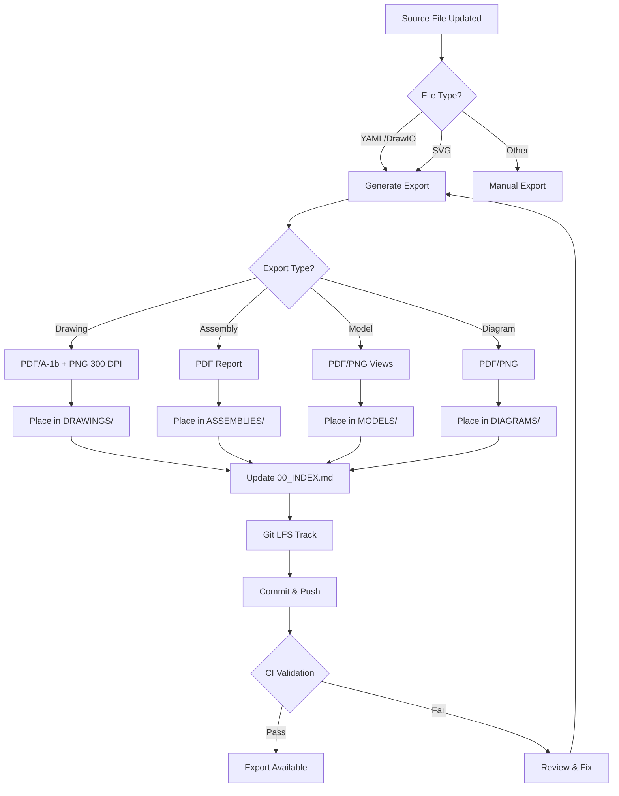

# EXPORTS Index — ATA 54 Design Assets

**Document ID:** 54-00-04-EXPORTS-INDEX  
**Version:** 1.0.0  
**Status:** Active  
**Last Updated:** 2026-01-02

---

## Purpose

This folder contains **rendered outputs only** (PDF/PNG) derived from source files in ASSEMBLIES, DRAWINGS, MODELS, and DIAGRAMS folders. These exports are:

- **Read-only** — Never edited directly
- **Distribution-ready** — For reviews, approvals, and external sharing
- **Traceable** — Each export links to its authoritative source file
- **Quality-controlled** — Generated following strict format and resolution requirements

## Directory Structure

```
EXPORTS/
├── ASSEMBLIES/       # Exported assembly views (PDF)
├── DRAWINGS/         # Exported engineering drawings
│   ├── PDF/         # PDF/A-1b format drawings
│   └── PNG/         # High-resolution raster exports
├── MODELS/          # Exported model views and reports
└── DIAGRAMS/        # Exported diagrams (when available)
```

### Directory Contents

| Folder | Purpose | Format | Typical Use |
|--------|---------|--------|-------------|
| **ASSEMBLIES/** | Assembly BOM views, structure visualizations | PDF | Manufacturing, procurement review |
| **DRAWINGS/PDF/** | Engineering drawings for archival/approval | PDF/A-1b | Design reviews, certification |
| **DRAWINGS/PNG/** | High-resolution raster drawings | PNG (300+ DPI) | Presentations, quick review |
| **MODELS/** | Model analysis reports, visualization exports | PDF, PNG | Engineering analysis review |
| **DIAGRAMS/** | System diagrams, workflows, context diagrams | PDF, PNG | Documentation, presentations |

---

## Export Registers

### Assembly Exports

| Export File | Source | Status | Last Export |
|-------------|--------|--------|-------------|
| 54-00-04-A001_ASSY_Nacelle_Primary_Structure.pdf | [../ASSEMBLIES/NACELLE_ASSEMBLIES/ASM-54-NAC-001_Primary_Nacelle_Structure.yaml](../ASSEMBLIES/NACELLE_ASSEMBLIES/ASM-54-NAC-001_Primary_Nacelle_Structure.yaml) | Pending | TBD |
| 54-00-04-A002_ASSY_Pylon.pdf | [../ASSEMBLIES/PYLON_ASSEMBLIES/ASM-54-PYL-001_Forward_Pylon_Structure.yaml](../ASSEMBLIES/PYLON_ASSEMBLIES/ASM-54-PYL-001_Forward_Pylon_Structure.yaml) | Pending | TBD |
| 54-00-04-A003_ASSY_Nacelle_Pylon_Interface.pdf | ../ASSEMBLIES/54-00-04-A003_ASSY_Nacelle_Pylon_Interface.yaml | Pending | TBD |
| 54-00-04-A004_ASSY_Thrust_Reverser.pdf | [../ASSEMBLIES/THRUST_REVERSER_ASSEMBLIES/ASM-54-REV-001_Cascade_Assembly.yaml](../ASSEMBLIES/THRUST_REVERSER_ASSEMBLIES/ASM-54-REV-001_Cascade_Assembly.yaml) | Pending | TBD |
| 54-00-04-A005_ASSY_Engine_Mount_Interface.pdf | ../ASSEMBLIES/54-00-04-A005_ASSY_Engine_Mount_Interface.yaml | Pending | TBD |

### Drawing Exports

| Export File | Source | Status | Last Export |
|-------------|--------|--------|-------------|
| 54-00-04-D001_DRWG_Nacelle_GA.pdf | [../DRAWINGS/GA/54-00-04-D001_DRWG_Nacelle_Primary_Structure_GA.yaml](../DRAWINGS/GA/54-00-04-D001_DRWG_Nacelle_Primary_Structure_GA.yaml) | Pending | TBD |
| 54-00-04-D002_DRWG_Nacelle_Dimensions.pdf | [../DRAWINGS/DETAIL/54-00-04-D002_DRWG_Nacelle_Primary_Structure_Dimensions.yaml](../DRAWINGS/DETAIL/54-00-04-D002_DRWG_Nacelle_Primary_Structure_Dimensions.yaml) | Pending | TBD |
| 54-00-04-D003_DRWG_Pylon_GA.pdf | [../DRAWINGS/GA/54-00-04-D003_DRWG_Pylon_General_Arrangement.yaml](../DRAWINGS/GA/54-00-04-D003_DRWG_Pylon_General_Arrangement.yaml) | Pending | TBD |
| 54-00-04-D004_DRWG_Pylon_Wing_Attachment.pdf | [../DRAWINGS/DETAIL/54-00-04-D004_DRWG_Pylon_Wing_Attachment_Details.yaml](../DRAWINGS/DETAIL/54-00-04-D004_DRWG_Pylon_Wing_Attachment_Details.yaml) | Pending | TBD |
| 54-00-04-D005_DRWG_Nacelle_Pylon_Interface.pdf | [../DRAWINGS/INTERFACE/54-00-04-D005_DRWG_Nacelle_Pylon_Interface.yaml](../DRAWINGS/INTERFACE/54-00-04-D005_DRWG_Nacelle_Pylon_Interface.yaml) | Pending | TBD |
| 54-00-04-D006_DRWG_Thrust_Reverser_Installation.pdf | [../DRAWINGS/INSTALLATION/54-00-04-D006_DRWG_Thrust_Reverser_Installation.yaml](../DRAWINGS/INSTALLATION/54-00-04-D006_DRWG_Thrust_Reverser_Installation.yaml) | Pending | TBD |
| 54-00-04-D007_DRWG_Engine_Mount_Interface.pdf | [../DRAWINGS/INTERFACE/54-00-04-D007_DRWG_Engine_Mount_Interface.yaml](../DRAWINGS/INTERFACE/54-00-04-D007_DRWG_Engine_Mount_Interface.yaml) | Pending | TBD |
| 54-00-04-D008_DRWG_Nacelle_Cross_Sections.pdf | [../DRAWINGS/SECTION/54-00-04-D008_DRWG_Nacelle_Cross_Sections.yaml](../DRAWINGS/SECTION/54-00-04-D008_DRWG_Nacelle_Cross_Sections.yaml) | Pending | TBD |
| 54-00-04-D009_DRWG_Pylon_Load_Path.pdf | [../DRAWINGS/SECTION/54-00-04-D009_DRWG_Pylon_Load_Path_Diagram.yaml](../DRAWINGS/SECTION/54-00-04-D009_DRWG_Pylon_Load_Path_Diagram.yaml) | Pending | TBD |
| 54-00-04-D010_DRWG_SHM_Sensor_Locations.pdf | [../DRAWINGS/INSTALLATION/54-00-04-D010_DRWG_SHM_Sensor_Locations.yaml](../DRAWINGS/INSTALLATION/54-00-04-D010_DRWG_SHM_Sensor_Locations.yaml) | Pending | TBD |

---

## Export Workflow



---

## Usage Guidelines

### ✅ DO

- **Generate exports** using approved automation tools or CAD export functions
- **Follow naming conventions** exactly matching source filenames (extension only differs)
- **Track large files** with Git LFS (see `.gitattributes-EXPORTS-TEMPLATE`)
- **Update this index** when adding or regenerating exports
- **Maintain traceability** by keeping source links current
- **Apply quality standards**: PDF/A-1b for archival, minimum 300 DPI for rasters
- **Version exports** in sync with source file versions

### ⛔ DO NOT

- **Never edit exports directly** — always regenerate from source
- **Do not commit uncompressed** large binaries without Git LFS
- **Avoid proprietary formats** in EXPORTS (e.g., .dwg, .catia) — use PDF/PNG
- **Do not break naming conventions** — automation depends on predictable names
- **Do not orphan exports** — always maintain source traceability
- **Do not skip quality checks** — verify resolution, format, and completeness

---

## Traceability Matrix

| Export Category | Source Folder | Authoritative Index | Requirements Link |
|-----------------|---------------|---------------------|-------------------|
| Assembly Exports | [../ASSEMBLIES/](../ASSEMBLIES/) | [../INDEX.meta.yaml](../INDEX.meta.yaml) | [../../54-00-03_Requirements/](../../54-00-03_Requirements/) |
| Drawing Exports | [../DRAWINGS/](../DRAWINGS/) | [../INDEX.meta.yaml](../INDEX.meta.yaml) | [../../54-00-03_Requirements/](../../54-00-03_Requirements/) |
| Model Exports | [../MODELS/](../MODELS/) | [../INDEX.meta.yaml](../INDEX.meta.yaml) | [../../54-00-03_Requirements/](../../54-00-03_Requirements/) |
| Diagram Exports | [../DIAGRAMS/](../DIAGRAMS/) | [../INDEX.meta.yaml](../INDEX.meta.yaml) | [../../54-00-03_Requirements/](../../54-00-03_Requirements/) |

### Key Traceability Principles

1. **One-to-one mapping**: Each export file corresponds to exactly one source file
2. **Bidirectional links**: Index points to source; source metadata can reference exports
3. **Version synchronization**: Export versions should match source versions
4. **Checksum validation**: CI/CD should verify export integrity against sources
5. **Change tracking**: Git history provides complete audit trail

---

## Quality Standards

### PDF Exports

- **Format**: PDF/A-1b (ISO 19005-1)
- **Purpose**: Long-term archival, certification evidence
- **Color space**: sRGB or CMYK (documented in metadata)
- **Fonts**: Embedded
- **Compression**: Lossless for technical drawings

### PNG Exports

- **Resolution**: Minimum 300 DPI for printing; 150 DPI acceptable for screen-only
- **Color depth**: 24-bit RGB minimum
- **Compression**: PNG with lossless compression
- **Naming**: Must include `_300dpi` or `_150dpi` suffix before extension

### Assembly Reports

- **Format**: PDF with bookmarks and hyperlinks
- **Content**: BOM table, part specifications, assembly sequence, tooling list, QC requirements
- **Traceability**: Include source YAML path in document footer

---

## CI/CD Integration Notes

### Automation Opportunities

1. **Automatic regeneration**: Trigger export generation on source file commits
2. **Format validation**: Check PDF/A-1b compliance, PNG resolution
3. **Naming validation**: Verify exports match source naming conventions
4. **Index updates**: Auto-update `00_INDEX.md` "Last Export" timestamps
5. **Traceability checks**: Ensure all exports have valid source links
6. **Git LFS verification**: Confirm large files are properly tracked

### Recommended CI Checks

```yaml
# Example CI validation steps
- name: Validate Export Formats
  run: |
    # Check PDF/A-1b compliance
    find EXPORTS/ -name "*.pdf" -exec pdfinfo {} \; | grep "PDF subtype"
    
    # Verify PNG resolution
    find EXPORTS/ -name "*.png" -exec identify -format "%f: %xx%y %[resolution.x]x%[resolution.y]\n" {} \;

- name: Check Export-Source Traceability
  run: |
    # Validate all exports have corresponding sources
    python tools/validate_export_traceability.py
```

---

## Document Control

- **Document ID**: 54-00-04-EXPORTS-INDEX
- **Version**: 1.0.0
- **Status**: Active
- **Owner**: AMPEL360 Design Documentation Team
- **Last Updated**: 2026-01-02
- **Review Cycle**: Quarterly or upon major changes
- **Related Standards**:
  - [AMPEL360 ASSETS Standard](../../../../../../../AMPEL360_ASSETS_STANDARD.md)
  - ATA iSpec 2200 Chapter 54
  - OPT-IN Framework v1.1

---

## Revision History

| Version | Date | Author | Changes |
|---------|------|--------|---------|
| 1.0.0 | 2026-01-02 | AMPEL360 Team | Initial creation with full structure and registers |

---

**Note**: This index is maintained manually. For automated file listing, CI tools should generate supplementary reports. The authoritative asset catalog remains in `../INDEX.meta.yaml`.
