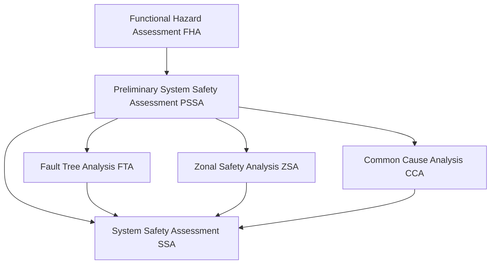

# 57-00-02-00 — Safety Framework

**ATA Chapter**: 57 — Wings  
**Folder**: 57-00-02_Safety / 57-00-02-00_SAFETY_OVERVIEW  
**Status**: DRAFT  
**Owner**: Airframe & Structures Domain (ATA 57)

---

## 1. Purpose

This document defines the **overall safety framework** for ATA 57 — Wings within the AMPEL360 BWB H₂ Hy-E Q100 aircraft family.

It establishes:

- The safety assessment methodology and process flow.  
- Applicable regulatory requirements and industry standards.  
- The relationship between safety assessment activities (FHA, SSA, FTA, ZSA, CCA).  
- Integration with the development lifecycle phases.  

---

## 2. Safety Assessment Process

The wing safety assessment follows the industry-standard process per [ARP4761](https://www.sae.org/standards/content/arp4761/):

1. **Functional Hazard Assessment (FHA)**: Identify and classify hazards at the functional level.  
2. **Preliminary System Safety Assessment (PSSA)**: Define safety requirements and architecture based on FHA.  
3. **System Safety Assessment (SSA)**: Verify that safety requirements are met by the implemented design.  
4. **Supporting Analyses**: FTA, ZSA, CCA, and other analyses as required.  

---

## 3. Applicable Standards

| Standard | Description | Applicability |
| :-- | :-- | :-- |
| [CS-25.1309](https://www.easa.europa.eu/en/document-library/certification-specifications/cs-25-large-aeroplanes) | Equipment, systems, and installations | Primary certification basis |
| [ARP4761](https://www.sae.org/standards/content/arp4761/) | Safety Assessment Process | Methodology reference |
| [ARP4754A](https://www.sae.org/standards/content/arp4754a/) | Development of Civil Aircraft | Development assurance |
| [AC 25.1309-1A](https://www.faa.gov/regulations_policies/advisory_circulars) | System Design and Analysis | FAA guidance |

---

## 4. Safety Assessment Scope

The safety framework covers:

- **Primary wing structure**: Wing box, skins, spars, ribs.  
- **Secondary structure**: Fairings, access panels, leading/trailing edge structures.  
- **Movable surfaces**: Flaps, slats, ailerons, spoilers (structural aspects).  
- **Interfaces**: Connections to fuselage, pylons/nacelles, control systems, fuel systems.  

---

## 5. Roles and Responsibilities

| Role | Responsibility |
| :-- | :-- |
| Safety Engineer | Lead safety assessments, maintain hazard logs |
| Structural Engineer | Provide structural analysis inputs |
| Systems Engineer | Coordinate cross-system safety interfaces |
| Certification Engineer | Ensure compliance with regulatory requirements |

---

## 6. Related Documents

- [57-00-02-00_Safety_Objectives.md](./57-00-02-00_Safety_Objectives.md)  
- [57-00-02-00_Safety_Taxonomy.md](./57-00-02-00_Safety_Taxonomy.md)  
- [57-00-02-20_FHA/57-00-02-20_FHA_Methodology.md](../57-00-02-20_FHA/57-00-02-20_FHA_Methodology.md)  
- [57-00-02-30_SSA/57-00-02-30_SSA_Strategy.md](../57-00-02-30_SSA/57-00-02-30_SSA_Strategy.md)  

---

## Document Control

- Generated with the assistance of AI (GitHub Copilot), prompted by **Amedeo Pelliccia**.  
- Status: **DRAFT** — Subject to human review and approval.  
- Human approver: _[to be completed]_.  
- Repository: `AMPEL360-BWB-H2-Hy-E`  
- Last AI update: 2025-11-29
