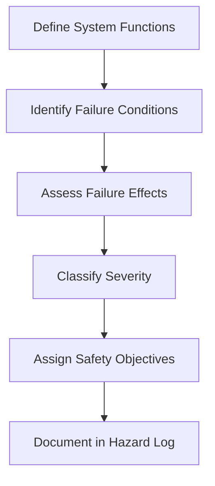

# 57-00-02-20 — FHA Methodology

**ATA Chapter**: 57 — Wings  
**Folder**: 57-00-02_Safety / 57-00-02-20_FHA  
**Status**: DRAFT  
**Owner**: Airframe & Structures Domain (ATA 57)

---

## 1. Purpose

This document defines the **Functional Hazard Assessment (FHA) methodology** used for the ATA 57 Wing domain.

The FHA is the first step in the safety assessment process per [ARP4761](https://www.sae.org/standards/content/arp4761/).

---

## 2. FHA Objectives

The FHA shall:

1. Identify the aircraft-level and system-level functions performed by the wing.  
2. Identify failure conditions associated with these functions.  
3. Classify failure conditions by severity.  
4. Identify the effects of failures on aircraft, crew, and passengers.  
5. Derive safety objectives and requirements.  

---

## 3. FHA Process

### 3.1 Step 1: Define Functions

- Identify all safety-relevant functions of the wing.  
- Define the function at the appropriate level of abstraction.  
- Reference [57-00-02-10_Functional_Hazards.md](../57-00-02-10_HAZARD_ANALYSIS/57-00-02-10_Functional_Hazards.md).  

### 3.2 Step 2: Identify Failure Conditions

For each function, identify:

- Loss of function.  
- Malfunction (incorrect operation).  
- Inadvertent function.  
- Partial function.  

### 3.3 Step 3: Assess Effects

Evaluate effects on:

- Aircraft controllability and performance.  
- Crew workload and awareness.  
- Passenger safety and comfort.  
- Structural integrity.  

### 3.4 Step 4: Classify Severity

Apply classification per [57-00-02-10_Hazard_Classification.md](../57-00-02-10_HAZARD_ANALYSIS/57-00-02-10_Hazard_Classification.md):

- Catastrophic, Hazardous, Major, Minor, No Effect.  

### 3.5 Step 5: Assign Safety Objectives

For each failure condition:

- Derive probability requirement based on severity.  
- Define design assurance requirements.  
- Identify required mitigations.  

---

## 4. FHA Scope for ATA 57

### 4.1 In Scope

| Area | Functions Considered |
| :-- | :-- |
| Primary structure | Lift generation, load transfer |
| Secondary structure | Aerodynamic surfaces, fairings |
| Movable surfaces | Roll control, high lift |
| Structural interfaces | Fuel tanks, ice protection |

### 4.2 Out of Scope (Covered by Other ATAs)

| Function | Responsible ATA |
| :-- | :-- |
| Flight control system logic | ATA 27 |
| Fuel system equipment | ATA 28 |
| Ice protection system logic | ATA 30 |
| Auto flight functions | ATA 22 |

---

## 5. FHA Assumptions

1. Aircraft is operated within approved envelope.  
2. Crew is trained and follows procedures.  
3. Maintenance is performed per approved program.  
4. Environmental conditions are as specified.  

---

## 6. FHA Documentation

| Document | Content |
| :-- | :-- |
| [FHA_Cases/57-00-02-20_FHA_Case_List.md](./FHA_CASES/57-00-02-20_FHA_Case_List.md) | Index of all FHA cases |
| [57-00-02-20_FHA_ATA57_Summary.md](./57-00-02-20_FHA_ATA57_Summary.md) | Summary of FHA results |
| [HAZARD_LOGS/57-00-02-10_Hazard_Log_Master.csv](../57-00-02-10_HAZARD_ANALYSIS/HAZARD_LOGS/57-00-02-10_Hazard_Log_Master.csv) | Master hazard log |

---

## 7. References

- [ARP4761](https://www.sae.org/standards/content/arp4761/) — Safety Assessment Process  
- [CS-25.1309](https://www.easa.europa.eu/en/document-library/certification-specifications/cs-25-large-aeroplanes) — Equipment, Systems, Installations  
- [AC 25.1309-1A](https://www.faa.gov/regulations_policies/advisory_circulars) — System Design and Analysis  

---

## Document Control

- Generated with the assistance of AI (GitHub Copilot), prompted by **Amedeo Pelliccia**.  
- Status: **DRAFT** — Subject to human review and approval.  
- Human approver: _[to be completed]_.  
- Repository: `AMPEL360-BWB-H2-Hy-E`  
- Last AI update: 2025-11-29
