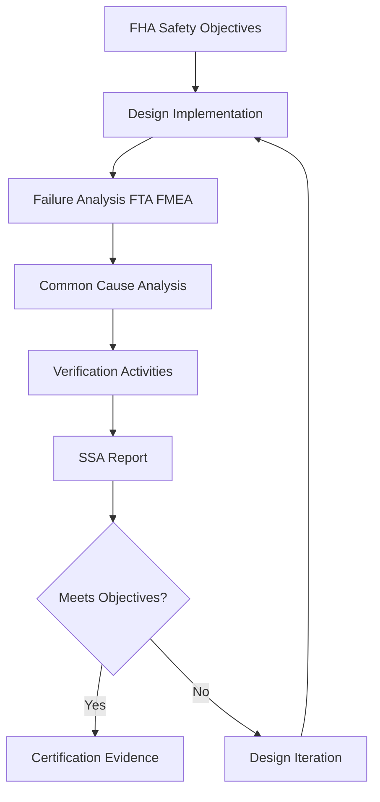

# 57-00-02-30 — SSA Strategy

**ATA Chapter**: 57 — Wings  
**Folder**: 57-00-02_Safety / 57-00-02-30_SSA  
**Status**: DRAFT  
**Owner**: Airframe & Structures Domain (ATA 57)

---

## 1. Purpose

This document defines the **System Safety Assessment (SSA) strategy** for the ATA 57 Wing domain.

The SSA demonstrates that the implemented design meets the safety objectives derived from the FHA.

---

## 2. SSA Objectives

The SSA shall:

1. Verify that the wing design meets all safety objectives.  
2. Confirm that failure probability targets are achieved.  
3. Demonstrate that common cause failures are adequately addressed.  
4. Show compliance with [CS-25.1309](https://www.easa.europa.eu/en/document-library/certification-specifications/cs-25-large-aeroplanes).  

---

## 3. SSA Process Overview

---

## 4. SSA Decomposition

### 4.1 Structural Domain

| Item | Analysis Method | Reference |
| :-- | :-- | :-- |
| Primary structure | Damage tolerance analysis | [57-00-06_Engineering](../../57-00-06_Engineering/) |
| Wing box | FTA, FMEA | [57-00-02-40_FTA](../57-00-02-40_FTA/) |
| Attachments | FTA, inspection program | [57-00-02-40_FTA](../57-00-02-40_FTA/) |

### 4.2 Aeroelastic Domain

| Item | Analysis Method | Reference |
| :-- | :-- | :-- |
| Flutter | Analysis and test | [57-00-07_V_AND_V](../../57-00-07_V_AND_V/) |
| Divergence | Analysis | [57-00-06_Engineering](../../57-00-06_Engineering/) |
| Control reversal | Analysis | [57-00-06_Engineering](../../57-00-06_Engineering/) |

### 4.3 Control Surfaces

| Item | Analysis Method | Reference |
| :-- | :-- | :-- |
| Ailerons | FMEA, FTA | ATA 27 interface |
| Flaps | FMEA, FTA | ATA 27 interface |
| Spoilers | FMEA, FTA | ATA 27 interface |

---

## 5. SSA Activities

### 5.1 Analysis Activities

| Activity | Description | Owner |
| :-- | :-- | :-- |
| Failure probability calculation | Quantify failure rates | Safety Engineering |
| Independence assessment | Verify no common modes | Safety Engineering |
| Architecture review | Assess redundancy | Systems Engineering |

### 5.2 Test Activities

| Activity | Description | Reference |
| :-- | :-- | :-- |
| Structural tests | Static, fatigue, damage tolerance | [57-00-07_V_AND_V](../../57-00-07_V_AND_V/) |
| Flutter tests | GVT, flight flutter | [57-00-07_V_AND_V](../../57-00-07_V_AND_V/) |
| Control surface tests | Functional testing | [57-00-07_V_AND_V](../../57-00-07_V_AND_V/) |

---

## 6. SSA Evidence Structure

| Evidence Type | Description |
| :-- | :-- |
| SSA Report | Summary of safety assessment |
| FTA Results | Fault tree analysis results |
| FMEA Results | Failure modes analysis |
| CCA Results | Common cause analysis |
| Test Reports | Verification test results |

---

## 7. Traceability

| From | To | Purpose |
| :-- | :-- | :-- |
| FHA Objectives | SSA | Verify objectives met |
| SSA | Certification | Compliance evidence |
| SSA | Requirements | Close requirements |

---

## 8. References

- [57-00-02-30_SSA_ATA57_Summary.md](./57-00-02-30_SSA_ATA57_Summary.md)  
- [SSA_MODELS/57-00-02-30_SSA_Tools_Notes.md](./SSA_MODELS/57-00-02-30_SSA_Tools_Notes.md)  
- [ARP4761](https://www.sae.org/standards/content/arp4761/)  

---

## Document Control

- Generated with the assistance of AI (GitHub Copilot), prompted by **Amedeo Pelliccia**.  
- Status: **DRAFT** — Subject to human review and approval.  
- Human approver: _[to be completed]_.  
- Repository: `AMPEL360-BWB-H2-Hy-E`  
- Last AI update: 2025-11-29
