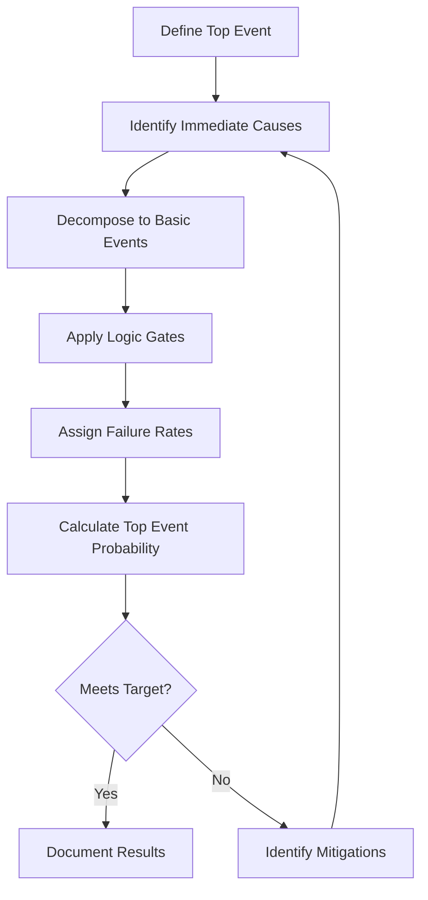

# 57-00-02-40 — FTA Overview

**ATA Chapter**: 57 — Wings  
**Folder**: 57-00-02_Safety / 57-00-02-40_FTA  
**Status**: DRAFT  
**Owner**: Airframe & Structures Domain (ATA 57)

---

## 1. Purpose

This document defines the **Fault Tree Analysis (FTA) methodology and scope** for the ATA 57 Wing domain.

FTA is a deductive analysis method used to identify combinations of failures that can lead to hazardous conditions.

---

## 2. FTA Objectives

The FTA shall:

1. Identify all single and multiple failure combinations leading to catastrophic/hazardous conditions.  
2. Calculate failure probabilities to verify safety targets are met.  
3. Identify design weaknesses requiring mitigation.  
4. Support certification evidence for [CS-25.1309](https://www.easa.europa.eu/en/document-library/certification-specifications/cs-25-large-aeroplanes).  

---

## 3. FTA Scope

### 3.1 Top Events Requiring FTA

Per FHA results, the following top events require FTA:

| Top Event | Hazard ID | Severity | Target Probability |
| :-- | :-- | :-- | :-- |
| Loss of wing structural integrity | H-57-STR-01 | Catastrophic | < 10⁻⁹ /FH |
| Failure of wing-fuselage attachment | H-57-STR-02 | Catastrophic | < 10⁻⁹ /FH |
| Failure of pylon attachment | H-57-STR-03 | Catastrophic | < 10⁻⁹ /FH |
| Wing flutter | H-57-AER-01 | Catastrophic | < 10⁻⁹ /FH |
| Fuel tank structural failure | H-57-FUE-01 | Catastrophic | < 10⁻⁹ /FH |

### 3.2 FTA Boundaries

| In Scope | Out of Scope |
| :-- | :-- |
| Wing primary structure | Flight control system logic (ATA 27) |
| Wing-fuselage attachment | Fuel system equipment (ATA 28) |
| Pylon attachments | Auto flight functions (ATA 22) |
| Structural aspects of control surfaces | Ice protection system logic (ATA 30) |

---

## 4. FTA Methodology

### 4.1 Process

### 4.2 Logic Gates

| Gate | Symbol | Description |
| :-- | :-- | :-- |
| AND | & | All inputs must occur |
| OR | ≥1 | Any input causes output |
| INHIBIT | ◇ | Conditional event |

### 4.3 Basic Event Types

| Type | Description |
| :-- | :-- |
| Hardware failure | Component failure |
| Human error | Maintenance/operation error |
| Environmental | External conditions |
| Software | Software-related failures |

---

## 5. FTA Diagrams

FTA diagrams are stored in the DIAGRAMS subfolder:

| Diagram | Top Event | Status |
| :-- | :-- | :-- |
| [57-00-02-40_FTA_Wing_Loss.mermaid](./DIAGRAMS/57-00-02-40_FTA_Wing_Loss.mermaid) | Loss of wing structural integrity | Draft |

---

## 6. Failure Rate Data

| Data Source | Application | Notes |
| :-- | :-- | :-- |
| Industry databases | Component failure rates | Adjusted for design |
| Service experience | Similar aircraft data | Where available |
| Test data | Design-specific rates | As available |

---

## 7. FTA Documentation

Each FTA shall include:

- Top event definition  
- Fault tree diagram  
- Cut sets analysis  
- Probability calculation  
- Sensitivity analysis (where required)  
- Conclusions and recommendations  

---

## 8. References

- [ARP4761](https://www.sae.org/standards/content/arp4761/) — Fault Tree Analysis guidelines  
- [57-00-02-10_HAZARD_ANALYSIS](../57-00-02-10_HAZARD_ANALYSIS/) — Hazard identification  
- [57-00-02-30_SSA](../57-00-02-30_SSA/) — SSA integration  

---

## Document Control

- Generated with the assistance of AI (GitHub Copilot), prompted by **Amedeo Pelliccia**.  
- Status: **DRAFT** — Subject to human review and approval.  
- Human approver: _[to be completed]_.  
- Repository: `AMPEL360-BWB-H2-Hy-E`  
- Last AI update: 2025-11-29
